# 微信公众号运营视频全套 手撕运营 拳拳到肉 - P39：3.02-公众号关键词设置~1 - 达妹_达内教育 - BV1UvvvebEdT

同学们好，来，我们本节课继续学习微信游戏增粉的相关内容。在上节课呢我们完成了整个游戏的设置。那设置之后呢，我需要告诉大家，你现在想要进行后面步骤的操作。比如大家看啊，完成游戏设计之后，我们要设置关键词。

那么就要找到游戏分享的链接，你需要去到我们凡科互动的个人中心。

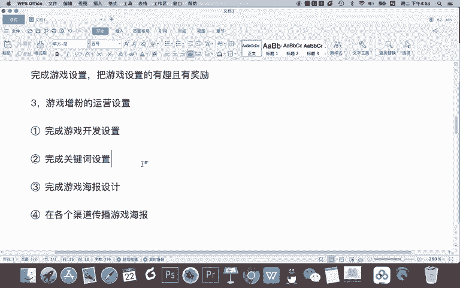

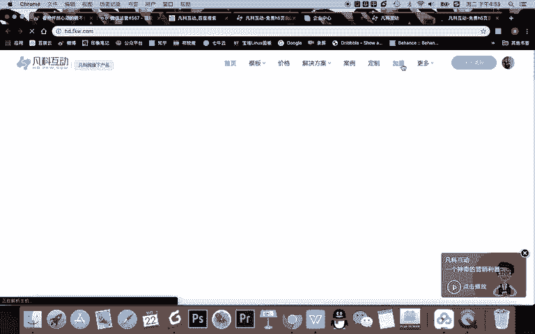

比如俺进到管理这里。啊，你比如点击凡客互动之后进入管理，然后点击我的活动。大家看在我的活动这里呢，有我要去发布的这个游戏，这个双十一我要脱单，对吧？它正在进行中，那我现在呢需要对它进行传播啊。

你需要点击什么呀？

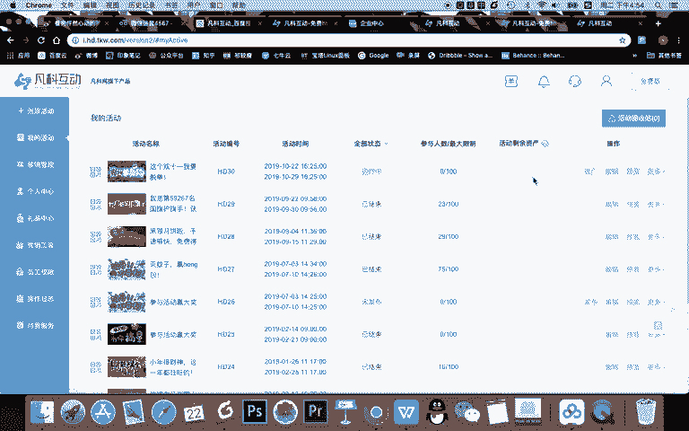

预览这个按钮，点击预览呢，你就能看到这个游戏的二维码，还有它链接。那我们现在要进行后面的操作呢，只需要把这个内容跟我们公众号打通就可以。来，首先游戏设置已经完成，第二步完成关键词设置。

所以我要去设置一个什么呀，关键词。我把笔记给大家完成的详细一点啊。第三点。游戏什么或者叫公众号。关键词设置。首先在这里设置的一个注意事项。第一。把。游戏链接设置成回复关键词。就能获取。但注意啊。

2注意把。链接设置成。文字链的形式不要直接给链接。啊，因为直接给链接呢，这个视觉效果不是特别好。来，我们来设置一下。

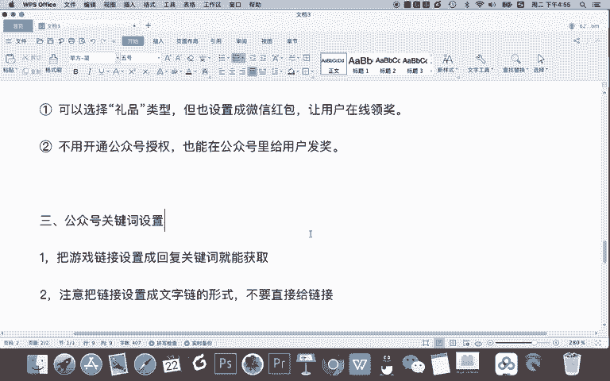

我再登录一下我的公众号。OK在自动回复这里啊，大家还记得我们之前学微信运营里面的第一节课的内容给大家讲了什么关键词的这个代码。比如说啊我们看看这个是不是有代码。O你看这个增粉呢提交授是我们之前演示的。

现在我们要会做成什么？游戏。设置成游戏呢关键词也设置成游戏。

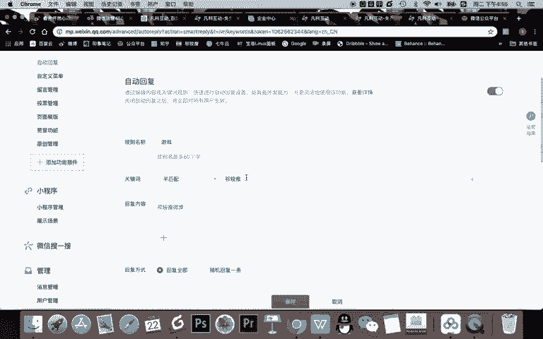

那我们关键词是什么？是什么公众号注意啊。首先这个文案是。公众或者叫扫码。回复。游戏。比如说哈开始打游戏，或者说什么开始。

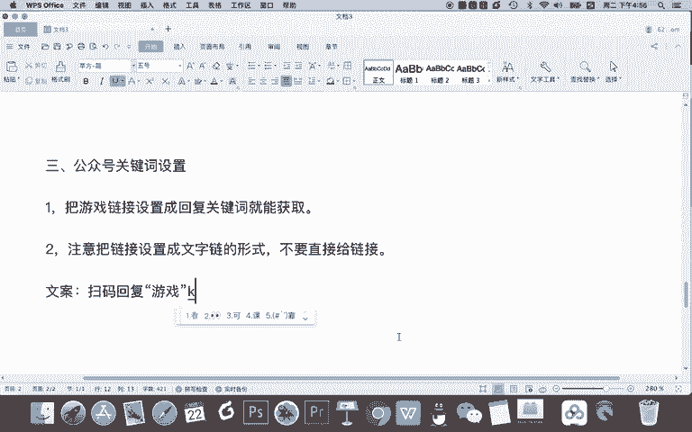

挑战扫码回复游戏，所以他会回复游戏。那在这里呢我需要去把游戏的链接。

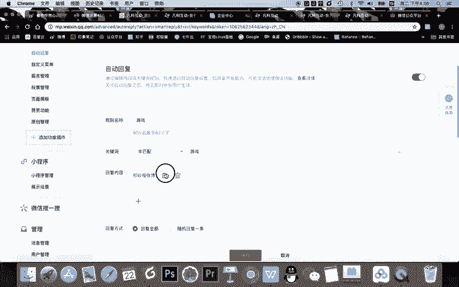

复制一下，然后设置到。这个里面。然后呢，把齐教授微博这几个字是么点击。

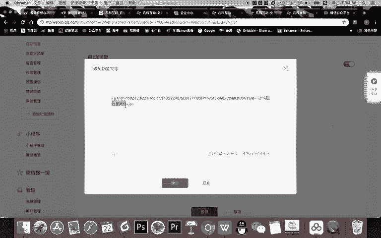

挑战游戏。OK点击确认。那这时候呢我们点击保存默认的啊实现的一个效果应该是什么？应该就是你用户扫码之后去到我的公众号，一回复游戏这两个字就能够点击这个链接，然后呢去到你看手机扫码去到什么呀？

我们的这个游戏里了啊，我个人认为呢目前我是设置成功的。因为我能点击会跳转。那真正的一个正确的流程是大家应该设置好之后给你的手机回复游戏两个字，你点一下啊，回复之后，看点一下能不能进入这个游戏。

如果能进入正常挑战，那说明你设置成功了。OK现在游戏这个关键词我设置成功了。那我们看上一步啊，也就是我们接下来要完成什么设置。

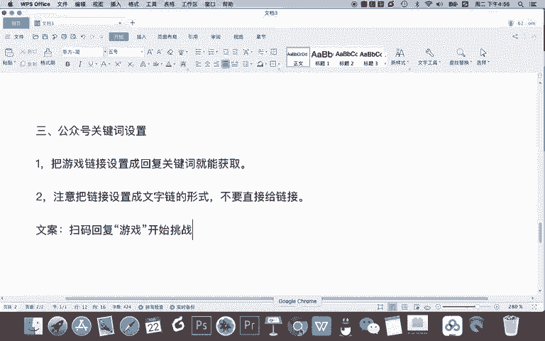

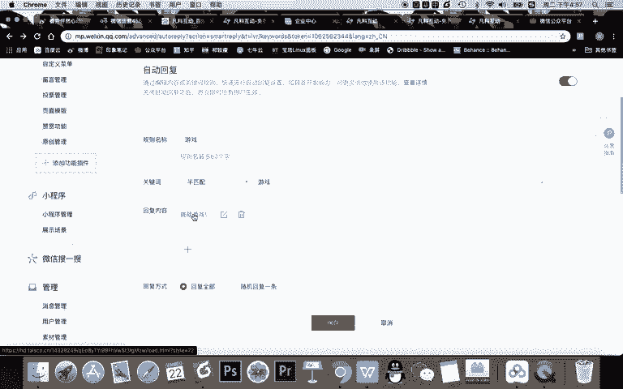

首先完成关键词设置，回复游戏设置成功了啊，再接下来就是完成游戏海报的设置啊，这一步比较关键。因为这个游戏这是什么呀？这个游戏有没有人玩决定你这个。什么呀根本性的一个内容，我认为就是这个海报。第四。

游戏海报设计非常关键的原因。第一点就是什么？海报是游戏的。宣传物料。海报。要有。吸引力对吧？第二，用什么做法，如何做海报？对我相信。在我们之前啊听过我们之前新媒体课程的人已经知道了是吗？

图片制作工具我们直接使用的吗？直接使用创客贴制作海报。那ok再讲一遍。

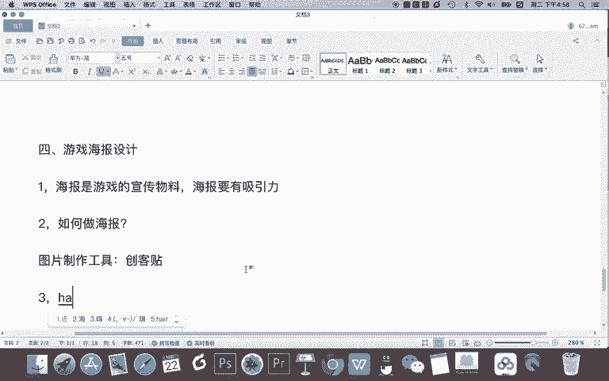

海报。这多记。那首先啊我们在创客贴里，我们应该去选择一个，比如我在新媒体管家里进入创客贴，我们应该选择一个游戏风格的图片。当然，这一步的工作你其实也可以提供文安给你们公司的设计，让他来去制作。

那假如我们新媒体人自己制作。我们要选择手机海报这种造型，对吧？

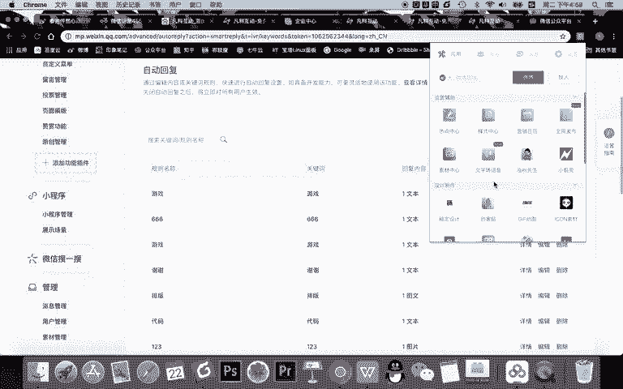

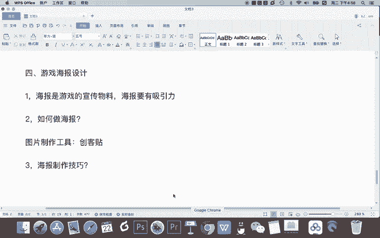

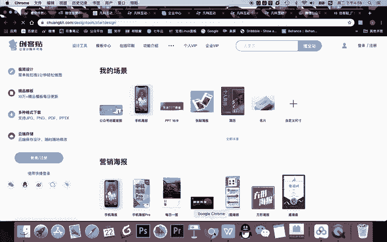

OK选择手机海报这个造型啊，我现在呢去登录一下啊，然后呢注意在我演示的时候，我们还是去选择这个。

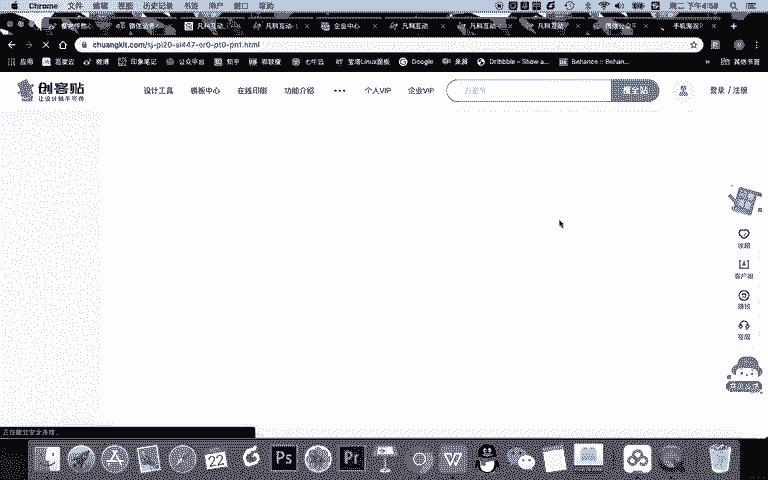

免费版本啊，手机海报。找到一个免费的一个版本。那假如我们呃去选择是这个搭吗？哎，这个不太搭，对不对？我们要选择跟你的游戏风格相符的。当然如果有设计师的话，你可以直接把这个图片的给他啊模仿的去设计一下。

直接做这个有单身狗的这样一个双十一的风格海报。那现在我们没有怎么办？那我们就去找一个还不错的。比如说做这个。海报内容。那个会员免费啊，你看我是会员吗？哎，我不是会员，所以呢我就不能免费去使用了。

那最好呢我在开始的时候就直接我看看在哪里能够选择免费版啊。

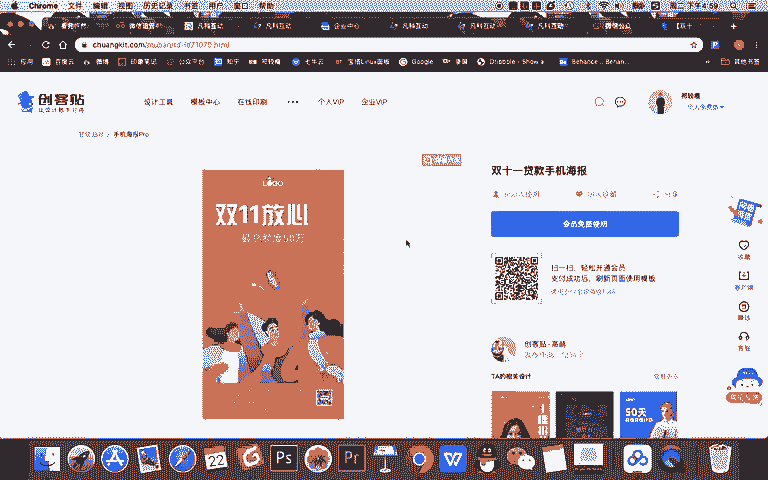

哦，直接手机pro这里应该有收费的那我直接在设计工里工具里去找吧。设计工具里呢，我直接去点击手机海报。啊，现在他可能新版本更新了啊，啊在这里我们直接点击免费，随便找一个免费的任务还不错的。

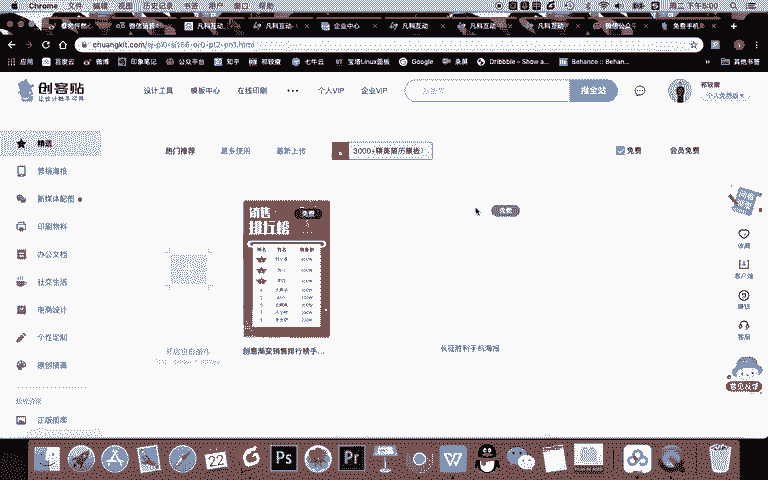

对吧你看像这些都比较适合做成游戏。那我们要找一个跟单身狗或双十一有关的。游戏模板，而且注意一点啊。怎么制作海报？第一点。一先这是我刚刚说的，先根据。游戏的风格选择。海报模板。

所以我是双十一单身狗的风风格，所以我要找一个跟这个相相搭相搭配的内容。但第二个还有一个关键的点就什么？要根据。什么呀所写的。文案是。选择海报。所以你要什么呀？你要去做一件事，什么？先预估。要写。哪些？

没有。Yeah。

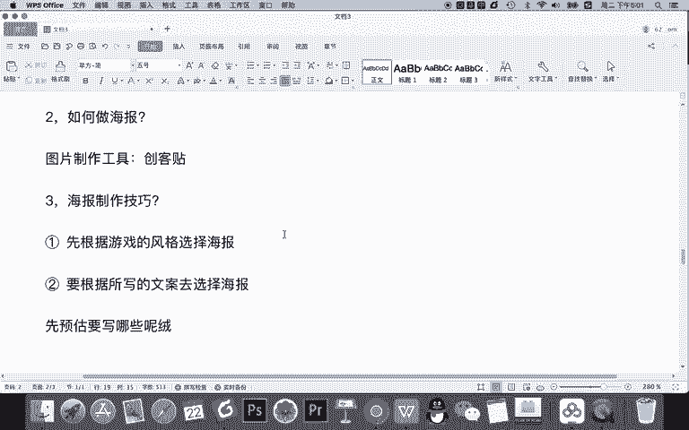

OK那我们做这个游戏要写什么内容？首先我要告诉他这个游戏很好玩双十一的游戏。其次呢我要告诉他有红包。比如说我可以写这样的一个文字，比如说玩游戏什么双十一脱单，然后呢，直接标题叫双十一什么，我要脱单。

下面一句话玩游戏赢百元红包现金红包啊，这是主标题。然后呢，下面你要告他什么？参与方式对不对？还要做成这个。所以我要有一个大标题，还要告他有参与方式，那我就要找。合适的一些。模板类型。

我们看看有哪些还不错。这个吧这个还不错啊，假如还不错，我们就选择这个内容。那做海报，我们选择模板之后要做什么？非常关键的一点啊，之前有提到什么呀？

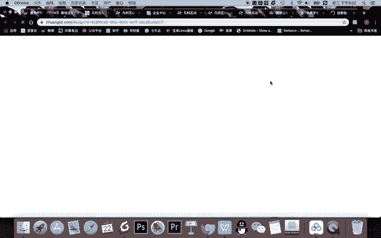

海报设计的。要点。值。替换文字内容。不要改变。海报设计。甚至啊你要做做到一点，甚至是。要根据。海豹的。设计去。搭配文案，所以你基本的文案你是要有心里有数的。但既然你选择的这个模板。

你要根据它去选择一个什么呀啊，具体的文字内容支持什么？直接在双十二好礼是吗？

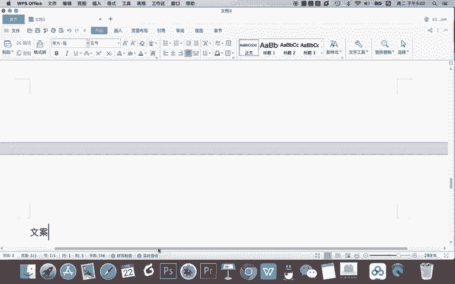

这个我就想我要这个双十一。什么呀。别我要拖单，因为他几个字，三个字儿，我就写什么要。脱单。系嘛。或者说什么这个双十一。挑战。什么寻找单身狗等等等类似了，你跟他去优化一下。还有呢你直接写什么？你直接写啊。

玩儿。寻找。