# 微信公众号运营视频全套 手撕运营 拳拳到肉 - P3：1.01-公众号注册及设置~2 - 达妹_达内教育 - BV1UvvvebEdT

你用啊这个邮箱和密码去登录。那么需要注意的是啊，你刚刚我们今天讲整个课程啊，你刚刚有了解，我们说个人可以注册订阅号，对不对？所以为了大家能够学习和实战啊，我希望大家都去注册订阅号就可以了。

你不要为难自己啊，明明没有企业的信息，你还说我要去搞服务号，那不可以啊。好，注册之后，你会让你选择类型，你可以选择订阅号，其实有多种类型。比如。

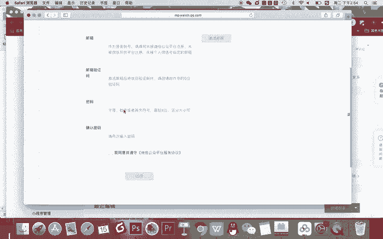

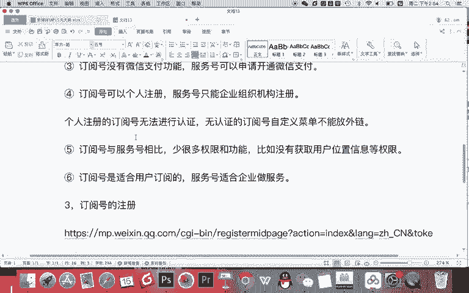

个人类的。企业类的媒体类的，还有一些啊比如社会组织机构类型的啊，你直接选择个人的就行。因为其他的是适合企业的，其他组织机构的选择类型之后需要登记信息，怎么登记，你需要进行实名制。

我们知道在互联网上发布任何的一些信息，特别是做一些自媒体啊，都需要实名登记的。所以你需要输入自己的身份账号，甚至是用微信扫码的方式。因为你的微信肯定已经绑定的银行卡。

用微信扫码的方式去跟你的身份信息去匹配啊，证明你是你你是一个实实在在的有就比如说身份证认证信息的这样一个人。然后呢，实名认证之后，你就可以去填写公众号的基本信息。比如公众号的昵称等等，完成以上设置。

那么你的公众号去注册好了以后你每次进入到微信公众平台就可以在这里啊输入你的账号输入你的密码，然后去登录，每次呢就在这里去登录。

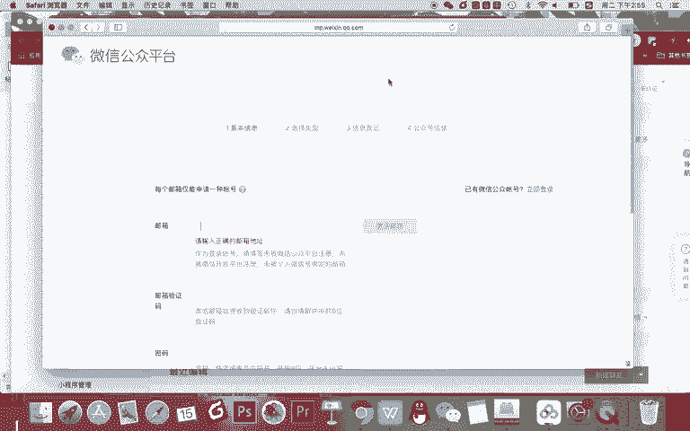

账号去使用你的呃，这个微信公众号了，你也有了自己的微信公众号以后也可以做自媒体或进行商业化的一些运营。OK这就是我们微信公众平台的基础的一个知识。这是我们让大家如何去什么呀？注册啊，第二部分。

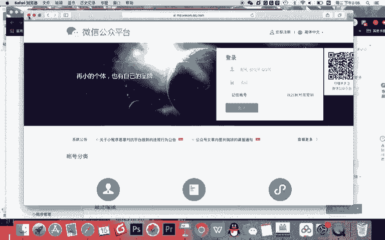

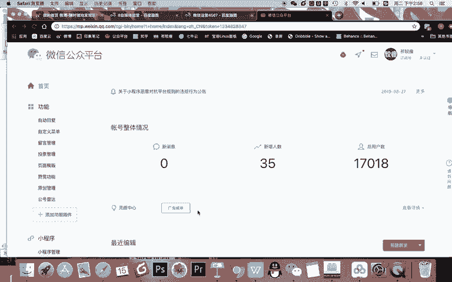

，完成公众号的注册之后，你需要进行的是公众号的。

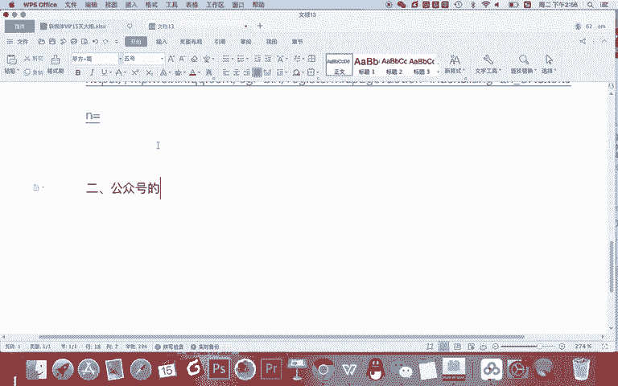

基础设计。那在基础设置里主要有几个内容，大家看啊，我这是设置好的哪几个内容呢？你可以看一下。首先第一个要有。点击你的头鼠标放到头像上要进入账号详情，完成主要是四个信息的设置。

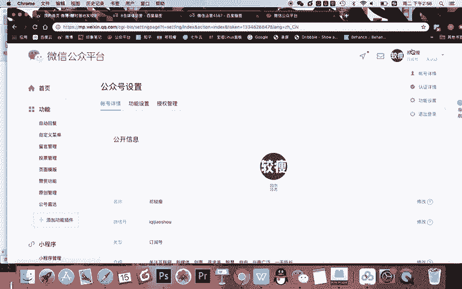

第一。完成昵称的事。第二，完成。微信号的设置。第三，王朝。头像的设置。第四，完成。

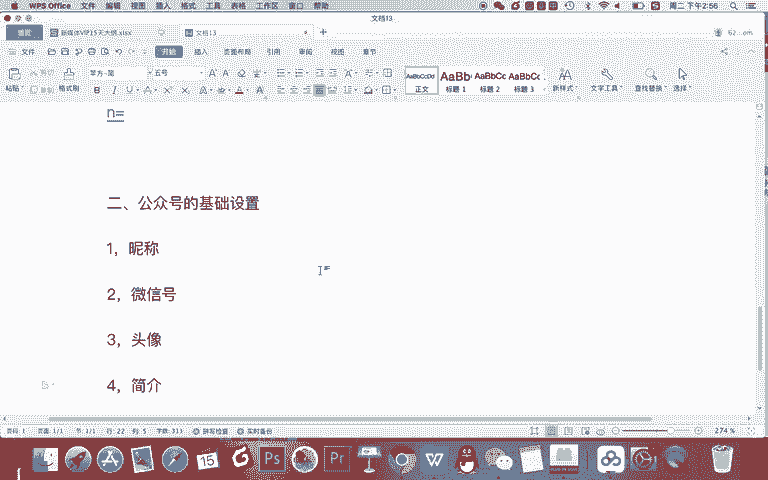

简介的设置啊，基本就在这个账号详情这里。首先名称、微信号，还有呢你介绍和头像。那我要告诉你的是，记得啊名称看这里。一个账号一年内只能改两次名称，所以你一定要想好了名字再去写啊，这是你的公众号的名称。

或者叫昵称。它有一个特点，就是所有的昵称，现在是不让重名的。比如我叫齐教授了，你就不能再注册一个公众号，叫齐教授。啊，除此之外呢，你一定要像我们讲微博知识一样，做任何的自媒体，到先定位再起名，对不对？

去给你起一个昵称。那还有呢微信号要设置好，记得你看微信号一年内只能改一次啊，我把这个给它写一下。

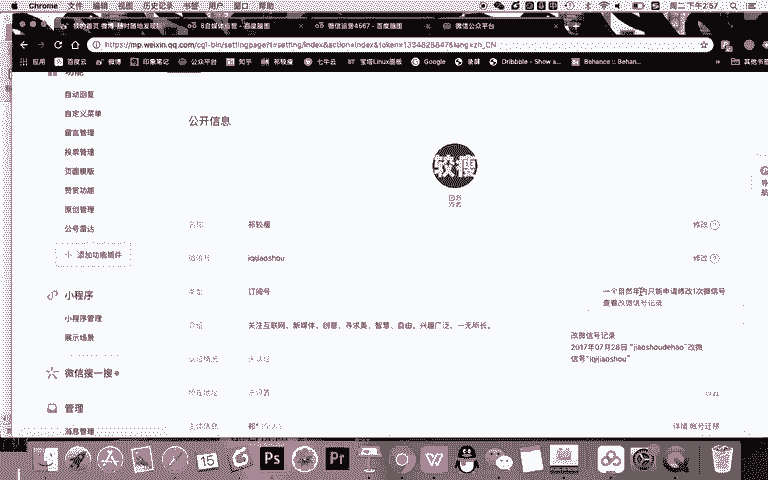

首先在昵称这里，我再让大家回忆一下知识。第一。记得。一年只能改两次，所以。想好。再改。记得啊，第二还是那句话，先定位。确定做什么内容在。7苗。OK这个做什么内容呢？跟微博类似啊，你做了公众号之后。

你想发的内容就约等于你可以想想我每天要发文章，我要发什么内容。我是做美妆领域啊，我还还是做游戏领域，我做电影领域，还是做新媒体领域，对不对？你要去吸粉去天天写文章，让别人订阅你，你就是一个杂志啊。

你是一个自媒体。所以你要先想好自己做什么，然后再起名。第三，起名的技巧，记得还是那两个最核心的技巧。第一种技巧。品牌词加行业词，比如教授新媒体啊，这是一个品牌加行业。第二个技巧就是个性化品牌词。

比如齐教授啊用这种方式去起名。还有呢注意啊，第四个注意事项。名字要短。好记。纯中文。还有呢还有什么呢？5。特殊符号。

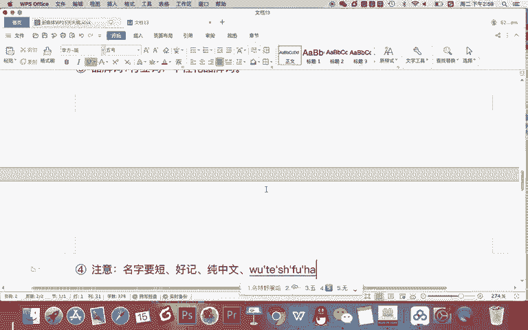

这是所有的我们做自媒体时候起名都要去遵循那个技巧。我们在这里不再多说，那微信号怎么写给大家写一下啊。

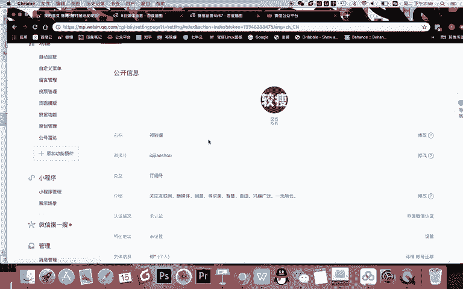

首先接着第一点。微信号是。你的公众号的唯一身份。什么呀。编号。这什么意思？在全网来说，如果他在微信里搜了你的这个微信号啊，他就能通过微信号找到你。就像你的身份证号一样，明白吗？这是你唯一的身份证编号。

所以你要起好了，那怎么起呢？有一个技巧。微信号。可以是。微信名，也就是你的昵称的什么呀？简拼。哇。

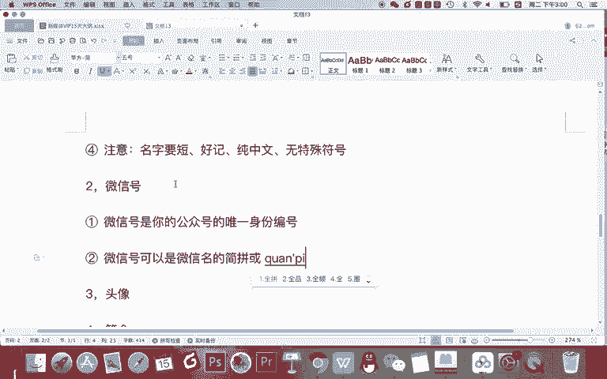

全拼，比如啊有时候简拼就三四个的字母不太现实啊，因为都可能被别人占用了。你看我我的名字叫齐教授，我的微信号最好也叫纯拼音的齐教授，而且小写，对吧？但为什么我叫爱齐教授呢，我不是自恋。

是因为我叫齐教授的时候，我发现别人已经用过这个我没法用，那我是齐教授，我就加个爱，代表我爱就代表我嘛，我是齐教授，所以我让别人看了一眼我的微信号就能记住，那你记住这有什么作用啊。

记住他就能够通过微信搜索的时候找到你了什么呀？微信号，所以呢。

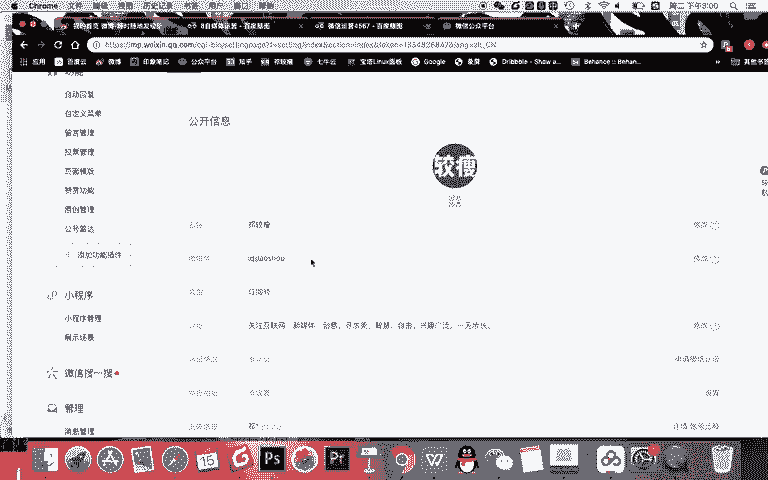

找到你微信号就直接能找到你这个人。所以记得啊微信号要。好记好拼。对吧还有呢一个要。

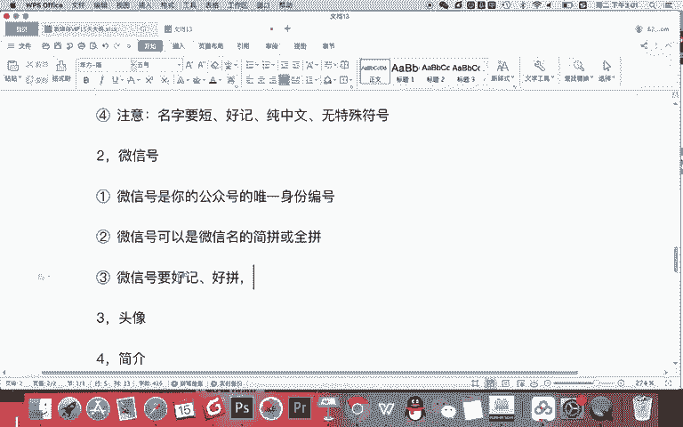

简短。你千万不要写那微信号老长了，而且呢有。比如说是4637521，再加英文等等，有点乱啊，那就不好记。

注意啊，第四点。尽量不要使用。下划线。特殊符号什么？或者说你的这个微信号里尽量。不要包含。下划线特殊符号等啊，这里你包含的话，用户你想他在手机微信里去点输入法，如果再找一下划线。

再进行各种切换是非常麻烦的，不方便去搜索你。

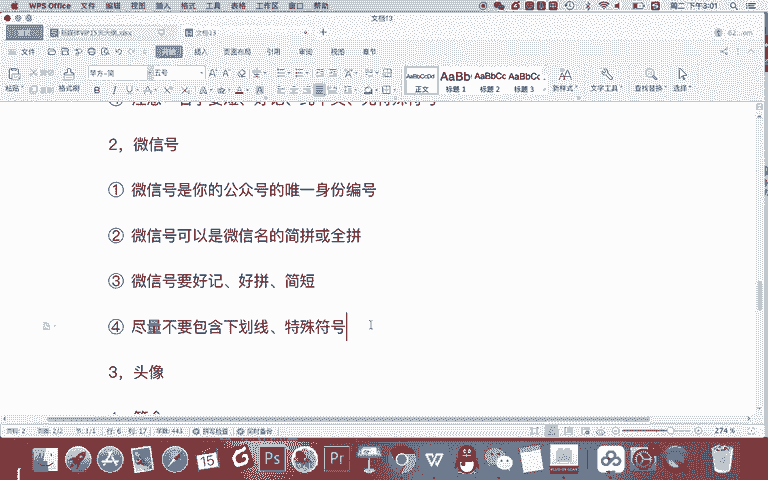

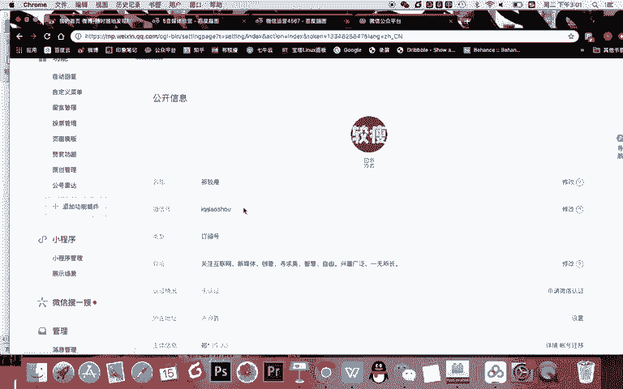

那最后要注意啊。第五点。一年只能改一次，要想好了。在。填写。没想好，千万不要一改试试试试一错就完蛋啊，因为一年只能改一次，你这一年月等于别人就没办法再通过微信号找到你了，因为不方便。

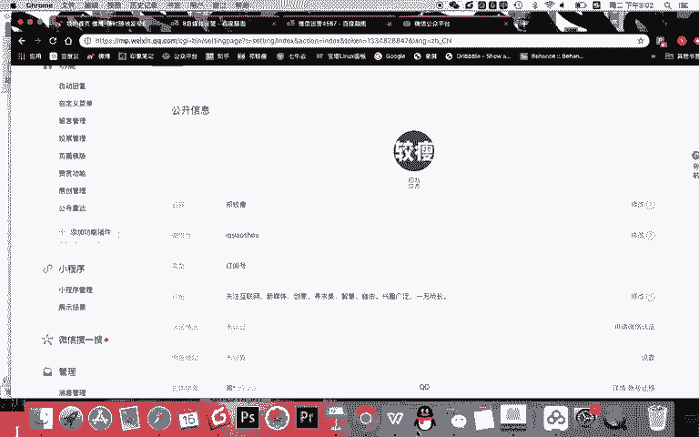

ok。😊，第三个我们需要去修改的内容就是头像，你记得。头像。就是你的。logo，你说爱我没有logo。啊，在微博运营的时候呢，我还说你头像可以用个人的头像啊，都是人格化就可以了。但我告诉你。

在公众号这里呢，其实你有点像个人品牌，你像一本杂志一样，你的头像最好是你的logo。那第二个需要注意的是。设置头像时，要考虑在手机端的。展示场景。不要什么呀。素材或者说不要元素过小。

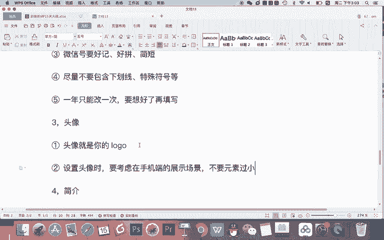

为什么这么说呢？因为你要知道这个头像你在后台现在看是这么大，对不对？但是在你的微信里，在你的手机上打开之后，它其实是像一个你微信对话的头像似的，是很小的。如果你的这个logo里面有很多的小字。

那我告诉你，你当成头像之后，在微信上根本看不清。所以呢在这里这样一个大小的位置，你尽量要设置的元素，尽量大一点少一点啊，展示清楚一点。然后让手机上看的也能看得清。

所以我希望你能设置一个啊还不错的logo，然后当成你的头像啊，当成你的头像呢，其实有有有点像一本杂志的一个logo。然后呢，你可以去以它去面对你的用户。当然这个头像呢就可以没事了。

去不满意修改一下啊就可以。但也不要在。已经运营之后啊，频繁的修改。最后以习一句话修介绍啊，你你看这里一个月啊能改5次啊，这就好很多，每周都可以改。那什么是一句话介绍呢？

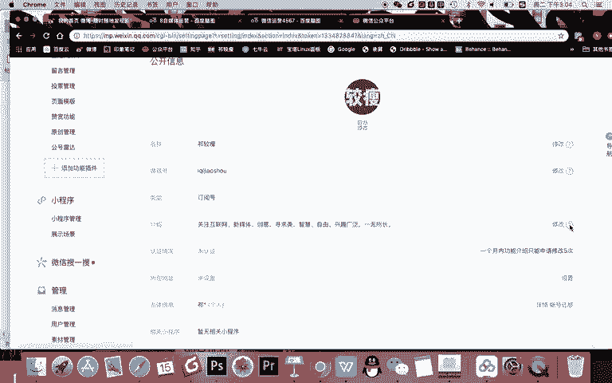

Yes。记得。用一句简短的话。向用户。表明你是谁？你是。做什么呢？以及你有什么吸引力，你说啊写这么多吗？首先你要告诉别人你是谁，对吧？然后当然他看名字知道你是谁的话，你这里就不用写你谁。

比如说如果你是一个起了一个名字叫什么教授新媒体，你可以在这写一下，哎呀，齐教授，比如说新媒体讲师齐教授的什么个人公众号。然后呢，在这里向大家传递新媒体的知识啊，你可以这样自我介绍。

但如果你的名字已经告诉了别人你是谁，你记得你需要一句话告诉别人，你是。

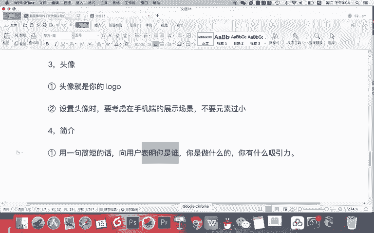

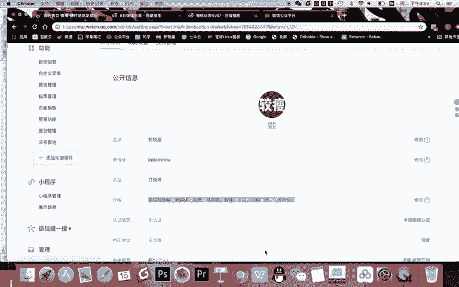

做什么呢？😡，这样呢方便用户看了一篇文章，感兴趣之后啊，他点击你的名字，去到你的个人公众号主页的时候，能用一句话认识你啊。比如说你说你是做新媒体的，他又喜欢新媒体，那怎么办？他就可以直接选择关注你。

当然这句话呢最好是一句文案写的有趣，有吸引力，让他再去手机上点开你的名字，看到你的这个个人介绍的时候，直接能够吸引到他，这样呢会更每就转化率会更高一点嘛，所以呢这是一个一句话精炼的简介，啊。

可以参考微博的一句话介绍去写这个方面的内容。OK以上呢就是我们公众号基础设置最核心的几个内容。你记得啊微信号名字，因为一年只能改一次或两次，所以要慎重。其他两个内容可以多次修改。啊。后面呢这个信息啊。

记得原始ID这是你的账号的基本不用对面对用户的一个内容啊。啊，他是。

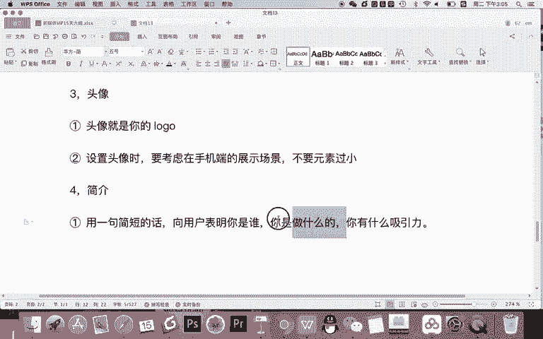

你有些时候去生成或者说开发一些第三方的功能的时候去使用的啊，你不需要指导它记得微信号，就是你的身份证号，甚至是唯一的你的像你的手机号或者说QQ号一样，是方便用户搜索找到你的。同时呢你的名字也非常的重要。

记得名字就是你的品牌。所以我希望你用个人品牌词再加行业词的方式给自己起一个好的名字，像微博起名一样，起一个好的名字。然后呢完成你账号的基础设施。完成以基础设置之后呢，你就可以进入到公众号的基础运营里了。

OK我们本节课的内容就到这里，下节课我们将进入到微信公众号后台的学习和认。

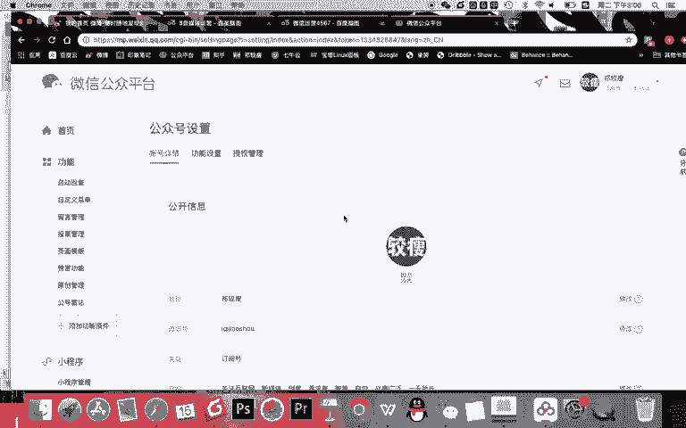