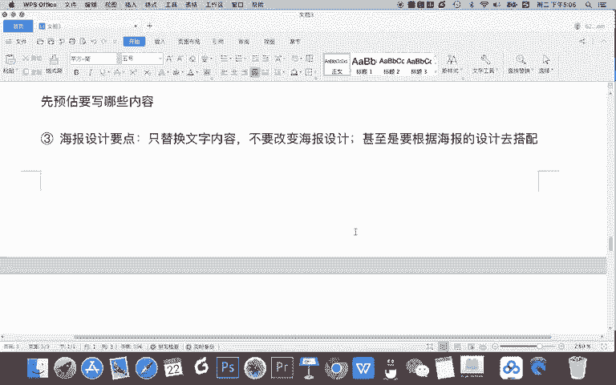
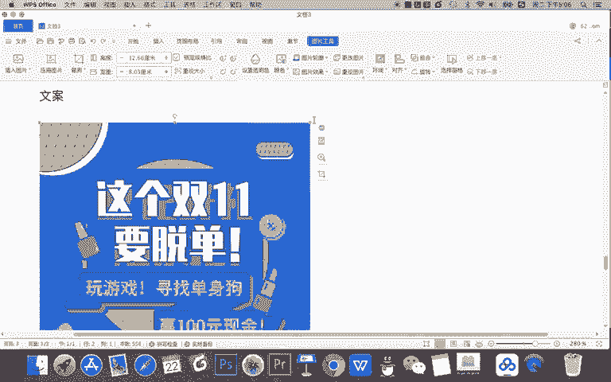
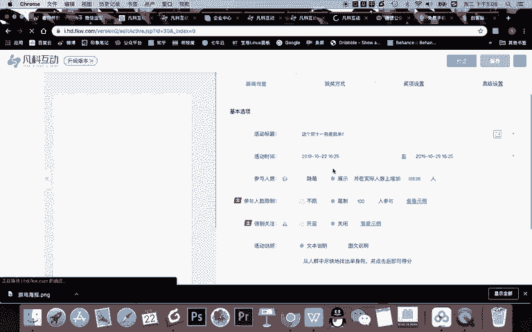
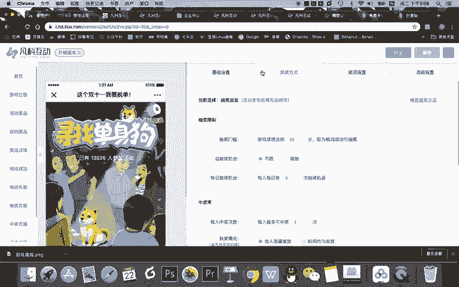
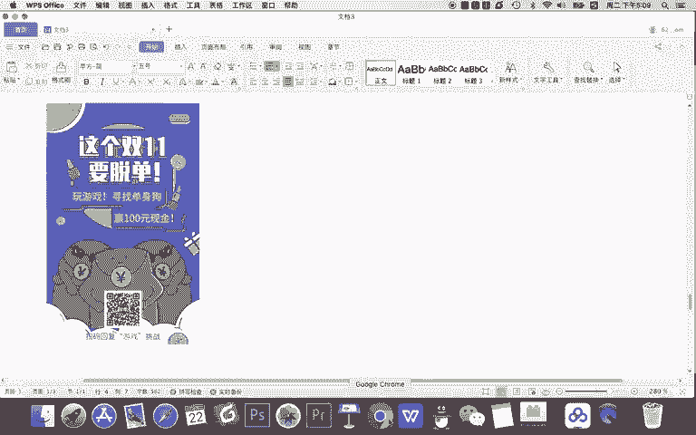
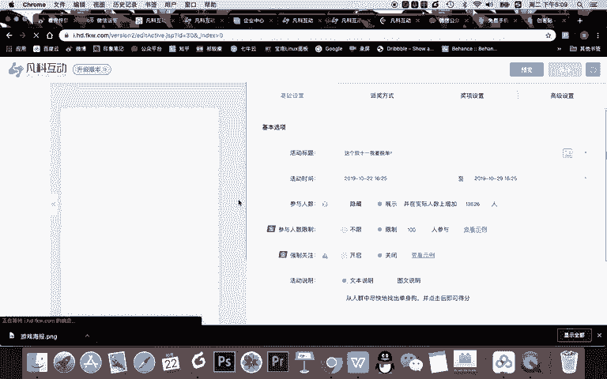
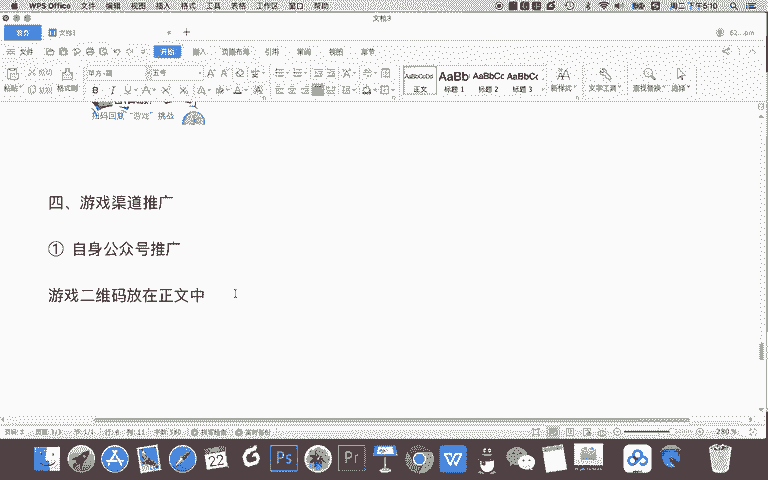
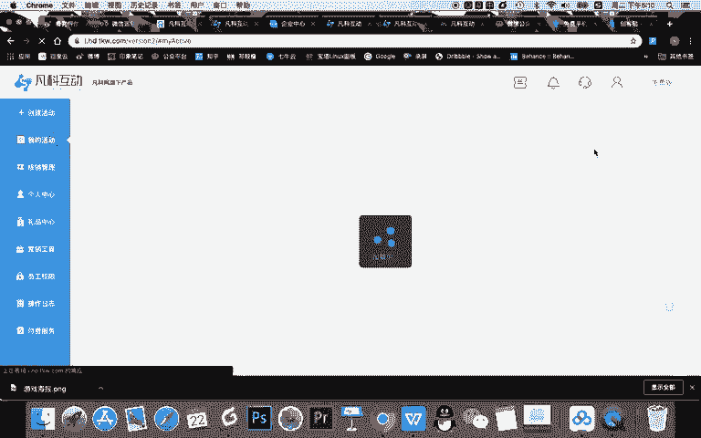
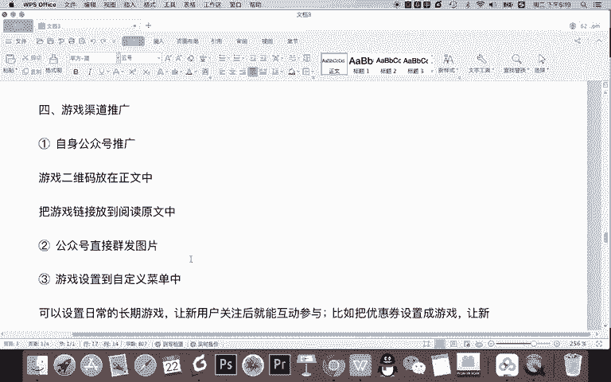

# 微信公众号运营视频全套 手撕运营 拳拳到肉 - P40：3.02-公众号关键词设置~2 - 达妹_达内教育 - BV1UvvvebEdT

单身狗。游戏。😊，然后呢。你看这文字正好差不多是吗？Ying。100元。现金。赢节险。百元现金。直接不写红包了，因为现现金也可以是吧？或者这个百元直接还写数字会更有信念。OK这个双十一要脱单什么？

玩儿寻找单身狗游戏，赢白现金红包。然后呢，二维码怎样？啊，看这是这不是二维码，这是云啊，我们要把这个二维码给它删掉，放什么二维码，这个比较简单，就放我们公众号的二维码。比如我就把我的二维码放在上面。

然后呢，扫码了解更多，我要写什么，你不能让他扫码了解更多呢，现在是他需要回复游戏，直接写什么扫码回复。游戏。OK而且呢这个文案比刚刚多了一点，你需要给它做的长一点啊。

而且这个二维码我们可以稍微的往下一点，再把这个素材再往上一点。然后顺着这个素材你还可以干嘛？上移一层啊，让这个图层在最下面。然后呢，再让他看还能不能再上一。哎，这不能再上移了，再上移，我们撤销一下。

再上一把这个文字就挡上了。那我们现在就这个文字就稍微往上一点。哎，二维码有了啊，整个的扫码回复游戏挑战。我当然我可以把游戏俩字改成。

红色嘛也可以对吧？然后呢突出扫码恢复游戏挑战，扫码恢复游戏，直接去搜到一个游戏的链接。这个双十一要脱单去玩什么呀？玩游戏寻找单身狗吧。再改一下。玩游戏寻找单身狗。然后呢，把这个往这边挪一点。然后呢。

赢100元现金，基本可以了啊。当然你还可以在这个位置或者在上面的位置放上你们公司的logo。所以我们现在啊这个海报还可以，它唯一的缺点就是没有什么单身狗的一个元素啊。

你可以在整个的游戏设置里把这些素材给它做弄出来啊。但是我建议如果你不懂设计的话，就去选个模板，不要乱改。但如果你懂设计的话，你可以去制作啊这样的一个内容。那现在呢我把这个海报做好了，我就直接下载。

下载之后呢，比如说我觉得是什么游戏海报，然后我给大家放到笔记里，然后我们需要走完整个的流程。

OK把这个海报放到笔记里，我们尝试一下。

。

OK这是我们的这个游戏海报。我现在呢需要去扫码体验一下，然后看走一下流程啊，大家也可以跟我一块扫码体验啊。比如说我回复一个扫码之后关注，关注之后回复游戏，然后呢收到了一个挑战游戏的链接。

然后直接凡客授权O我直接现在授权了。这个双十一我要脱单。然后我就去到这个游戏。然后呢，开始寻找找到单身狗okK我就各种打游戏啊，我就随便先打吧。然后呢，我就开始一直打打看能打多少分。

但现在我发现啊我这个游戏设置好像是100分才能挑战。但现在我根据我这个速度，我根本找不到100个，我顶多找二三十个就了不起了。所以你看我现在先把这个游戏我自己挑战一把。然后呢，我现在还有半分钟的时间。

假如我不玩了，我现在预估啊半分钟。我总共能找20个，但是我设的100100分。才能打这个游戏。所以我这个游戏行不行？不可以，因为我没法抽奖。

啊，所以我现在要回到我的凡客互动的。游戏里，然后呢进入编辑。

我要把派奖的一个游戏设置改成20就能挑战成功。然后呢，我再点击保存。这个时候啊我就能抽奖了。对吧现在。设置20就可以的保存。然后呢，我关闭。

在我的活动中，然后你看我再去看一下这个游戏，我再玩一把，玩一把。如果发现这时候20分钟啊啊不是20分钟嘛，就是将近一分钟的时间能挑战20分，也就找到20个单身狗，那就可以就完成整个设置。那我就可以抽奖。

我发现现在啊我抽不了奖，但是呢我能正常的看到一些游戏挑战啊，这是okK的。我整个游戏是设置可以的。所以大家可以看到啊在游戏设置好了之后，关键词没有问题，海报没有问题。然后呢，游戏也没有问题之后。

我就需要进行。第几部。第四步啊第四步非常关键。第四。游戏渠道推广。ok现在呢假如我这个游戏我非常慎重的啊，我去给他。进行了一个高级权限功能的开通，它没有最高在线人数的一个限制。

我希望本次活动能吸引5万人参加。然后呢，老板也给我了一些预算啊，我需要去做进行推广。所以这个游戏里面的奖品假如我设置的很好。然后呢，整个海报也是我们的设计师专门制作的，整个的活动的等级啊。

也就是它的整个的level要高很多，包括整个游戏所有的一些素材都是我们公司的一个内容。那现在老板给我的有钱，我要去进行推广。那大家思考一下整个微信游戏，我们都能在哪些渠道推广。

都有哪些推广方式？第一个。做好了这样一个游戏，最常规的第一个什么？自身。公众号推广怎么推广呢？游戏。什么呀？二维码。放在。正文中，比如你写了一篇文章是吧？双十一活动，然后推送了一次内容。

然后给大家讲你们送什么什么奖品啊，同时让大家什么呀脱单，然后玩游戏。介绍完之后呢，直接把游戏的二维码放在了这个正文中。但是我建议啊你发二维码的时候，不要像这样的去放啊。

大家看一下。不要在预览里把这个二维码下载下来放进去，因为这二维码非常难看。你可以像我之前讲解的知识，用什么呀？草料二维码把这个链接生成一个漂亮二维码，放在你的文章正文中。

这样当你推广了介绍了这个游戏之后，用户能够看到一个漂亮二维码，可以玩游戏。还有呢？还有什么方法？还有。把。游戏链接。放到。什么呀。阅读原文中。然后呢，也是自身公众号可以退推保。当然除此之外啊，还有什么？

第二个方法就不用也是自身公众号，但不用写文章了。公众号直接。群发一个什么呀？图片就这次你不用去介绍一篇文章，图文，让用户在玩，直接发一个图片，让用户去扫码体验，这也可以。那还有哪些是推广游戏的方法？

第3个。是吧比如说游戏。设置到。自定义。菜单中。设置到自定菜单中的一个好处是什么？是你不需要设置关键词的。用户只要去了你的公众号，看到自定菜单，一点击就能玩游戏。而且这个游戏的好处是什么？可以设置。

日常的什么呀？长期游戏。让用户或者说让新用户关注后就能互动参与。比如举一个小例子啊。比如把。优惠券。设置成游戏，让用户新用户来。抽奖得，这是一个很好的增加你跟粉丝之间互动的一个方式。设置到最定菜单。

只要是新用户来，他一看到菜单里他就点一点。那我要告诉你的是，一旦设置成这种游戏领优惠券的这个最金菜单，那菜单的一个点击量会有提升。那当然第三个就是我们说的设置成关键词。那么现在啊自身的这些推广就这样了。

那我们想推广这个游戏还有什么方法？还有第4个外部推广，比如。在。什么呀，自身。谢。微信群。推以广。图片。你们公司除了有公众号的粉丝，也可能去运营了有资深的一些微信群，你们公司自己的微信群对吧？

公司员工权。公司。产品的。粉丝。社群啊，你们自己去推广，让用户去分享。比如在群里你去发一些红包，让大家去帮你去传播，这样呢让粉丝成为你第一批的一个传播者。这是一个，还有没有？还有没有别的一些推广方法啊。

这是自己的一个推广啊，比如说。自身微信群或什么呀？朋友圈推广让自己人去推广啊，除此之外，你还可以什么？付费。投放公众号。怎么投投放呢？很简单，找。什么呀？受众精准的。公众号大号进行投放。

然后呢进行付费投放。是这。其他账号。帮忙退吧。比如你们公司如果受众是大学生，你可以找一些大学生常关注的一些公众号，让这些公众号推送文章，或者是在文章中放上图片。

甚至是在文章中放上阅读原文等等去帮你进行推广啊，这就是大号付费的推广，也可以去推广你们的这个活动。还有没有别的方法？第六个啊，我个人认为比较有效的就什么？行业大V。个人朋友圈。推广。找到。受众精准的。

什么呀？行业大V甚至是。KOL啊其实一个意思只是QOL是一见领袖啊。比如你找的是新媒体领域的一些受众，那你可以找一些新媒体领域的一些大咖。然后呢，你给他付费啊付费吧。比如说啊这个人有5000好友。

他是新媒体行业的一个大咖，那让他去玩这个游戏，甚至多找几个就更容易什么。更容易实现。什么呀。初始。流量的。Okay。因为如果你找了10个你们这个领域的大V或QL，那基本这个这个新媒体圈子都会能看到。

那如果这个内容比较好的话，那很多人就会去参与。当然啊除此之外。第七个。行业。微信。社群。推广。比如说找到。精准的。垂直。微信。通过付费推广的方式。什么呀。推广付费推广常规有两种方式啊。

或者这两种方式同时具备的。第一种方式就是你找到这些微信群都有群主，这些群主经营的群，你需要一给群主付费。2、你想让群里的人参加也好，或者说让群里的人帮你转发这个游戏海报也好。

就是也是需要在群里进行付费的。所以呢付费方式有三种，第一是公众号推广。第二呢是找这种行业的QL和大V推广。第三是找行业的一些社群推广啊，同时你其实这三种付费推广呢，平时你就要积累这样的行业资源。然后呢。

有需要的时候去找他们推广。然后呢，自身的一些渠道，比如你们自身公众号可以推，自身的微信群，自身的朋友圈可以推，这是免费的。最后当然啊如果真的是常规的一些大型的活动，还可以第八个进行。广告主投放啊。

这个不建议。因为你一个游戏类的活动，不建议进广告主投放，你可以直接投你的公众号啊，实现这个粉丝，实现起来更加的一个便利，更直接，没必要投了游戏之后，再让他去关注公众号啊，但是呢这也是一种方式。

所以我们后面给大家讲的这几个投放的方式呢，不仅是游戏增粉的一个投放的方式，也是我们微信投放的一个方式。我们常规来说，在微信这个生态内进行公众号啊，微信群的一些投放。

主要就是进行广告主投放微信社群投放个人大V朋友圈投放以及公众号的一个付费投放。比如说我们很多的一些自媒体大号。然后呢去推广一些商品也好，品牌也好，都是去接一些软文文章。

然后呢文章中去植入最后阅读原文去转化。当然也可以在文章中放二维码的方式去转化。还有呢行业的一些大V朋友圈啊，他们收费几百甚至上几千去帮你去发这个朋友圈，你找了这个行业内顶级的一些内容之后啊，比如说。

这些大号你找了10个几十个之后，基本能覆盖这个整个圈子的顶级的流量。还有呢就找一些精准的行业微信社群，这是常规的一些渠道。你需要积累这样的资源去进行投放。O这是我们整个游戏渠道的推广。

那讲到这里呢大家可以看到啊，我们整个游戏啊流运营的流程就设置好了。其实流程比较简单啊，你看想要进行游戏的增粉。第一，设置好一个游戏。第二，把这个游戏跟你的公众号打通，比如通过关键词打通。

通过自定义菜单打通，甚至通过公众号的被关注回复打通，然后让用户在你的公众号内才能玩游戏。第三个呢就是你需要设计游戏宣传的物料，比如海报，比如文章等等，然后发到微信的朋友圈，微信群。

甚至公众号推送等各地方，然后让用户看到那在这个渠道里呢，我们给大家讲了免费的付费的整个的一个渠道。大家可以看到啊，这个流程非常的。啊啊，简单或者说它非常的顺畅啊，所以呢想要实现增粉啊。

不只是游戏或者任何的一种类型的方式，基本都是这个流程。啊，我们通过游戏增粉给大家去演示了这样一个内容。那我们关于游戏增粉或增粉的流程的梳理，今天就讲到这里，下节课我们将学习新的增粉的方式。

