# 微信公众号运营视频全套 手撕运营 拳拳到肉 - P41：3.03-微信上墙增粉01~1 - 达妹_达内教育 - BV1UvvvebEdT

同学们好，欢迎大家学习微信运营第三节课的内容啊，我们第六天第三节课的内容是微信上墙增粉。首先什么是微信上墙？啊，这个概念呢比较简单，就是说在我们什么呀一些。线下的。活动。场景装。通过。扫码。什么呀。

发送。信息。进行现场展示。就叫。微信上角。嗯。啊，比如说你看啊上墙指的是什么线下。然后呢。你看很简单。线下有墙壁啊，墙上有投影。扫码给扫码发信息，展示在。投影上。这个就叫微信上墙。比如说啊场景。

使用哪些有哪些使用场景呢？比如说。校园。讲座啊，举办校园讲座，你们肯定有投影屏幕啊，去展示讲座的信息啊，现场的我们的学生啊，或者听讲座的人呢，也可以通过扫码，然后把信息发到这个讲座的大屏幕上。

然后这就要上墙。还有呢。比如说公司年会。公司开年会呢要进行互动或者抽奖。然后呢，大家可以出现啊，大家可以通过扫一二维码，然后把你对公司的祝福展示在这个大屏幕上。同时呢一旦你扫码成功之后。

还能参与我们公司年会现场的一个奖品的抽奖啊，非常好。还有呢。比如说酒吧。对吧。酒吧有驻唱的歌手在唱歌，如果他单纯的一直在那唱啊，现场的人喝着酒聊会天是不是也挺无聊的。其实有些时候呢就可以通过啊互动。

增加酒吧的一个氛围，比如在唱的歌手的旁边，然后呢放放一个屏幕，这个屏幕上会有一二维码，所有来听歌的人呢啊都可以扫码去去比如说给你的歌手点歌，甚至呢去评价这个歌手唱的怎么样，说甚至呢说说你的故事。

甚至给歌手打赏，对吧？都是可以的。当然还有一些其他的活动，比如说。线下。会议。对吧还有什么？KTV这些场景还有呢？线下。活动啊，所以各种啊，比如说你记得只要有线下什么呀？有屏幕。想互动就能。

微信上墙互动。因为呢只要有线下这种场景呢，你就可以把通过微信上墙，把我们的这些用户聚集起来。聚集的方式呢就是通过微信上墙。那O我们给大家讲一个微信。上墙的是吧。工具。工具呢比如说啊挺多的啊。

我个人用的多的就是嗨现场。

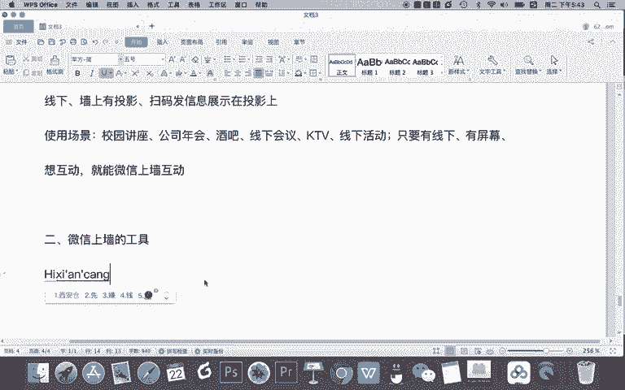

来，我们一起看一下嗨现场。看现场呢你看免费的微信墙是吧？现场互动专家只要是有线下，然后呢想互动就可以去使用。你看他有你年会啊、婚礼甚至婚礼庆典，说出你的祝福等等，都可以。我给大家截个他的。

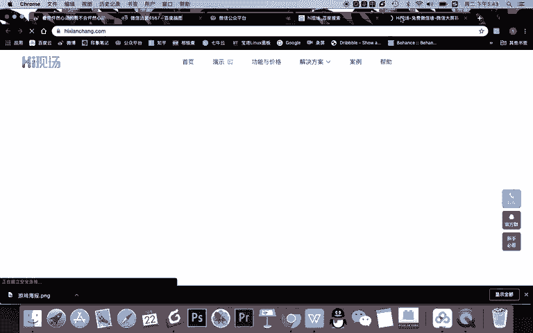

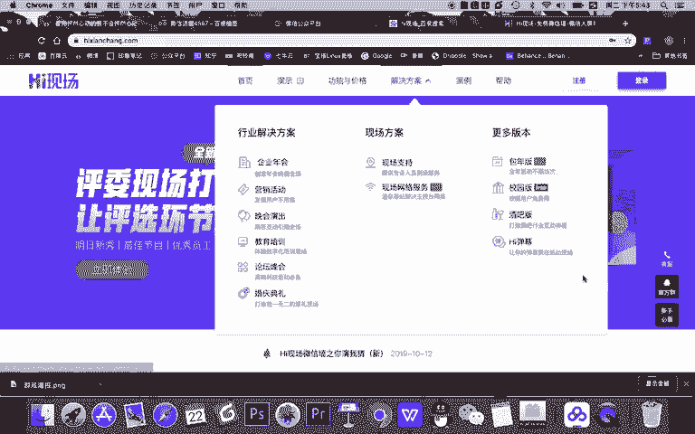

图片啊这个图片呢就是微信上墙的一个造型的一个效果。Okay。ok。😊，韩现场的地址我也发给大家。利开现场呢能够增反，很简单啊，怎么增粉？让所有想互动的人必须在公众号里去进行互动，这不就实现增粉了吗？

所以用拍现场或者说用微信上墙这种方式能够啊。用微信。上墙的方式，能够在线下实现线下用户的粉丝。只要是线下啊，只要你能够玩微现黑现场就能实现一个增粉。那么整它的整个设计设置的流程呢，我给大家讲一下啊。

首先在黑现场呢，你需要去登录注册啊，比如说你看我有登录过，我就直接去。

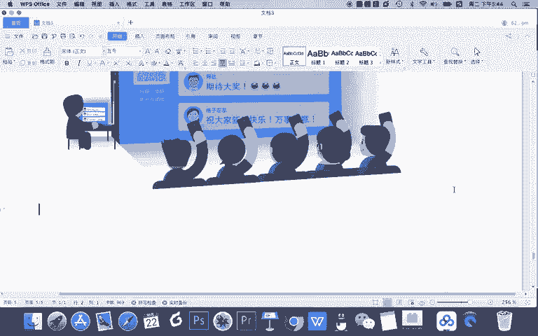

W。

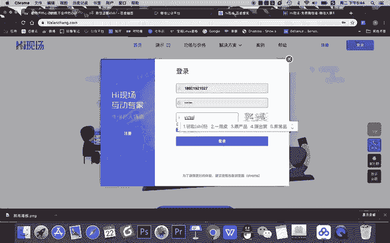

啊，登录进去。但登录进去之后，第一步啊，你要做的一件事是点击创建新活动，然后呢完成你活动的基本信息的设置。比如说我的活动叫新媒体。

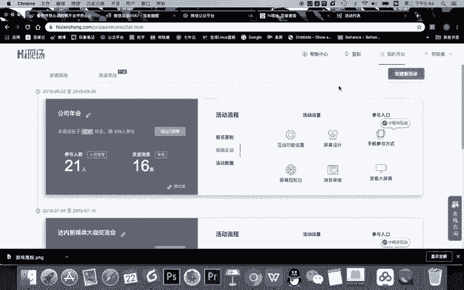

打咖。交流会活动类型呢，你看这个就不重要，你都可以选择一下。我们企业会议预计参与人数。大家看啊，免费版的活动是300人参与的。如果需要扩容，需要升级更高活动，就是付费了。所以我们就直接写什么。

预计人数就写100到300。然后所在的区域呢，因为是标星呢，都必须填一下，你就定一下你的地点啊，然这其实意义不大啊，主要是给焊线场平台进行了一个信息的统计。活动生效的时间很简单，就是我们创建活动的时候。

还有呢选择失效时间。比如你可以选择啊任何的一个时间去失效就可以。还有呢注意版本一旦选定创建后不可更改。这里呢非常关键啊，是进行网页模式还是绑定模式。绑定模式说必须在公众号内进行互动。那我告诉你的是。

我们不需要去用绑定模式，我们只要选择网页模式，就能够实现公众号的一个增粉啊，这个方式呢我们会教给大家。所以你记得在这里不要选择绑定模式，直接选择网页模式即可。

当然还有呢线下其他呢下面你可以填一下你的个人联系方式，然后呢，如果有汉现场的，比如说啊他们可能有销售啊或者一些服务人员为你提供更多的一个服务啊，你可以为给把你的信息给他。当然你也可以不填啊。

OK完成基本信息的设置之后，选择网页模式，点击创建。

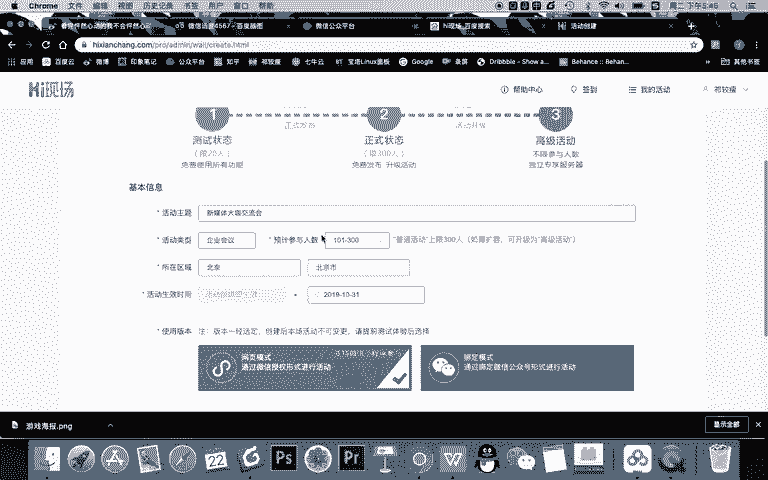

然后呢。刚开始创建的活动是属于测试状态。测试状态呢只能有20个人测试啊，我通常建议大家就直接不试了，直接发布，直接能300人啊。你试的时候，因为这个内容你也没推广，所以呢你可以自己去试就行了。

不用专门弄一个测试模式。大家看啊，这是免费的0元，然后呢想要高级活动是一场300元288啊，然后还有一些其他的一些需求，你可以去设置使用。如果你们活动比较正式人比较多，你可以选用付费的啊。

但现在我给大家讲解，我们就选择免费。

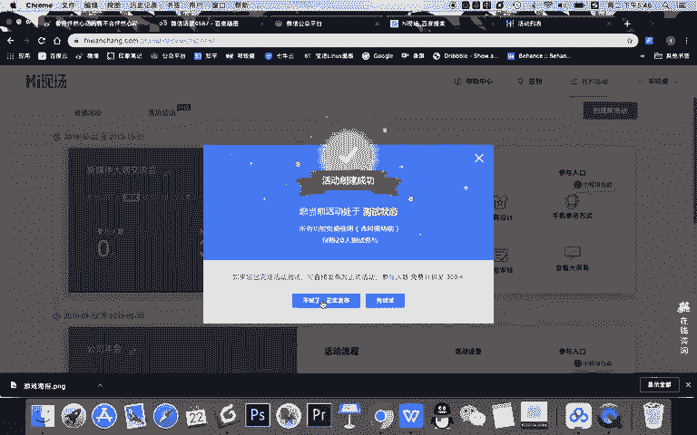

OK免费活动设置之后，大家看在你的普通活动这里就生成了一个活动的菜单。那么现在呢我给大家讲讲这个菜单怎么设置。首先。进行一个线下的微信上墙活动是可以做签到的。怎么签到呢？你可以去通过导入信息。

让用户去给你进入活动啊，比如说让用户才能玩，这是内部活动时候去使用。今天我们就不直接签到了，不需要签到。然后主要我们整个活动所有的设置就是在现场互动这里有活动设置入参与入口这两个内容。

还有呢就是我们的活动数据。这个活动啊，你当然可以通过扫码打赏等等去挣钱甚置呢啊你做的有抽奖啊，多少人中奖，你也可以完成这个设置在这里，还有呢互动数据啊，这个我们这个活动到底有多少人参加。

也可以在这里查看，包括参与人员的一个管理啊，都在活动活动数据。这里。那我们所有的设置就在。啊，现场互动这那需要注意的是大家看啊。活动参与的入口啊是指的手机参与方式和查看大屏幕。

因为你看啊这两个之间的距离要比他们四个要离得远一点啊，他们四个是一起的这是一起的。

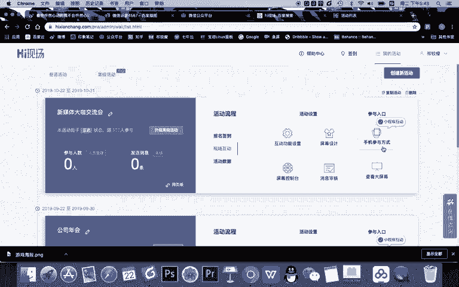

那首先我给大家讲讲所有的一个内容啊，这里是需要有一些注意事项，我挨个给大家讲解。

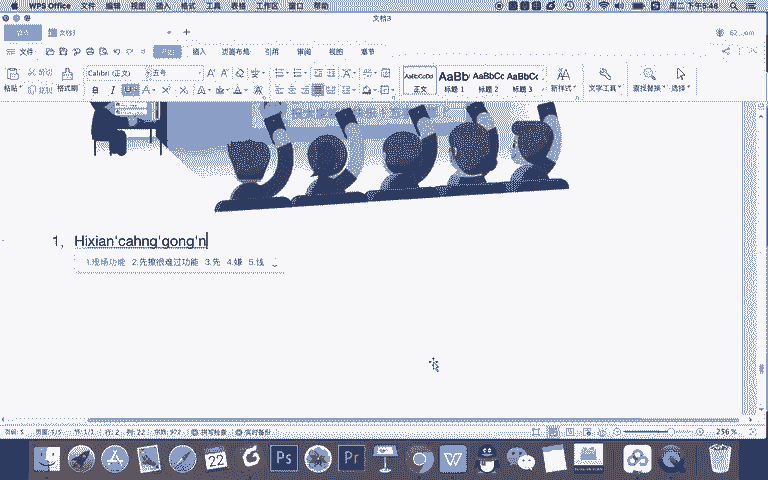

首先第一个功能。是互动功能设置。

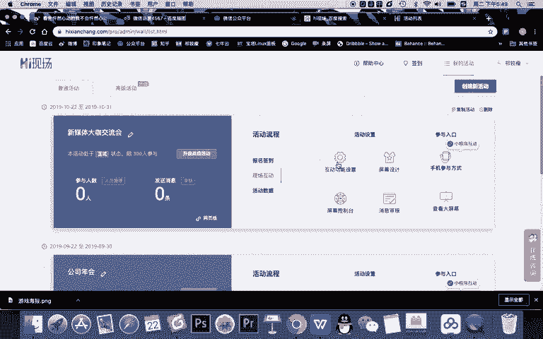

啊，也带上一个小标号吧。互动功能设置指的是什么呢？所有。什么呀。互动的。功能。都在这里设置。比如。抽奖啊。摇一摇。

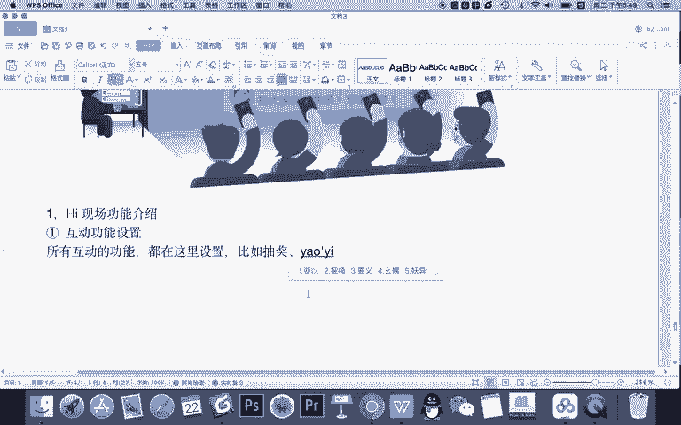

啊，你想进行各种活动的一个设置，就在这里设置。比如说你大家进去看啊，互动功能设置，你看有基本的一些活动的信息，比如说消息要不要上墙啊，要不要有霸屏功能啊，甚至啊现场互动的一些看看那游戏抽奖啊。

PK啊等等。所有的互动的基本的信息都在这里。所以这是一个活动的后台。

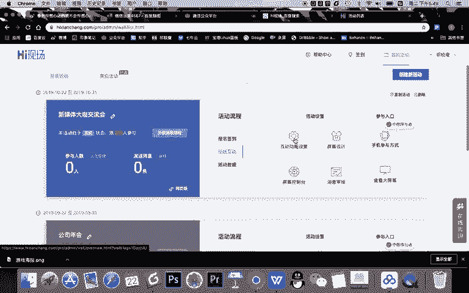

那么。