# 微信公众号运营视频全套 手撕运营 拳拳到肉 - P42：3.03-微信上墙增粉01~2 - 达妹_达内教育 - BV1UvvvebEdT

记得啊，你去去了活动还是要去到我们的啊这个页面去到这个页面呢，除了功能设置之外，屏幕设计是什么意思呢？

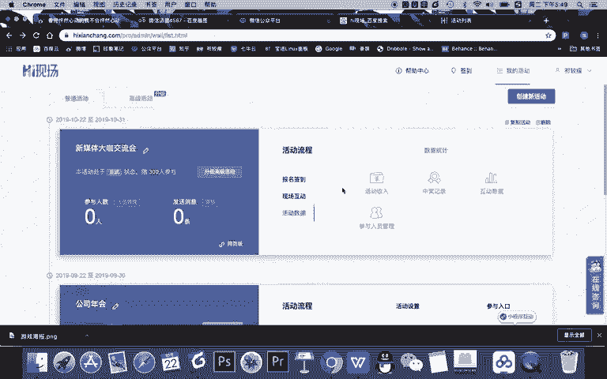

屏幕设计纸。设计。展示出来的。让用户看的。大屏幕的。造型。O所以你这个大屏幕到底长什么样呢？在这。

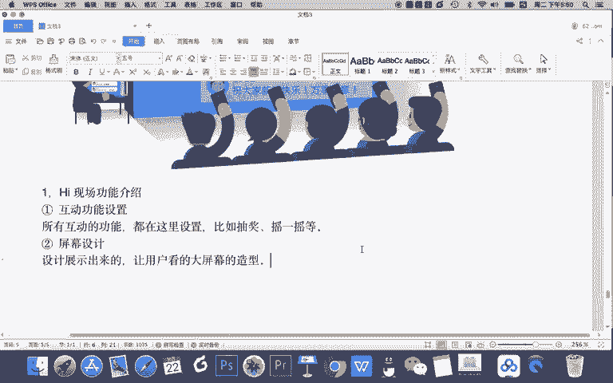

打开我点下。

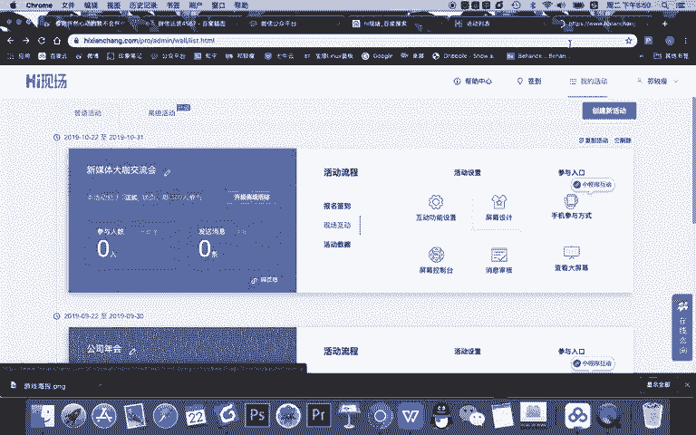

比如他默认呢是有一个造型，默认啊。屏幕长这样，那你说哎我这不好看怎么办？你看这里有屏幕设计啊，我们去设计好，设计好之后，大看参与入口查看大屏幕在这里。

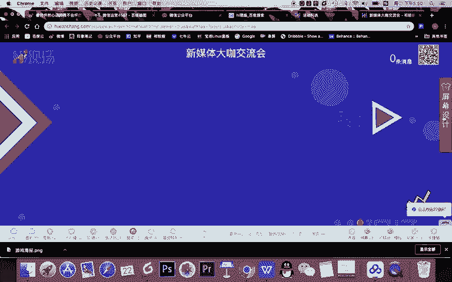

是干嘛的？我告诉大家啊，你要区别屏幕设计和查看大屏幕，查看大屏幕，这个是让用户看的地址啊，所以我。

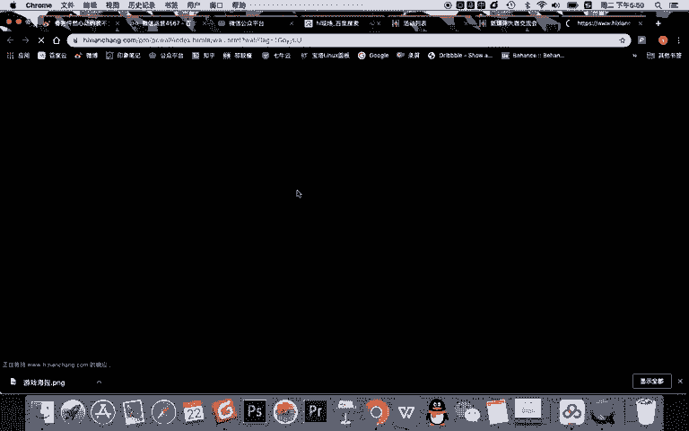

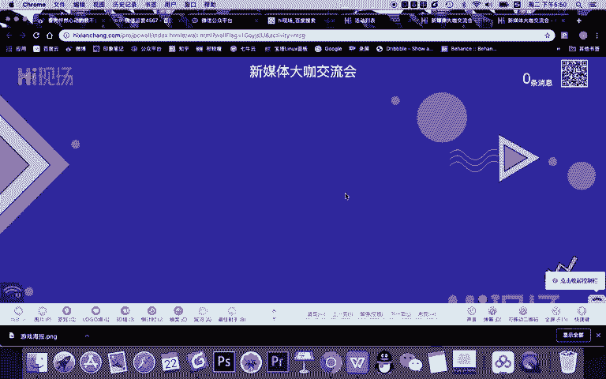

放在这里。纸。😊，让。用户看到的。展示的屏幕地址。然后呢。不可修改。只是。前台展示啊。ok那我告诉你一点，什么呀，活动整体。是，这是好后。只需要。带着。或者说只需要带着查看。大屏幕的。怎么样？

链接就可以在任何有网络的。地方打开。什么意思啊？你说哎老师我们做活动，我全部都设置好了，你说我到时间我连电脑都不带，我能不能做这活动，可以记得就把这个查看大屏屏幕的地址一复制啊。

你在任何活动的现场把这个地址给活动的负责人员，他把这个地址只要有网络打开了，投在大屏幕上，用户就能参与互动了。那你说用户怎么参加呢？怎么参加，我一会儿再跟你讲啊，怎么互动，其实呢你不用带电脑。

你用手机也能进行整个活动的一个操作啊，它是非常方便的。

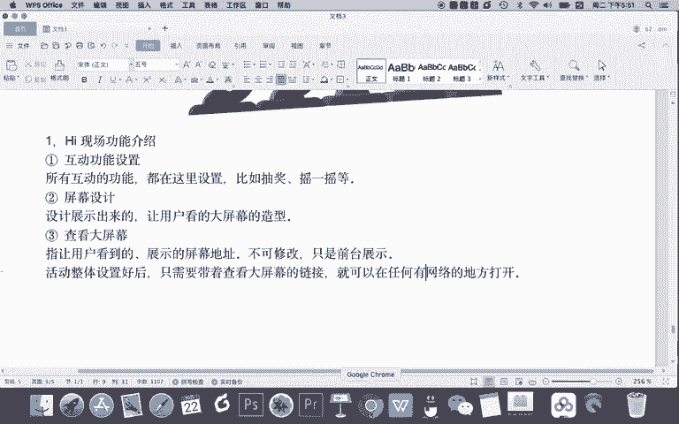

OK记得看这里啊。😊。

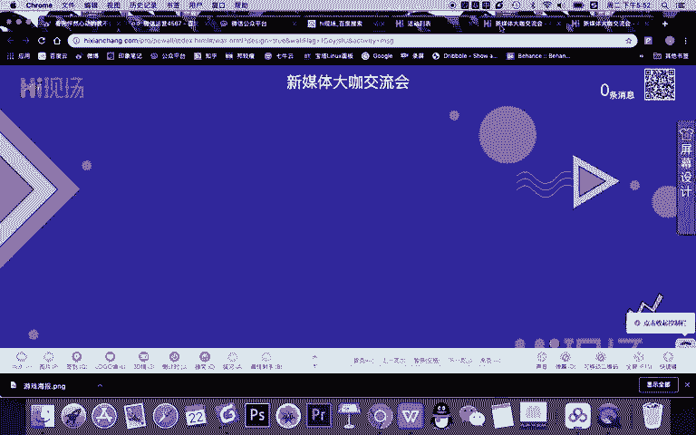

。查看大屏幕是只能看啊，只要是带着这个大屏幕的一个地址，就可以在任何有网络的地方打开。

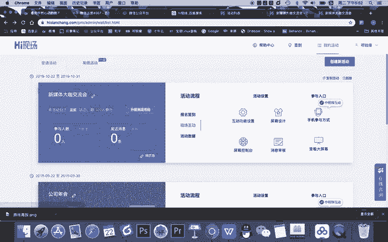

OK啊，第四个点。

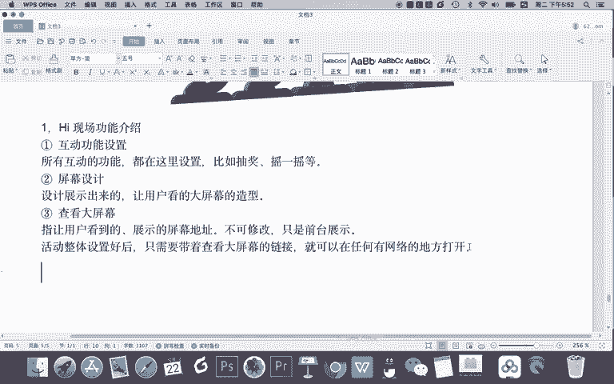

第四个呢是我们的屏幕控制台。

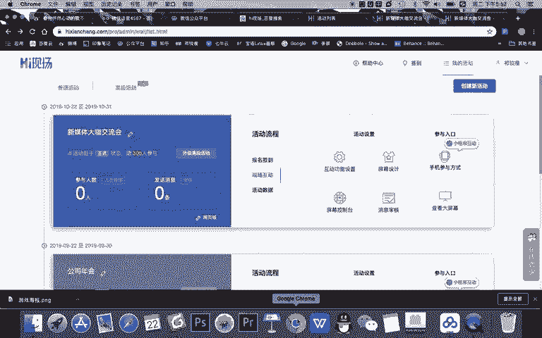

屏幕控制台是干嘛的？你看。他就是一个什么呀？二维码，那干嘛呢？屏幕控制来纸啊。手机上什么呀？操作。活动。流程的。干嘛呀？后台。用手机扫码。朗国。控制。活动的进行。比如切换二维码。然后呢，切换抽奖。

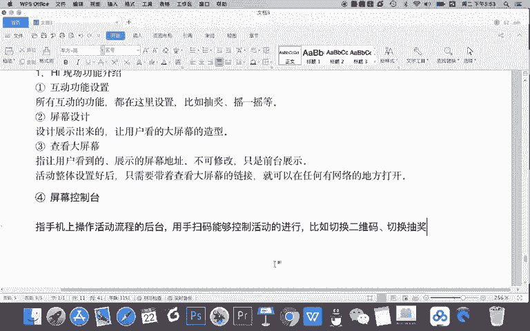

所以呢屏幕控制台只是一个二维码，这个二维码，这个二维码可不能给用户啊，只能你自己知道你手机扫码之后，可以把这个链接也收藏一下。然后呢，当在大屏幕上展示这个活动之后。

你可以通过屏幕控制台一点击把这二维码切换出来或消失，一点击把这个界面切换到抽奖的页面或其他的界面，然后整个活动的操作都在这里了。这是屏幕控制台，消息审核就不用说了吧。

这干嘛去审核就是说如果你们活动现场比较严格，不能发一些乱七八糟的信息的时候，你需要去控制好这个消息啊，就每一条让它审核，你看一下。

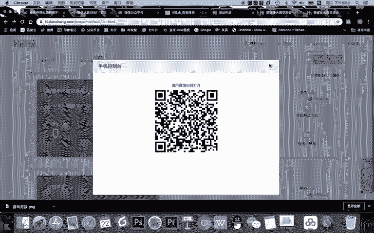

每一条审核之后才能上架。当然啊你可以什么呀？一开启就就有一个问题，就是所有的消息根本不会直接展示出来。你需要一个一个的找一个工作人员在后台看啊，通过通过通过才去给他通过，或者你不审核。然后呢。

所有的消息在发布之后会展示在这里，你看到哪个不合格，直接点击拒绝。直接给它删除，甚至还有一些直接加入黑名单啊，就是这样一个内容这是审核消息的。这个比较简单不说了。那手机参与方式是什么？

大家看手机参与方式是一个二维码链接，记得啊，这个是关键的。

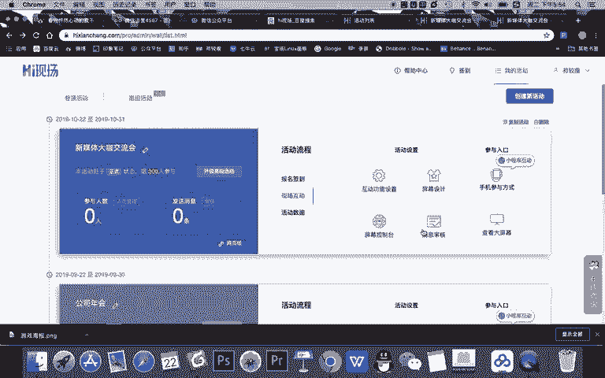

什么呀？是这里的。链接。和二维码是。给用户的用户。Yeah。链接或扫码能够。进入活动。发消息或。抽奖的。

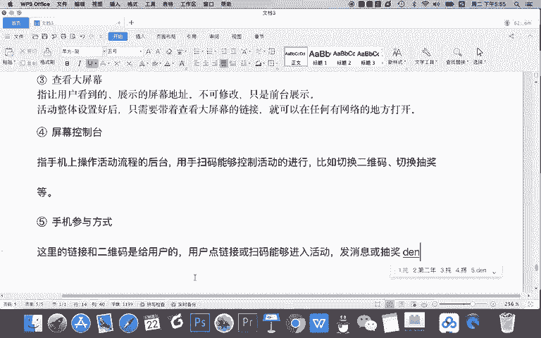

什么意思啊？这个手机参与方式这个东西这个地址它是给用户的，然后这二维码也是给用户参与的。约等于大家注意啊，用户收到了手机参与方式，比如进入这个链接之后，他能发一个弹幕，但他发的弹幕是展示在查看大屏幕的。

所以查看大屏幕的这个地址啊，他还不能给用户，你给用户用户只能手机打开，只能看啊，这就是一个只能看的地址。它是一个前台展示的内容。用户想参加在手机参与方式这里参加。然后他发的信息会展示在大屏幕上。

那我们管理人员想操作这个界面，那你记得在屏幕控制台里去切换界面，然后大屏幕会显示出来。那么整个活动的后台的设置呢都在互动功能设置这里，所以大家要注意他们的区别啊。

就是在互动功能设计里面是完成所有内容的一个设置。然后呢，在屏幕控制台，你控制这个活动，然后把手机参与地址给到用户，然后看到这个屏幕的信息啊，这是我们整个焊线场的一个后台的一个设置。

那完成现在这个设置之后，我们要干嘛呢？我们要进行一个简单的内容设置啊。

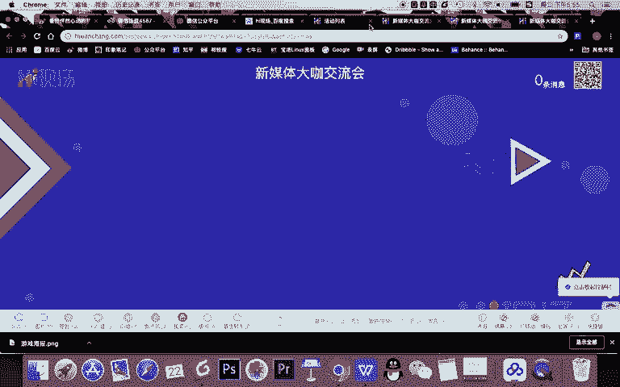

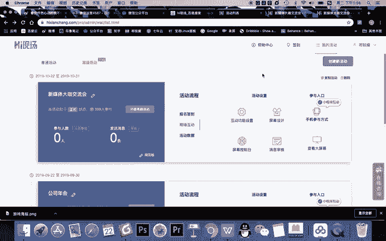

第二点。屏幕。设计。设计屏幕呢是要查看你看。

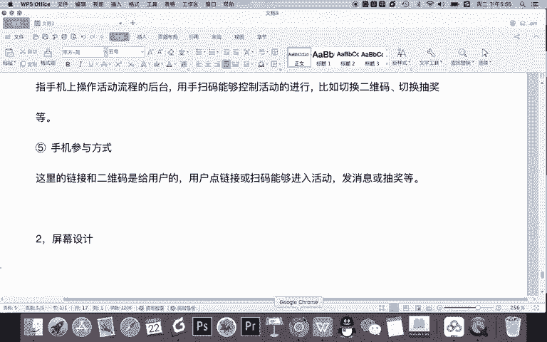

屏幕它展示出来是这样子的。你说这背景不好看，还有海鲜场的水印啊等等。我不想要长这样怎么办？你就去。

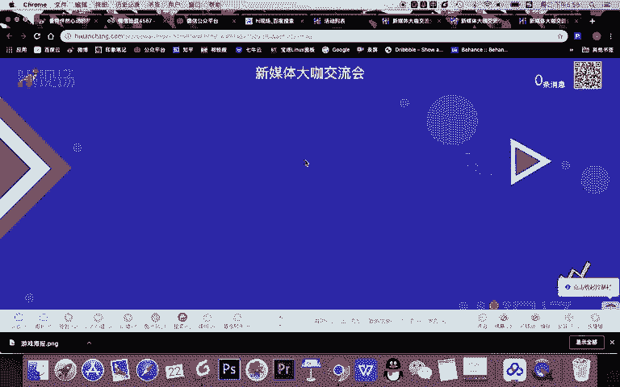

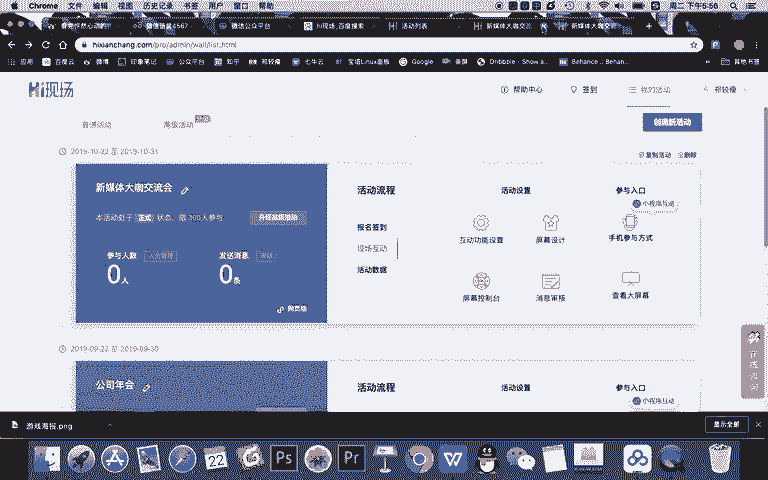

进行屏幕设计，点击屏幕设计啊，在右侧有一个屏幕设计，进这里能够改什么改主题背景，还有屏幕内容效果。首先在主题这里呢，你可以。

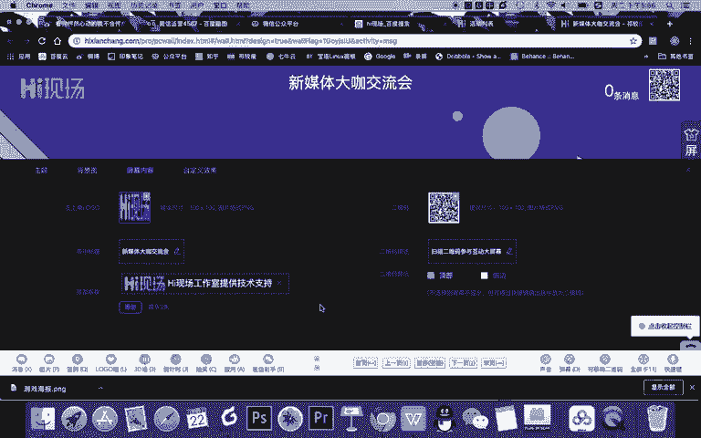

你看有年会，有各种节日，有商务的一些风格都可以去做啊。比如说我现在就默认里面，我随便选一个吧啊，默认就这个了，那我就选一个校园的嘛。假如我们在高校做活动啊，我认为这个比较好看OK你看背景我就改了。

我一应用。关闭这个界面，他就改成这样了，改成这样呢，用户看到就是这样。其他内容也一样设计啊。背景图我要告诉大家的是，你除了默认这个主题背景，你还可以公司设计一个，你们找你们的，比如你们公司开年会。

你找你们的设计师设计一个漂亮的图片，这是完全有你们公司logo的一个素材，可以上传屏幕内容这里能改什么呢？大家看第一。

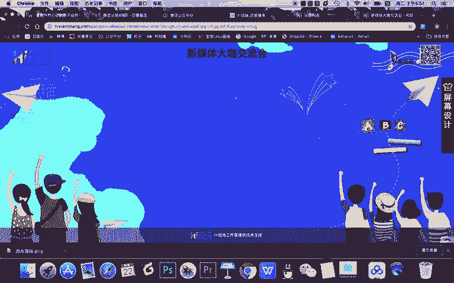

可以。把嗨现场的这个什么水印去掉，然后更改成你自己的一个水印。比如说他看看我这个上面有没有图片啊。

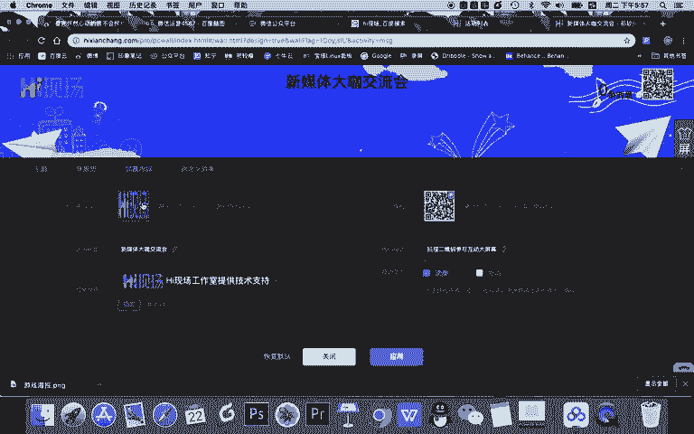

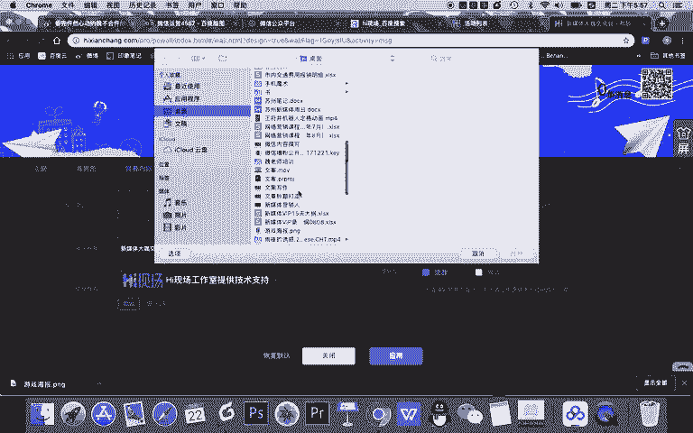

OK比如啊我设计了一个游戏海报，我把这个游戏海报，假如是我们logo最好是方形的，你看100乘100，然后呢，把我们公司的logo放在这里就没有含现场的素材了。还有呢标题我可以进行更改。

刚刚写的标题叫新媒体大咖交流会。那现在呢我感觉这文字小怎么办？你看我可以放大一点保存，这个内容就变得更大了。

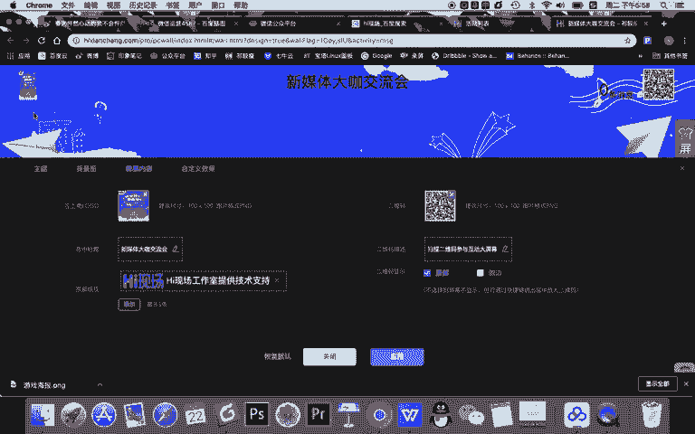

然后呢，大家看到在底部版权这里，它默认的是有焊线场的一个信息的，你可以删掉，甚至增加你们自己的信息，加图片也行，加到文字也行。比如说。

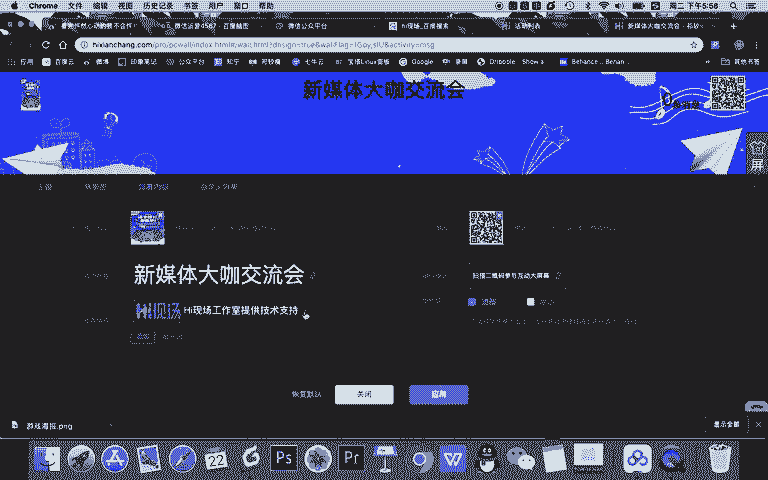

本活动由。齐教授进行。什么啊。活动支持。对吧当然你可以其实写成你们公司的或者其实不写也行，对吧？自己公司做活动。那现在有一个非常关键啊，二维码要不要改这个二维码是什么二维码？就是用户扫码就能参加。

那我告诉大家注意一点。

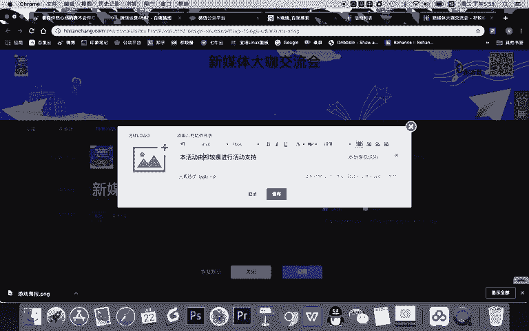

啊，屏幕设计这里我就没有什么技巧了啊，就什么按照自己的需求完成。撇沫。展示。效果的设计。第三，二维码设置，那需要提醒一点，就是注意一点啊，就是。如果想要。增反。要把什么呀？😡，屏幕。展示的。二维码。

换场。自己。公众号的。二维码。然后呢，让用户。扫码。进入。公。

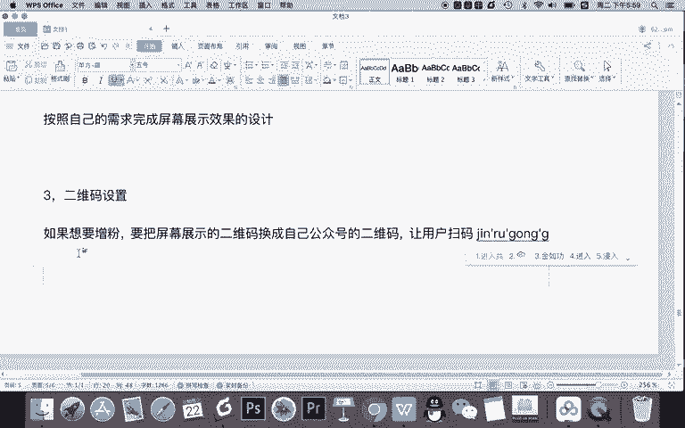

众号。参加活动。所以非常关键的一点就是。