# 微信公众号运营视频全套 手撕运营 拳拳到肉 - P43：3.03-微信上墙增粉01~3 - 达妹_达内教育 - BV1UvvvebEdT

我们现在的这个二维码如果一扫用户直接能够参与互动的信息，弹幕会发在这里。但现在我不让他去参加这样一个二维码，我要把这二维码删掉，放什么二维码，放我们公司公众号的二维码啊，比如说。

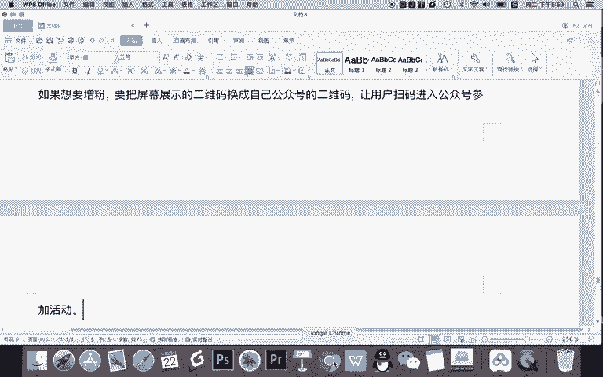

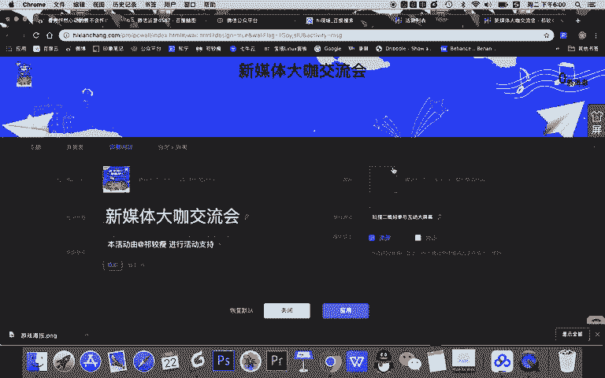

看一下对，这是我的公众号维码。我放在这里呢，然后用户扫码能参加，那怎么参加呢？我需要给他什么呀？二维码描述要改一下，现在不能是参扫码参与屏幕互动，是吗？直接改成。

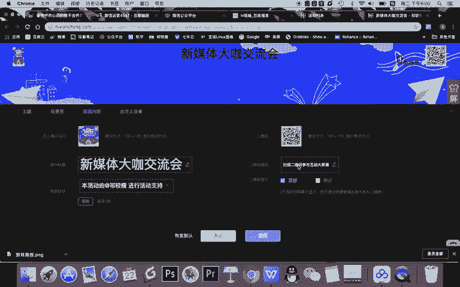

扫码回复。没关键词参与什么？互动他方回复哪个关键词，你可以回复上墙或我设置一个回复666参与互动啊。OK设置好之后，然后二维码显示在顶部或者侧边啊，直接默认顶部。然后还有一些自定义的效果。

这个就是什么意思呢？就是。

头像的一些形状啊，什么是头像呢？就是等会儿你发的弹幕一条一条的它的一个形状，还有翻页的一些效果啊，缩放的一些效果。这现在没有消息，所以你看不到，还有这个一条一条消息的一个造型。那什么内容。

大家看是这样的啊，你看这一条两条三条的消息，这些消息，它的头像啊，还有整个细条的一个造型可以设计啊，这个不是特别重要，你就不要改，但我一般建议改成消息显示的条数显示5条，为什么呢？

因为在拍现场这里呢显示三条，每条消息特别的大。你想一个屏幕三条有点特别的大，我们显示5条。当然你说我为了让现场用户看清，可以三条嘛，当然可以一般默认345都可以啊。还有文字的颜色。

我建议也不要改屏幕显示多少条消息嘛？你看这是零条，最后多少条会显示是吧？OK这里默认显示之后点击应用啊。

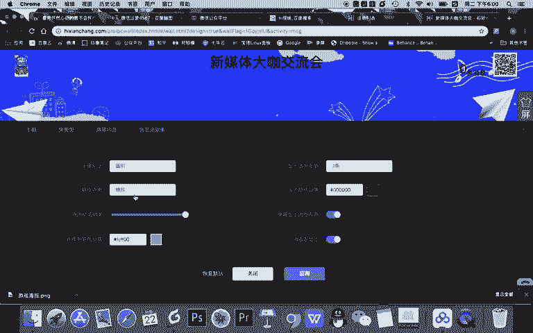

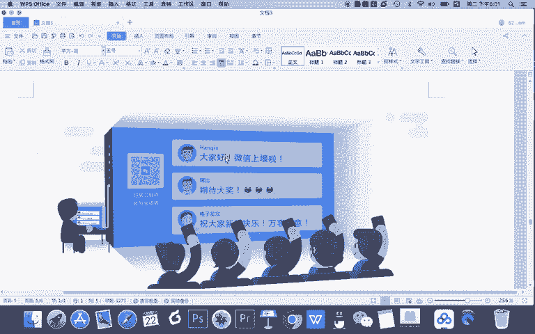

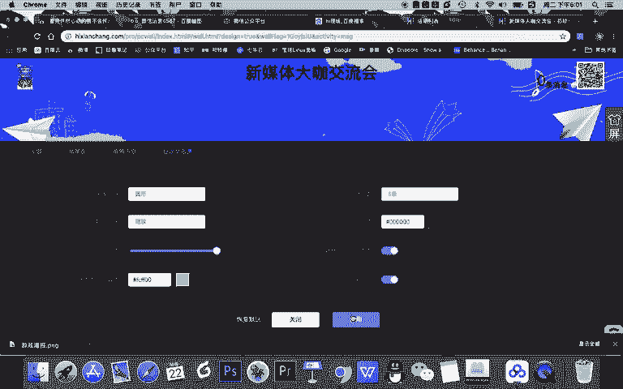

应用之后我需要进行一个操作的，就是我要查看一下大屏幕，看看设计的。OK不OK。

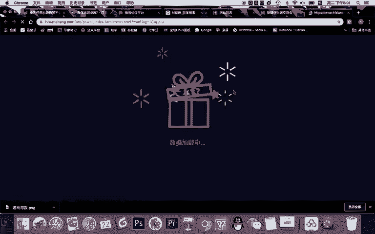

好的，大家看啊，我点击二维码出现了扫码回复66参与互动。那这个二维码就搞定了。然后呢，这个这是我们公司logo，当然这是一个场形的啊。然后呢，我要去完成这个设置本活动与期要授支持。

可以甚置大家看这个活动在活动的页面的右下角有一个上向箭头啊，下一个菜单，这个菜单这里可以去完成整个活动的一个切换。比如切换到抽奖界面，我们现在没有创建，对吧？所以现在还没有。

那我现在呢就是设置到消息界面，也没有消息。

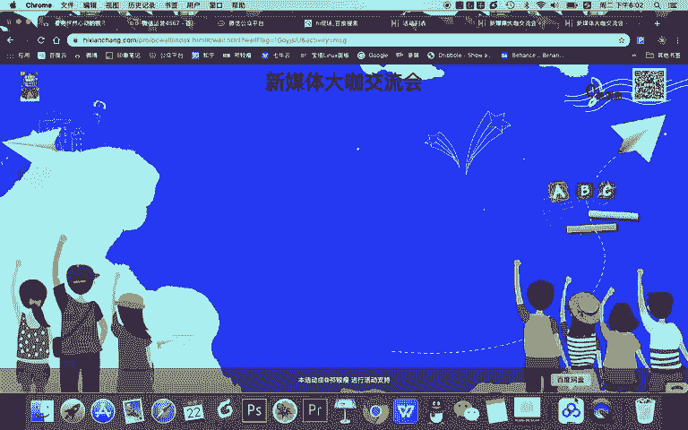

OK甚至大家看啊，最后我们可以把这个内容全屏。那你知道在你们公司做年会或者现场做活动的时候，你一旦全屏，你看到这次活动所有的消息都是我们自己设置的，用户只需要扫码互动就可以了。但是他并不需要干什么。

他不需要去看到任何无关的信息啊，链接呀、浏览器啊等等都没有。所以呢这是一个啊设计效果或者展示效果非常好的一个活动。但现在这个活动到底能不能参与呢？还不知道，因为我还没有去扫码回复66参与。

所以我现在要干嘛，要设置一个关键词叫666。

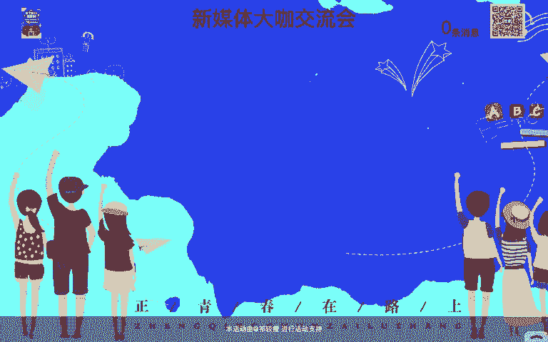

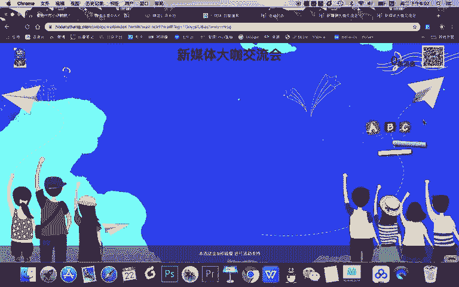

然后呢，让他参与活动。那大家思考一下，我666给他回什么？回哪根链接是大屏幕链接还是控制台二维码还是什么？对的，其实应该是手机参与方式。因为他一回666，他想参加，所以我应该把这个链接给到他，对吧？

OK那我现在去到我的公众号的后台。啊，哎，大家看啊，我这个活动之前我的后台有1个666的一个关键词啊，我是之前教学演示的时候，可能其他内容设置的，我现在需要把它删除。然后呢。

我把这个游戏的啊这个无关的也删除。我把这个游戏的关键词我现在不用了，哎呀，我直接把它改一下，把它改成什么呀？微信上墙。

然后呢，关键词叫666。然后回复的内容啊，在这里呢就不是之前涉及的链接了，而是我的哪个链接。对，再确认一下是手机参与方式的链接。我要把这个链接给到用户。然后呢，链接给了用户之后。

我要把这个文字改成什么呀？点击。

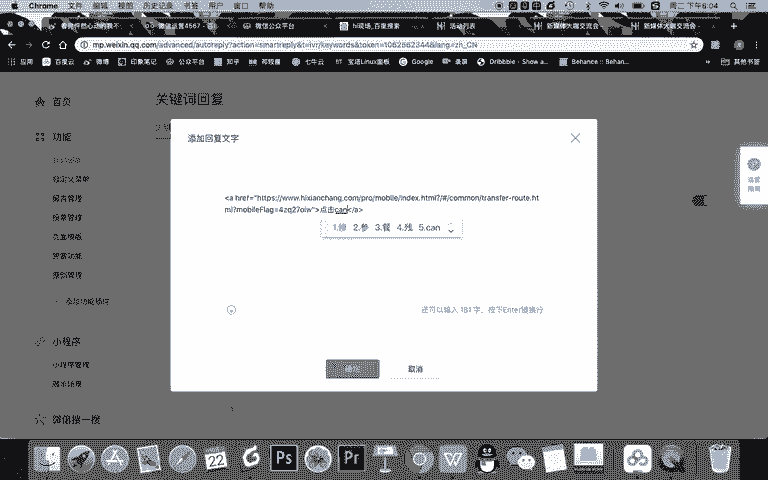

参与活动。OK确认确认之后666啊，关键词66，我点保存。然后这个时候我就需要自己去走一遍这个流程了。比如我扫码。扫码之后呢，我要回三个字，666，点击参与互动出现了。然后呢，我看看能不能进入嗨现场。

OK啊，成功的进入嗨现场这里面了那现在呢我要去到这里给他干嘛呢？我就。直接。怎么上墙发一个互动消息。比如说。开心啊我也回来66。然后呢，哎大家看我现在回了这个消息之后啊，我甚至可以先把它取消，然后呢。

我的消息就出现了。如果啊现场有上百位用户，那么他同时扫码进入这里面都能完成这个消息的话，所以现在啊能发的收到这个消息证明它是成功了。当然我们还可以啊，等会儿我教大家更高级的方法。

现在我还可以让它显示弹幕，约等于我们用户所发的所有的消息，我都可以以弹幕的方式在这个屏幕中滚动。如果你想啊，我们现在去全屏的方式。展现。弹幕在这走的很快，大量的消息在这发布。

其实我们跟现场互动的效果是不是非常好？比如有一个主持人在看着这个弹幕去跟用户互动啊，甚至你讲课的老师在看着弹幕回答学生的问题，甚至你在酒吧里公司年会上看着弹幕去跟现场互动，这效果是非常好的。

所以我呢现在完成了我的屏幕的设计。同时呢我还完成了我的什么设计啊，我的一个关键词的设置约等于我现在完成了两件事儿。一、完成后台的这个嗨现场的设置。2、完成了增粉的设置。所以通过一个简单的演示。

我告诉大家如何进行线下活动时，通过一个嗨现场的活动实现微信的增粉。那么本节课呢我们只是讲了其中的一个部分，大家只是刚会了什么呀？我们这个活动如何去设置它的屏幕。

甚至如何把公众号增粉和你的这个啊线线下互动结合起来。那我们下节课将学习新的内容。

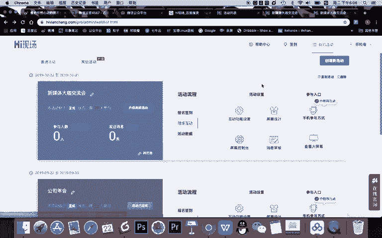