# 微信公众号运营视频全套 手撕运营 拳拳到肉 - P44：3.04-微信上墙增粉02~1 - 达妹_达内教育 - BV1UvvvebEdT

同学们好，今天我们来学习微信上墙第二节课的内容啊，在上节课呢我们给大家讲解了微信上墙的工具嗨现场的一个屏幕设计的一个操作。同时呢我们实现了大屏幕二维码的一个替换。

我们把原有的直接上墙的二维码换成了我们公众号的二维码，然后呢，我们把公众号通过关键词，然后给这个嗨现场打通，让所有的用户能够在参与互动的时候，先关注我们，从而实现了一个增粉。

那接下来呢我们给大家讲解其他的一个设置。比如我们在活动的时候，除了需要用户啊给我们发消息上墙之外，我们还可能去抽奖以及其他的一些活动。那在哪里设置呢？比如是在互动功能设置。OK我们先给大家讲一下。

拍现场的什么呀？上墙抽奖的一个设置。首先啊在上墙抽奖这里呢啊它属于我们所有互动功能的一个介绍啊，一个部一个活动之一。我把整个我们海现场的一个后台给大家介绍一下。在活动设置里面呢，首先在活动总览里。

这里有什么呀？比较热的一些活动的推荐。比如赛马啊赛车，还有呢滚动抽奖、红包雨啊，3D签到这样的一些特别的新的活动推荐。在基本的一个上墙展示上，比如说我们消息上墙可以开启。还有呢弹幕啊可以去开启，就是。

在前台也能够我们就是我们看到这个就在前台也能给他开启或关闭。再然后呢是图片墙，然后呢用户上传图片能成为一个摆出一个墙的一个造型，然后去展示我们的一个风采。还有呢能够霸屏啊，什么是霸屏呢？

比如说大家看我发的其中一个消息，我如果选择霸屏的话，那整个屏幕上就非常大的展示我这条消息。比如我某个人给另一个人送的祝福啊或表白啊，或者开玩笑等等，就可以用霸屏的方式啊进行全屏的一个展示。

那霸屏是需要干嘛的？需要付费的。还有呢超级的一些弹幕啊，也是是额外的一个展示。啊，当我们在进行活动的时候，还有暖场的一些启动，比如进行签到墙，让用户先签到3D签到啊，还有倒计时引爆这个活动。

其实就是暖场的一个内容。还有抽奖的时候，我们有滚动抽奖红包与语音口令的一个抽奖方式。还有一些现场互动的方式，比如用通过摇一摇。最佳射手数前答题拔河等等，然后去进行竞技PK的一个互动。

然后能让现场啊几百人甚至上千人同时互动，然后跟我们的屏幕互动。这样呢现场的氛围会比较 high。最后呢还有一些投票类的一些功能。那现场互动这里呢，我们看啊我们可以通过消息上墙等等去进行设置。

那首先呢我们给大家在现场互动呢给大家讲一下幸运抽奖的一个设置。那我们先进行一个基本的一个抽奖。好，首先啊需要注意的是啊，这个抽奖呢，你在后台设置好之后，在你前台切换的时候，比如你看我在这儿切换。啊。

在这儿我一点击那个抽奖就会事就会出现在这里了。那我先进行一个简单的一个演示，我新建一个抽奖。

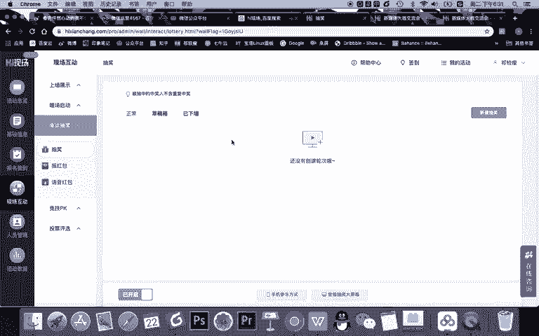

大家可以看是扫码抽奖还是导入名单抽奖。比如说你们公司年会可定要导入名单抽奖，对不对？导入公司所有的人的名单，然后呢进行抽奖。但今天呢我给大家讲的是一个演示，然后呢，是为了让现场来的所有的用户进行互动。

所以我直接选择扫码抽奖。

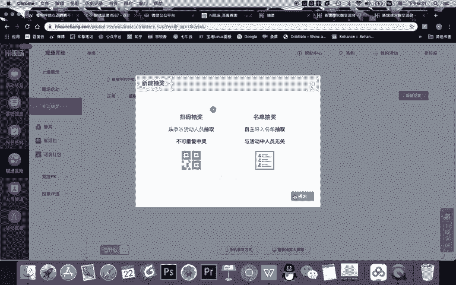

OK我直接进行奖项的一个设置。比如说奖品名。一等奖。奖品名那比如说我们就送iphone。iphone是吧XS max数量呢，一台点击一次抽奖几个人啊，这什么意思？比如说如果是二等奖，数量是两个。

你是一次抽两个，还是说点击一次一次抽一个，甚至一次抽两。比如10个数量的话，一次抽5个或者一次全出啊。我建议有些时候你比如说你奖项不多的，就一次，有几个奖项就抽几个。啊，还有这里呢。

你看我还可以设置奖品的图片啊，我就演示一个，我先弄一个。

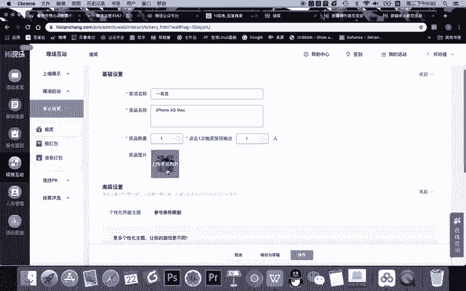

iphone手机。搜搜一下这个图片，然后我们看到这个图片呢，它的造型是方形的，所以我们最好选一个方形的一个造型，然后当成我们奖品的一个展示。啊，比如说我们就选择这个宣传图。

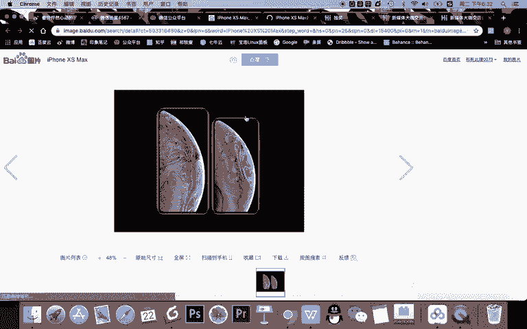

OK存到我们的桌面上，然后呢上传进来就很简单，这是一个基本的一个设置啊，我只需要去。演示一下二等奖和三等奖，我们就不再进行这个图片的一个替换。OK个性化的界面呢，其实啊它有一些免费的。

比如这个造型长什么样这样的一个抽奖。当然它还有一些3D的一些抽奖啊，这是收费的。其实我个人认为这个就还不错了，对吧？你也可以认为这个不错。O我们选择这个内容啊，建立经不要着急保存，我们还要设置参与条件。

参与条件呢，如果你需要进行分组抽奖的话，它是一些额外的功能。还有呢一般如果不进行一些额外的一些设置。比如说啊默认所有人都是可以抽奖的。那么你需要记得一点，就是刚刚在上一个页面会显示一个人一般只中奖一次。

啊，而且呢如果需要定制一些滚动效果情点击，其实也就有额外的一些付费。所以呢参与条件这里你记得想设置更多的一些条件，那你需要去。完成更多的一个付费的功能的设置。OK如果一等奖搞定之后，你就点击保存。

那么此时在你的后台呢，就已经有了一个奖项，一等奖一个人没有抽出，对不对？那你设置好之后，你需要记得啊，需要有临时嘉奖，还有中奖数据，甚至再次编辑的一个内容。什么时候需要临时加奖？比如同学们你要注意。

当你完成整个奖项的设置之后，一般情况下你需要进行一个预览的演示，对吧？你先抽一遍，但如果这个时候如果你抽了之后，你忘记把这个奖项再次重新添加或者重新设置的话。那你抽奖的时候，如果真的是现场会尴尬。

为什么？因为一抽发现抽不成奖品已送完。所以你记得啊如果这里有临时嘉奖，会能解决你的燃眉之急。如果你之前演示的时候抽过了，你需要临时加奖O我们用同样的方法再设置两个奖项。

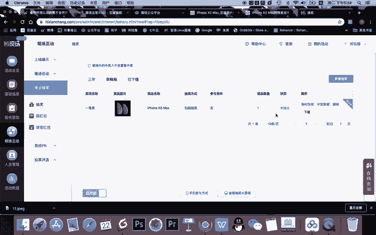

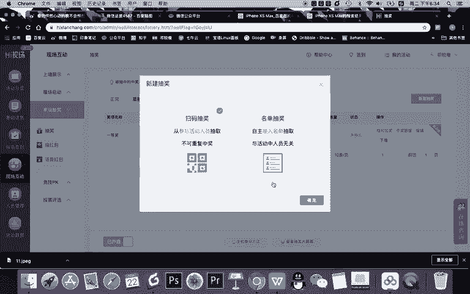

是。比如二等奖，我们送。华为手机对吧？奖品数量呢两台。一次两个人图片我们就先不换了。界面呢我们还选的这样一个免费的界面啊，参与条件也同样是不限制的。OK我们再次点击保存。

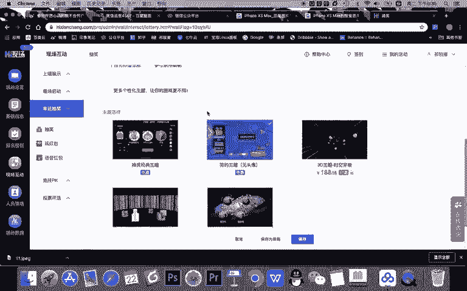

然后再新建三等奖。

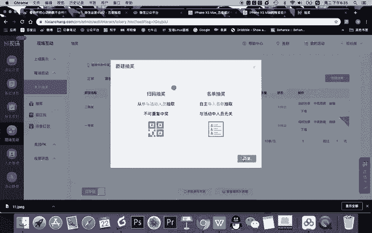

然后呢，奖品比如说什么呀。啊，比如说我们就送亚马逊。听到。三台一次抽三个人，约等于我们一抽啊，就直接这三个人抽出来，同样选择这个界面，同样条件不限。OK保存好之后啊，那你需要注意这几个奖项呢。

你看这里有一个内容，它是默认展示中的，什么意思？约等于大家看啊。

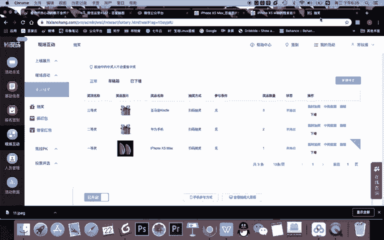

别说。我去到大屏幕。

如果我把这个活动直接切换到抽奖，你看一下。

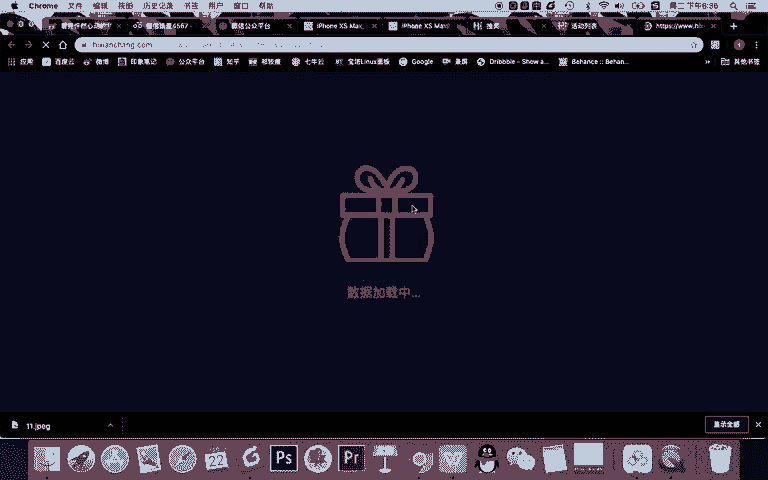

🎼直接抽的行就。🎼看声音。直接抽阴动奖有什么问题？我们需要去三等奖往往前抽，对不对？你直接一等奖的话，就效果就不太好。所以呢我需要把这个给他。改掉啊，我先直接让他去抽三等奖，再二等奖加一等奖。

但现在有一个问题啊，你说哎我刚刚已经去设置好了，他展示的就是这个，那我需要怎么办？你现得你可以现现在啊你对它进行编辑，这个叫什么？测试。测试奖品你保存。之后啊，他会在什么呀？临时啊。

比如说展示中去展示这个内容，那你其实需要只是需要再新建一个。要じ。对吧。然后呢，这是真正抽的。一等奖一个，然后我们再次上传这个图片。还有一个方法比较简单啊，就是你可以在刚开始做的时候。

是从三等奖啊三等奖去进行这样一个内容的一个展示。OK啊，我们还选的这个奖项。给你保存。那现在呢大家看。在我的整个后台，我呢现在先展示的是测试奖品。但其实你知道我在正式抽之前，我先抽一下测试了。

然后我会把这个奖项切换到三等奖。对吧然后呢再抽二等奖，然后呢再抽一等奖。但现在我告诉大家，现在可能会有一个问题啊，大家如果你没有操作过，你可能会不知道啊。

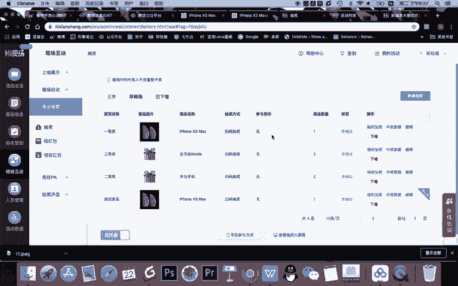

他的默认。