# 微信公众号运营视频全套 手撕运营 拳拳到肉 - P45：3.04-微信上墙增粉02~2 - 达妹_达内教育 - BV1UvvvebEdT

正确是展示完这个。再抽这个再抽这个再抽这个。那你想你这个抽奖就是二等奖、三等奖、一等奖。那有什么办法去解决这个问题呢？我告诉大家啊，你设置的时候先去排好顺序，让321或123都可以。

其中呢弄一个测试的是站在这儿。然后你就把它调成这个123或321都可以。但是它的顺序一定是123或321。比如默认一会儿抽完这个测试之后，是这个或这个都可以，然后在手机上切换的时候。

你可以选择上1个或下一个。能理解这个吗？所以呢如果你看啊现在我们按默默认的这个抽奖方法的话，你抽完他他抽的是一等奖或二等奖，这是不可以的。所以我现在要把什么？

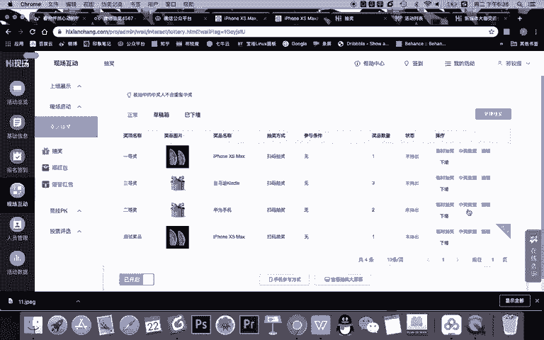

这个数据给他改成。哎啊，我这还这里还没有中奖数据，我要把它编辑成。

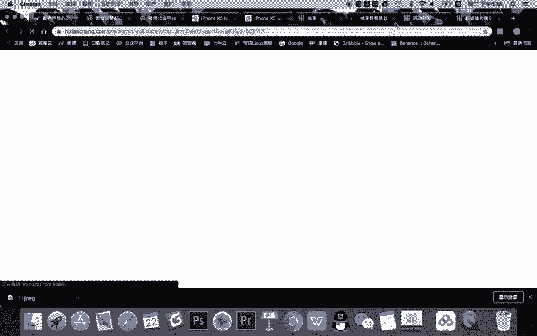

三等点。然后呢。抽三个人。所以大家记好这个顺序啊，比如说还是华为手机，好吧。然后呢，这个就变成二等奖。然后抽两个奖品我们不变啊，价值默认不变，然后呢点点击保存。

那这个时候不管你是抽一等奖、二等奖、三等奖，他仨都是算排好序的。所以你可以先抽完它之后，把你的奖项。展示成三等奖，然后选择上一个二等奖，然后再选择上一个。这样呢他们的顺序是能排好的啊。

如果你不知道这个概念的话，你一会儿看我先操作一遍就可以。那现在大家看我的奖项已经设置完成了。那我需要干嘛呢？那其实我只需要去前台演示一下就可以啊。我现在给先给大家演示一下，你看一下效果。

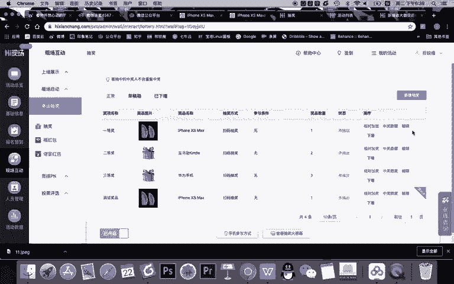

ok。我先把。界面。调到这个最基本的内容。然后大家知道我用户参加呢很简单，我是需要他扫码去参加的。但我告诉大家，我作为一个运营人员，我肯定不能在这儿，我要干嘛？我要在后台。

我要在我的活动中去进行屏幕控制。

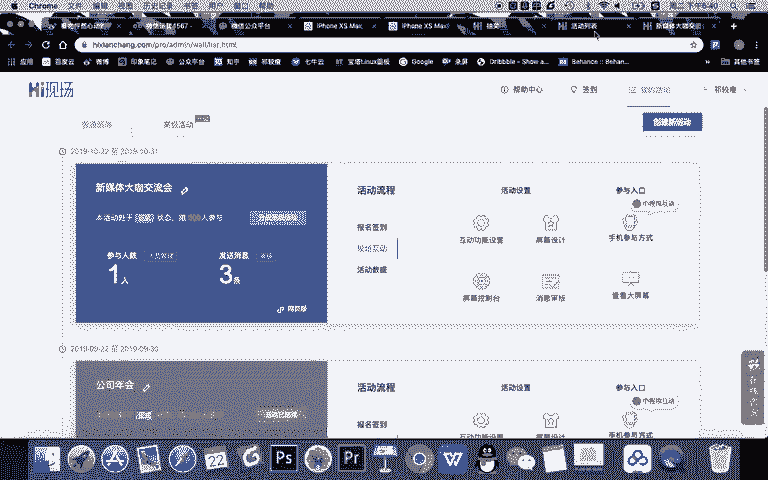

也就是我需要个人的手机上。我去扫这个二维码。然后我扫这二维码，它的效果啊跟大家看到就不一样，它是一个控制台。比如说大家看我现在能够控制，哎，你看我没有进行屏幕的操作，我只是在手机上点。

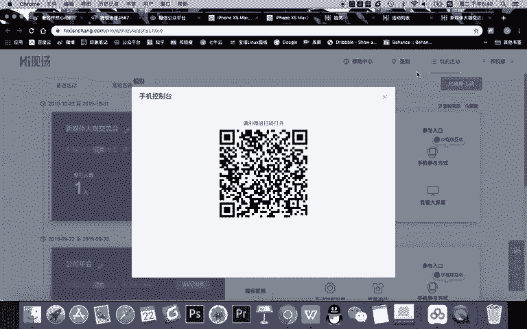

我点一下二维码，二维码就没了。我再点一下二维码就出现了。然后呢，我再点一下弹幕。我这个活动的弹幕就会出现。在活动呢刚开始我会给大家说，哎，大家好，欢迎参加我们的一个什么呀微信互动内容。

大家有任何问题或者有什么想说的话，可以通过扫码，然后按照我们的方式啊去进行互动。哎，大家就扫码看到回复666，他会回复666，然后进入这个里面，进入这里面之后呢，他就可以进行弹幕的一个消息发布。

然后此时呢，如果大家不需要扫码了，我就直接把二维码隐隐藏了。然后这个过程中你就需要比如说啊看着弹幕消息去跟用户互动也好，或者进行任何的操作都是可以的。然后呢，如果需要进行抽奖啊，你直接点击抽奖，哎。

大家看现在这个奖项是不是已经有了。那抽奖的时候，我要把弹幕关掉。那这个时候大家看我手机进行操作啊，它是一个测试奖品。我可不可以抽一下？直接点击你看啊，直接点击开始抽奖就抽了。很简单，为啥？

因为只有我一个人，所以就我中奖。但现在你要注意，我要切换到12三等奖的时候，你看这里有上一项，在手机上有上一项和下一项。我点上一项，直接去到一等奖，我点下一项的，去到测试奖名再点下一项三等奖。

再点下一项二等奖，再点下一项一等奖，再点下一项测试。哎，所以你知道现在你在预览的时候就能控制好这个奖项的顺序，约等于在我进行测试奖项之后，我只需要点下一项。然后这个奖品就切换到了三等奖。

对吧嗯谁中奖还没显示出来。然后呢，切换到三等奖之后，我需要进行抽奖。抽完之后，我直接每次抽就点下一项3。2。二。对吧这个顺序就我手机上就跳试好了。所以你理解我刚刚的这个操作。

如果我没有把三等奖二等奖给它进行一个切换的话，那你看你先测试完抽过来下一项二等奖。一等奖三等奖，这个顺序就变了。所以你要让它三个顺序是123或321都可以。如果这321呢，很简单。

上一项二等奖再上一下一等奖。所以啊我给大家刚刚演示的这个流程，你需要记得，在你设置的时候，先设置一个测试奖品被展示中默认，然后按照321倒序的顺序排好这个奖项，然后在你抽奖的时候，这个流程就可以了。

所以呢你看这个奖项就可以进行按照顺序抽，抽完怎么办？抽完的话，你直接点击消息。又去到我们这个界面，还可以在首机上再点击什么呀？弹幕，然后呢又能够啊看到我们的弹幕消息。当然啊这是我们其中两个内容。

也就是消息和抽奖的一个设置。那其实呢我们还有其他内容的一个设置啊，我一会儿呢会给大家再讲解一下。OK我希望大家能理解这个内容。OK在我们抽奖这里，其实你是看到啊，我们设置了之后互动现场。

这里有很多内容的啊，抽奖呢这里只是一种那竞去PK里面呢其实。对我们活跃线下气氛来说啊，非常有帮助，可以完成这样一个设置。比如我给大家演示一个摇一摇的一个内容啊。你看我新建一个摇一摇，比如说摇一摇标题呢。

比如说什么。比如新媒体。最佳臂力。排行榜。对吧。OK啊，你去做任何的一个标题都可以摇一摇嘛，它就摇。比如说你看活动持续30秒，让大家现场几百人同时摇手机啊，摇30秒。那你可以用各种段子。比如说什么呀。

谁摇的好，是不是谁证明单身酒啊是吧？最佳什么呀？单身偶像奖双十一可以搞这个活动，对吧？我们啊不那么什么坏坏的啊，我们就稍微正经一点，我们就写最佳必力排行榜30秒。最大摇动次数呢，你看你可以手动改啊。

其实也不用改。显示我们最终多少秒。你可以显示5个。或者10个都可以啊，就是你可以根据大家互动的情况去按排名情况去给大家发奖品。比如我就默认10个。大家看摇的时候啊。

现场所有人的微信头像和昵称都会显示在这里，然后去展示它的一个效果，我们就可以去选择啊，比如说默认的这个效果。参与条件呢。你看本轮前多少名不能参与，为啥？因为已经中奖了，他在下一次又是摇的前几个。

我们是不是不太好，对吧？你可以写本轮前10名不能参加后续的。啊，当然也可以不限啊。还有呢你看按名字设置奖品，你可以1234567890去设置这个奖品。现在我们假如先不设置这个奖品。

我们就默认完成整个内容的设置，点击保存。ok。那么这个活动呢，你看就是在展示中还没有开始的。那展示的效果怎么样呢？大家看一下。在前台上啊，你看在这里，它是你可以往下翻的。对吧你看可以用摇一摇。

1洋就是你设计的这个内容。然后呢，我当然可以把了。弹幕给它取消掉。然后呢，我一点开始摇一摇啊，你当然同时也可以设置两个，一个先自己摇一遍测试啊，一点开始摇一摇。

现场所有进入到我这个活动的用户都可以进行摇一摇。那怎么证明他进入我的活动了，再看一遍。只要他在我的公众号后台通过我设置的那关键词链接进入我这活动互动，那么他去到那个页面就能开始摇一摇。然后呢。

我一说开始321开始一点倒计时，他就可以摇摇完之后啊，你看。

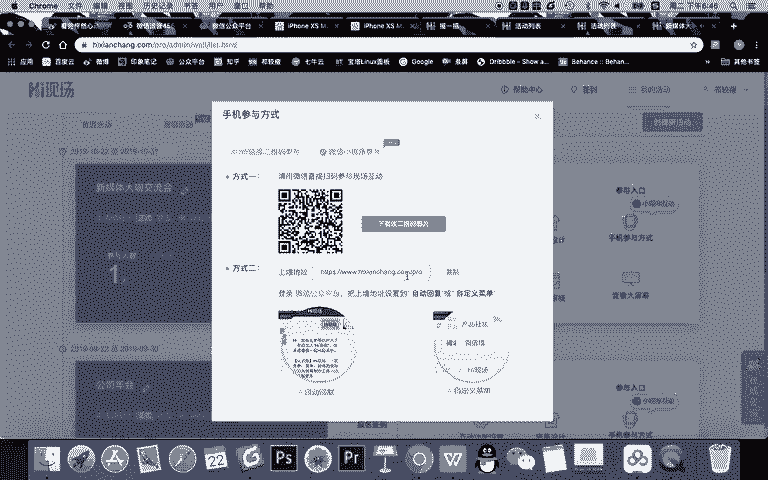

摇完之后，他就能够参与我这个活动。现在我没有去用户没有去进来，所以没有办法摇。OK这是我们的摇摇的一个活动。

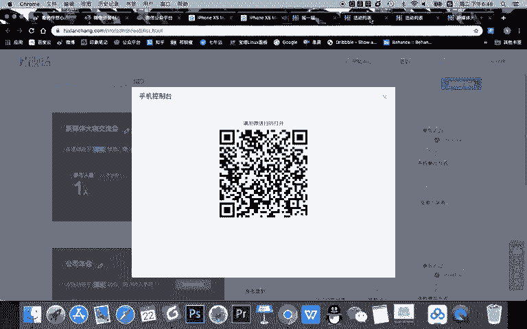

好，在摇一摇活动设置好之后呢，大家可以看到啊，在互动功能里我们有其他的。

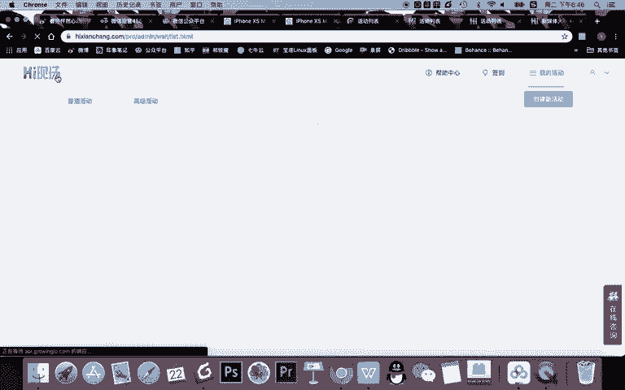

一些。

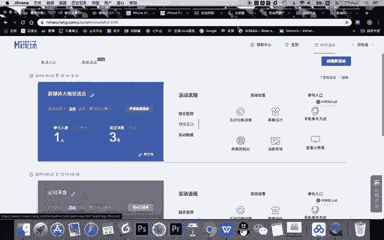

游戏互动里面呢都在这里面，抄级淡漠这你看。

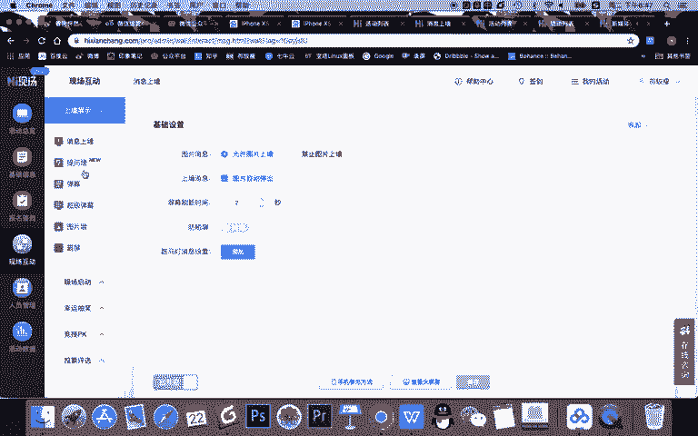

是需要。付费的啊一些计费多少多少钱去进行一个这种超级弹模的展示。

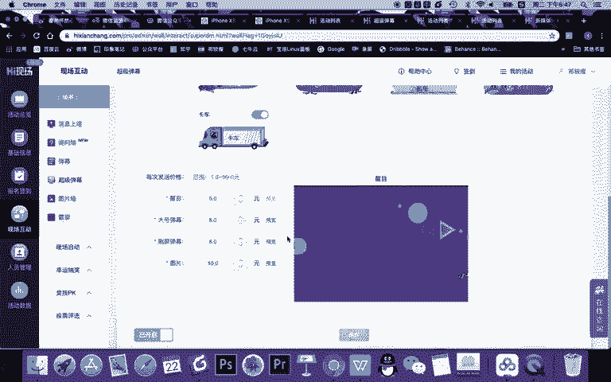

然后呢，暖场呢这里面的其他的游戏我们就不再设置了。在抽奖这里，你看既可以摇红包，还可以抽奖。在PK这里呢也有各种各样的玩法。我只是给大家演示了一个要摇。那我要说的是呢，其实这样一个活动。

它没有特别多的一些难度，你可以完完全按照这所有的一些设置，比如按答题啊，答题赢红包等等去完成这个设置，包括啊投票类的设置好之后，你只需要作为一个管理者做一件事。一、扫你这个啊。

比如说扫你这个大屏幕就能够进入这个游戏。

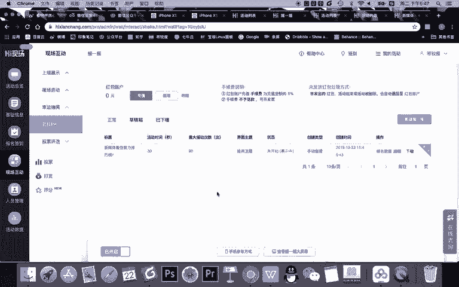

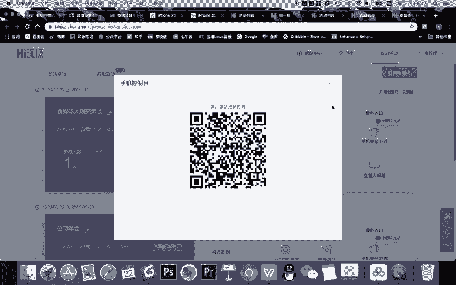