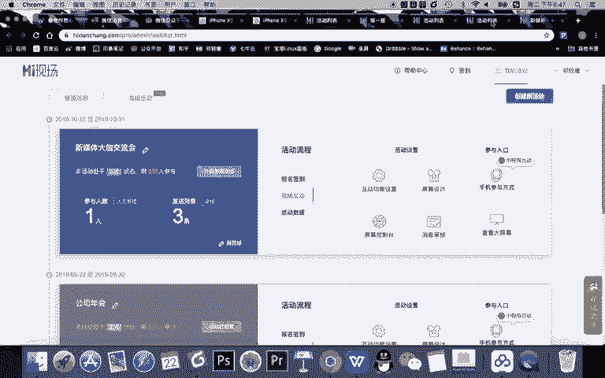
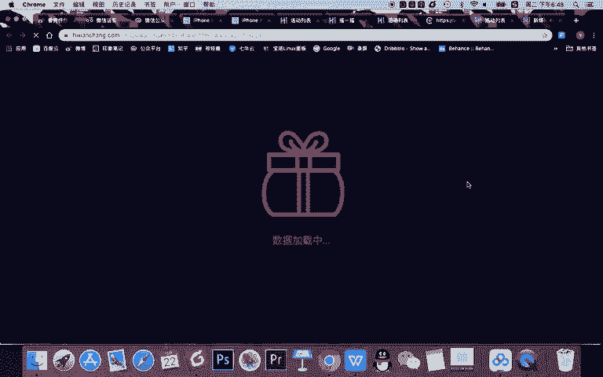
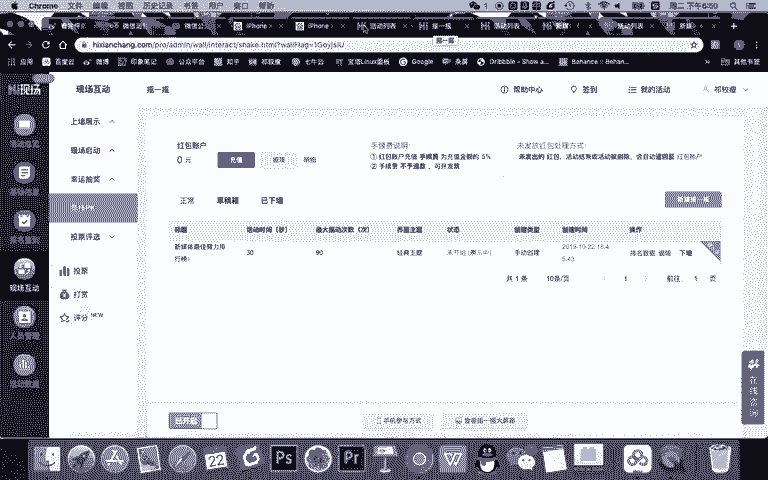
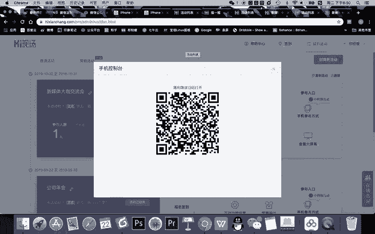
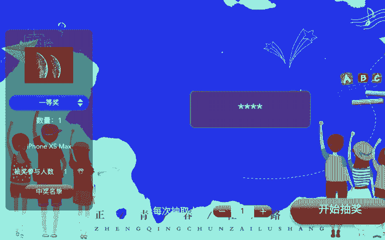
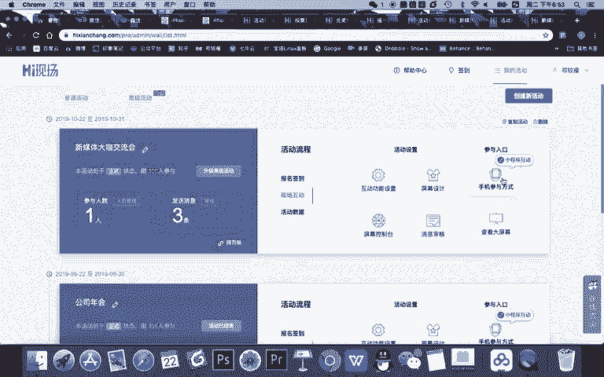
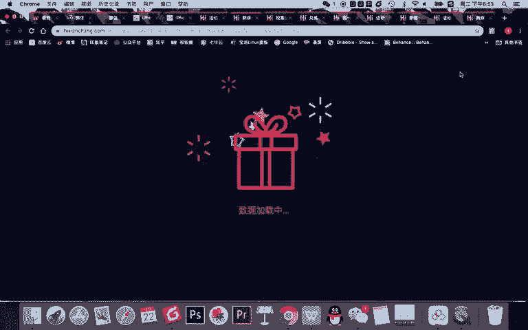
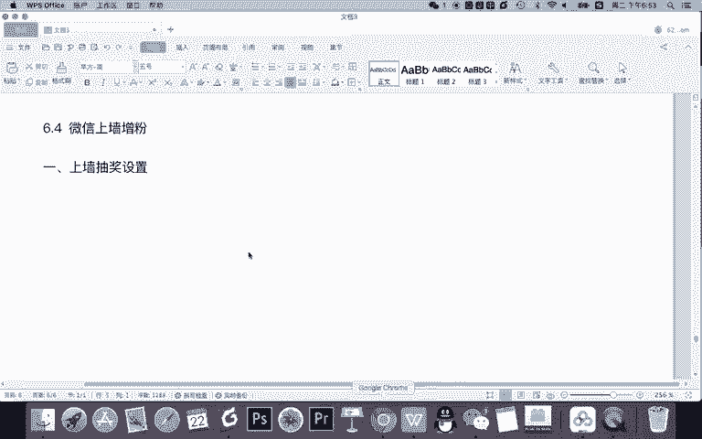
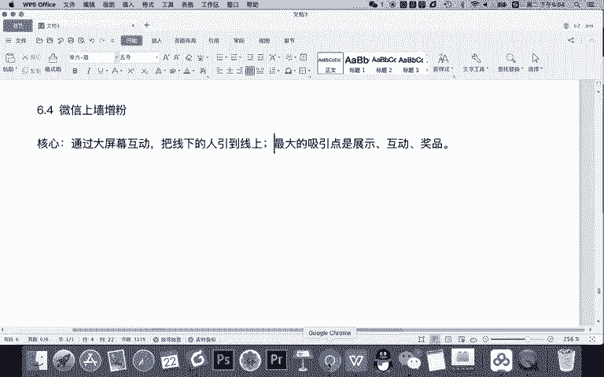
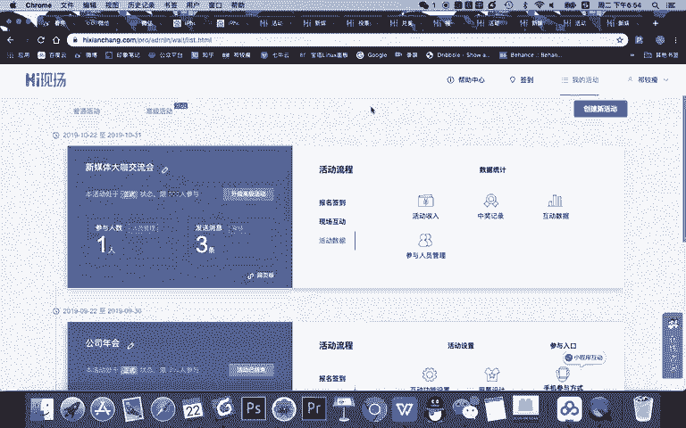

# 微信公众号运营视频全套 手撕运营 拳拳到肉 - P46：3.04-微信上墙增粉02~3 - 达妹_达内教育 - BV1UvvvebEdT

然后呢。对用户来说，他什么也不用管，你只需要让他给你的公众号回复666，进入这个链接，他就可以去互动了。参与了。对一个操作者来说，我们前台的大屏幕展示的就是这样一个连接。

那现在呢我把整个活动的链接。啊，活动内容给大家展示一下。我把操作界面的链接啊给大家展示一下。OK啊，大家看一下我的。こ到 나容。好，我现在呢给大家展示一个内容。这个内容呢就是我们的大屏幕的内容啊。

就是当你去在活动中扫了屏幕控制台之后，你手机上看到的这个内容。比如当你看到这个屏幕控制台之后。手机作为管理人员，你可以点击这个二维码，你看右上角二维码一点击，那么显示出来的效果，这二维码就出现。

然后会出现66的内容。再然后呢，你点击弹幕啊，它会出现弹幕跟你展示的一个效果其实是类似的啊，就跟在这里。点击弹幕是一样的，一点击就会出现弹幕。然后呢，如果你点击了抽奖界面就直接切换到我刚刚所说的。

抽奖界面啊，在屏幕上也是可以进行切换的。但是你在屏幕上切换会显得比较low，对不对？他会还能看到用户，还能看到这个怎个操作就不好看。所以呢我们要进行手机端的一个切换。然后当然你设置的有其他的。

比如说我刚刚设置摇一摇的活动啊，我就可以直接摇一摇。然后呢，我点消息又切换回消息，点二维码再点一下就没有二维码，再点一下弹幕，没有弹幕。然后比如说你看我现在给大家演示一下啊。我点击。

我让大家看到前台的内容。我先去再扫一下二维码。

然后呢，现在它的界面是在摇一摇，我直接点消息，大家看切换成消息啊，当然我先全屏一下吧，这是正常的给大家演示一下。正常活动开始之后，就用户看到这个界面。然后呢，我一点二维码，让大家去扫码进行互动。

大家去扫码了就会回666，到我的公众后台呢，他又会收到一个文字链，进入链接就能看到啊，能发消息。发信息之后呢，我就把二维码取消。把弹幕打开，那用户所有发了上百上千条消息都会展示来我这个页面。

然后此时呢我点击抽奖。对吧我一点击抽奖呢，它就会切换到我的抽奖，然后我再把弹幕取消掉。然后呢，我点下一项正式开始三等奖。二等奖一等奖能抽取。当然抽完奖之后，大家不过瘾是吧？

我们设置还有一些现场互动的更好的活动。比如摇1摇，哎，你看屏幕上直接切换到摇1摇。摇1摇之后呢，有排行榜啊，谁获奖呢都会知道，其实我们的后台也能看到。然后最后呢我还可以切换到我们的消息，然后把弹幕打开。

继续进行我们的这样一个互动。O以上呢就是我们整个的流程，那完成设置之后需要兑奖，那兑奖的时候，你注意一点啊，他所有的消息都在哪。

活动数据这里啊，比如你的你看你的互动数据，这个活动有多少人玩？现在多少人，现在基本没有人，对不对？他都会在你的这个信息里，甚至你的中奖记录。对吧你看看让用户啊，你能看到兑奖码是多少，然后他会有核销的。

谁去领奖，在后台都会有信息显示。啊，包括你的一个整个的收入。如果你用弹幕啊、霸屏等等效果去实现的话，也能够看到。OK啊，以上呢就是我们整个还现场的一个操作流程。在这里呢我给大家演示了两个内容。

第一就是发消息互动。第二呢就是在我们的互动这里啊，也就是在我们的前台我让大家去看了一下如何抽奖，特别是在抽奖排序的方法给他设置。第三呢，我给大家设置了一个摇一摇。当然我们因为是课程演示啊。

没有现场同学在听课，也无法扫码进行互动，所以我们没办法操作摇一摇。但平时在我们的线下的一些课程中，我们的同学参与积极性是非常高的。然后我最后需要注意的是大家记得啊，在现场互动这里面。

你只要记得他们的功能就可以。记得大屏幕是给用户看的。然后呢，这个地址是需要设置的公众号里面让用户访问的。那你需要记得在屏幕设计里面。

你要把这个屏幕的二维码改成你公众号的二维码，让公用户回复关键词给公众号，然后进行互动。然后呢，用户就能实现增粉。然后你管理人员需要扫码，进入这个页面的后台，进这个页面操作你的互动。

啊，当然所有的功能设置啊基本都在互动功能设置这里面，用户就可以啊按照这个内容进行一个参与的一个互动了。

OK啊，以上呢就是我们整个嗨现场增粉啊，它的一个设置。所以嗨现场增粉呢更多的是一个操作啊，它一点都没有怎么说没有特别大的一些难度啊，你可以通过。

各种游戏的设置，然后你多多测试在你们公司年会或校园讲座或线下营销会议，甚至去酒吧KTV等等场所去进行整个活动的设置。所以大家需要注意啊，游戏设置我们给大家讲一下微信上升增粉的一个核心。

是。😊，通过。大屏幕互动，把线下的人。ま人到。线上。并且呢。并且是什么？并且。最大的吸引点是。展示。互动。奖品对吧？每个人能展示自己啊，能通过互动给我们去啊玩起来，还能通过奖品得到好处。

所以通过嗨现场这种方式能够大量的啊基本百分之百的实现线下粉丝的一个增长。

OK啊，以上就是我们微信啊，这个微信里面嗨现场，也就是我们微信上墙增粉的一个内容的讲解。本节课就到这里，下节课我们将给大家讲解新的微信增粉的方法。

