# 微信公众号运营视频全套 手撕运营 拳拳到肉 - P47：3.05-微信裂变讲座增粉01~1 - 达妹_达内教育 - BV1UvvvebEdT

同学们好，今天我们来学习微信增粉的第五课，微信裂变讲座增粉。啊，首先呢我感觉我们基本啊所有的新媒体人应该都参与过这样的一些讲座。什么讲座呢？首先我们按照流程去给大家梳理啊。微信裂变讲座。增粉的流程啊。

比如说。用户的角度或者叫用户思维感受到的讲度是这样的。第一步。用户也就是大家在朋友圈看到一个。别人转发的什么？讲座海报。

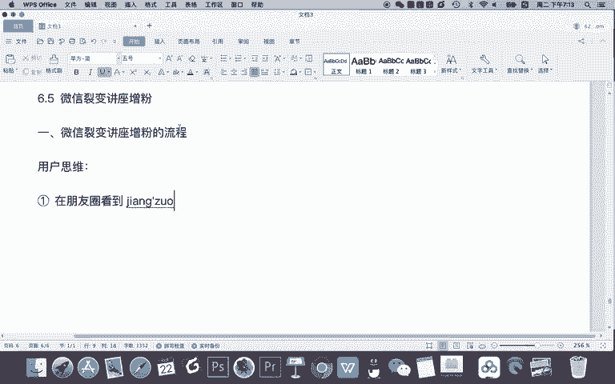

通然这个海报可能长这样啊，比如说啊你在朋友圈看到某某人发一个讲座了什么创客学院现在免费扫码进群听课。

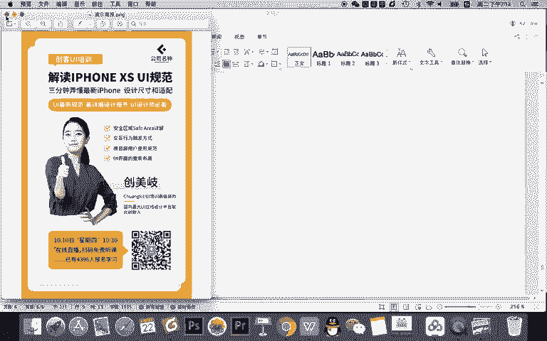

对不对？OK见过对吧？那么整个讲座的流程从用户的角度是怎样的呢？第二步，用户看到这个讲座会干嘛？第二。扫码是吧呀？关注他想报名吗？扫码关注。公众号。去的。什么呀？上到关注公众号，然后呢去到公众号里面。

然后干嘛？回复。关键词对吧？回复关键词干嘛？第三。通过关键词是吗？加。个人管理员微信。想要金钱。因为他告诉你像去公众号里要回复某个某。比如说你回复讲座，回复讲座，他会给你告诉你啊听讲座请加CD微信。

然后呢可以拉到讲座群。第四呢。第四，加个人微信号，让。转发。或者像转发讲座海报，不是活动海报。让转发讲座海报到。

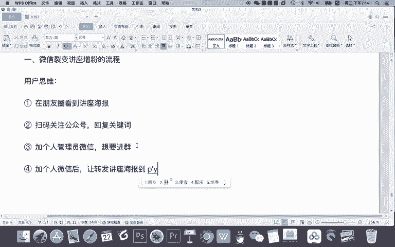

钢圈儿。对吧加个人微信后，让你转发这个讲座的海报到朋友圈。然后第五呢。你。转发讲座。海报。好。进入什么？讲过去。你か。那当然有可能比如说你提前一周就参加了这个活动，朋友圈看到了扫码关注了。

扫码关注后来加微信，加微信，让他让你传发朋友圈，然后你发了发了之后进入讲座群。然后呢，过了几天讲座听课啊，然后你听了这个课。好，这是我们整个讲座的一个流程啊，首先这是我们用户思维。

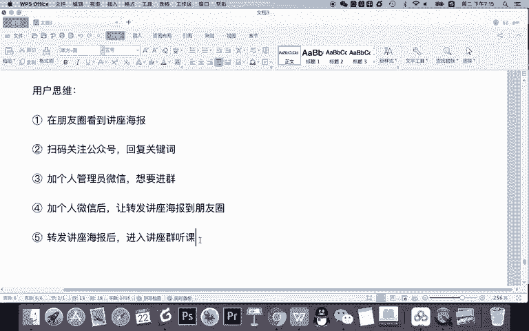

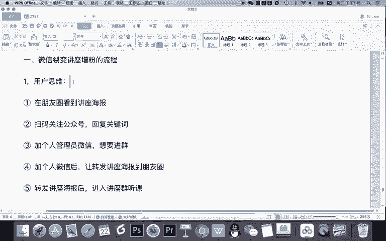

讲座的流程。就我们用户参与的时候的一个流程，等会儿能不能给大家讲什么呀？

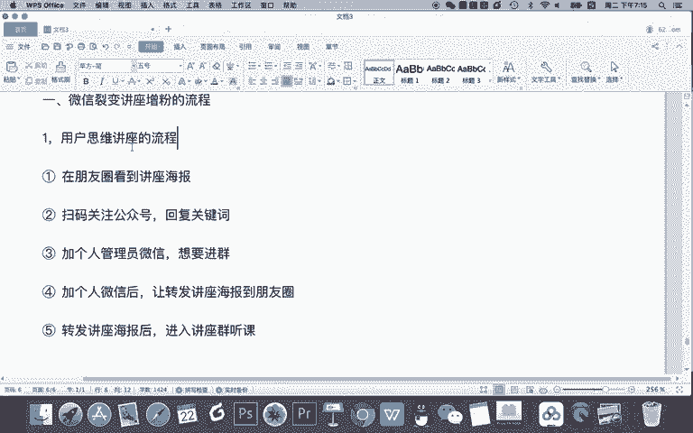

运营者思维讲座流程。OK那现在我问大家一个问题，就是为什么这么多企业都爱进行。

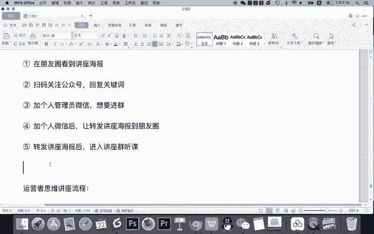

微信讲座。

或者都要进行微信免费啊，基本都是免费的讲座。他们为什么要做这种免费的事情？

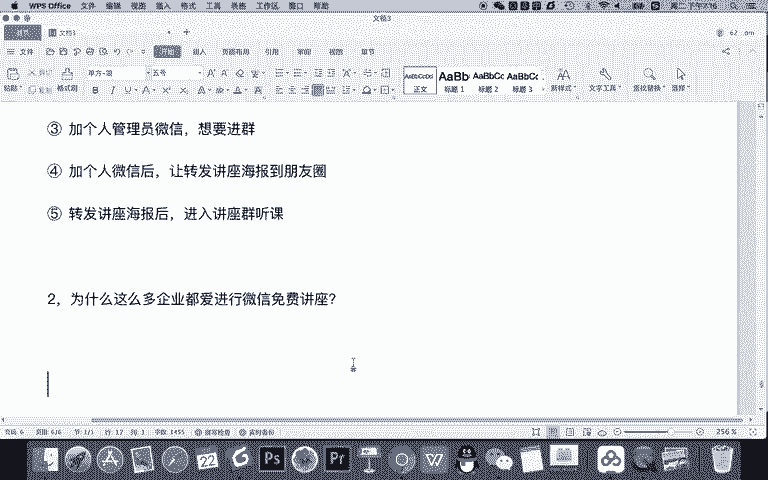

对钱来说有什么作用呢？首先第一个你干嘛？第一，免费的讲座对用户来说是不是哎有吸引力啊，但对企业能干嘛？

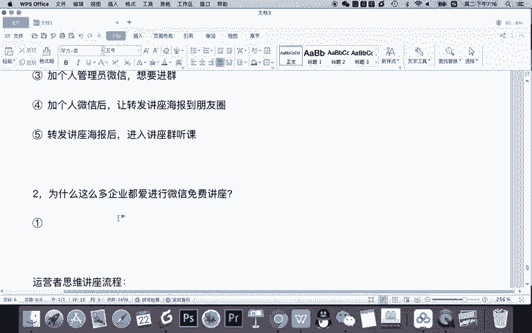

首先我感觉啊你看这讲座里面有一个非常关键的一个流程，转发朋友圈。

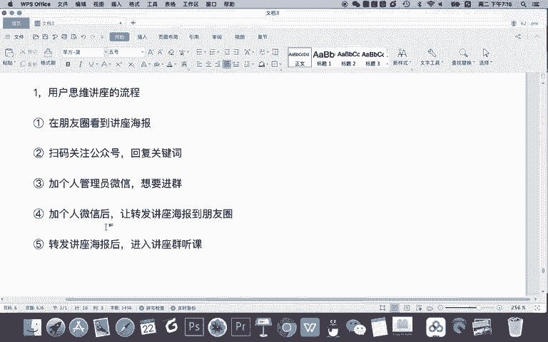

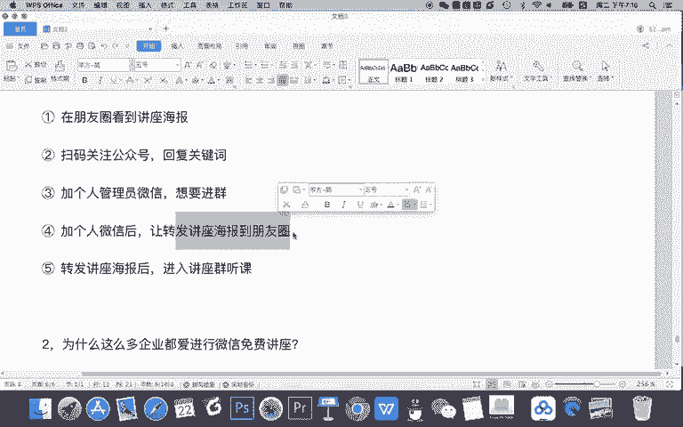

包括我们所有的参与者都是在朋友圈看到的。所以第一步。能够实现品牌曝光，对吧？因为所有的参与者都会去转化朋友圈。你们公司这个讲座呢上面有你们公司的一些信息活动，那提升你们整个在朋友圈的曝光和影响力。

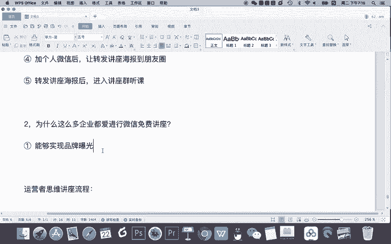

还能干嘛？第二，我认为能够实现。

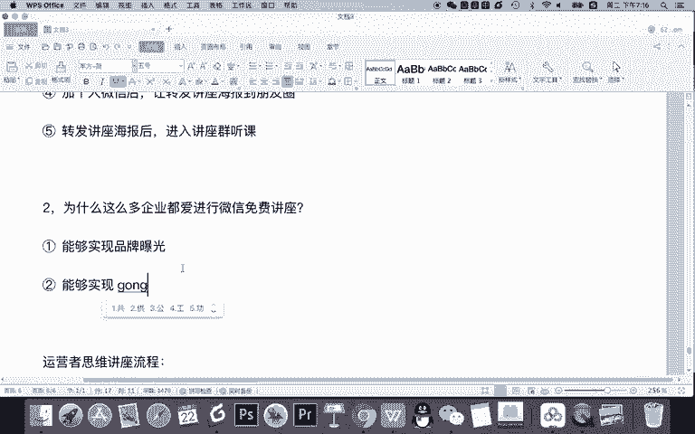

公众号。增分。因为你看啊参加我们这个讲座的方式是先去扫码，然后呢关注了公众号，给公众号回复关键词。所以你记得只要他需要回复关键词。

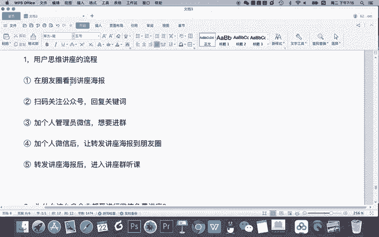

一定是关注你公众号，所以在你的公众号里，它就实现了增粉啊。你看做个讲座能实现增粉还能干嘛？

第三，我们看还有什么事儿啊。第三，关注了公众号之后，他回复关键词是加的个人微信，哎，加个人微信能干嘛？

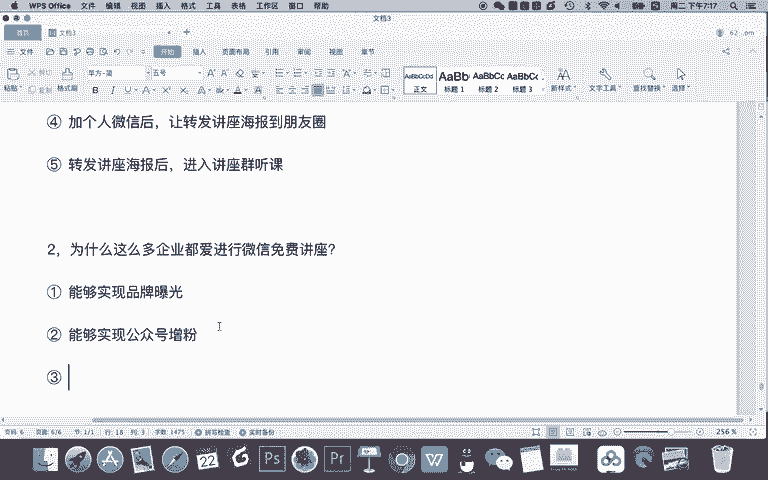

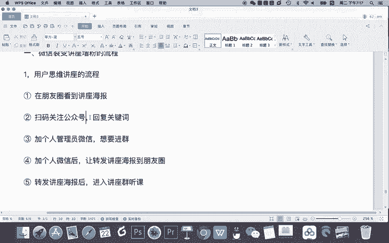

能够通过个人微信啊，这是非常关键的一步。加强。鱼。用户的。或者说什么。与粉丝的。

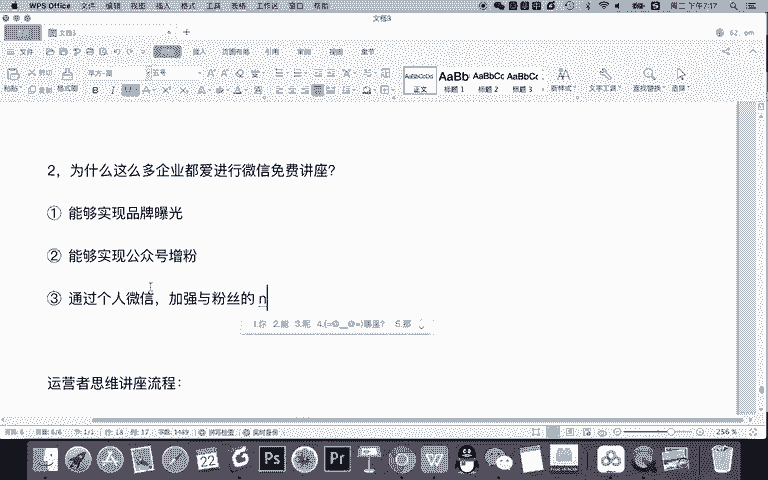

联系。为什么要通过个人微信加强与粉丝联系？你要记得一点。公众号与用户的连接。较弱。只能发文章。然后呢。等着。用户来看对吧？如果你想如果你做了一公众号，你的粉丝很多，但是。你的粉丝都不看你的文章。

你有办法吗？你也没有办法，对不对？你也你也没有任何办法让他看，甚至他们比如说80%都是死粉啊，你你这文章哎呀粉丝再多，你写的是不是阅动量也还低呀，对吧？所以你就没有办法。

因为你公众号又不能主动跟你的用户来提醒他一下，哎，你好好看一下文章嘛，不能，对不对？但是呢。但加完个人微信，能够把。文章。转发朋友圈传播。A，如果你加了用户的个人微信，你的文章写了之后。

他虽然在公众号里不看，你转发朋友圈被看到的概率更大，更高，对吧？还能干嘛？

还能。而且啊还能给用户发私信，对吧？发什么呀？发微信。不能叫司G嘛，其实也是这个意思啊。比如说。你们平时公司有什么活动，你可以通过个人微信啊，给你的这些有微信号的粉丝们群发消息，加强的观联还能干嘛？

还能什么呀？是这样。用户。方便的与企业沟通。比如我有一家啊我有一个朋友，他是做的一家线下的餐厅卖小龙虾的，他呢就不爱去用公众号跟用户订餐。

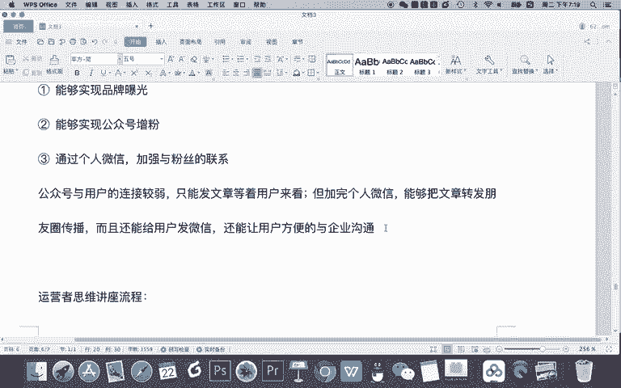

他是做某个区域加了有好几千的这个经常去吃的，他的他的用户嘛。但这些用户想吃小龙虾很简单，直接搜小龙虾啊，就找到他，直接给他发。哎，哪哪哪哪哪来多少只小龙虾，对吧？然后那边一说好的，这边前一桌，然后呢。

地址他也有，然后再发一遍复制一发，直接就完成了这个订单。但你想如果去的公众号。你会考虑一个问题，哎，我也不知道他接单没有是吧，我也不知道到底能不能发过来，互动起来会麻烦。

所以呢通过个人微信能够非常好的加强你与你粉丝的一个关联啊，既能够在朋友圈传播文章，还能够群发，还能解决客服的一些问题。

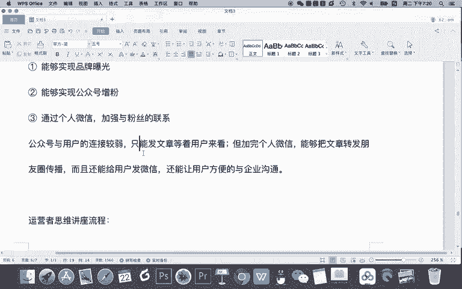

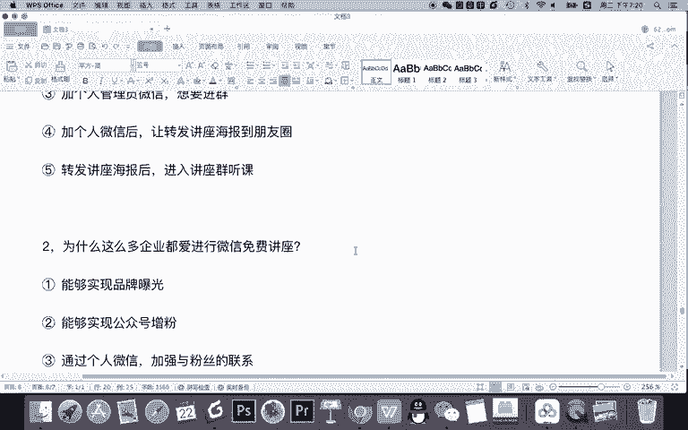

OK加完个人微信，然后进群，你看第四步能实现什么作用。

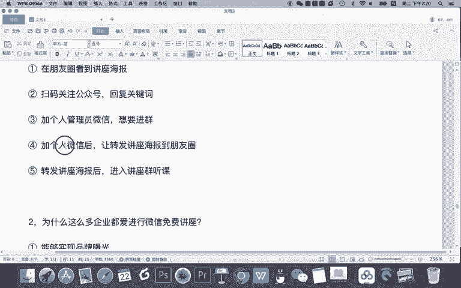

用户转发讲座的海报到朋友圈。哎，这是我们整个活动的一个核心。

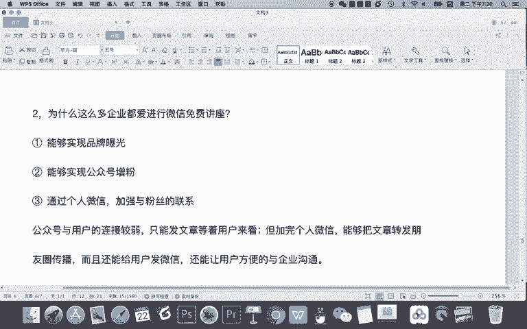

第四能干嘛？4。能让。所有的参与者。长围。传播者实现什么呀？粉丝或者实现裂变去。

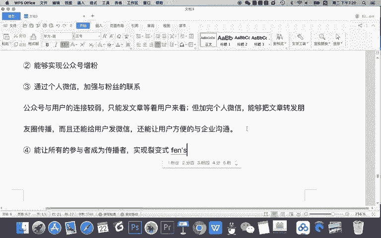

粉丝增长。这是非常关键的啊。因为你记得啊，一般进行渠道投放是。需要付费的。对吧但。裂变讲座。什么呀。参与者。就是。传播者。不需要给。

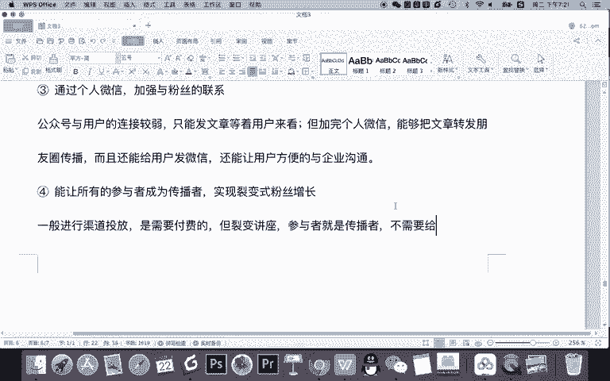

传播渠道。付费。啊，当然这个呢不是说不需要付费啊，是不需要给这些用户付费。因为他们是裂变式传播的，一传十十传百，但一传十十传百都是免费的。当然你也可以付费啊。比如说找一些行业的大V去投放你这个角座。

让他帮你发，那是需要付费。

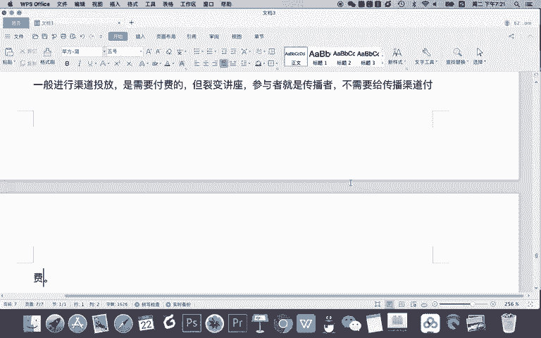

但从我们的活动的参与者角度来说，我们是免费的。而且这是我们的什么降多的核心，就是裂变式粉丝增长。因为所有的参与者都会帮你做传播。

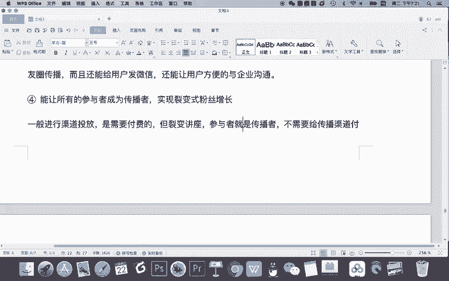

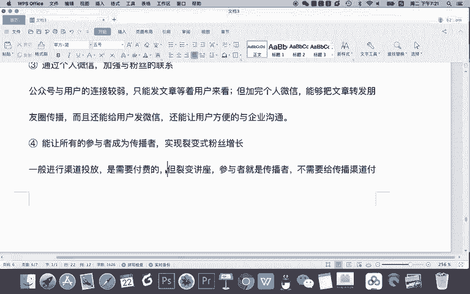

非常核心。OK那第五步能实现什么作用？讲座哎听讲座需要进群，那么你看第五步能干吗？

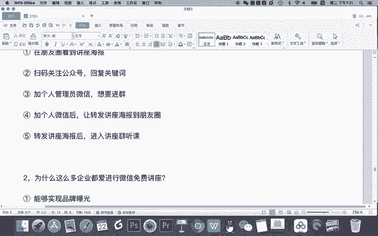

其实我告诉大家进行这种免费公益课讲座。另一个核人非常核心的目的就是什么？能够快速搭建。企业。社群完成。粉丝及用户的积累和。沉淀。进行裂变式讲座呢，就是能把你的潜在用户啊。

包括粉丝啊等这些潜在用户维维护到什么呀？通过微信群。维护用户保持于用户的什么呀？强关联。

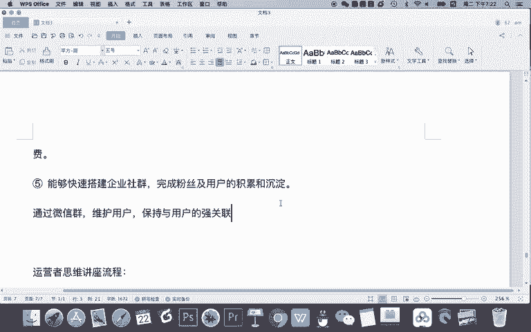

然后呢，如果你们公司比如说有什么活动需要推广的时候，需要。