# 微信公众号运营视频全套 手撕运营 拳拳到肉 - P48：3.05-微信裂变讲座增粉01~2 - 达妹_达内教育 - BV1UvvvebEdT

给用户进行转化的时候，你有这么多的微信群。比如一次讲座进行5个或10个群的积累，你有几十个甚至上百个微信群。那对你企业来说，一次活动都可以进行上百个群传播。那对你的活动来说啊，它有了一个初始的流量。

对吧所以呢能够沉淀你的粉丝进行微信群的一个运营是非常好的。

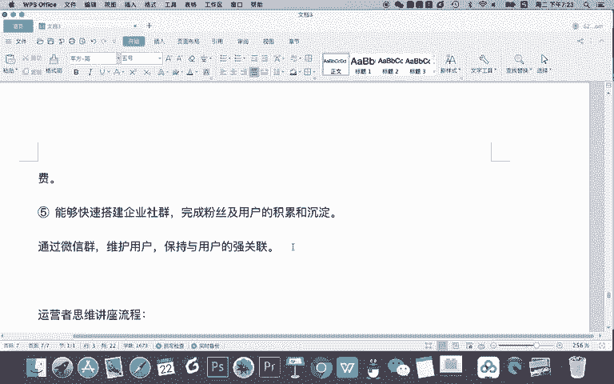

这是我们通过这个活动啊，你看我们直接从这五步就能看出来的一个流程。

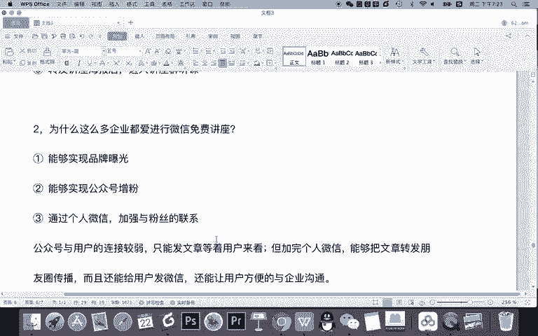

那其实做一个讲座还有什么作用？为什么企业爱做讲座？

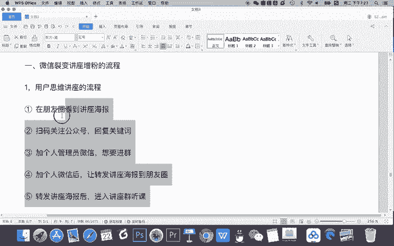

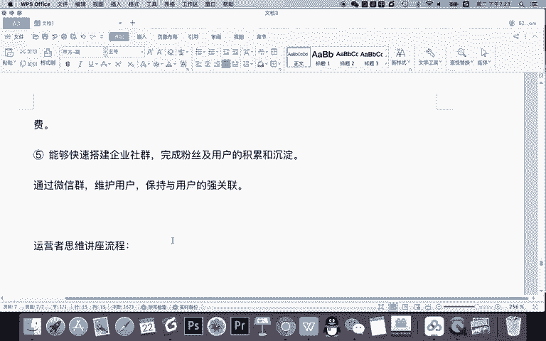

那我告诉大家讲座还有一个看不见的一个作用。第六。能够挖掘。现在客户。

为什么这么说呢？因为啊你你看。所有听讲座的人。都是。精准的。对。该方向。内容。感兴趣的人。朋友圈。其实他们就是什么是朋友圈筛选。出来的。

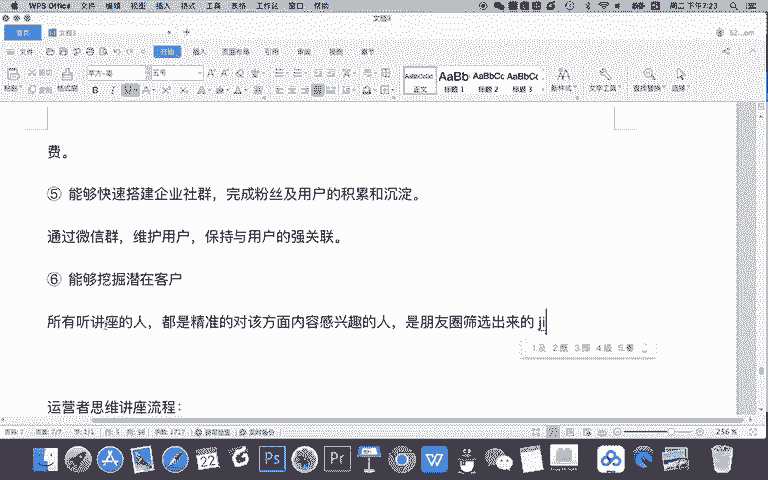

经典客户。所以如果你能够通过讲座把这些人给你吸引到群里，那所有的这些参与者其实都是你的潜能客户。你后期可以在微信群进行用户的一个运营和转化。那你不管是进行品牌传播。

粉丝增长还是产品的销售都是非常有帮助的。当然其实对我来说啊，我感觉我们平时进行微信讲座，还有一个作用就是什么？能够为企业。公众号。公众号运营。提供什么呀？活力和。

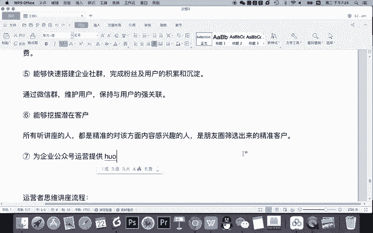

内容哎，首先什么是提供活力？讲座能够。拉近。什么呀和增加。用户嗯。或者说能够拉近与用户的距离。增加。新用户。有这个有什么好处啊？因为你想平时你跟你的粉丝不基本也不互动啊，大家都各干各的。

只能你发我让他看一下。那你通过讲座，如果他不知道怎么参加，或者他有很多问题的话，他会去跟你公众号进行互动。那你通过一互动的话，你就拉近了跟用户的这个距离。同时呢我们知道他能增粉新用户也跟你互动。

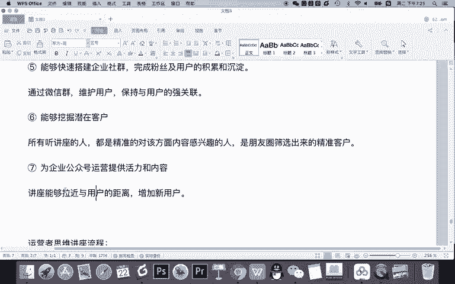

那这么多用户跟你互动呢，你的公众号的活跃度啊，粉丝活跃度就会提高。所以你账这个用户的活力啊就是就会增长。还有呢。还有第二个内容就是。讲座内容的传播和讲座后。知识的积累和。传播为公众号运营提供了什么呀？

原创素材啊，我认为这是。非常关键了。比如平时你运营公众号，你要需要频繁的写文章，今天写这个，明天写那个，但这些内容可能都是非完啊非原创的，或者说不够独立原创的。那这个时候呢，你这个内容就不够好。

但你想如果你做的是讲座。你去宣传这个讲座时的素材，还有你讲座后这个讲座人讲这个内容，你也可以通过文章进行一个什么呀分享。对你的公众号来说都是原创的一个素材，对吧？而且你传播讲座的内容。

不管是在活动前传播的那个讲座内容，还是活动后传播的知识内容，对粉丝来说，大家都更喜欢讲座前呢，大家都去转发传播，对不对？讲到后呢，你分享这些干货，大家更爱收藏和传播，对吧？甚至你可以。利用你的微信群。

让所有的喜欢这篇文章的人去收藏啊，去帮你传播。所以呢你的公众号的内容上，还有公众号运营的活活力上啊都会变得非常的好。

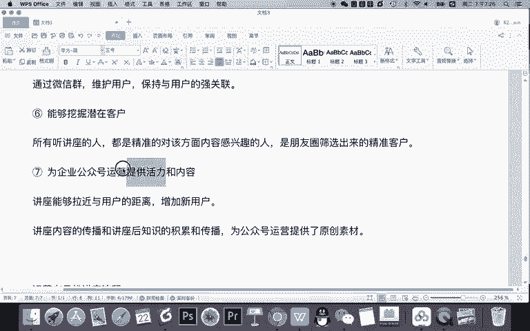

所以呢这就是企业进行微信讲座的一个原因。你看既有品牌，还能粉丝，还能加强与粉丝的关联，通过个人微信，还能实现裂变传播，还能进行社群运营，还能挖掘前的客户，还能为公众号运营提供活力和素材啊。

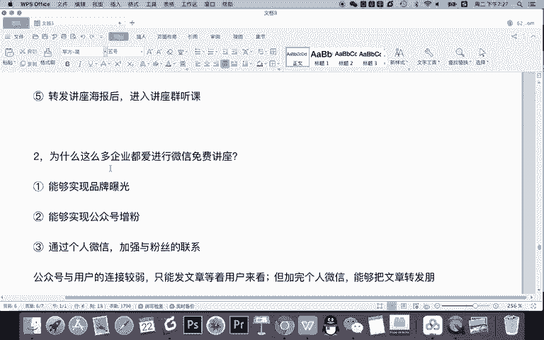

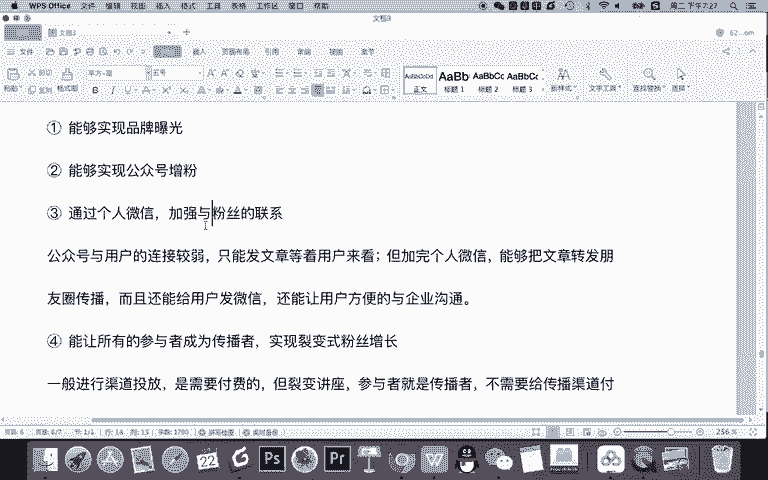

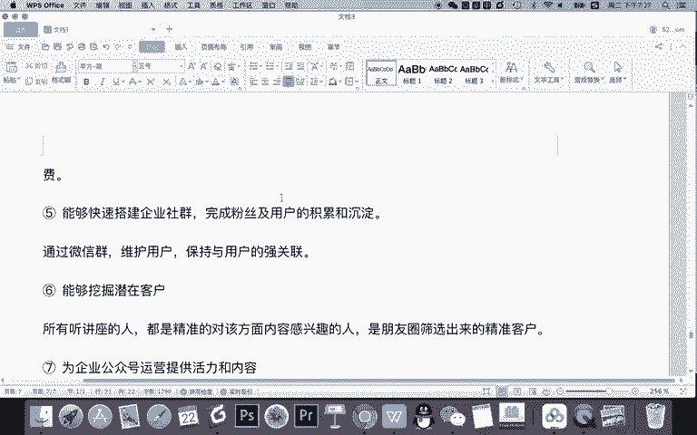

所以呢微信讲度是非常好的一个企业啊。

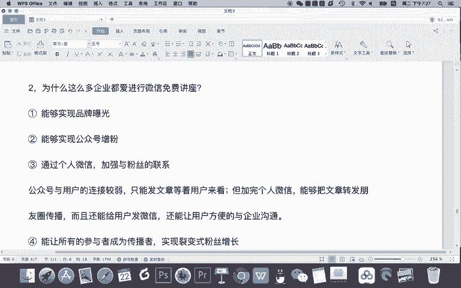

做粉丝增长，做用户增长的一种活动形式。

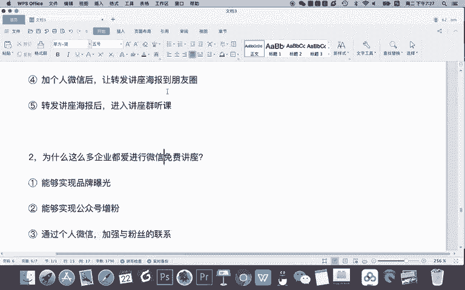

OK这个活动这么好，那么我们想想有没有活动的，有些弊端呀。第三。这个弊端是什么？或者说我们。裂变式。讲座。成功的关键是什么？或者有没有同学啊。有疑惑，你说哎你说的讲的这么好，真的这么好。

我感觉讲的不好啊，为什么？因为用户听一个讲座好麻烦，感觉挺烦的呀，这就是弊端啊。真的有人爱听这样的讲座吗？首先你要相信很多企业在做这样的免费公开课讲座，那就是有人真的爱听，而且用户真的有需求，对吧？

那你认为这个讲座有没有弊端？B端就是比如说啊你先写一下B端。讲座参与。流程泰。对吧真的能吸引到用户吗？不确认。那好，那所以我们要思考我们裂变式讲座成功的关键是什么？

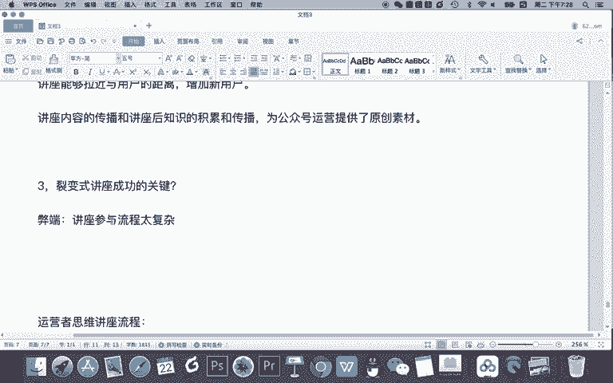

我个人认为啊讲座流程复杂不重要。重要的是什么？吸引力。是。什么吸引力？就是讲座要有。足够的吸引力，才能保证用户走完。流程。去参加。对吧如果你这个讲座没有吸引力的话，你说哎呀我一看还得关注公众号。

还得加你微信。我看到加你微信，我就烦，我就不参与了，对不对？但你想如果你的讲座足够有吸引力，他愿意加你个人微信嘛？绝对愿意对吧？我们讲座是免费的，比如说免费的，只要这个讲座足够有吸引力。收费都可以。

对吧？我知道我相信大家也知道啊，就看到一些行业的非常经典的一些裂变式讲座，找了行业的大咖，全行业知名。免费都能进群。那大家当然愿意参加，对不对？所以吸引力是一个保证讲到成功的一个核心关键。

所以不怕流程复杂。当然你说流程复杂怎么解决？第二，想要讲座成功，还有什么？流程要。尽量。简化怎么保证经量简化？

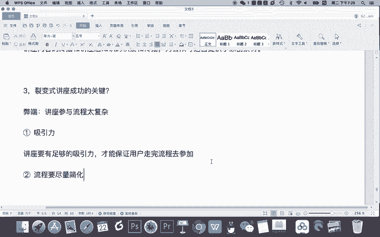

比如说在。实现企业目标的。基础上。要保证活动。参与。流程的顺畅。

别举例啊，你看我们这个讲座对用户来说又需要你扫公众号，还得加个人微信，还得发朋友圈。

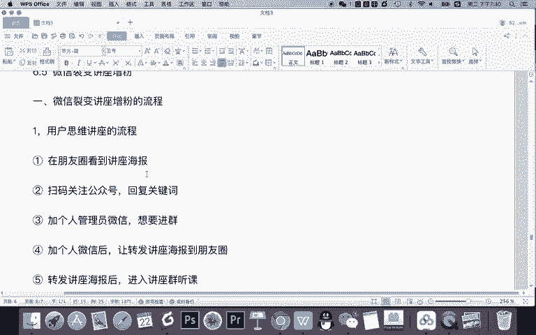

那同学们如果你说哎我不让他去增粉的话，能不能听讲做？

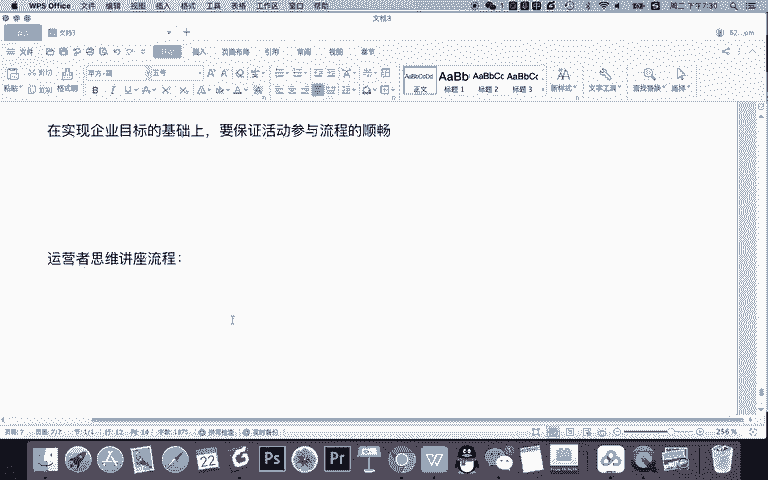

能不能让他分享朋友圈？比如说两二选一公众号不用增粉，但是呢也需要他分享朋友圈行不行？当然可以，你可以活动海报上不放公众号的二维码，直接放什么呀？管理员的微信，让这个用户直接加你微信。

你直接让他去转发朋友圈就可以，这样少走一步，所以会变得简单。其次你说我就要增粉，同时我还要他转发。那我怎样让这个活动简单呢？那你就要什么参与流程的一个顺畅。比如。在讲座海报上引导他扫码的时候。

不要去写的一大段话，让他看着不懂。比如让用户加你个人微信的时候，你不要给他说，请加微信号。某某某某某同学，你想如果你告诉了他微信号方便吗？非常不方便，因为他还需要在微信里输入微信号去搜索。

这样加好友是非常笨拙的一个方法。那最高效的方法是直接把你的微信的二维码给到他，他直接扫码识别加微信，这就方便。所以呢把整个活动流程设置的简单，就能够保证你这个活动，用户参与起来，就更加的顺畅啊。

提高你的用户参与的一个。

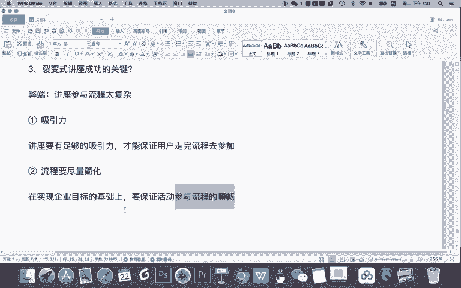

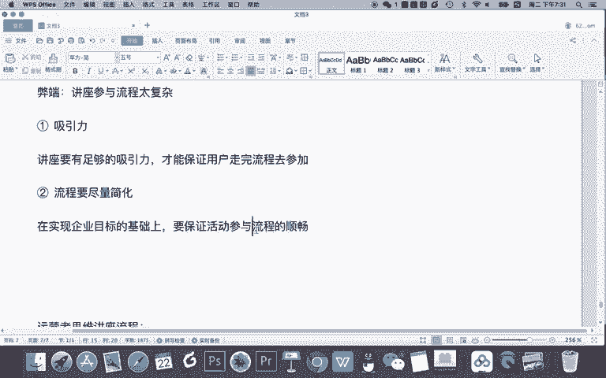

比例嘛，就很多用户可能参与者参与者没走完流程就放弃了。所以大家注意啊，我们列别式讲座成功的关键是要有足够的吸引力。其次呢流程要设置好流程这一步我们会在这个课程中给大家讲，那吸引力怎么办？

记得在你进行讲座之初，你要去啊找到这个行业内真正有吸引力的讲座的大咖去讲，对吧？比如你可以请你们整个行业里的一些啊有影响力的QL啊，或者呢请一些网红啊去讲，这样会更有吸引力。这是你运营人员的一个工作。

就是你要评估所有的参与者啊，是否对你的这个大咖感冒O如果保证了吸引力之后，就要完成整个流程的设置了。那这个流程怎么设置呢？来我们一看一下运营者思维。

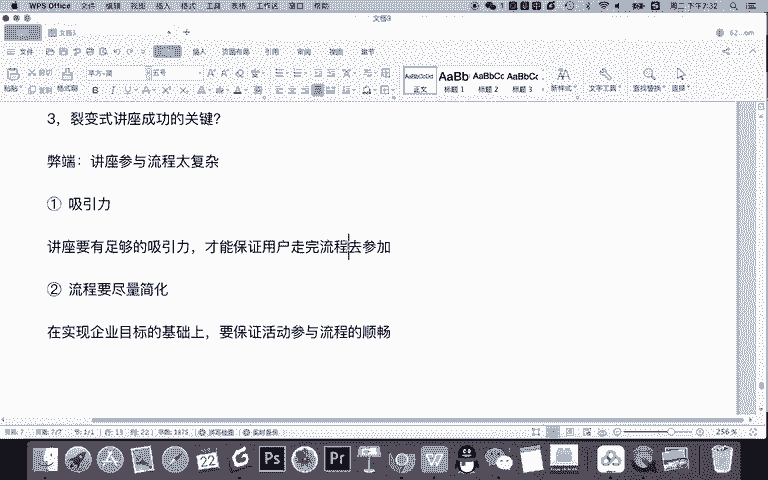

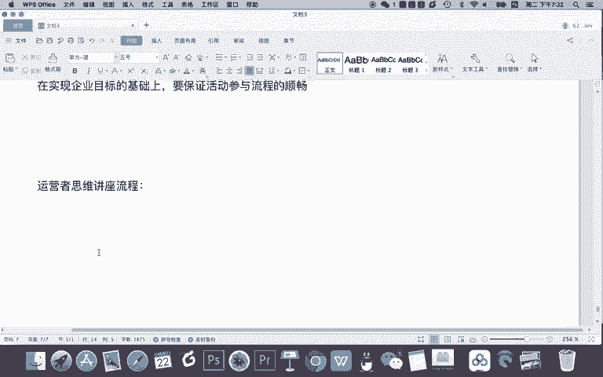

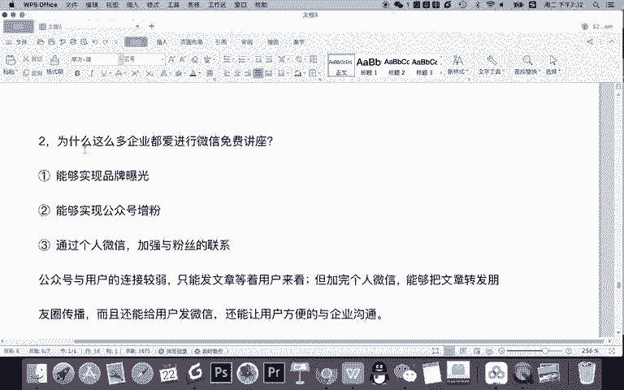

我们对照啊用户的参与者思维啊，用户思维去做这个运营者思维。

首先。大家来看对运营者来说，如果用户参与的时候，第一步是在朋友圈看到讲度海报，我们要做什么？

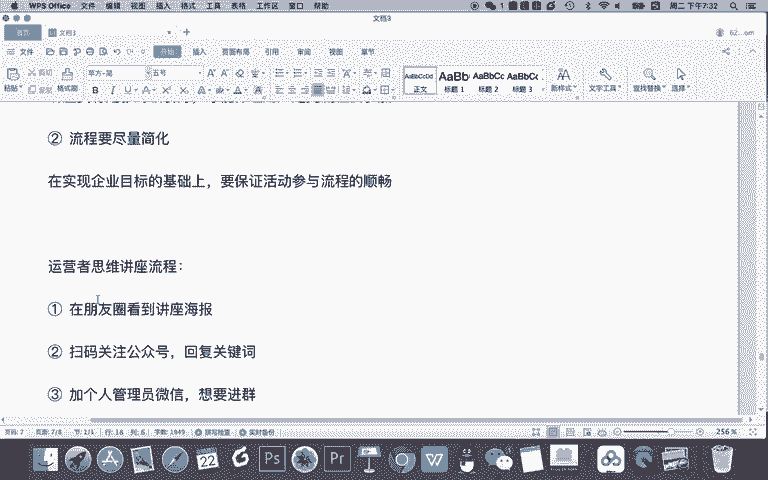

对我们要做什么？A进行。讲座海报。

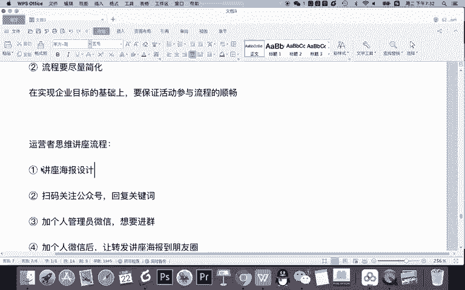

设计对不对？第二步，如果用户需要扫码关注公众号回复关键词呢？第二步我们要进行。

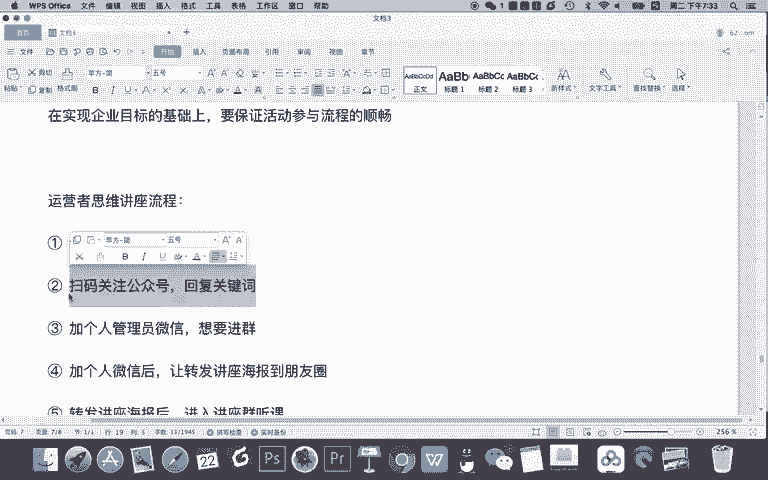

关键词设置。第三步，如果用户需要加个人微信啊，让他进群，想要进群，我们要干嘛？进行。个人。微信号。甚至对吧？或者说是什么企业的。这你们公司的啊。企业的个人的微信号设置。第四步呢，让他转个朋友圈需要干嘛？

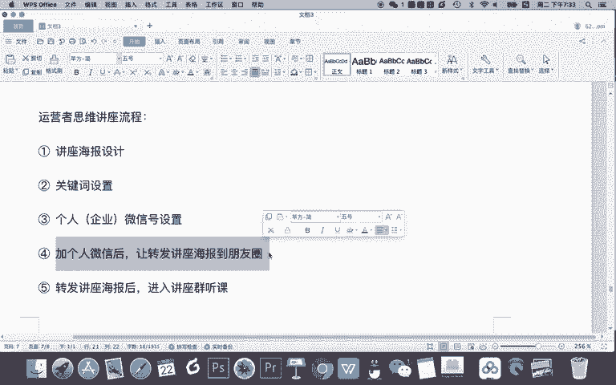

要什么？给用户发私信，还得监控。或者说什么审核是否。

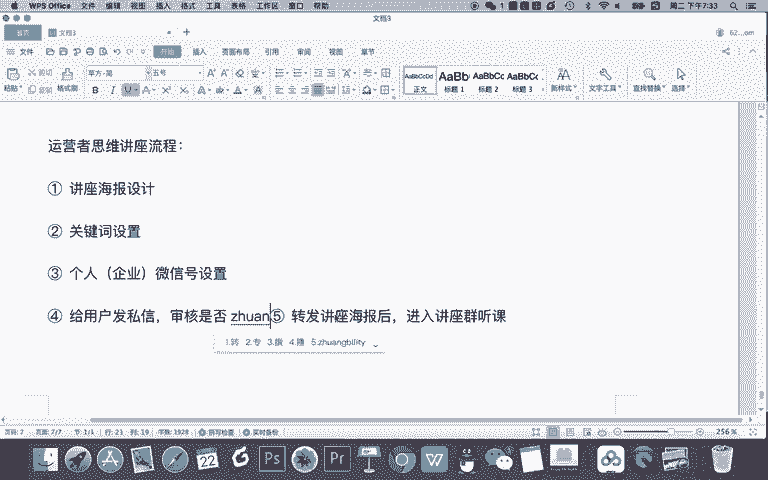

转发朋友圈对吧？那第五步呢。转发之后拉进群，那我们需要做的什么？拉用户进群并。

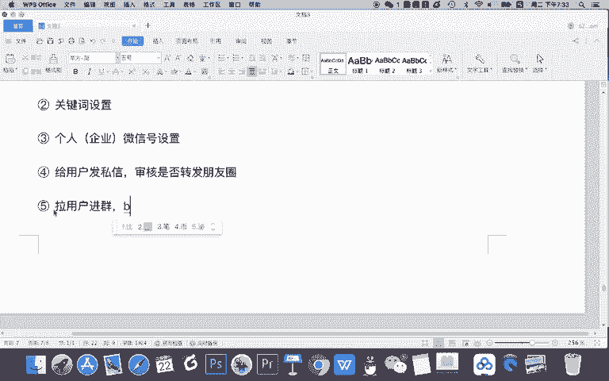

运营。微信群，因为你想那么多用户啊，成百甚，如果讲座比较成功的话，你有几百甚上千人进到不同的微信群。那多个微信群你是要需要给他运营管理好的OK这是我们运营者思维，也就是我们想要完成整个讲座的流程的设置。

我们新媒体人员应该做的工作。第一，设置海报啊，设计一个海报。第二呢，完成关键词是第三，个人微信号的一个设置和。

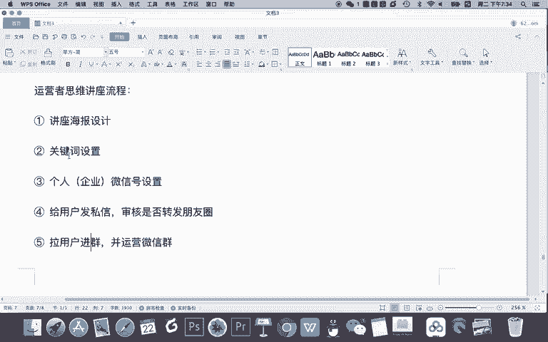

在运营吧。第四，需要给用户发信息并审核是否转到朋友圈。第五，拉你的这些用户进群，并运营微信群。

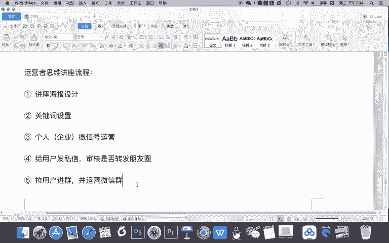

OK接下来呢我们将对整个舞步的流程给大家讲讲运营的技巧。好的，我们本节课先到这里，下节课我们将学习微信裂变讲座的。

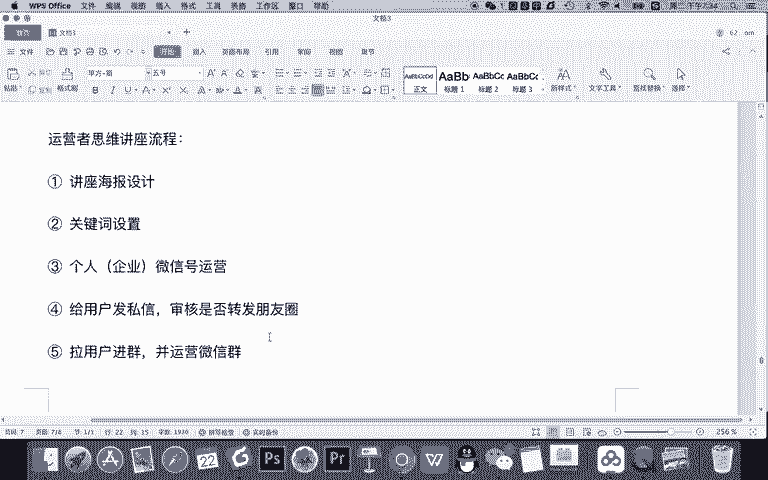