# 微信公众号运营视频全套 手撕运营 拳拳到肉 - P49：3.06-微信裂变讲座增粉02~1 - 达妹_达内教育 - BV1UvvvebEdT

同学们好，今天我们来学习微信增粉第六节课的内容。微信裂变讲座的第二部分。在上节课呢，我们给大家梳理了微信裂变讲座的整个流程，还有它对企业的意义。那及本节课呢我们将针对啊五步啊微信讲座裂变的五步。

我们每一步进行设置。首先第一步。是进行什么呀？海报。设计。OK首先呢我们如果是制作一个宣传海报，第一个解决的用什么制作啊，按照我们前面讲解的课程又按什么？对，相信很多有之前课程的同学就会知道啊，创客贴。

去。制作这个工具。OK我们知道用创客贴去制作图片之后，我们接下来比如说啊我们就进入创客贴。

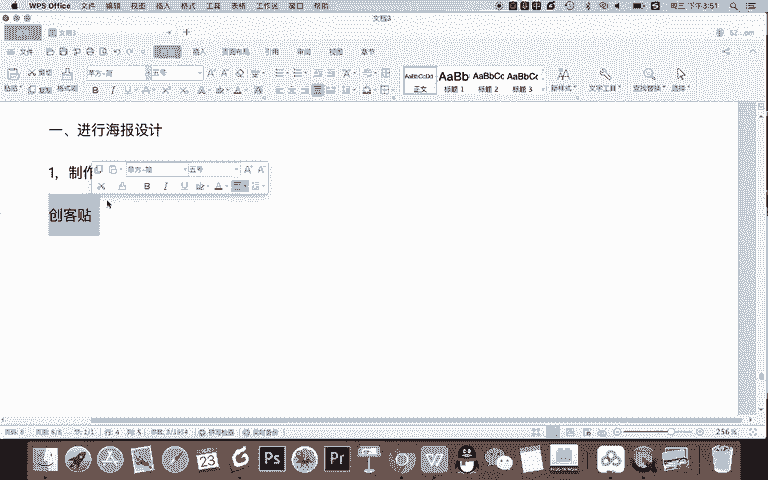

但这里面会有一个问题啊，不是我们直接就要去做这个创可贴。我们要解决我们做的是首先是一个手机海报。那我们先找到海报。在找到海报里呢，还是点击免费。但现在有一个问题，我们该找什么类型的什么呀模板。

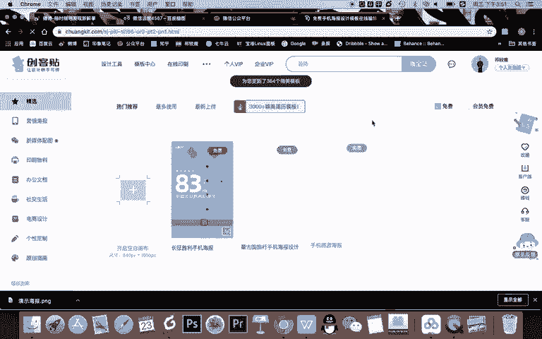

那比如说我认为啊。比如说直接确定这个内容啊。创客贴。模板选择。首先第一应该选择什么？一，按照。风格。类型相同。进行选择。首先我们要知道是什么，选择一个适合。做讲座的。

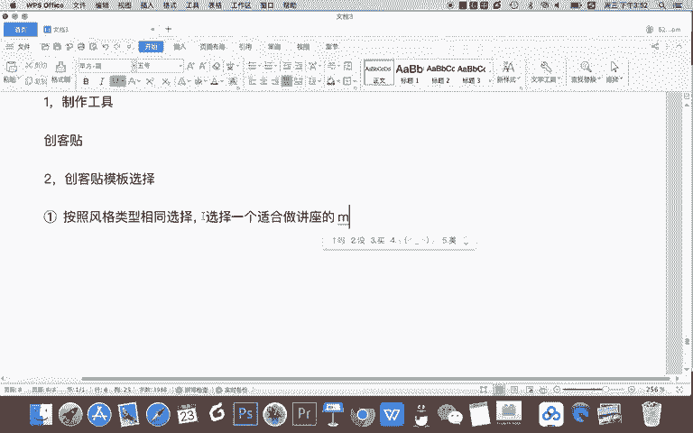

500。比如我们看这里有很多的各种图片，像显然这个不合适，对吧？像这个呢也不是特别合适，这个呢也不合适。我们要找一个讲座的啊，比如说哪些适合做讲座课程呢？比如说我们看一下，哎，像这个是不是还可以。

还有呢像这种对吧？再然后呢。我们比如说啊办公文档啊看一下。哦，它是办公文档去的是这样的一个模板啊，所以我们还去了设计中心。最好能够按类型去。

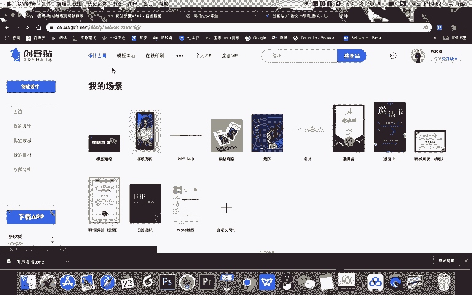

选择比如我们选择手机海报。

然后选择。免费哎，你看这里就比较多了，对吧？这种都是能够去当海报的。但现在有一个问题啊，你找了一个风格类似的，比如我认为这个可以，然后这个也还可以。但是有一个非常关键的问题就是我们这个海报你要确定什么？

确定。海豹的。文字内容。甚至是字数。为什么要这样啊？因为我们要知道我们的海报上要放哪些文字，然后我们才能找更合适的对应的什么呀？主题风格比如有很多图片呢，你看着非常漂亮，但是首先风格不合适。

其次你找到了它之后，你没有办法在上面放上你所有讲座要写的内容。所以我们要解决第三个问题。什么呀讲一场。讲座的。海报文案。对吧我们这个海报上要去展示一些文案，我们要写什么内容呢？首先。第一个呢。

我们关于海报上一般会常见有什么呀？讲座。主题。要告诉用户，哎，我在讲座是关于什么呢？这是一个大的主题。再然后呢，有了主题，你不能光告诉他有主题还要告什么？讲座内容。对吧讲的内容我认为又分为2块。

一般是第一个。讲什么？第二个呢。讲座人。介绍。所以呢在讲座内容上，你要告诉他A是谁来讲什么内容，这样呢让这个主题更加的深化，让那些有需求的学员啊可以看到啊，我具体能得到什么。

然后他增加他报名的一个可能性。当然有的讲座是没有讲座人介绍的啊，甚至有的讲座关于讲内容讲什么的内容，这个讲的也比较少，他会突出这个人，所以呢你的讲座内容是更多的介绍讲座人，还是说要更多的介绍你的内容。

根据你的讲座人是否有吸引力来决定。然后还有要介绍什么？我认为还有一个非常关键的什么？时、参与方式或者叫时间地点，要告诉用户。在什么地方？什么。时间讲ok啊，这是我们的时间点啊。

最后一个非常关键的就是什么？如果我那天有空啊，地点呢也是在线，没有问题。然后我对你的内容非常感兴趣，我要是想参加，我得知道。参与方式。所以呢我就要写出什么具体如何参与。那好，那我们是一个裂变式的讲座。

比如大家看啊，去完讲座之后去到的是公众号。所以呢我们应该去参与方式呢，是不是扫二维码，也就是公众号二维码，我们给它关键词。所以呢参与方式是什么？扫码报名对吧？扫码其实你可以按照这样理解啊，扫码关注。

公众号回复。关键词就能报名啊，这是我们的一个基本的参与方式。为什么说基本的呢？因为你在最终的文案里，你不能够告诉用户还要要写什么扫码关式公众号会有关键词。因为首先对用户来说，这句话太长7次。太麻烦了。

哎呀，还要关注你的公众号，然后还要回复关键词才能报名，太费劲了，那怎么办？那他其实就有一个方法。我等会儿会给大家讲啊，在文案里应该怎么写还合适。OK现在呢我们确认了我们的一个讲座海报，它应该放四个内容。

大字主题。然后呢，小字讲的内容，然后呢要写出时间地点，最后写出参与方式。那我就要去选择合适的模板了，那我要找一个模板，然后去当成我的讲座海报造型设计啊。

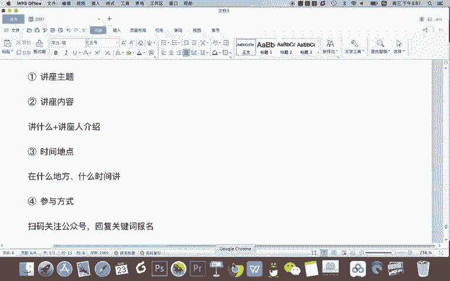

看其实这个都不是特别合适，对吧？而且呢你看这些都有点太。宣传性了。对啊，我们看看能不能去找一些啊，直接看着就像讲座的。比如你看我们看看有没有培训类的啊。我先点一下。直播培训OK这个好像更接近一点，对吧？

比如说我们可以选用这个这个其实就可以啊。因为你像这有标题这有内容，甚至还有可以写老师的介绍，那我感觉文字稍微有点多，看这个也可以，对吧？你看所以你可以在这里选择模板。

我们直播培训类的是可以的那当然这个是不是更好对吧？这里有老师ok假如我们选择了这个。

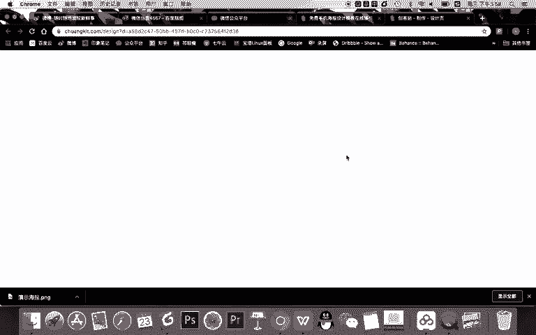

那么按照我们提前的规划，这个模板呢，不管是在风格上还是在文案上是跟我们的比较搭配的。但是现在要注意一个问题，同学们，这个海报它的文案比我们预想的是要多的。比如说你看这个人的介绍是不是挺多，然后呢。

讲什么内容是不是还没有，那怎么办呢？我告诉大家，不管啊你选用了任何一个模板，我需要你注意的是，当你去制作这个海报的时候，不要去修改它的任何的文字的排版布局。比如说你不能把这一行话给删掉。

你应该去改变它的文案内容。

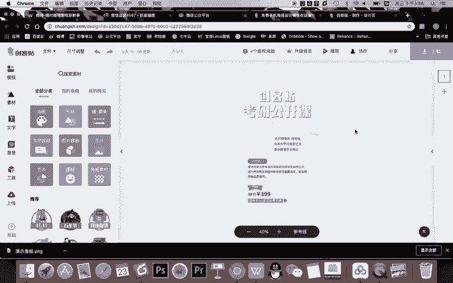

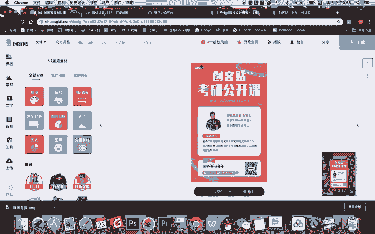

啊，首先呢我认为这个里面啊，我们现在演示就不放logo了，所以把logo删掉。然后呢，我去针对这个海报，我要对它进行一个修改。

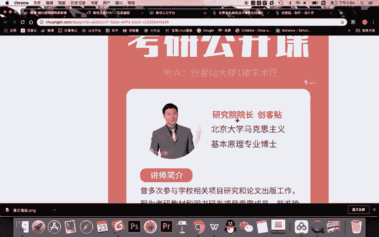

O我们看一下啊，我们稍微放小一点。

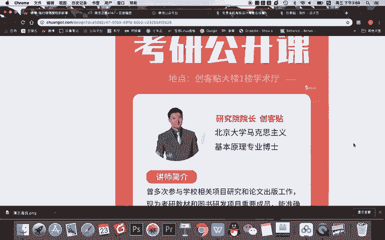

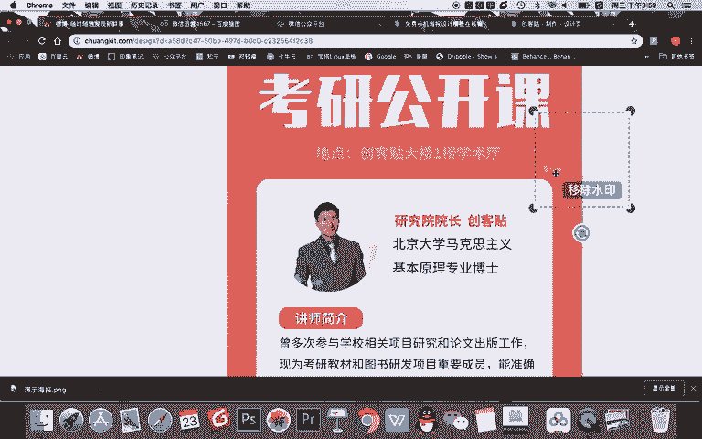

OK移除这个水印。然后呢。啊，这个放太大了，我有一点点缩小。然后呢，我要去1。1点的去修改它的。

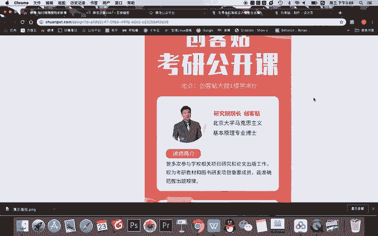

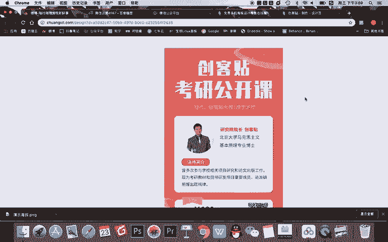

文案的。内容。

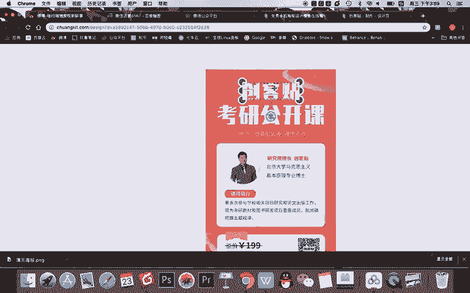

比如首先我要改成什么，我发现这个页面是不是变掉了，你看它现在只有图片，为什么没有别的其他内容了？那我就关闭它，重新再打开，直接去替换文案。

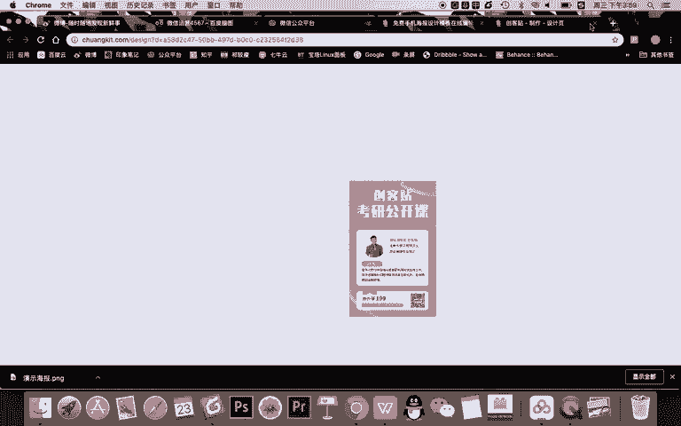

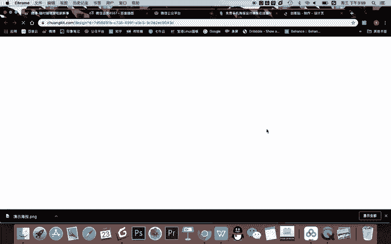

比如我的讲座主题是啊，比如说我这节课的讲的就是如何增粉嘛，那我直些讲课的主题也叫什么？增粉。接写什么？粉丝增长。然后呢。啊，这里两这个两个字就删掉粉丝增长。然后呢。裂变。公开课。对吧然后呢。

后面这个创客贴的贴子，你看啊，我们要去把这个文字。删掉。然后要把这个内容给它居中排版，粉丝增长裂变公开课啊，虽然可以，但。

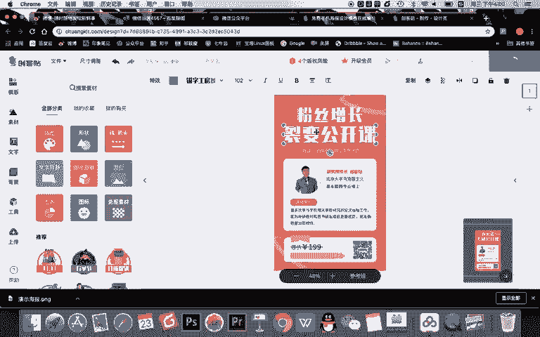