# 微信公众号运营视频全套 手撕运营 拳拳到肉 - P4：1.02-公众号后台功能认识~1 - 达妹_达内教育 - BV1UvvvebEdT

嗯。同学们好，今天我们来学习微信运营第二节课的内容，微信公众号后台的一个认识。首先啊当你注册公众号之后，你会看到你的公众号后台有左侧这样一些功能。那本节课呢我们就给大家挨个介绍这样的一些功能。

首先在首页这里能干嘛呢？

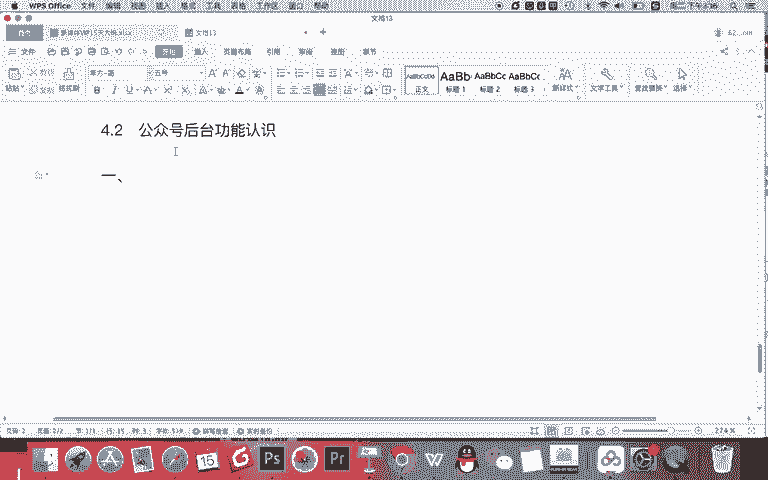

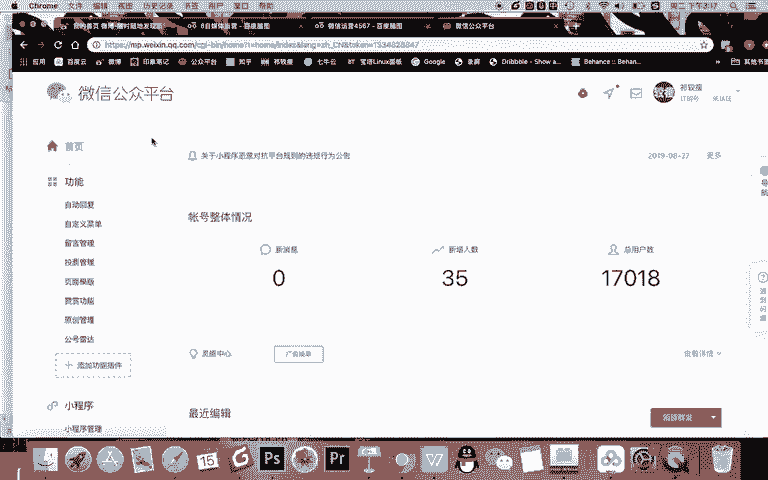

记得。一、能够。新建。

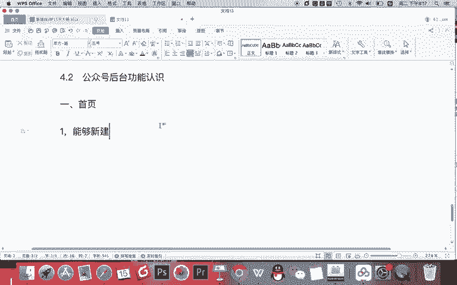

群发。当你每天需要去发送一些群发给所有的用户一些图文或视频啊或一些。比如说图片的时候，你就可以在这里首页进行新建群发。点击在这里啊，你看点击新建群发。

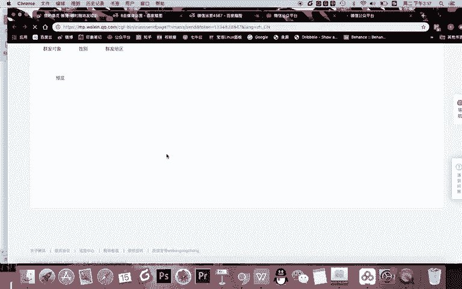

可以从素材库。选择你编辑好的文章啊，去确认。比如说选择任何一篇文章去确认就能去群发。当然你除了去发送图文之外，还可以去写一段话，找一个图片，或者去上传一段语音去进行群发啊。

你想让你这个公众号里面的内容被用户看到，那就需要在首页的群发这里去发起。当然，在首页呢每天都会要注注重的一个内容，就是你每次一登录就要看到你的公众号的整体的运营情况。

也就是你的后台有粉丝给你发了多少消息，以及你的公众号新增了啊多少个粉丝，还有你的公众号的总粉丝数量都会展示在这里。

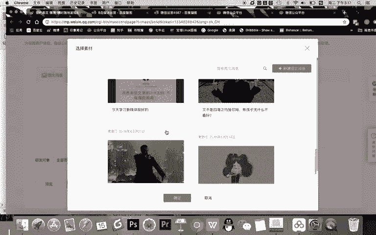

那除了群发之外，第二个内容就是什么删除或者说什么第二个功能。

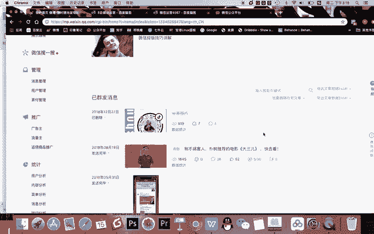

查看或删除。而犬花。

内容。比如你所有已经群发过的文章都在你的首页在这里展示啊，第一页、第二页第三页都在这里展示，它会显示你每一篇文章的阅读量。比如点击好看的数量，还有评论量，点赞量，还有别人给你打赏的费用，还有什么呀？

别人转发的数量。那你说我平时写了一篇文章啊，我发现这篇文章不想让传播了，它会有一些危害，怎么办？在首页里点击删除，可以去进行这篇文章一删除，别人就无法再查看了。当然你看旁边还有一个改。

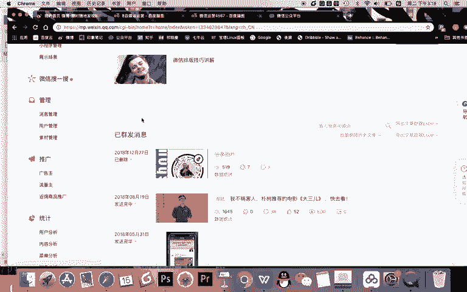

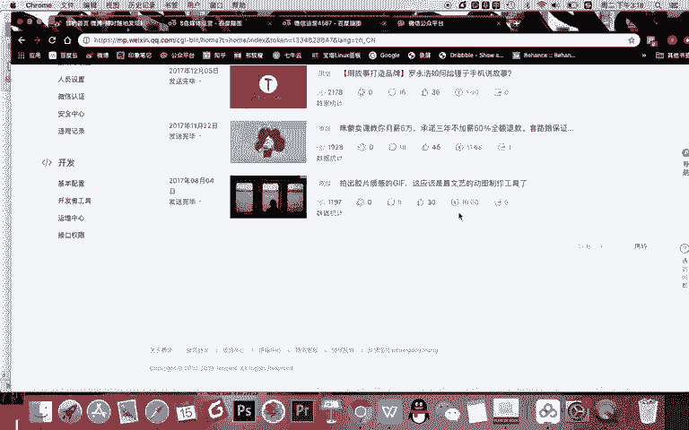

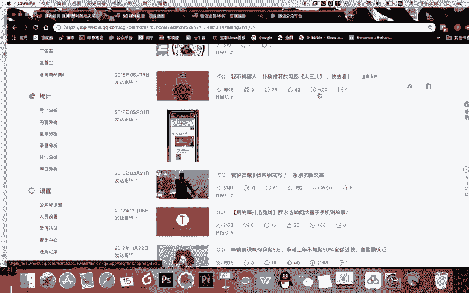

发布过的文章呢，以前是不支不支持修改的那现在呢可以去修改里面的个别内容，可以对个别的错别字进行一个修改啊，这是你的已群发的内容，可以在这里查看数据，以及去修改它。

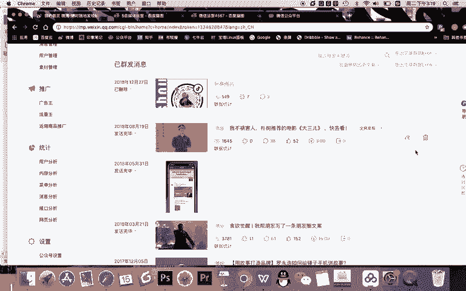

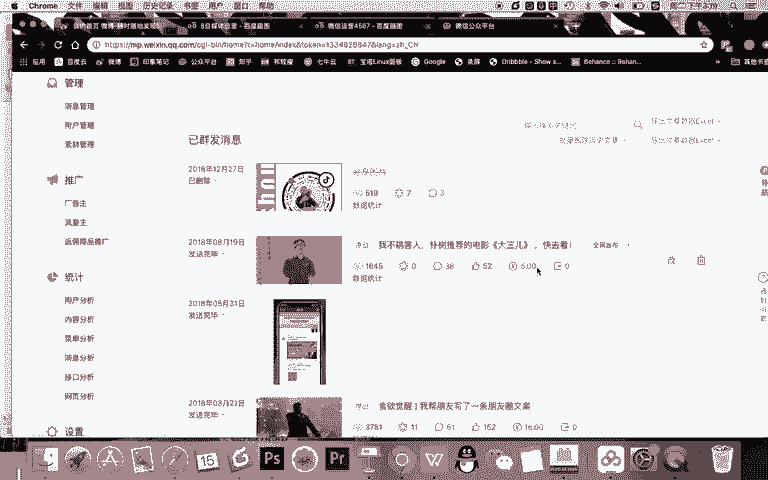

OK这是我们首页要做的一个事情。那最后呢我还要分享一点记得。

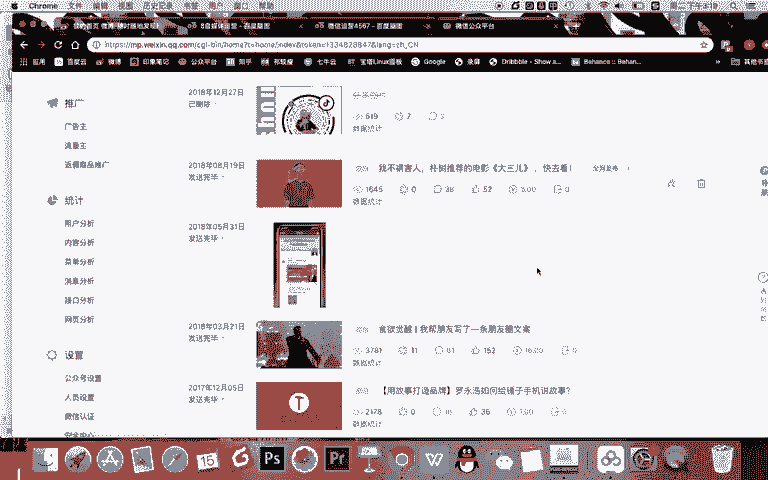

查找。什么呀。群发过的文章链接。

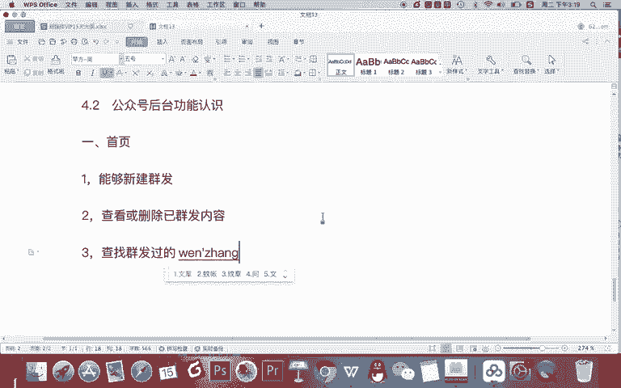

也是在首页，什么意思？就有些时候你需要把一篇文章的链接发给其他人，或者说把它插入到你的公众号的文章里，千万不要在公众号的什么呀。素材模板里。

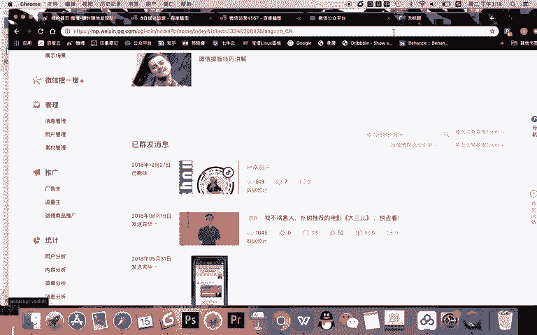

也就是你写文章的地方，等会儿我们会讲到去这里找一篇文章去打开，它，把这个链接放进去。不对啊，你看这是临时链接，对不对？它是错误的那怎么去放一个文章的永久链接呢？就是在首页这里找到这篇文章，点击它的标题。

然后你在这里获取的这个链接啊，这个链接但是你这篇文章的永久链接，你可以把它发给别人，别人任何时候都能访问啊，这是。

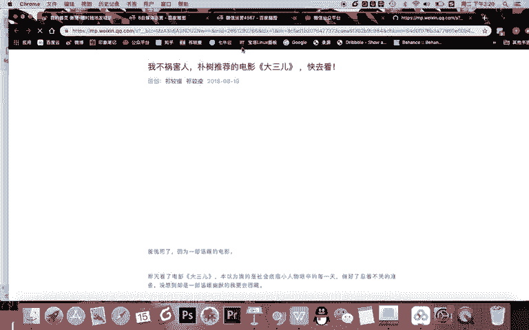

我们的这个公众号啊，查看永久链接或者以群发文章链接的一个方式，这是在首页。

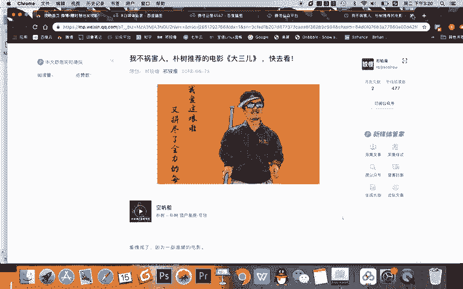

那大家看到首页还有一些功能啊，你看我一放到这里，它会有各种的一些功能。那我告诉你，这不是微信公众后台自带的一些功能，而是我使用了一个工具啊，新媒体管家它额外添加的一些功能。在后面的课程里。

我们会给大家讲这个工具。所以大家现在先不要着急，你记得在首页能查看你账号的数据情况。还有呢群发文章，还有呢删除已发布的文章或查看文章链接就可以了。除了首页之外啊，我们还有第二个核心的功能。

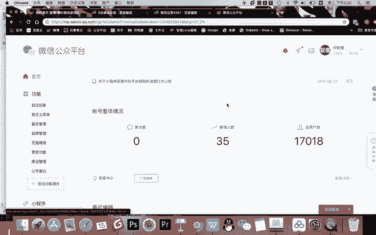

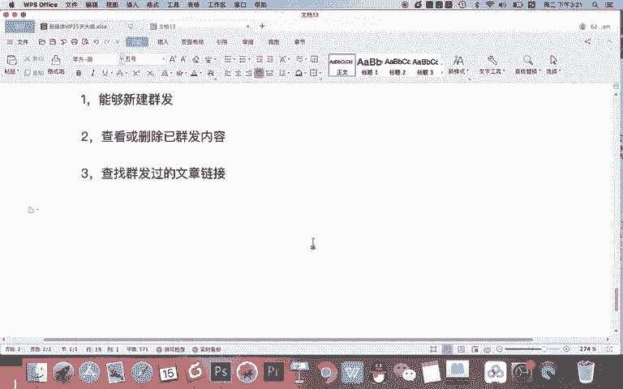

也就是在我们公众后台，它有功能，功能，这里有以下功能啊。

我们先把功能展示在这里，挨个给大家讲一下。

首先在功能的里面，第一个是自动回复啊，自动回复呢有三类内容。那我告诉你的是什么是自动回复。

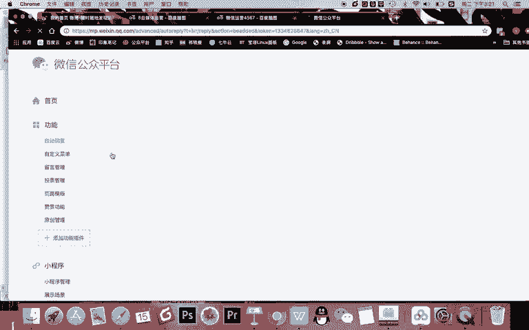

自动回复就是设置好之后。当粉丝关注或于公众号。或给公众号发消息吧。发消息时是吗，会自动回复的内容。所以呢自动回复你可以理解就是什么？就是你设置的一些机器的一些回复。这个部分呢我们会给大家详细的讲。

所以你现在知道它是什么就是。

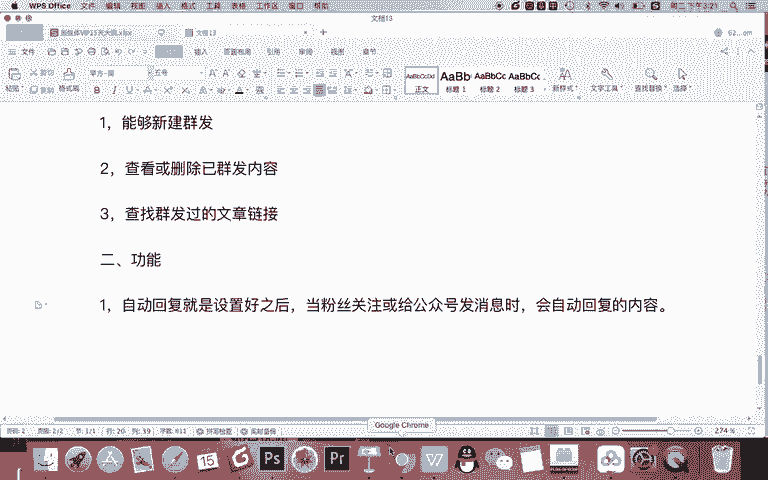

那什么是自定义菜单呢？看到这里啊，你看一下。自定菜单指，当你的公众号设置好之后，别人关注你公众号一打开会看到你公众号下面有三个菜单，同时点击这个菜一级菜单，还会有二级菜单的显示，约等于公自定菜单是什么？

你可以这样理解啊。

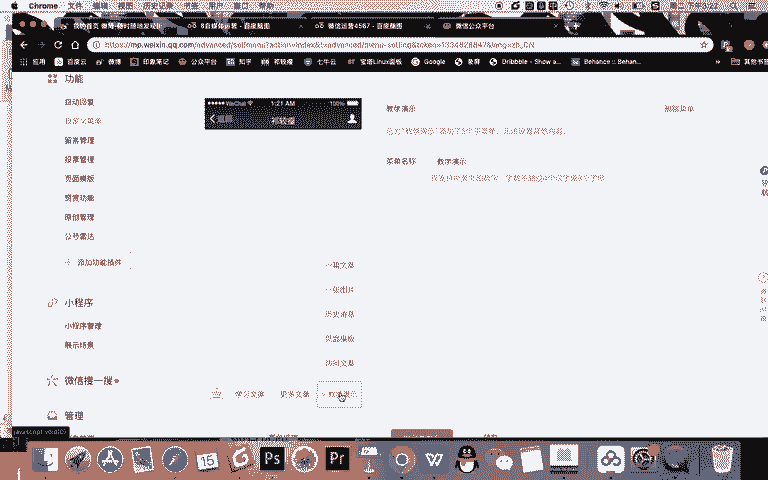

自定义菜菜单就是。公众号的。微网站。效果展示。

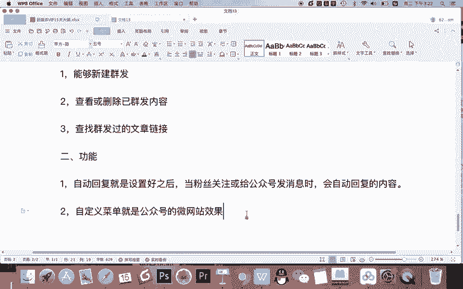

比如如果你没有设置自定菜单，别人关注你的公众号呢啊，这下面什么也没有，他只能给你发消息。但如果有自定菜单，他可以看到自定菜单这些内容去给你的什么啊，比如说他可以查看更多，甚至访问其他的地方啊。

OK这是自定菜单。啊，我们也会详细的讲这部分内容，所以我们在这里不再多讲啊。OK留言管理。

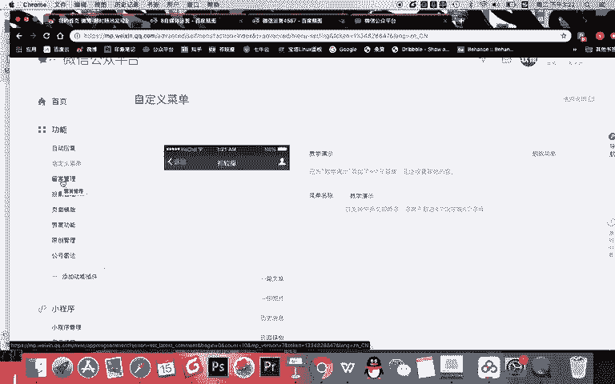

那么首先你记得。第一。现在新注册的公众号。基本没有留言。

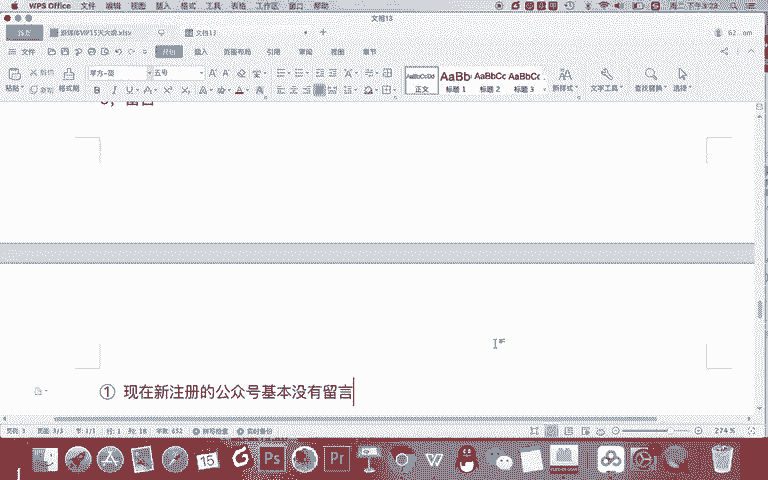

功能了。那你说老师，你讲留言管理干嘛？那我要告诉你的是新注册的这个公众号，现在虽然没有留言功能，但以前注册的很多老的公众号都有留言功能，而且留言功能不是你注册了就有它是根据你的公众号粉丝情况。

还有你的运营的一个是吧稳定度，然后他会看你达到一定指标之后给你开放留言功能了。但是呢19年以后啊，我们发现很多新注册的公众号，不管你怎么运营，都不会给你开放留言了。那你说如果我是做自媒体的。

或者我是一家企业，我希望我的公众号有留言功能怎么办？很多操作的方法是购买一个之前注册的有留言功能的账号啊，然后呢去进行运营。那留言你要记得什么留言。

就比如说你写了一篇文章啊，这篇文章会被用户留言显示在什么呀？显示在这篇文章的最下面。那你需要注意的第一点，关于留言。留言。需要被审核通过后。

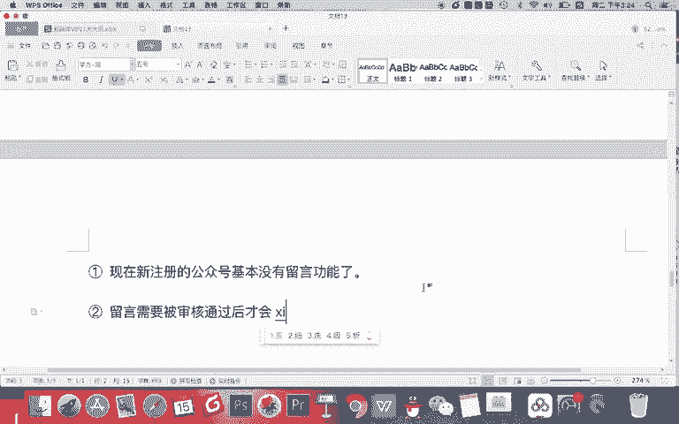

才会显示。所以呢虽然会有很多人有可能给你的公众号去发了留言，但是怎样？但是哎看不到，只有你收到提醒，一点开这个留言，然后记得点了这个，看这个星也约等于什么精选才会显示。所以呢你看到有不错的一些留言啊。

比如说别人给你留言呢。

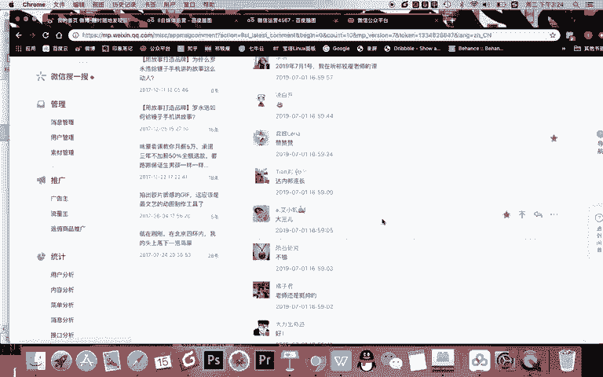

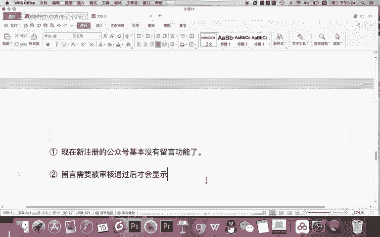

怎样？我点一精选哎，它的就会显示。那同时这个留言的人会收到一个提醒，告诉他被显显示。

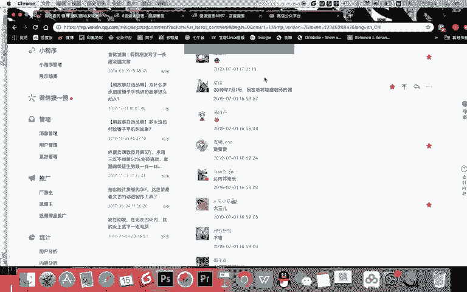

还有第三。留言可以被置顶，可以被回复。或者叫删除，大家看啊。

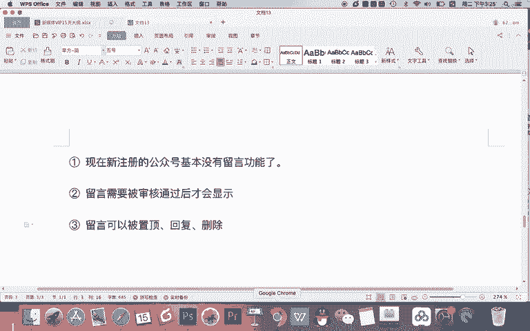

置顶呢约等于你把这个留言显示在所有的这篇文章的留言的最上面啊，这是置顶回复呢就是他如果咨询你一些问题啊，你可以怎样回复他，然后呢，让他不再给你发消息，或者说去回答他的问题。

当然你还可以删除留言或移到什么呀？垃圾留言啊，就是不要看到这个消息，这是关于一篇文章的留言。那需要在这里给你讲一个技巧记得。

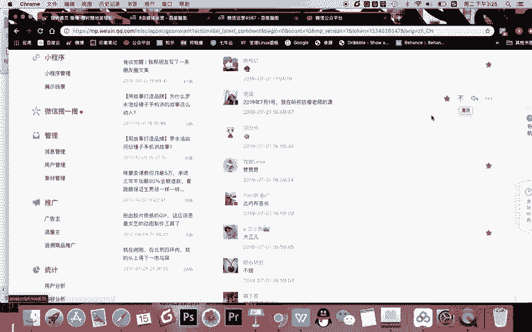

注意你留意就行。利用留言功能能实现。增粉怎么实现？比如说你可以设置，你看啊留言设置这里。

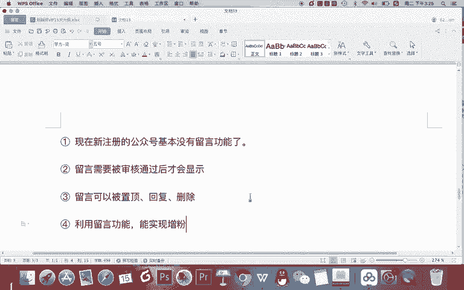

你可以设置。怎么样？首先啊屏蔽一些骚扰的一些留言，还可以设置什么？

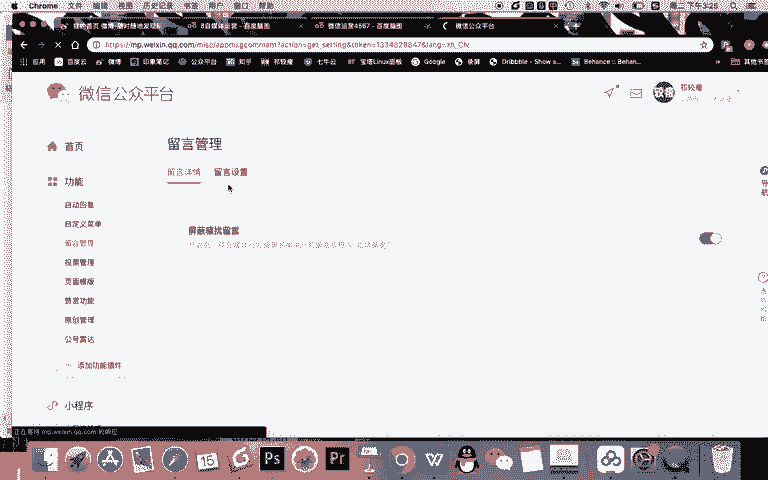

设置一篇文章必须关注后才能留言。那你想如果一篇文章用户想给你留言，是不是得关注就能增粉。但同时呢你还可以这样，比如说你做了一个活动是给这篇文章留言，我们从留言中选前10个排名送礼物。

那你想首先有很多人留言，那所有留言的人都得关注，能增粉。其次，他怎样才能成为前十名呢？有没有想过？对，留言啊，你记得。我。留言。是按照。点赞量。

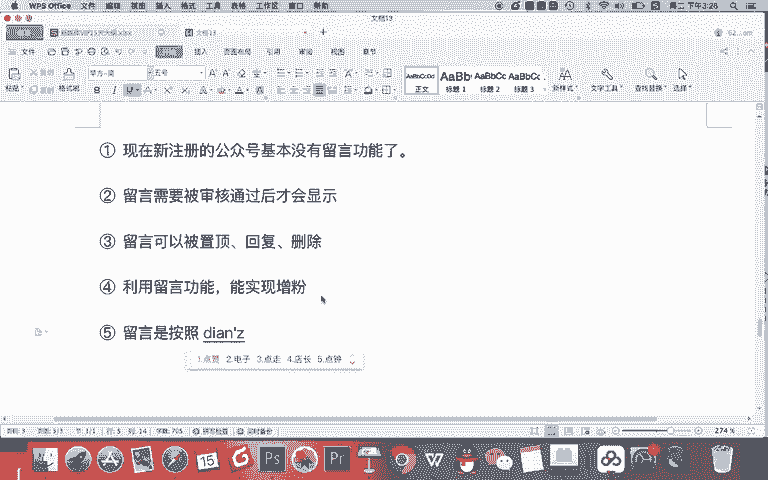

。还没有。啊，什么意思呢？就是你。