# 微信公众号运营视频全套 手撕运营 拳拳到肉 - P50：3.06-微信裂变讲座增粉02~2 - 达妹_达内教育 - BV1UvvvebEdT

但我感觉这个课程的内容呢有点太简单了啊，我需要再把这句话，我当然可以写地点，也可以不写地点改成什么呀？比如说。微信这里改成一个小标题，主要改成比如说微信裂变增粉的8个核心技巧和方式。

就直接8个核心技巧吧，然后文案啊直接改成这样，这样的话你看有大标题，有小标题。然后下面呢这个人很简单，我可以把它进行替换，对吧？我直接删除掉，它也可以，或者我直接去替换别的照片可以。

那此时呢我就不进行替换了。你知道你可以替换进去。然后呢，我要把这个人给它换掉。比如说其教授，比如说什么呀？其教授的介绍。某某。啊，比如说书籍。坐者。对吧比如说哎我出了一本书叫做。什么呀？新媒体运营实战。

实战坐着。然后呢，你看我这稍微可以改变一下，因为这个文字有点小，所以呢我可以换成。两行啊，我这里直接写出我的名字，哎，这样。直接啊这样去写。住有对吧？因为我要为了第二行不能特别长著作的著。

新媒体运营时代。然后呢，你看这个内容再稍微往上一点。然后排版稍微美观一点OK下面再进行介绍是吧？比如说自媒体人，然后呢某某。营销。总监。从。通过。从一篇文章。中法。10万O啊，你直接这样去差不多写一下。

然后有2到3行的一个距离，然后内容也基本ok。就可以。然后这是约等于这个人，然后你给他介绍好。那除了人的介绍，我们还要介绍什么？下面这里就不写讲师介绍了，不完全去突出讲师，而且就写什么。课程。

或者直接写是吧？课讲座。内容。讲的内容呢我们可以分成三行一。什么呀？微信裂变松粉。案例解读。2。微信或者说什么实现。裂变棕粉的。8个技巧及。怎么呀？5个。方案。第三。裂变。增粉的。全流程核心梳理。

那我要告诉大家的是啊，这里其实写什么不重要，我就是瞎编的。你记得这个地方一定要写清楚，就是你写三方画，为了目的呢是要这个图片设计更美观就可以了。在这里呢直接写什么原价。199。

然后呢后面直接写免费报名就可以。比如说啊你看我这里。直接写原价199，然后后面呢。现实。免费。对吧你要感觉文字有点多的话。可以改成小一点。OK这个文字我认为还是可以的。

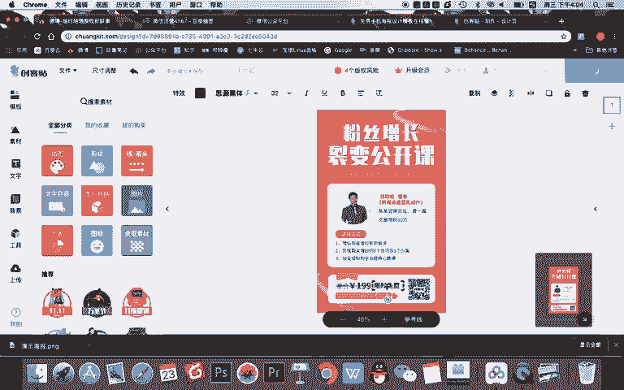

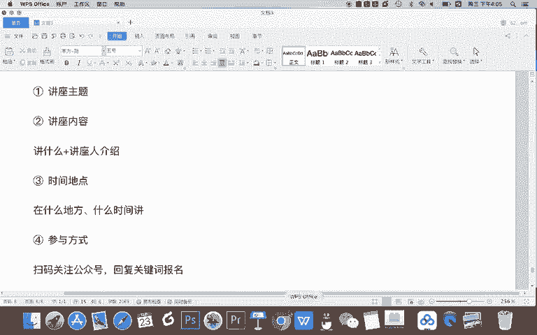

然后放在这里之这里呢，其实你看我们在讲座里面要注意参与方式是不是没写呢？我们要一定要写出它参与方式。然后还有呢我们讲座地点没写，对不对？你直接写什么？😡，这里呢不用写地点啊，当然你也可以写在这儿。

就告诉他什么，微信群公开课讲座直接可以写在这里。是吧比如说达达学院。微信群。公开课讲座。OK啊，这里呢你就把地点写了，然后时间其实要写吗？要写的话，其实你也可以加入到这里啊。

比如说放在这个地方加一个时间，或者不用写时间也行。我认为现在呢我不写时间，但是我认为有一个非常重要的内容啊，那就是参与方式O参与方式怎么写呢？现在我需要去找一个文字模板。因为刚刚上面的文字没了。

那怎么添加文字呢？我直接在这里直接双击一下啊，就直接能添加一个文字。比如这个文案呢，就不要告诉用户的扫码关注公众号，然后回个关键词，直接写什么。关注意啊八个字，扫码回复。讲座。报名OK大家看一下。

我告诉你这8个字呢比你说一大堆话还要有效，因为它更符合简单以及更符合用户的心理这两个原则。首先。啊，你要感觉白色不清楚，也可以用什么呀？其实 ok k 。比如为什么说它简单了是好的。

因为你首先啊如果告诉用户，我还得关注公众号回复关键词啊，用户感觉这个流程是不是非常麻烦，对吧？他不想参加，或者说看起来也费劲。首先文字更精炼的话，说明你的活动形式在视觉上更简单。

但其次呢我们扫码回复讲座报名，其实对用户来说，他只会感觉有一个操作，就是扫码回个讲座就行了。但其实他也是需要扫码之后，关注了公众号才能回讲座的，也就是在文案上，用户看起来更简单。

他心理上没有感觉你这个活动更复杂，但事实是还是要两步的操作，先关注，然后呢再回关键词，对吧？所以我希望大家记得啊。

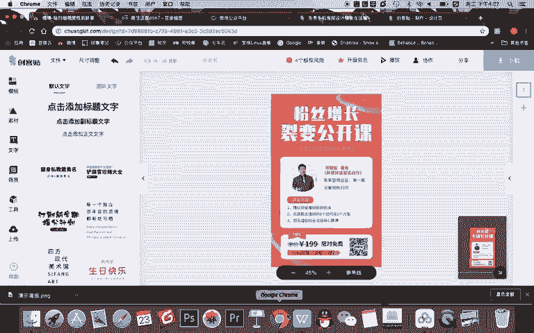

给你一个什么注意吧，写一下。文案参考。直接啊文案参考这8个字，你任何时候做一个需要他扫码报名的我这个海报的时候或者任何图片的时候，你记得可以用这几个字去当成你的参与方式的文案。

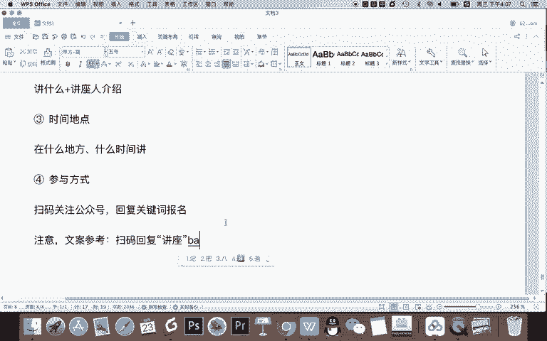

扫码回复。讲座或某某报名就即可够简单，用户看起来在参与方式也简单。那最后呢只需要把二维码去替换成。你的二维码。比如说你们公司公众号的二维码，然后就可以。OK啊。

这个海报呢现在除了一个啊这个有点不太美观啊。除了这个海报的这个图片的，比如说你的讲座人的照片没有替换之外，其他的内容我都替换了。那做好这个海报之后，你就哎这里我们进行一个微调的。你看稍微的不是特别美观。

对吧？因为刚刚挡上了这个内容。那OK这里弄完之后，我们就直接下载了啊，下载了这个第一步就完成了。但现在看啊，你刚刚去我们在选择模板的时候，没有选择免费怎办？记得如果不是免费的那你就不能去使用了。

你看它有什么模板，我们看一下有什么收费的。啊，这些素材那我们可以删掉它，对吧？比如说这个是可以删掉它，然后改成你的，还能改成什么？哎，这个也删掉它，是不是这些是收费的，你可以自己上传一些素材。

照片当然可以用你自己了。我们看现在是不是免费的了啊。

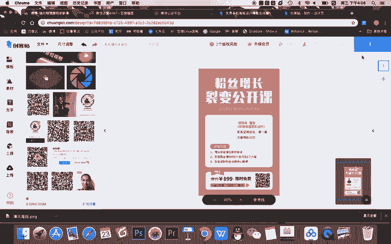

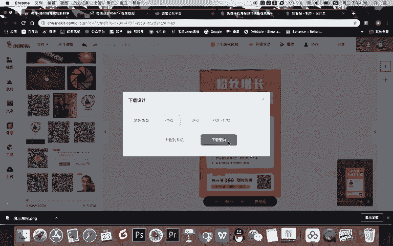

哦，还有一个圆形，我们看一下就在哪。

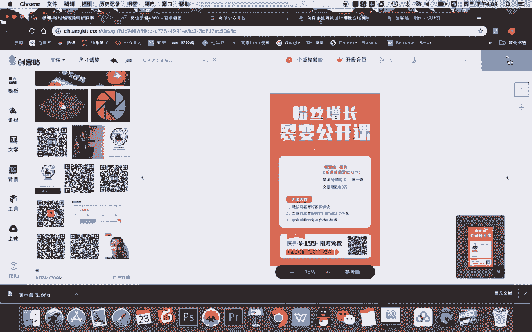

其实基本看不到了啊，是不是有这个地方？啊，你就选择免费的就可以。当然你也可以去开通他的会员去做收费的啊，0元。

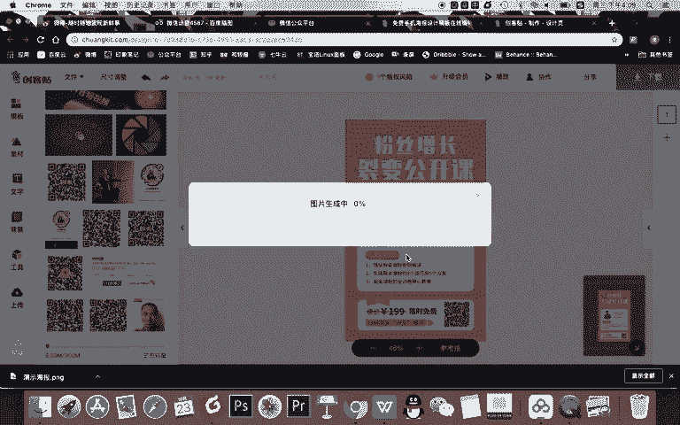

啊，直接免费下载，我就不去。去生成他的什么字体。OK这个照片呢我们做好了，就直接改成。讲座。海报放到桌面上。那此时这个我们的讲座的海报就搞定了。搞定之后，大家看啊这个海报做的怎么样，基本还可以。

对吧不难看，当然中间要放上照片啊不难看。然后呢整个的造型跟模板试演了。所以呢这是我们裂变式讲座它的一个海报的制作过程。希望大家注意的是，当你选择海报的时候，一定要先根据你的风格。

还有讲座要放的内容去选择海报，然后呢做出这个海报。完成海报制作之后。

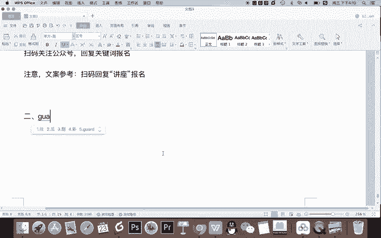

第二步。是进行。

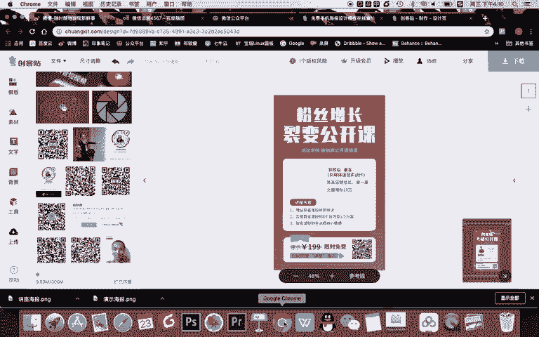

关键词。设置在这里呢它比较简单。首先。关键词设置什么呢？我们来看一下。是要让他设置一个词叫做讲座的。我们的目的是当我们的用户来听我们的讲座的时候，要让他能够非常方便的加到我们个人的微信，对不对？

所以呢我现在。

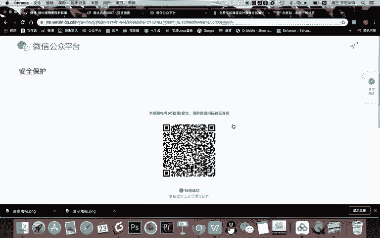