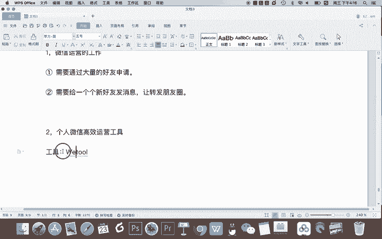
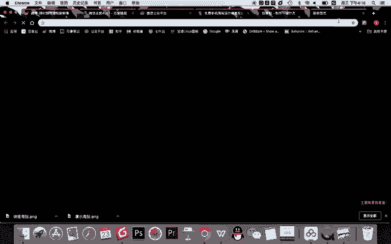
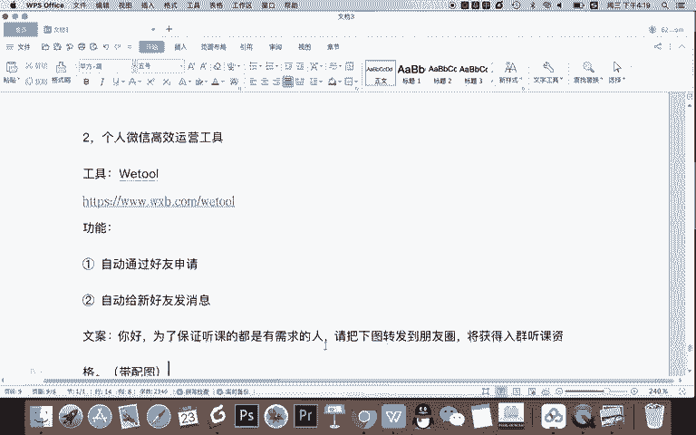
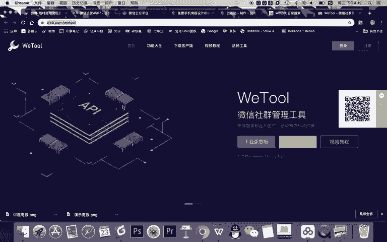
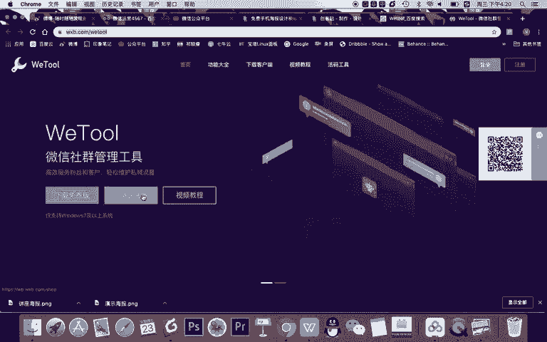
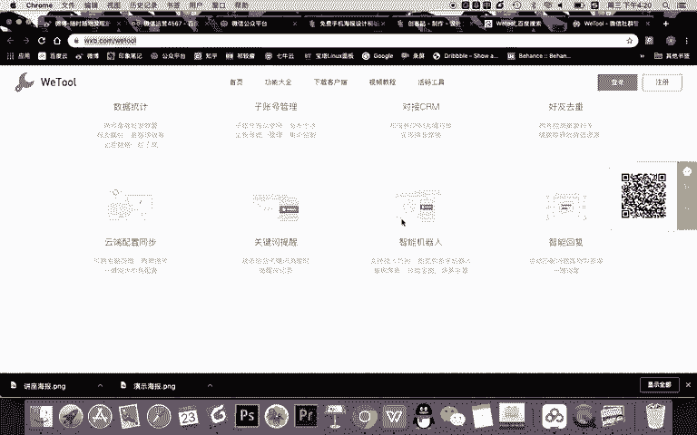
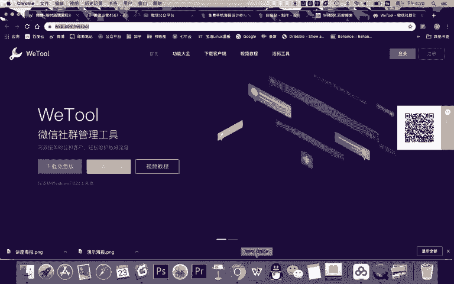
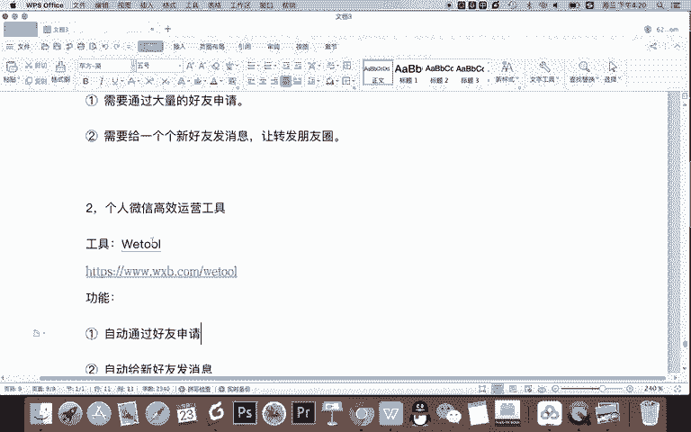

# 微信公众号运营视频全套 手撕运营 拳拳到肉 - P51：3.06-微信裂变讲座增粉02~3 - 达妹_达内教育 - BV1UvvvebEdT

还需要让设置一个关键词叫做讲座，然后把我的微信给到他。比如啊你看一下，我先添加一个内容。讲座这个关键词，我怎么给他微信呢？比如说啊这个叫。讲座也叫讲座。最直接的方式是这样的啊，你好，感谢报名，对吧？

听讲座，请。加管理员。微信。他。将。或者我们用这个女字旁的话，它将。什么呀，拉你。进入。想作曲，然后呢为管理员。比如说管理员小A微信号。对吧随先变成数字。OK那我问大家，你这样去写行不行？

这样写是不可以的，为什么呢？因为如果你这样给的用户，他加你的微信是非常麻烦的，他需要记着你的微信号，同时在手机上他去。去到比如说微信的首页，点击搜索，然后找到你再添加，非常麻烦。

为了提高这个工作的效率啊，记得这点。一、关键词的设置。技巧啊非常关键。第一。不要给用户文字。让加。微信直接给。图片二维码。加微信。那你说这样行吗？比如说我们知道微信公众号有这样一个功能，可以添加图片。

我直接把我的二维码。比如这假如啊这是我的二维码，我直接把我的二维码给到他，然后把文万改一下啊。你好，请将拉进中群，然后呢。扫码直接。加微信。然后我确认之后。ok我把这个回复全部让用户既收到这个二维码。

又收到这个one可以吗？可以是可以啊，但建议不这样做2。另一个技巧。建议把文案。或者说引导。添加好友的文案和二维码做成一张图片，让用户吧看着。清楚。加。好友。也方便。什么意思？看啊。

我这里就不给大家重新做了，我告诉你，你要有一个技巧啊，直接把这个删掉，做成一个什么呢？做成一个这样的东西。比如大家看。大家看。做成什么内容呢？做成一个有文字，有二维码的一个图片。这个图片呢。

而且是添加成你的个人微信的一个图片，这样用户能直接扫码加到你。比如添加成感谢报名听课，然后呢，看听课，请加群众微信，他家拉你入群。刚刚我们讲的文案已经有了。那么你把这个设置成关键词给用户。

用户一回关键词讲座俩字，直接收到这个图片，一长按直接添加你的微信更加的方便。那么我建议啊大家在做这个图的时候，还有一个技巧。三。建议选择。方形的图片制作什么呀？制作什么呀？二维码引导。不要用。海报造型。

以便。与。第一步的。讲座海报区分。也就是在这儿。在创客贴这里，你看你刚刚已经做了一个这种竖屏的海报，有一个二维码。现在你又让用户去加你的微信，又一个扫码，那你就需要做出区别。

就是比如说你看我是做成一个方形的一个小字的图片，让用户知道哎，我已经进入下一步，我只需要加个人微信。所以呢在选择模板的时候，不要选其他的造型，更不要选这种竖长的海报的造型，简单直接让用户知道是不同的。

是新的，需要加好友的。那完成了以上的设置呢，就第二步就非常简单的完成了，用户就能非常方便的加到你的好友。那我们第三步要做的是什么事儿？第三步就要什么呀？通过。或者说叫个人微信运营，微信运营做什么事儿啊。

比如说第一。微信运营的工作内容。第一个。一、需要通过大量的好友。申请。因为你做这个讲座，你的活动宣传之后，会有很多人来你的公众号去参加活动，然后回回复讲座，然后添加你。

那么你一天呢也许有几百个甚至上千个好友申请。那么你就需要大量通过好友申请。接着你还需要做第二件事。2。需要。给一个个新好友。干嘛呀？发消息让。转发。朋友圈。对吧你这个地方呢这个工作量就大了。

因为首先第一个啊，通过好友验证这个在微信里设置一下，你是不需要一个一个通过的，就能让他们直接加你的好友的。但是呢你一个一个给他发消息，这个是没有办法的对吧？那怎么办呢？在这里呢？

我们给大家推荐一个什么呀？2。🤢，个人微信高效运营工具。用这个工具能大大的提高你的工作效率，能够自动通过好友的申请，并且自动的给你一个一个好友啊，新好友去群发消息，让用户能够知道要转到朋友圈。

而这个工具呢。就是。

wiital啊，当然这个写成西小写会好一点。waer我告诉大家，这是一个非常高效的新媒体，或者叫微信运营的一个神器啊。大家看啊，它是微小宝公司出品的这样一个waer，我发到我们的这个地址。

那我告诉大家它有什么功能啊。首先第一个功能。一。自动通过。好友申请。这没有什么神奇的对吧？因为你说我微信设置一下，我也能动，大都告诉大家，第二个。自动给新好友什么呀？发消息。

所以你就可以把这句文案发给他。比如。哪个文案呢？就是我们讲座的文案内容。你好。😊，听讲座。请把什么呀？讲座。海报转发到。朋友圈将获得入群听课资格。对吧然后甚至我告诉大家啊，你别写什么讲座海报。

因为对用户来说，他不知道什么是讲座海报。听讲座请把。下图。为什么呢？因为你这个5碍啊直接设置好。带。配图的。对用户来说，所有加你好友的人直接能收到这句话，还有那个海报配置，他直接就知道哦。

我要把这个图转朋友圈，先获得入选请客的资格，对吧？这就实现了。但我告诉你，现在这个5万有点生硬啊，就是太广告了怎么办？你可以跟用户委婉的说，你好。为了保证。听刻的都是有需求的人。对吧我们需要进行筛选。

或者不写这个筛选。为了保证听课都是有需求的人是吧？请。什么呀。把直接写请把吧，下图转到朋友圈将获得入群听课的资格。对吧OK我们简单这样声下，或者你可以这样写啊，你说你好啊，感谢报名。

本次课程呢有两种入群方式，一、付费69元，对吧？当然你这个如果是付费69元，你在我们的这个海报上就不要写限时免费了，对吧？你就直接写什么啊。不要写价格就可以。你告他也不说免费，也不说不免费。

其实这个文案你委婉一点，有两种听课方式，一、付费69元直接入群。2、免费入群，但需要转发活动海报，讲座海报到朋友圈对吧？下图就是海报O这样告诉他，用户就有的选，我当然可以直接听课啊。

这样的我我得需要付费。但是呢我现在想听课又不想花线怎么办？那我就选择转发朋友圈吧？O所以呢你使用wier这个工具就能解决这个问题。那我告诉大家微信这个waer工具是一个高效的社群运营工具啊。

你看它是一些运营工具，它有非常多的一些功能，它有免费版，也有企业版。那我告诉大家以前它是纯免费版，后来很多功能去进行的一个升级。你看它有哪些功能啊，首先对微信社群有统计群发还有数据好有去虫等这些功能啊。

甚至能够啊检测僵尸粉啊智能回复啊等等等等。所有的功能基本微信社群需要用的它都有啊，这个功能我们现在这一步只需要去。

使用到什么自动好友发消息。但你记得我们第五步的运营的内容是要运营设微信群的。

