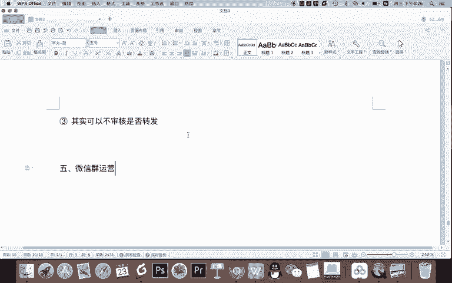
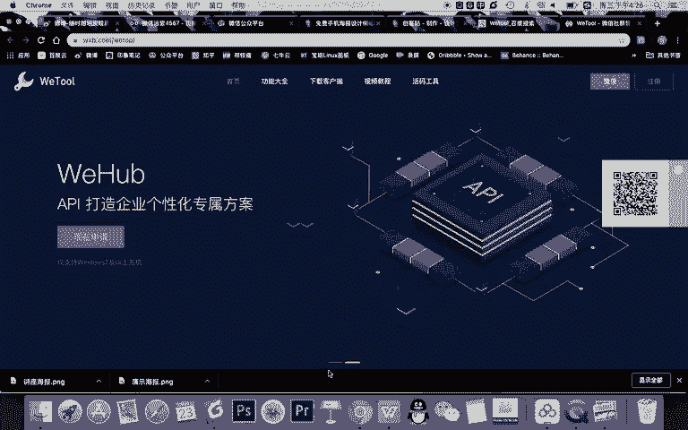
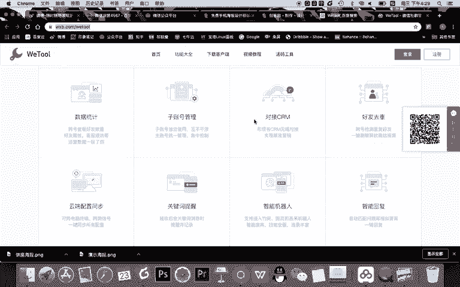
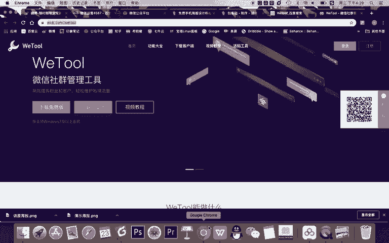
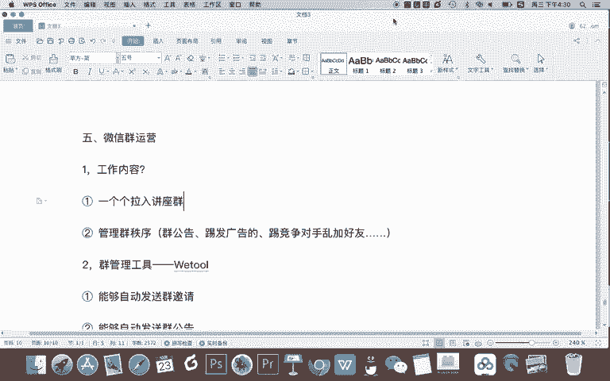

# 微信公众号运营视频全套 手撕运营 拳拳到肉 - P52：3.06-微信裂变讲座增粉02~4 - 达妹_达内教育 - BV1UvvvebEdT

就可以用wier提高我们工作的效率。所以功能呢我们先讲这两个，所以呢使用wier能解决第二步啊，不用机器去处理这些工作，而是我们用不用机械式的一个一个去回复好友消息了啊。

我们直接用wier能够自动化啊机器化给所有我们幸好友发消息。这样呢个人微信运营这一步工作，我们就完全自动化实现。好，我们第四步的工作啊是要进行什么呀？审核朋友圈。对吧。我们要为什么要审核朋友圈？第一。

😡，一。要查看用户是否转发了。讲做海报。对吧我们要知道你转了没有，你没转，你不符合我们的要求，我们不能让你听课，因为你没有帮我们进行传播。第二个功能啊，其实我们要审核有一个原究也有可能转了，但是怎样？

查看。用户是否转发后立即删除。所以我们审核朋友圈审核的是这些工作，就是我们希望用户不仅帮我们转发了这个角度海报，而且希望他的这个海报一直在呢。那如何审核呢？我给大家分享一下审核技巧。首先第一个。

首先他转没转很简单，你去到朋友圈去看就可以了，对不对？他给你提供的截图，你再去看就有。但是会有一个问题，就是第一。如何避免？分组。怎办。对吧审核上你需要去避免分组转化怎么办？截局我们的解决方案就是什么？

看截图是否有。分组。标志。我们知道微信的朋友圈，如果你进行分组转发了，这条微信朋友圈的内容下面会有一个小人的标志，这是提醒你已经进行了分组，对吧？啊，当然你说哎我分组，我给你截图的时候。

我不让你看到我给他PSP掉，可以不可以，可以是可以。但是对用户来说，这个操作比较麻烦啊，不是每个人都真的会这样费尽心机的去给你P掉这个小人，大部分人简单转发一下，他也愿意转发。

所以呢你看有没有必有没有发就可以。还有哪个什么技巧。还有第二个。如何避免？什么呀。分享号立即删。用户如果进群了，比如说他你让他转朋友圈，他转发了，然后呢，他给你截图了，然后你给他拉到群里，然后他删了。

他在朋友圈停留的时间太短，就没有帮你进行传播，怎么办？所以这是一个非常关键的问题。我们如何避免用户发了就删啊，进群就直接听课了，没有帮我们传播，给大家分享一个小技巧，就是什么？不要。立即。审核通过。

怎么可以隔天通过用户的。什么呀？健权申请。为什么这么说啊，什么叫隔天通过，可以在用户发。给你截除后，隔天通过好友的进群申请。比如每一个加你微信的人，你就告诉他转发朋友圈。他转了之后。

你不要当天立即处理这样的信息，你可以啊，我建议大家在实际的工作中这样操作，给所有的人去发让转发的信息之后，就对他们不再回复了。如果这些人最后给你发了消息给你的提供截图。

你在讲座开始的那一天把他们全部拉到群里。这样的话，你中间停留的有两三天的时间，用户会不敢删除这个内容，所以他有避免了立即删除。因为如果你给他发一个啊，他给你一个截图，你拉一个这个效率也挺低的对吧？

所以我们可以在讲座的当天集中的拉用户进群。那分享最重要的一个审核的技巧告诉大家。其实。可以不审核。吃了否了。想发。因为我们所说啊，让用户帮我们传播朋友圈，其实是为了实现我们免费推广的一个目的。

但很多人不希望去什么呀，分享朋友圈。但你说他不分享朋友圈，我们就不让他听讲座吗？一般可以是这样啊，你记得在让用户分享这一步，如果他没有完成的话，你可以干嘛？你可以让他去也听课。

你可以后期在微信群里对他慢慢的进行转化。也就是这次他没有给你去做推广，做营销，做转化。你下次可以继续对他进行营销，所以呢不要放弃这些用户。所以让用户转换朋友圈，只是我们设置一个门槛。

但这个门槛我们不是做不进行严格的要求，我们不是唯一的必须要做的啊。我们只是告诉他你转，如果有些人帮你转化的那很好。但如果没有或者有很多人没有转化怎么办？没关系，我们同样让他听课。只要你加了我们的微信。

我们都让你听课，因为进群的都是什么呀？潜在客户。我们后期还可以慢慢转化你。所以呢真正在工作中，如果啊你的这个讲座不是说价值特别高，一定为了保持一个公平性。比如说很多人付费的，那些没没花钱的。

你也让他听的万一付费的知道的不太好。那如果本来就是免费的，那你就可以让所有的人都进群听课，啊，哪怕发了朋友圈啊，或者没发朋友圈，不影响。OK这是我们审核朋友圈的一个技巧啊。其实这个工作。怎么说啊。

你需要。它全是人工的啊，就是你需要自己做一个评估，你看看到不到要到底要不要去一个一个审核。O审核朋友圈这一步解决之后，我们第五步进行的工作就是。

微信群运营，也就是我们的社群运营。那第五步社群运营呢我们需要做一件事儿啊，那就是什么？首先。写一下。微生经运营的工作内容。包含以下。第一。一个个拉群拉入。讲座群，这是一个工作。第二呢。管理群秩序。

对吧所以呢首先这两个工作都不容易啊，一个一个拉讲座群，这也是一个纯体力的重复性的工作。第二呢，我管理群秩序，比如你需要怎么管理。比如说。群公告你得发吧。还有呢。踢那些。发广告的踢那些什么呀。

竞争对手乱加好友的等等等等。这是你的管理工作的一部分。那么一个一个拉群这事儿，我们肯定不能人工去操作，因为它太复杂，包括群公告的自动发布，还有广告这些发广告的这些人怎么踢，还有乱加好友。

这些人怎么监控去除，这就需要一个工具了，这个工具还是什么呀？前面所讲的群管理工具。没错。那我告诉大家，使用wito能解决这些问题。比如它的功能有一。能够自动拉或者自动发送群。邀请。第二。能够自动。

发送群公告。三。能够。自动设置什么呀？发广告。被。踢出群。第四。能够。什么呀？监测私加好友。等等，它还有其他的一些功能啊。但我要告诉大家的是。基本啊我们目前进行这次讲座所需要的一些功能，wier都具备。

所以呢wato是一个高效的微信社群运营的一个工具。希望大家能对它进行掌握啊，但是它是一个基本操作的工具，一点都不难。所以我们不进行详细的讲解。当然它有付费版，还有企业的啊收费版本，大家可以好好使用一下。

以以wiital作为一个辅助的工具去运营，或者说提高运营我们微信裂变讲座的整个的啊工作的效率。OK啊以上五步呢就是我们微信裂变讲座的一个操作方式。在这里呢我们给大家讲解了啊，或者说详细讲解了。

如何制作讲座海报的一个技巧。其次呢我们给大家分享了一个微信群，或者说微信个人微信以及微信社群运营的一个工具。wier啊，它具备的这些非常好的功能，都是我们进行微信运营啊非常重要的一些功能。所以希望大家。

能够掌握它的使用O。啊，讲到这里呢，我们关于微信讲座裂变啊，就讲完了。我们有两节课给大家好好梳理的这个内容，并给大家进行了一个实战的操作。

希望大家也能在工作中把这样一个裂变讲座增粉的技巧掌握的什么呀到位。

