# 微信公众号运营视频全套 手撕运营 拳拳到肉 - P53：4.01-微信数据分析~1 - 达妹_达内教育 - BV1UvvvebEdT

同学们好，今天我们来学习微信运营的数据分析的相关内容啊。首先呢关于微信的数据分析，我们分为两个部分。第一个是。自身。公众号。分析。第二呢是。公众号全行业。分析什么意思啊？第一个就是说你运营微信。

你要去分析你的微信的公众号啊，这是自己的公众号的一个内容的一个分析。自己的公众号的分析又分为主要的四个部分啊。第一个是用户分析，第二是内容分析。

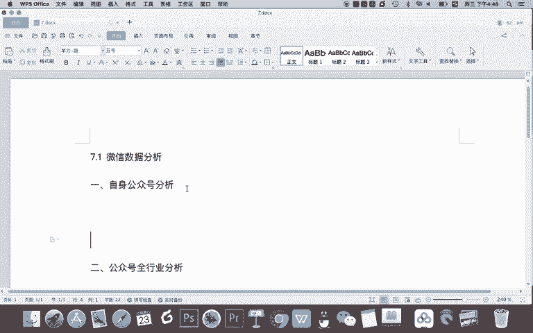

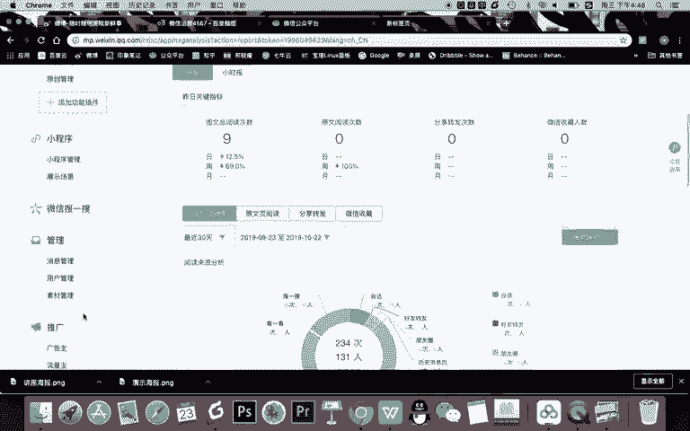

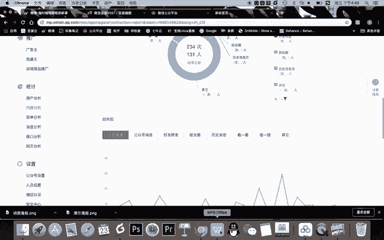

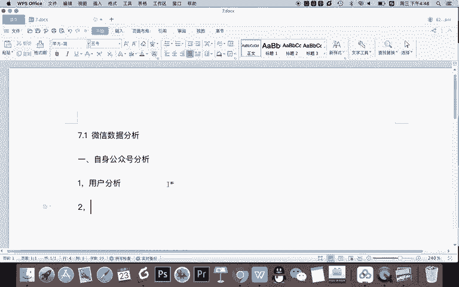

第三个是。菜单分析。第四是消息分析。

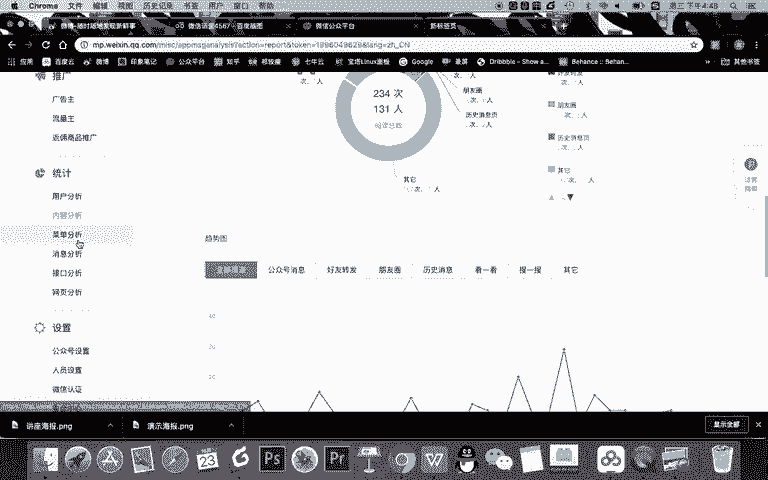

OK啊，什么是用户分析呢？我们在最初的课程有简单的提到过啊，用户分析指你的用户的啊，比如说增长分析属性，还有常读文章的一个用户的分析3块内容啊。

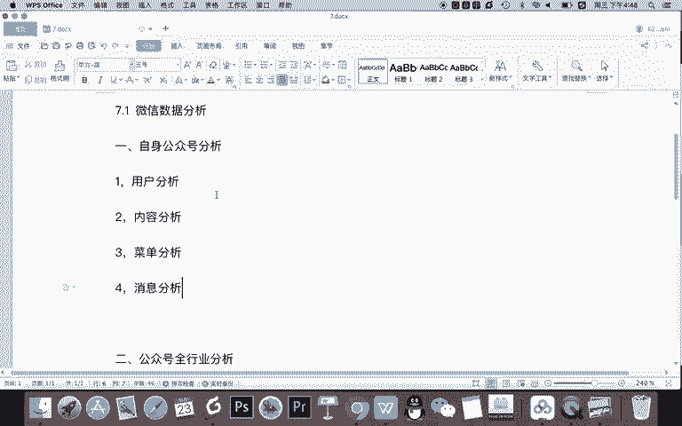

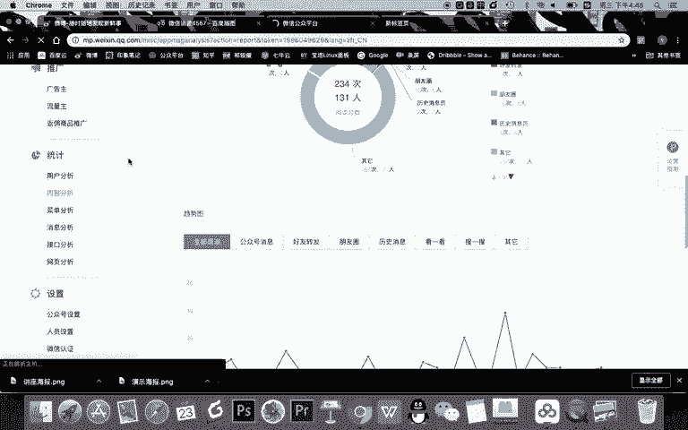

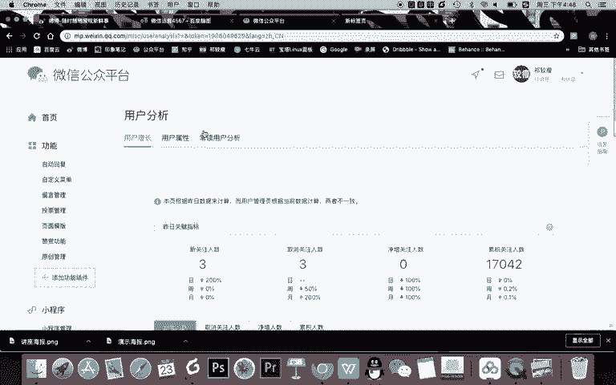

第一。用户增长分析。第二呢。用户属性分析。第三是你的什么呀常读文章的一些用户的分析。或者你可以这样理解是什么。活跃用户的一个分析。

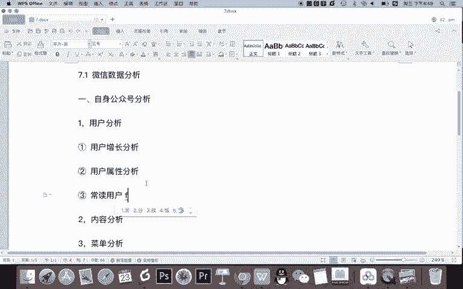

好，用户增长分析很简单。你看啊，比如说你要看一个用户的新每天的新关注的情况，取消关注的数量，竞增的数量。还有呢你最终的一个累计关注的数量。

一般啊在我们的数据表格里面会体现你最近30天的啊一个增长的一个情况。当然你也可以去选最近7天一个增长的一个情况，然后还有呢比如说啊你可以选15天等等。这里面去看的是什么啊，其实我们要从。

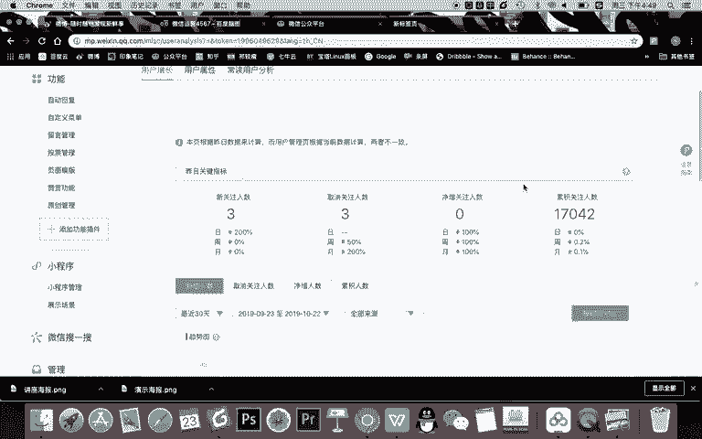

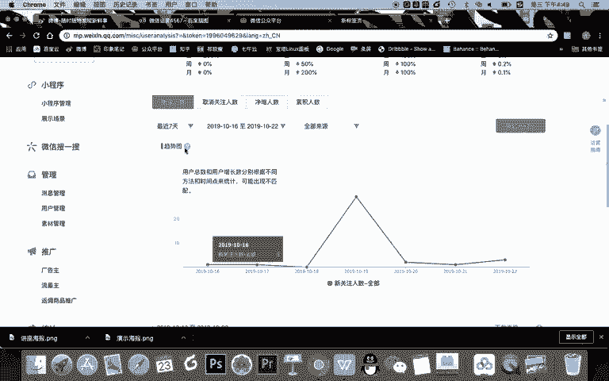

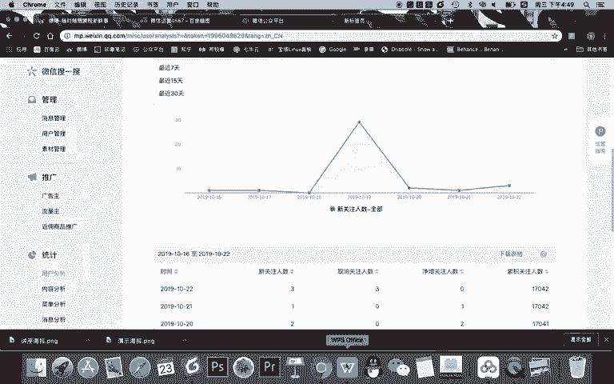

主要监控的是什么？主要从这个数据的一个增长情况去查看，或者说主要分析公众号的。正向。粉丝。增长。情况。要统计的是什么？每日增长和。掉粉啊，也就是什么取消关注的一个情况。比如说什么叫掉粉。

你看取消关注叫掉粉啊，增粉我们直接用对称起来写吧，要统计每日增粉和掉粉的数据。

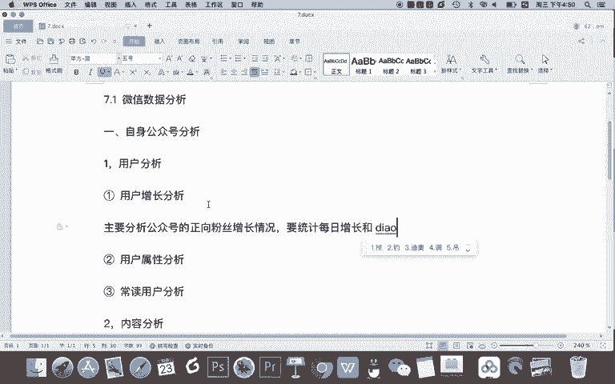

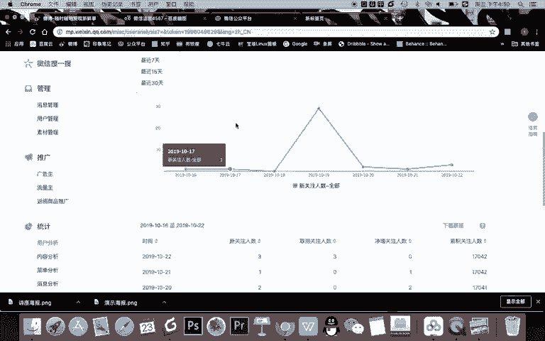

努力什么呀？多增粉。少掉粉，然后呢提高。公众号的。正向什么呀？粉次增长。OK这是一个基本的一个内容。但是我建议大家在去进行用户分析的时候。不要啊，只单纯的去看用户分析，注意。要把用户增长情况和什么呀。

公众号文章。发布以及。公众号活动。推广相结合。然后呢，确定。增长的来源和方式。啊，因为你如果单纯的去看增长，你只能知道哎我今天增了几个啊，取了几个然后呢先净增多少，这没有意义啊。你每天的所有的增长情况。

其实要去跟你的这个部分，也就是你的内容，也就是你写了什么文章，比如说今天推送了一篇文章，公众号粉丝是不是增长了，然后呢改天是不是做了一个活动啊，公众号粉丝是不是增长了。通过这样的方式实现啊。

或者说去确定你的用户增长的一个来源。这样的这些增长才是有意义的。比如说你在写某一类型的文章的时候，发现用户的增长很快。那你在后期在做选题的时候，可以就多写这样的内容。还有呢做一些活动，看看是否有增粉。

比如说相比之前的活动，这次的活动增粉效果比较好，那后期可以举办多类型的这样的活动，所以呢啊用户的一个增长主要是去看你的用户一个公众号的日常的运营情况，并且统计出你这些日常的粉丝增长来源哪里。

第二本的用户属性是什么？

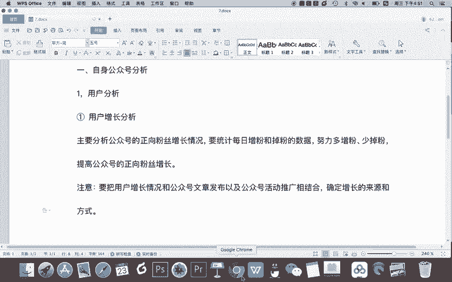

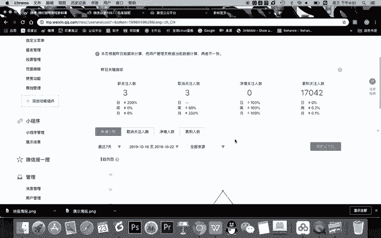

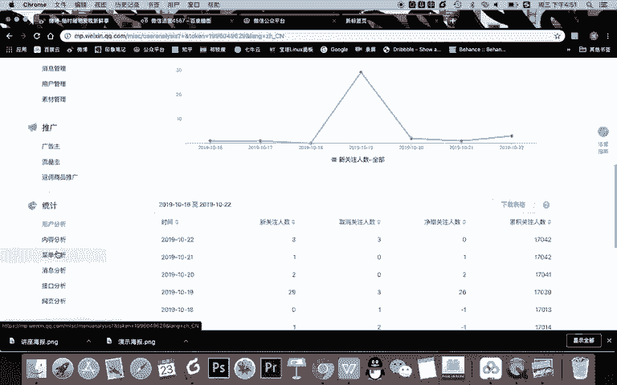

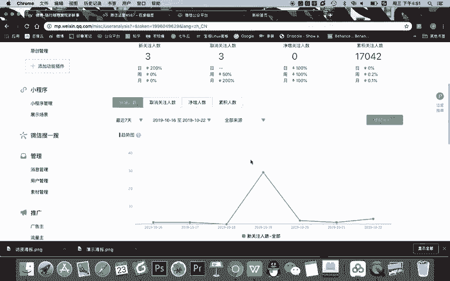

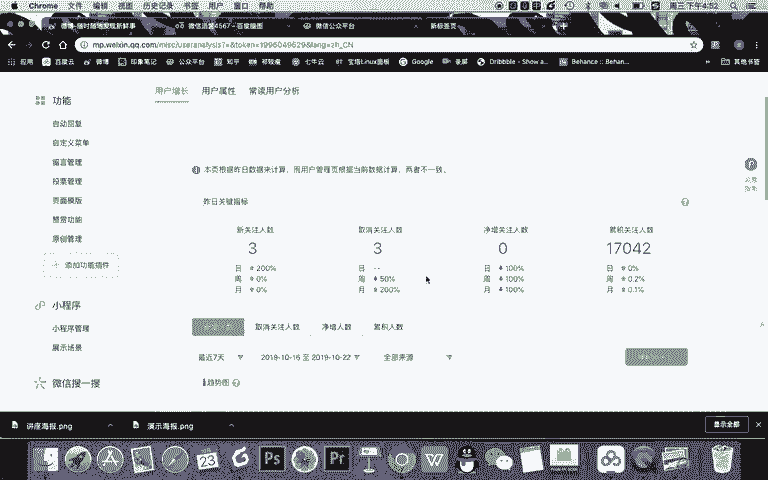

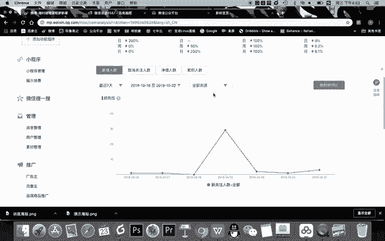

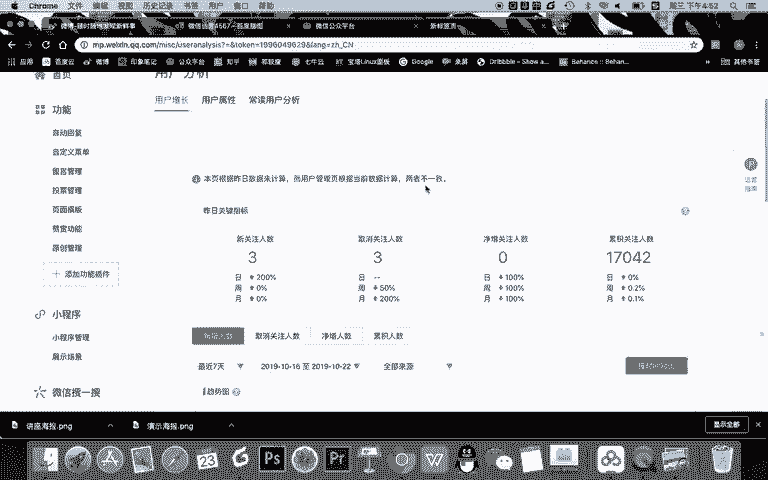

主要是看性别、地域和设备啊，性别年龄。你看用户的一些人口特征，性别年龄、语言这个语言一般很少啊，主要是性别年龄，还有什么啊，比如说地域和设备。

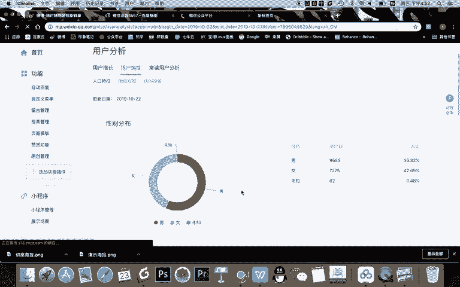

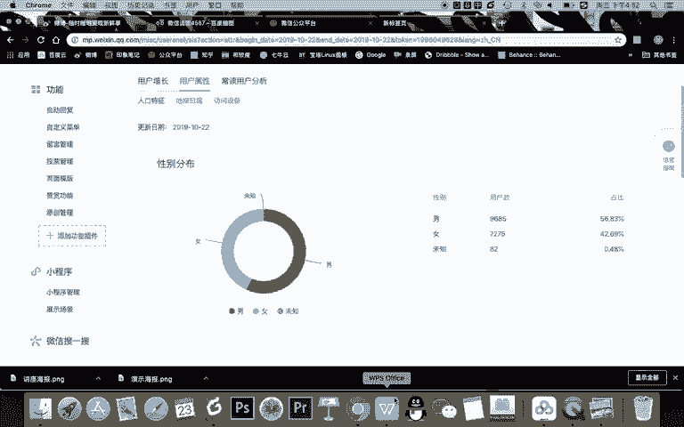

我把这几个数据给他写这里啊，主要是性别。年龄。地域设备分析这个有什么作用呢？比如第一个什么呀不同的。账号类型用户的。整体。性别。倾向性。我操。比如很简单。比如。鸡汤情感类账号。女性。用户多。对吧。

女性用户多有什么对我们启运营的一个启发呢？其实很简单啊，你要记得。女性用户多在内容选题上要倾向于。女性，所以你会知道有一些啊经常发一些情感类内容呢，他为啥天天就光夸女人或者说贬低男人呢？

因为他的女性用户多，你当然要去维护好他的一个粉丝，讨好他的粉丝，大家才喜欢对吧？所以呢你要去根据这个去确定。还有一个内容啊，就是说如果你们的产品是针对男性的，但如果女性多，那你就需要去调整你的内容了。

因为你要保证你的男性用户多，你的产品卖给他们啊，才能卖得出去，对吧？你要是天天写的公众号文章特别好，女生很喜欢，但是你的公众号啊，这产品主要是卖给男人的，那那就完蛋。当然也有一种情况啊。

虽然这个产品是卖给男人，但很多是女人买了，哎，这个时候也可以啊，卖给女人，女人买了送给男人啊也是可以的。这是我们的用户的一个性别。那年龄的分布呢主要是看你的用户的一个整体年龄的一个形态。

比如他是大学生还是高中生还是中年人或者是中老年人啊，这个是跟你的文章定位有关的。你要去跟。

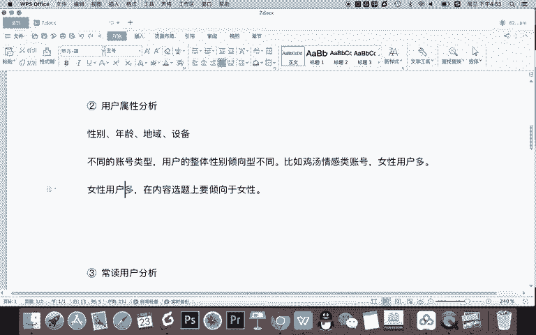

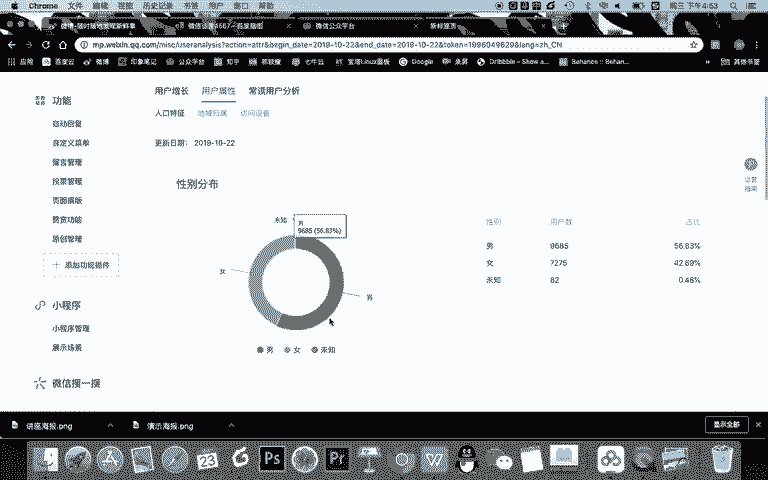

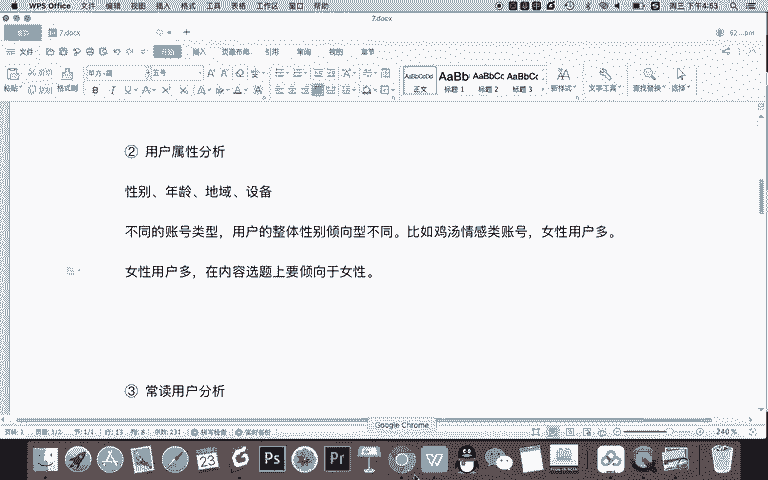

根据你的文章内容的一个方向，还有公众号的定位去确定他的年龄，或者说相互进行一个反差对比。比如你明明写的文章是针对大学生的，但发现很多都是职场人的关注。

你是不是要考虑这个内容上不太受众不大不太受对大学生的喜欢啊，这是不太好的。ok。地域归属呢一般是省份啊，省份一般北上广会多一点。你要根据你的用户的地域属性啊去进行一个基本的筛选啊。

但这个价格或者说这个内容呢对我们常规来说意义不大，对哪些账号运营比较大呢？是吧？

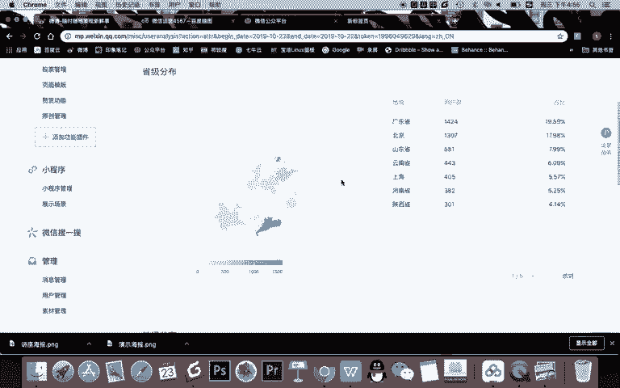

一般啊。

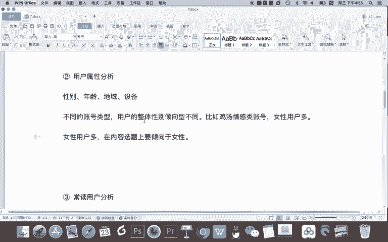

在地域上对那些啊垂直地垂直于地方的账号，它的影响力比较大。比如说你是针对北京地区做的北京吃喝玩乐推荐的这个账号，那你的用户肯定要北京为主才是正常的。如果比如说你做的是针对某一个省份的一个用户了。

但你的用户分布上其他省份多，或者全国很平均，那你的用户其实就不够精准了。要么是自己内容做的不够垂直，要么就是这粉丝有可能就是刷数据刷的啊。还有啊再往下的一些城市的分布啊。

这个就啊具体的一些城市的一些内容了啊。O还有呢就是你的常啊就是用户经常在看你的文章时去使用这些设备啊。你看iphone安卓偏多的啊，大部分都是iphone和安卓iphone的话，啊，怎么说。

现在这个价值参考性不是特别大啊。但是如果在你接一些商业推广的时候，会有一个相关性。比如说你在推广一些APP的时候，如果你这APP是iphone专有的，或者说在一些安卓上使用是特别好的话。

那你可以根据你的用户类型去选择，甚至比如说啊当你在接一些广告的时候啊，你或者说再去投一些广告的时候，也可以去考虑别人的一个终终端的一个受众。O这是用户的一个属性。

还有常读用户的一个分析是指经常啊读你文章的一些用户到底。

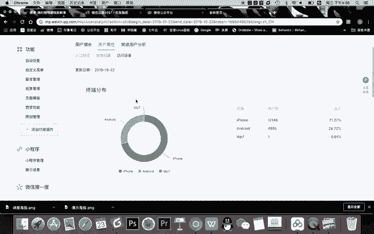

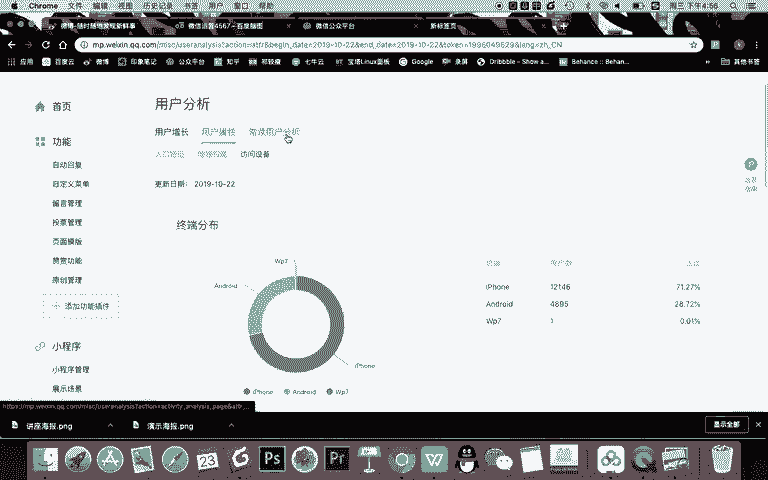

有多少啊？比如你看我的公众号基本没有更新啊，长途用户只有几百个人。你看我有1万多粉丝，只有几百个人，长度，说明明很多人基本就不打开这个公众号，或者说不打开我的公众号呢。

还有呢他的性别啊、年龄、城市和终端，这个是跟刚刚一样的啊，但是意义不是特别大。所以呢这个功能呢只告诉大家，你需要知道你的公众号到底有多少活跃的用户。因为活跃的用户会决定你公众号的一个文章的基本的阅读量。

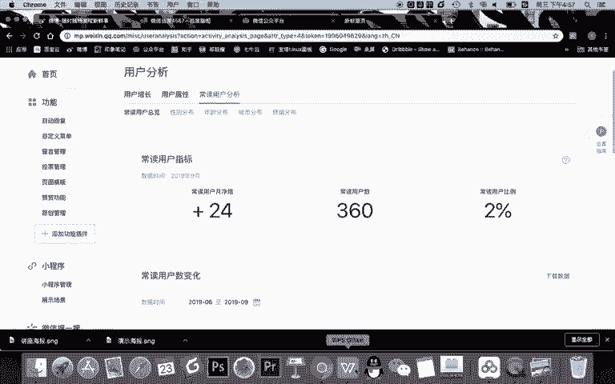

OK啊，这是我们用户属性分析这里啊。以及长途用户这给大家提了一嘴啊。ok我们看第二个那部分是内容分析，内容分析是什么？

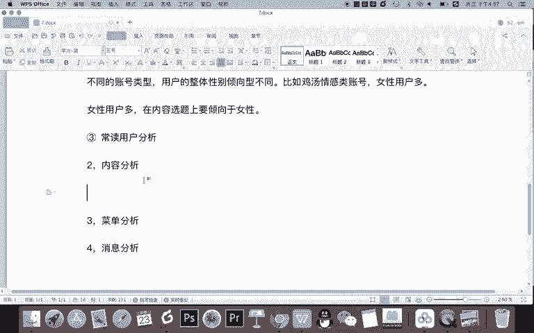

C。分析。