# 微信公众号运营视频全套 手撕运营 拳拳到肉 - P54：4.01-微信数据分析~2 - 达妹_达内教育 - BV1UvvvebEdT

一公众号。图文的也不叫图文，就是你推送的文章的是吗？内容的什么呀？阅读。传播情况。比如我们一起来看啊。

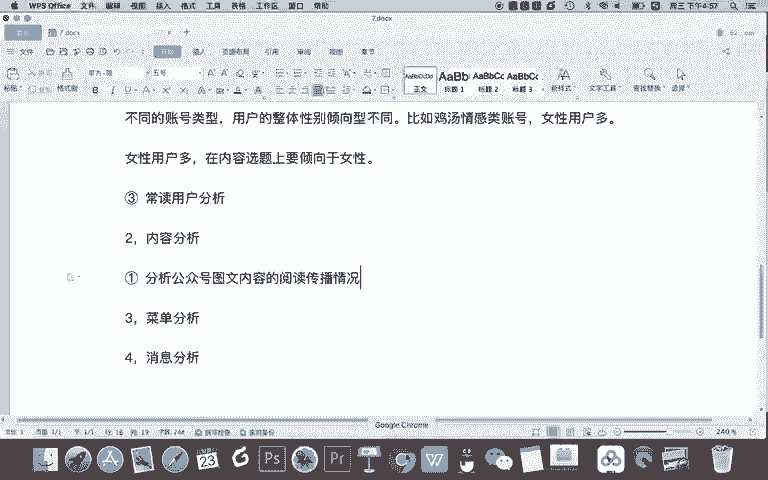

内容分析这里能提供两个维度的一个分析。第一是所有的群发内容，他会去看到你的这个数据情况。还有一个是针对单篇文章的一个阅读的传播波情况。我们一般先整体在局部啊。

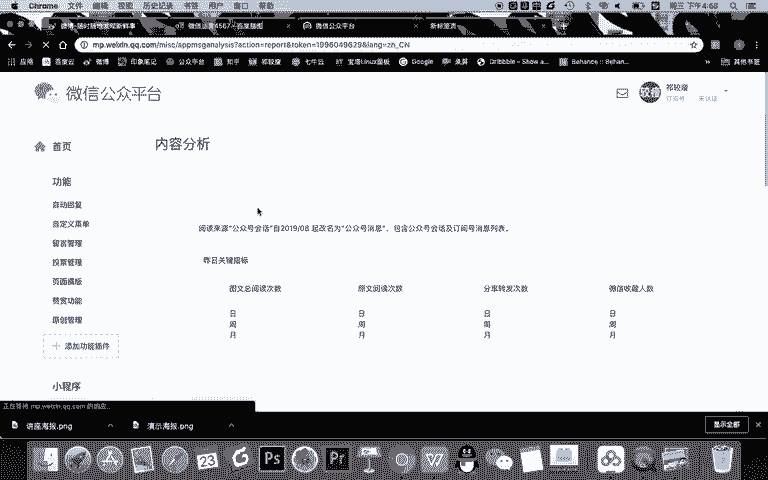

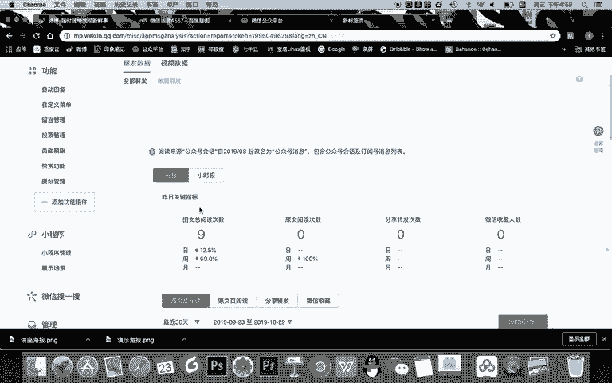

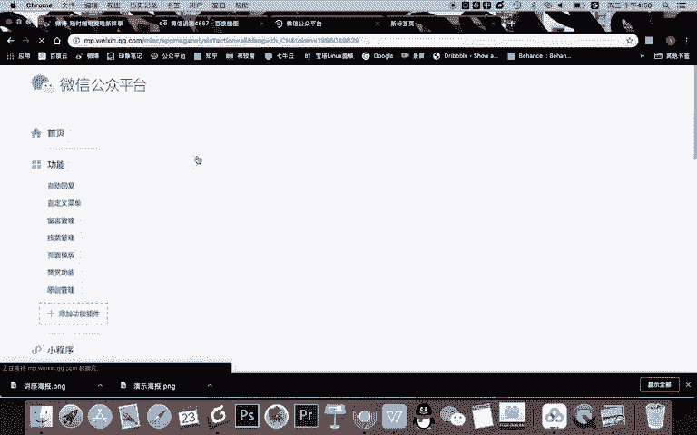

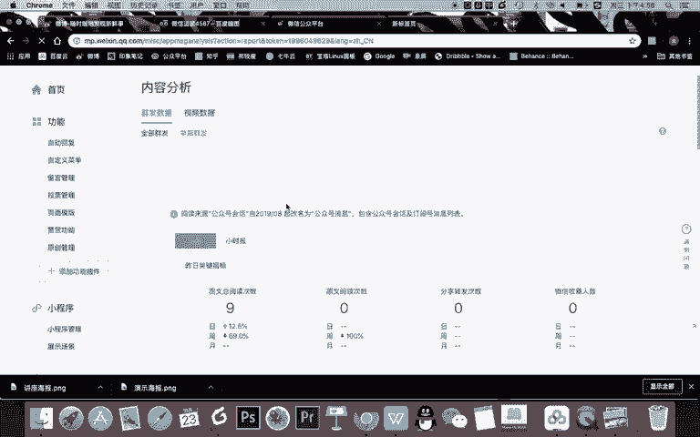

比如在你的群发内容里，一般会看到阅读量图文阅读的总阅读量的一个次数。还有呢就是原文阅读的次数，分享转发次数和收藏次数，它的价值分别是什么啊？OK首先第一个。

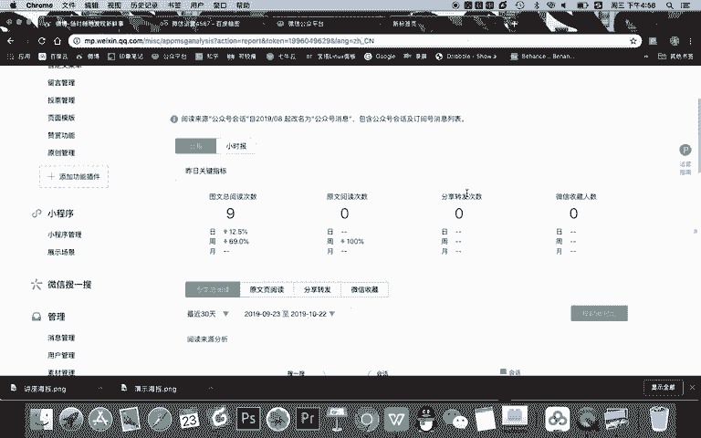

Yeah。是。啊，我把这个给他小编号去掉。

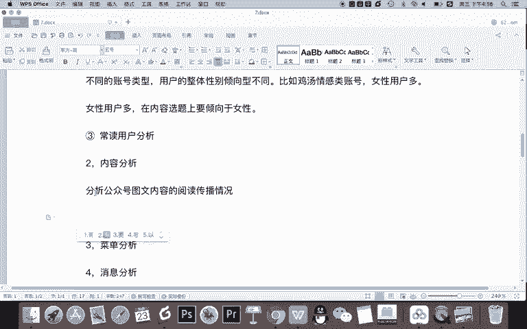

首先，图文总阅读次数的高低是什么？

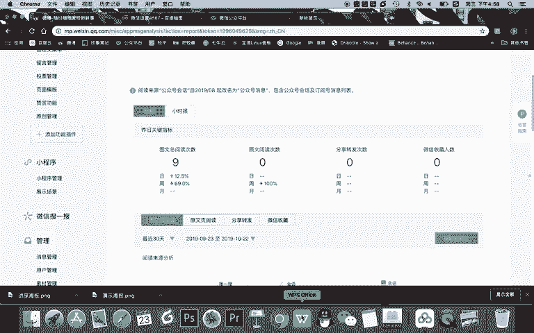

影响什么或者决定了什么。决应是决定或者说什么。表示是什么？表示。整体的。文章的。

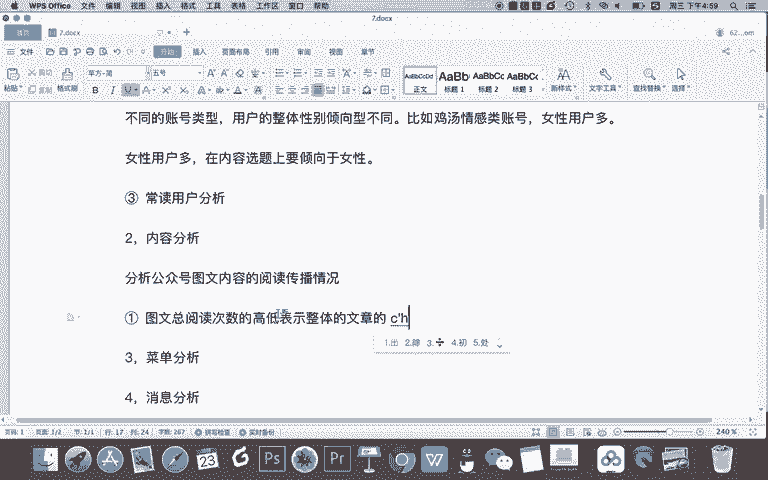

传播力度。比如如果你的图文总阅读数高啊，那你这个说明你这个公众号整体的影响力就会大一些啊，如果低啊就会小一些，这是一个整体的一个参考的基数。那它跟什么对比呢？比如说跟阅读原文和分享转发次数。

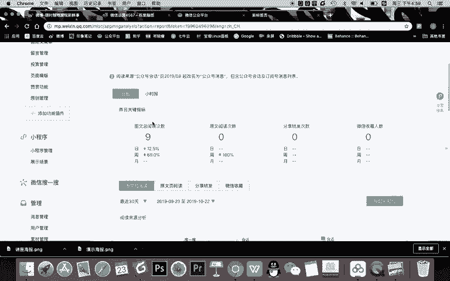

阅读原文次数啊。表达的是什么呀？其实你想假如有很多人去看了你的公众号的文章，这个数据很高，但阅队完次数很低，说明什么？代表。文章的。吸引力和什么？😡，和用户的粘性。及。😊，本次文章的。转换效果。

就如果啊举个例子，你的总阅读数很高，但阅读原文的次数很低，只能这几个情况出现一。

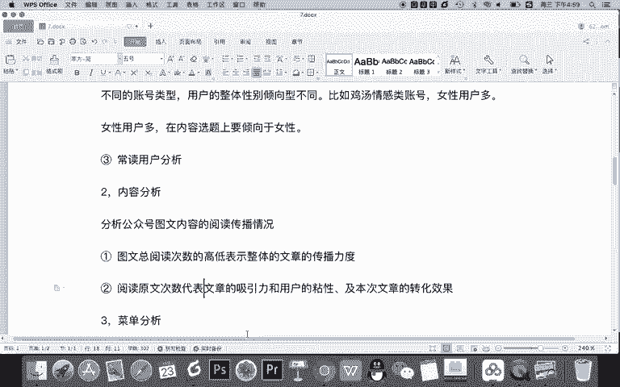

你的文章虽然很多人爱看，但是呢你的用户的这个活跃度或者用户的粘性不够强，所以他们都不点你的阅读原文，对吧？第二啊，说明你这次文章可能写的不太好，或者说你这篇文章在最后转化的时候做的不太好。

很多人都不点你的阅读原文，虽然你让他们点，所以呢文章看着没有吸引力，对吧？

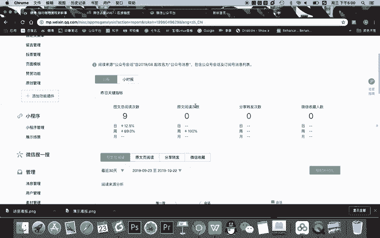

啊，这是我们的一个指标啊。如果比如说你在做一些产品推广的时候，你的整体的文章阅读的很高，但你的阅读原文啊效果很低，可能就是代表你这次产品推广的一个效果就比较差。第三点。第三个数据，分享转发次数啊。

这个非常关键。代表。用户对。文章的喜爱程度。分享转发还决定什么？还决定着。这篇文章的。

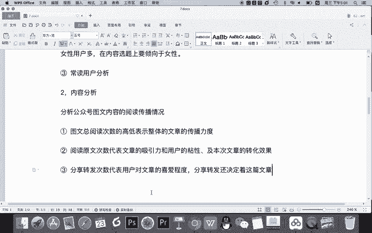

最终。阅读量。也就是你可以这样理解，如果一篇文章它的分享转发次数高，那它整体的阅读量一定高。但如果分享转发次数很低啊，那说明什么用户不喜欢。那当然如果没有分享转发，你的阅读什么呀。

总量也会低收藏次数啊代表什么？你可以这样理解啊4。

收藏数据代表。这篇文章。对用户的实用价值，他感觉到实用，感觉到有价值，他才会去收藏啊，这是整个四个数据。所以希望大家能会去看啊，不管单篇也好，还是整体也好。

你就需要看一篇文章或者整体的内容就要看这个文章啊，整体的阅读量高不高。然后呢，阅读阅文互动情况怎么样，然后分享转发怎么样，就收藏怎么样。那最后还有一个分析是针对文章的。

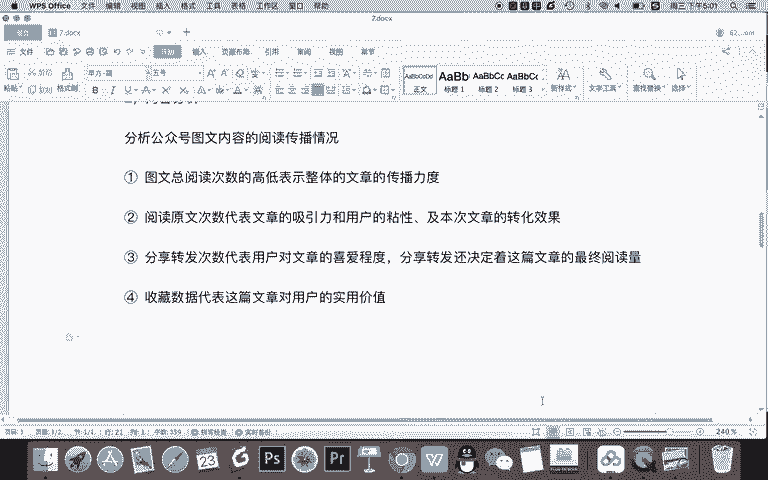

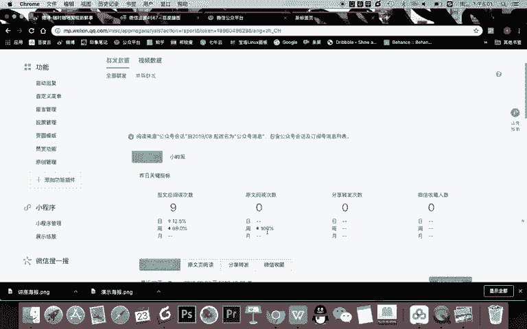

来源啊，就是一篇文章阅读来源分析。这里呢就看你这篇文章是来自于对话多呀，还是其他多，还是朋友圈多，还是搜一搜等等等等。你看啊一般会搜一搜，看一看有这么多的一个来源。那我需要你注意一点是啊。

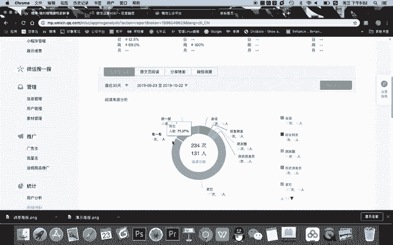

在。阅读。来源中。要多。追求。朋友圈。好，看一看。

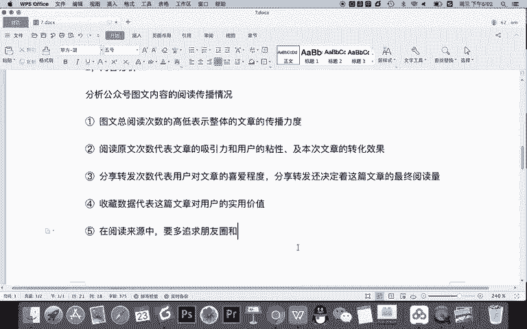

什么意思啊？就是你一篇文章最终的这个阅读量的高低，其实不是取决于你的粉丝数量啊，而是取决于你这篇文章有多少阅读量是来自于朋友圈，有多少是来自于看一看。

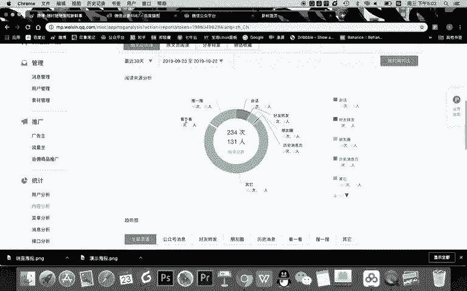

啊，为什么这么说？因为你记得啊张小龙曾经说一句话，这个我前面也给大家讲过一篇文章，80%的阅读量来自于朋友圈。那现在呢除了有朋友圈之外，还有看一看。所以呢你最好让一篇文章，用户都爱给你点什么呀？

哎好看或再看，然后呢好最好用户都帮你去传播，这样你的文章一次传播能带来一定量的一个阅读量，那你整体的阅读量才会高。但如果你的公众号的这个阅读量主要来自于公众号绘画，那可能你要有一个危机感了。

就是啊你的文章没有传播力，用户看完了都走了。但是呢如果你的文章阅读量都来自于朋友圈和看一看，说明你这文章是真的精彩，用户不仅爱看还爱分享。

我们再去做传播的时候也要多追求我们的文章阅读量来自于朋友圈和看一看O这是关于我们文章来源的一个分析啊。下面呢这个是趣事是每一天的一个传播情况啊，这个呢就不再多讲了。你需要去每天去监控它，看看你的。

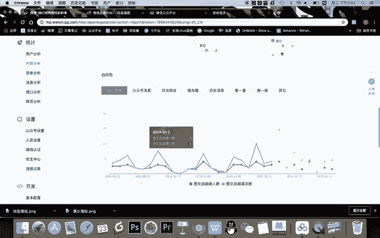

文章主要是从哪里来的？这个阅读。OK除了分享以下这几个数据之外啊，你还可以分享你的视频的数据。当然你得首先有视频，对吧？你如果你看这这个功能也是后来工号加的，说明大家现在在做自媒体或运营的过程中。

这个视频还是比较重要的。如果你更新的发布的有视频，你可以看到这个视频的一个数据。O当然还有啊去看单个视频以及群发里面单篇文章的一个分析。单篇文章我们分析的就是这篇文章，它的一个整体的什么呀？

阅读量转发量收藏数量，还有它的文章的阅读来源啊。我们刚刚分析整体需要注意的那些点，在单篇文章上同样使用O关于我们的内容分析就到这里啊，接下来给大家讲讲什么是菜单啊，菜单指什么？

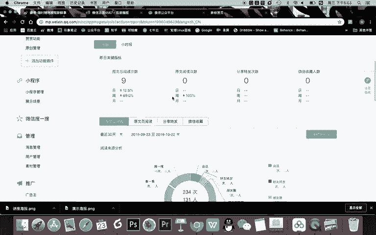

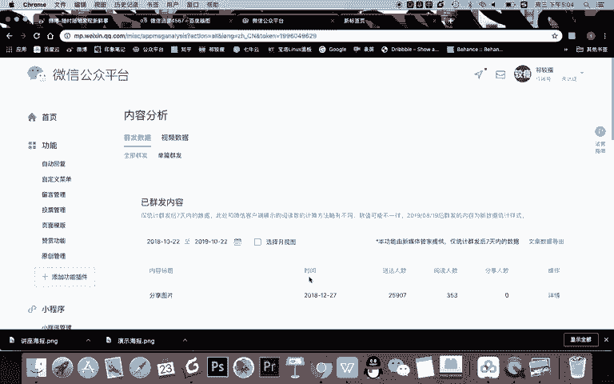

指。自定义菜单啊。数据或者说什么呀。被。点击。

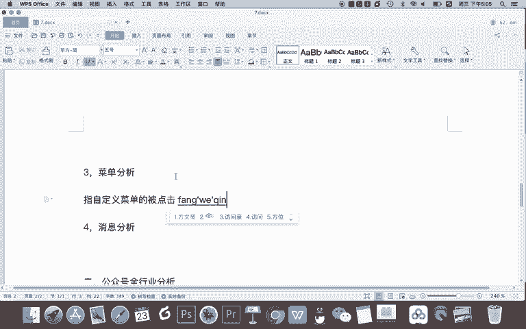

访问情况。O大家看一下我的最定菜单的一个内容啊，我的公众号其实呢就很久不怎么运营了。但是呢我希望他有一点点的数据能给大家提供一个参考。大家看到啊，首先我的菜单昨天被点击了6次啊，然后呢4个人点击6次。

人均1。5次，然后菜单点击需要大家注意的是你的菜单的点击来源。

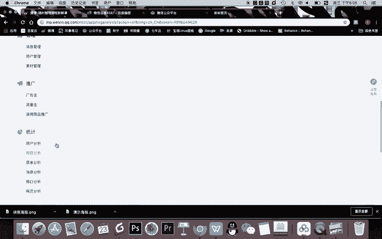

也就是说你的所有的点击量是来自于哪个菜单。比如大家看我现在的最低菜单只有一级菜单啊，比如说我进行到了两个一级菜单，一个是点击直接去学文案。第二个呢是一点击直接看到更多的文章，它并没有一个什么二级菜单。

比如说又又新增了5个其他的菜单。那自定菜单的点击代表什么啊？需要第一点一。

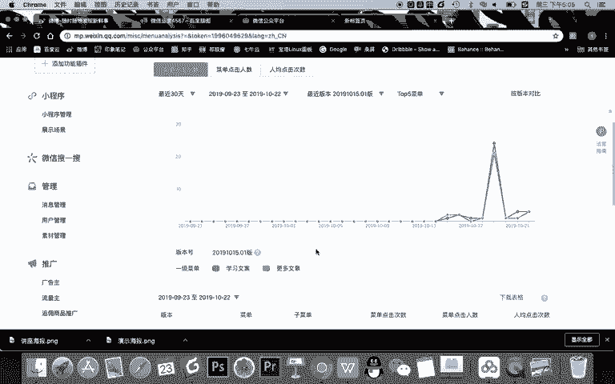

自定义菜单点击量的高低。代表着。用户。对你公众号的。什么呀？喜爱情况。

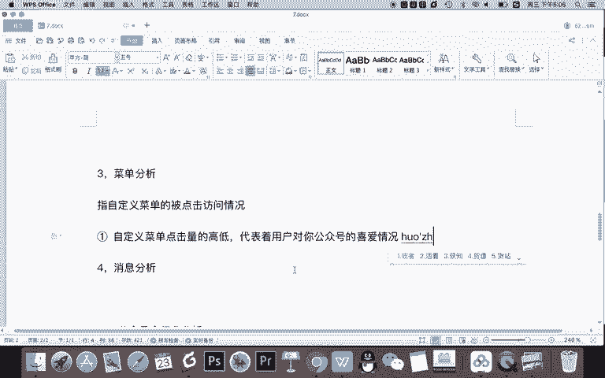

或者什么粘性。就是一般什么时候用户才会点你的自金菜单，最常见的一个方式，就是当他刚关注的时候，他会点你的自金菜单，看看你有什么。所以呢如果你的自金菜单设置的内容比较好，那么用户很喜欢的话，他点击会多。

对吧？还有一种情况就是当用户看到你的文章的时候，如果你的文章提醒他在自定菜单里去点击获取什么啊，当然这一部分比较少啊，那他也会去点击你的菜单。所以我们主要的菜单互动的基本的都是什么新关注用户。

所以你要尽量做一些对新关注用户有价值的一些服务性的内容，或者说一些好玩的有趣的内容，然后呢设置在自金菜单里，让用户多去点击，多去互动，增加他对你的喜爱和粘性，这样啊，他是你的一个铁粉。

这样他更有可能看你的文章，因为你给他提供的有价值嘛啊，所以我建议大家可以啊按照我以往的经验，我建议大家可以把一些游戏资料啊甚至。

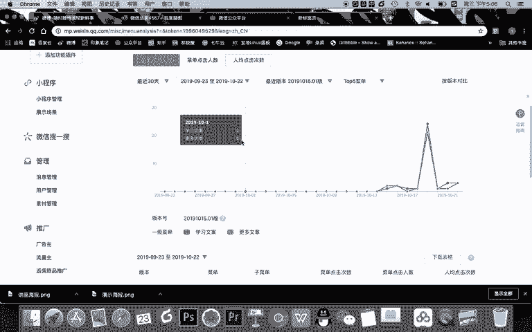

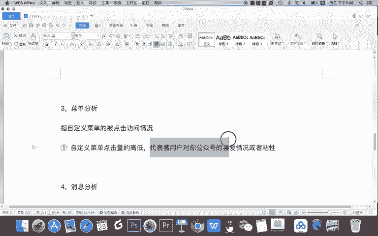

是互动的一些方式放在你的资金菜单里，让用户来了之后能玩一玩游戏，获取一些免费的干货资料、福利等。然后这样的菜单点击量会更高一点啊，提高用户给你的粘性，提高你对用户的一个价值。

O大家看这里呢是我的资金菜单的一个新老版本啊，只有学习文案和更多文章，在之前的版本呢有三个菜单，三个一级菜单，学习文案更多文章和教学演示。在教学演示这里呢，我其实还有一些做了一些内容。

这个是我主要讲课去使用的。所以你看到学习文案和更多文章的访问量会更高一点，对吧？那这个里面呢其实就是为了看啊，它没有任何的价值，只是为了告诉大家怎么设置资金菜单，所以它点击量会低。

OK这是我们关于自定义菜单的一个指标。希望大家把菜单设置成你公司的啊，这给大家写一下吧。

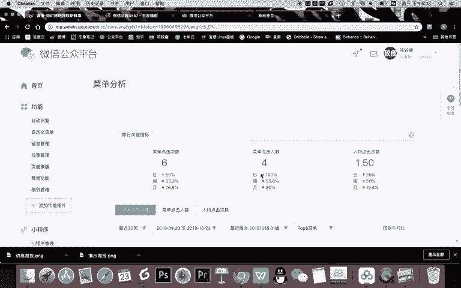

2、可以把。自定义菜单设置成。公司的微网站。为用户。提供价值，让用户在这里能够获取更种一个价值的信息。这样你的菜单才真正发挥了作用。O消息分析比较简单，我们给大家梳理一下什么是消息，就是指。

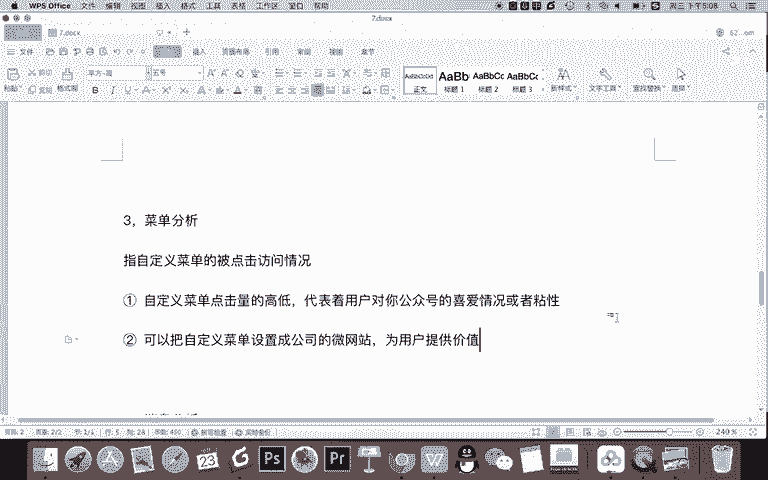

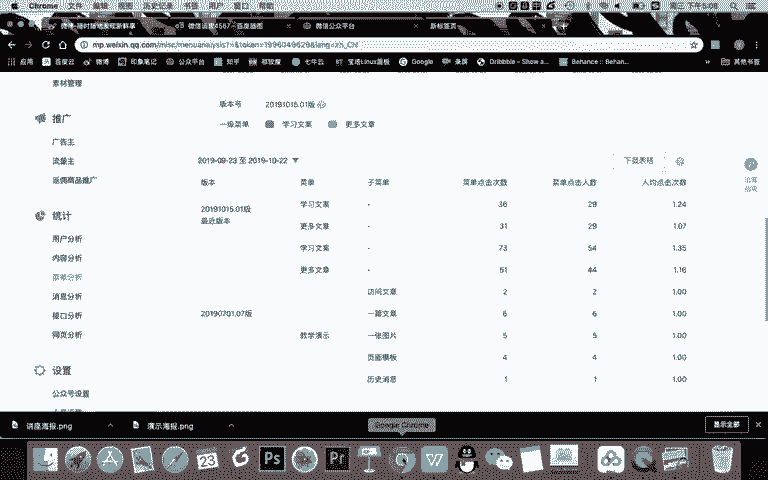

指用户。给你的公众号。发送的。消息的数据统计。

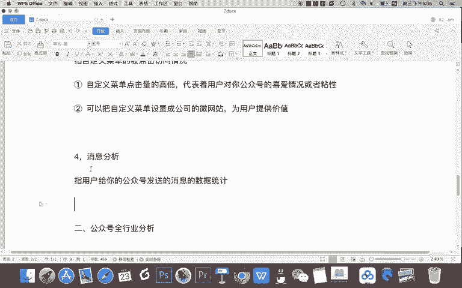

比如说你每天你的公众号什么也不动啊，有成千上万人给你发消息啊，消息发送的数量啊，说明你的公众号运营的是比较好的啊。OK消息分析呢？你看它一般是按照日报去统计的。昨日的一个消息发送呢。

人数是两个消息发了3个人均1。5啊，然后呢看到他每天的一个数据的一个增长情况，甚至你看有些人给你发消息的一个数量情况啊，其实这个代表什么？非常关键啊，记得。

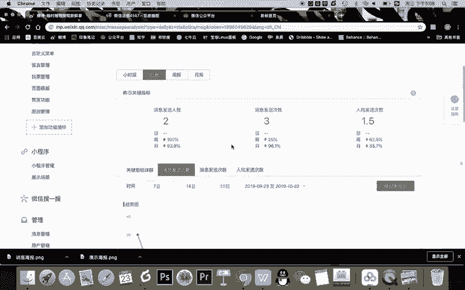

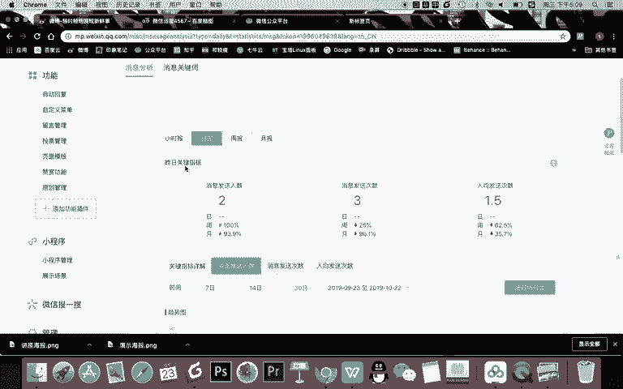

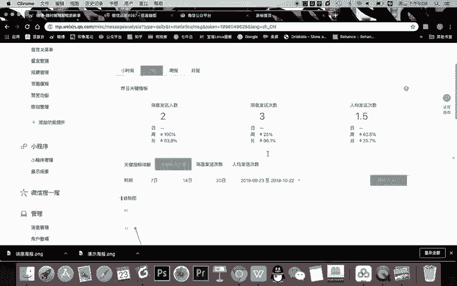

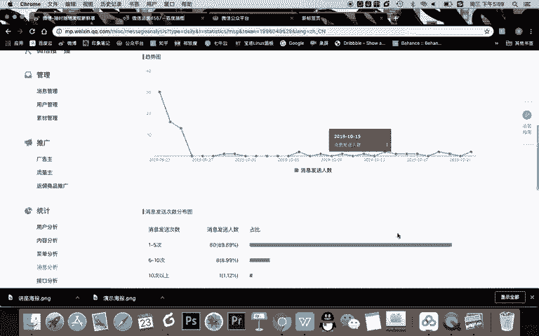

消息数量多。代表用户互动频率高。跟用户的。粘性强。我们当然追求高粘性的一个用户，什么呀数据指标。所以我们希望我们后台的数据很多。因为用户给我们发的信息足够多的话，说明他需要我们啊我们能给他提供价值。

所以我们追求这个数据，那可以通过哪些方式追求这个数字呢？比如啊第一。

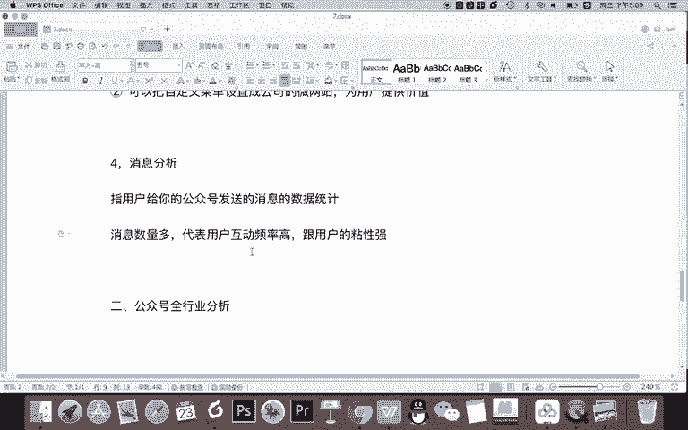

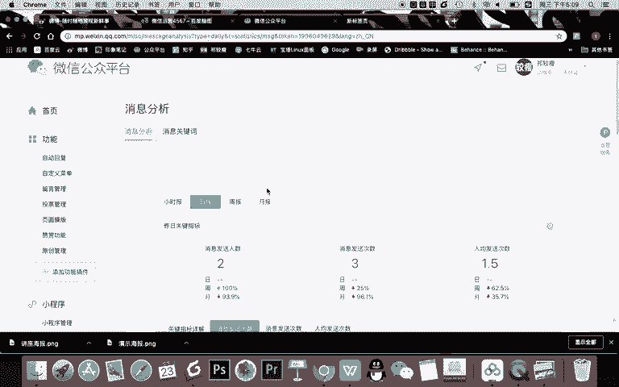

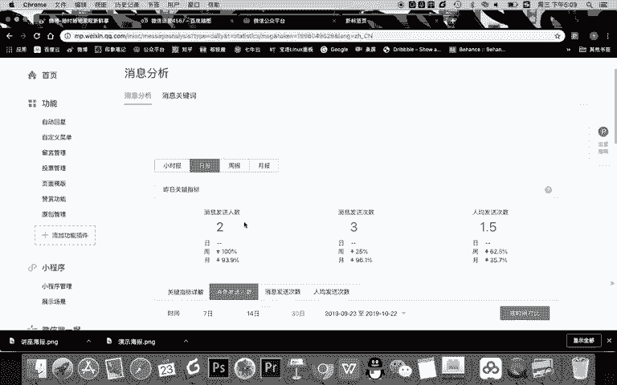

文家写一下，可以通过什么呀，被关注回复设置。关键词。自定义菜单、文章引导等。方式让用户给你。发消息什么意思啊？比如举一例子，被关注回复里，你设置回复一能收到什么，回复二能收到什么，让用户给你发消息。

或者有问题可以让你他直接问用户看到之后直接给你发消息。所以呢这个数据会高。还有你通过设置一些关键词，比如说设置讲座回复讲座，能够参与我们的讲座，通过文章去传播，也能提高互动。

还有呢把一些关键词设置到资金菜单里。对吧比如说资金菜单，他一回某个内容，你让他给你发消息，获取更多的内容。这个时候到用户就会发消息。当然文章中也可以让用户给你发消息，对吧？通过关键词啊。

或者直接去给你互动提问的方式，我们能收到更多的消息，消息更多用户代表是活的啊，那根据粘性更强。那对你的公众上公众号来说，活跃用户的比例就会更高。那价值会更大。包括还有消息关键词的一个分析，指的是你的。

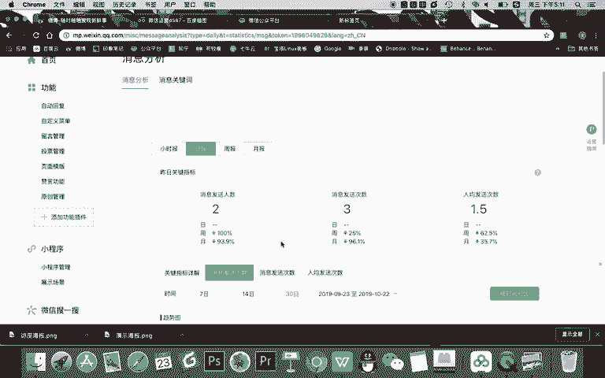

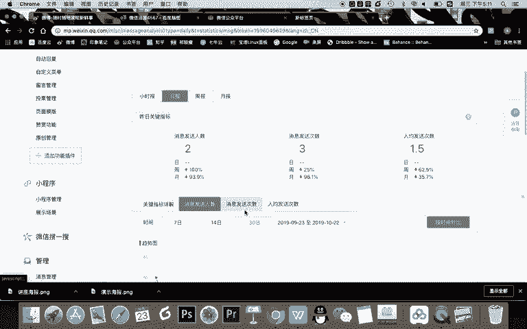

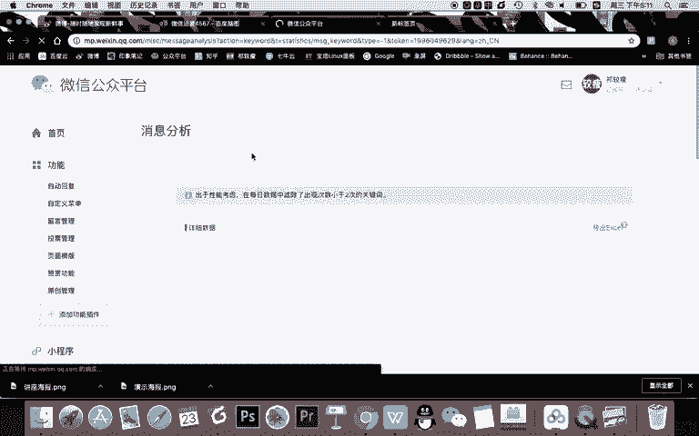

公众号里都设置了哪些关键词，比如说你看我设置有12345，还有游戏社群等等这些关键词。那么这些关键词的一个互动数据啊，比如回复的次数都会显示在这里，以此为指标可以统计你这个关键词的受用户喜爱的程度。

或者这个关键词的推广的成功的啊一个数据的指标。比如如果有大量的用户都给你回复6，可能在其他的平台，你去推广六这个关键词的时候，波及的用户更多，用户更喜欢，所以回复的就更多了。

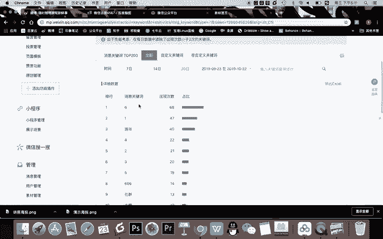

对吧ok这是一个关键词消息的一个数据分析。希望大家能对关键词消息以及整体的消息有一个清晰的概念，让用户啊记得追求一点，让用户尽可能多的跟你互动。你尽可能多的回复他，给他提供更多的一个价值。

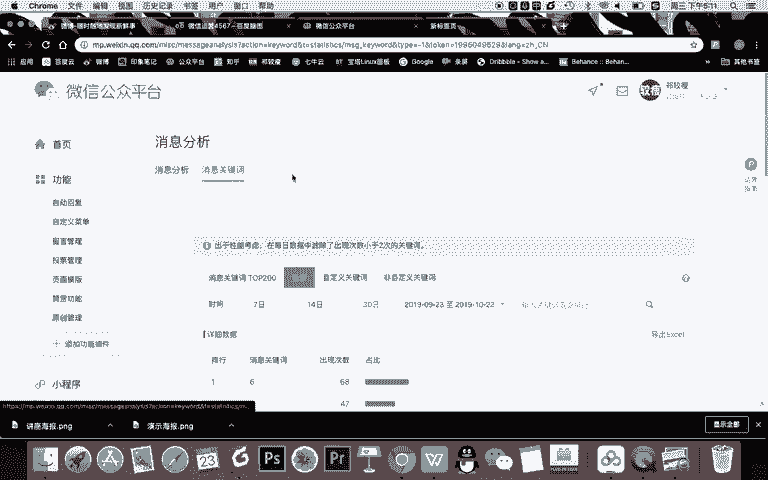

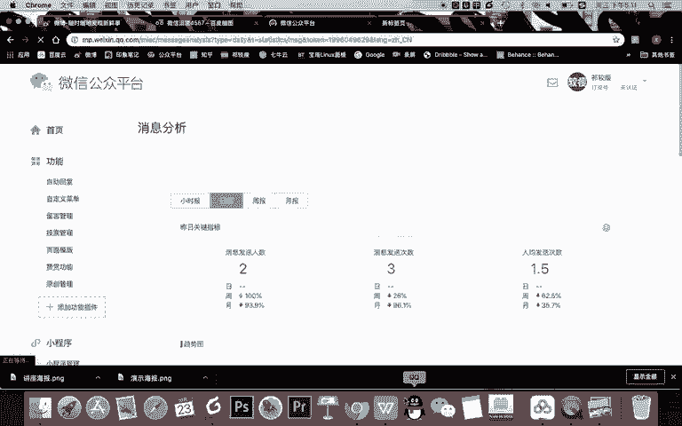

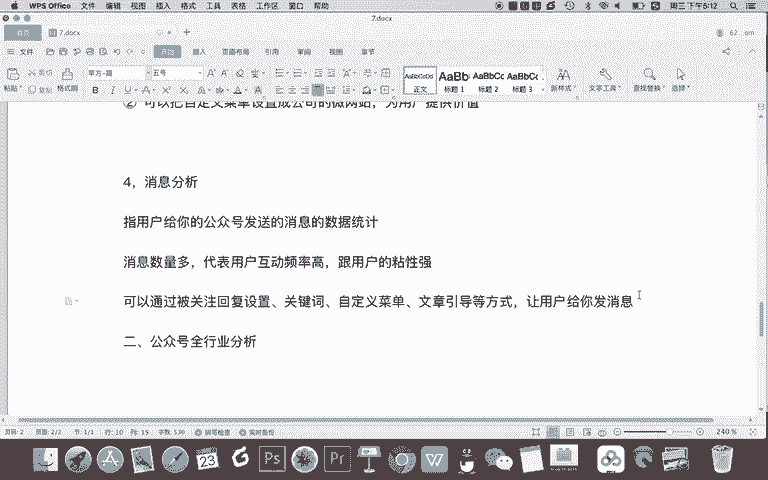

OK那以上就是我们公众号数据分析里面公众号运营的一个数据指标。其中主要是我们的用户的一个情况的分析，还有文章内容的分析，还有自定菜单以及用户给你发消息的分析。以上四个内容的分析呢。

对我们运营公众号非常的有价值。那我们关于公众号运营的分析就到这里。下节课我们将啊站得更远，站在全行业来看看公众号的一个分析。OK我们本节课就到。

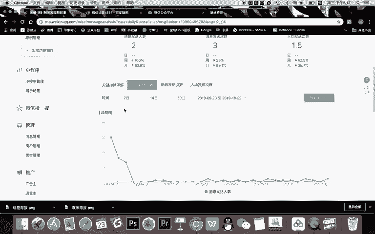

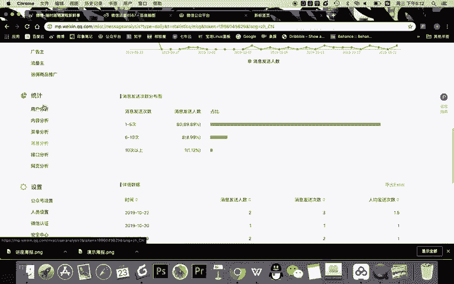

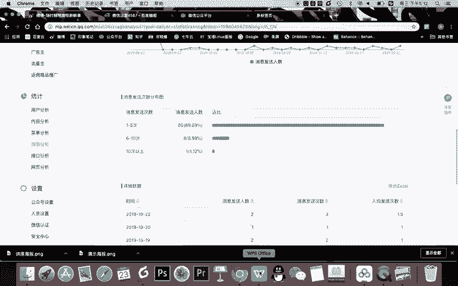

