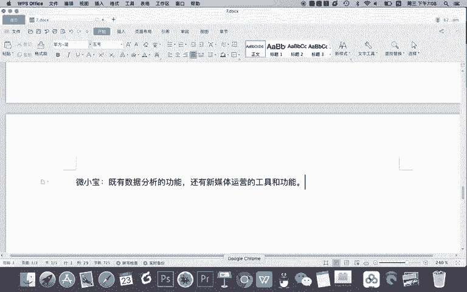
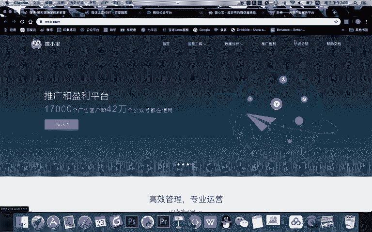
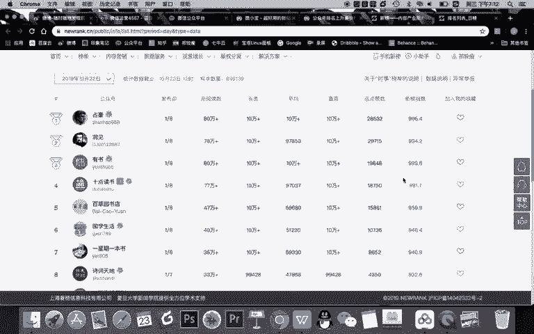

# 微信公众号运营视频全套 手撕运营 拳拳到肉 - P55：4.02-公众号全行业分析~1 - 达妹_达内教育 - BV1UvvvebEdT

同学们好，欢迎大家学习我们公众号数据分析的第二节课的内容。全行业公众号的一个数据分析啊，什么是全行业的数据分析呢？我相信大家可以从这个角度理解啊，就是我们除了要分析自己的公众号。

我们还要分析整个公众号行业的一些全行业啊，全网的一些数据。比如说想知道是吧公众号领域。有哪些？大号对不对？你说哎我天天运营自己的，可是我运营的怎么样？我自己这100万粉丝到底在这个生态里面。

它属于排什么排名是吧？那我想知道公众号领域啊，比如说第一大号是谁，谁排名第一，谁是前十名，甚至哎我想知道这个问题，比如。我是做汽车领域的。我想知道汽车领域什么前。10个大号是谁？

对吧这个数据呢都是不能从自己的公众号运营里看到的。包括我还想知道这样的一个问题啊，比如说我的竞争对手，他的公众号运营的。怎么样？对吧这叫什么？竞品。分析。对吧哎我天天运营我的公众号。

我这每天阅读量3000，粉丝每天增长500，老板不满意。那到底你说我这做的好不好呢？怎么办？其实你做的好不好，你自己心里得有数，也就是你要去通过分析别人这个行业内别人做的怎么样。

然后来看看你自己做的怎么样。比如说你已经是行业第一了，你你就可以通过数据分析，向你老板证明说你做的不错。当然你也可以用一些其他的方式啊去证明这个内容。但是我们其实如果有一个数据分析的工具的话。

我们去分析的更好。当然除此以外，你还可以你还也许还想知道这样一些内容。比如。哪些。公众号这周。什么呀增长的最快。因为有很多人说啊，公众号现在进入了一个呃缓慢增长，甚至是公众号的流量在消退啊。

现在做公众号越来越难了，那是不是就做不好了呢？也许你还是想做公众号，对吧？那你一就想现在做公众号有什么方法，你想知道这样的一些技巧，那怎么办？你就可以像现在做的最好的这些公众号去学习。

然后看看他们用了哪些方法，哪些技巧，你也可以去学习一下，然后呢去把你的公众号在这个时代也能或者在这个阶段也能做的更好。O除此之外呢，我们可能还有一些问题，比如说我想。分析。具体。某一个公众号的运营情况。

对不对？比如说我假如啊举一个我认为不错的一个公众号叫视觉制。而视觉制整体的阅读量。怎么样？然后呢，粉丝有多少？然后呢，什么时候发文章的？统计啊，什么时候还发文章，甚至呢每篇。文章的阅读量和点赞量。

对吧这些数据你都想知道，但假如没有一个数据分析的工具，或者说你不知道如何进行数据分析的话，你只能一篇一篇。比如看阅读量啊，你只能一篇一篇去到新式项它的公众号里。

然后呢查看它每一篇文章的一个阅读量去进行人工的统计，那效率非常低了。所以呢我们急需啊对公众号进行分析，并且急需知道某一个工具，能对这个公众号进行更好的一个分析。所以呢我们在这里给大家推荐一个。啊。

我把这个改成第二个小标题吧。比如这是什么？关于。公众号的数据问题。然后呢，我把这个就直接12345删掉了，因为我要直接建第二个小问题啊。第二个问题就是数据分析工具，而且是。公众号的数据分析工具。

在这里呢我给大家推荐两个工具。第一个是。新宝。第二个是。微小宝。OK新榜呢是一个什么数据分析工具，淡记的它不仅是一个数据。分析。工具还是内容创作及什么呀商业化平台。比如我们一起来看一下新榜的网站啊。

首先大家知道新榜为什么叫新榜吗？因为其实新榜在创业的最初就是做什么呀？新媒体排行榜的啊，所以他就是专门做数据分析的，只是现在它做大了，你看它的定位是内容产业的服务平台，所以他什么都做有做广告。

还分享行业的一些数据报告，还分享行业的最新资讯，还有公众号的一些分析，还有一些文章啊等等，甚至你看你还有一个在线交易的平台，可以在这儿广告主打广告，然后自媒体人能赚钱，对吧？

当然我们今天讲的就是这个榜单。大家可以看到啊，除了微信新榜，还有微博等等，其他的平台的榜单。所以呢如果你运营的有其他的平台，也可以在新榜进行数据的查看，这是第一个啊知道新榜是一个数据分析的榜单平台。

同时呢也是一个内容商业化的服务平台。那接下来我们看微小宝微小宝呢，其实是什么？既有。数据分析的。功能。还能还有什么呀？还有什么呀？新媒体。运营的工具和功能。比如哎我们看一下微小宝。

其实你只要百度搜索微小宝就去了它的官网能看到啊。比如在运营工具，这里，你看它里有它这里有互动宝，还有推吐营销工具啊，还有PC的一些客户端，下这个客户端呢能更好的运营你的这个什么啊，比如说运营你的微信。

甚至还有在线的什么手机版本，然后呢去查看数据等等等等，浏览器插件在线编辑器。所以呢微小宝在这运营工具里，你可以理解它能更好的帮助你运营你的公众号，比如编写文章。

比如给像新媒体管家一样给你的微信公众号增加一些功能。比如在手机上去排版编写，甚至查看一些行业的文章等等。所以微小宝也是一个综合性的一个平台。而且我们知道微小宝还有一个什么工具。

在我们前面的课程里，我们讲到vito这个社群运营工具，也是微小宝的OK那在这里呢，你看微小宝这里有一个数据分析的功能，在这里我们可以进行数据的分析。除此之外，微小宝也有什么呀？盈利推广盈利。

也就是广告平台，还有小说分销等等。那么在数据分析这里，我们首先看一下公众号排行榜。当然啊我建议两个平台大家综合起来来分析。在微小榜里，我们直接点数据分析，查看一下公众号排行榜。

同时呢建议大家也去到我们的什么呀，比如新榜里面也看看啊，我建议大家两个平台对比查看。比如我们在新榜里看一下微信的榜单。okK那首先呢我们知道微小宝，它有些时候啊功能不太稳定。

你看比如我们在点击这个公众号排行榜的时候，这里并没有数据。但是。

在新榜里，你看微信的日榜是有这个排名的那我首先给大家讲一下这个数据来源啊，不管是微小宝也好，还是微这个还是新榜也好，他们的数据都来源于微信的开放接口。那所以呢微微信给他开放了这个接口之后。

新榜还有这个微小宝会抓取这个数据进行一个分析，然后生成这样的一个结果。那么我要确定一点，不管在新榜也好，还是在微小宝的这里面的一个排行榜也好啊，大家注意这里面都有一个指数。比如小宝指数或者新榜指数。

新榜的新榜指数，这个指数呢只是一个数字，它不是一个确定的数字。这个数字没有任何的意义，只有高和低的之分。比如啊像新榜这里，它把新媒体的最高的指数分值定为1000。你看做的最好的这些账号呢。

基本能达到999或者995这样一个数字。那根据你的账号的整体的质量情况，比如你的阅读量，还有呢平均阅读量，还有点赞量，甚至你的发布文章的数量等等。根据你的综合的数据情况，它给你评一个分。

这个分呢这个数字再强调一遍，没有任何的意义，只有高低之分。所以你能看到分高的排上面分低的排下面，然后呢就出现了一个榜单，比如这是每日榜单，然后还有每周的榜单，看到10点读书，是不是每周排名挺靠前的。

还有月度的。

