# 微信公众号运营视频全套 手撕运营 拳拳到肉 - P56：4.02-公众号全行业分析~2 - 达妹_达内教育 - BV1UvvvebEdT

一些榜单在月度榜单里呢，其实你还可以按什么查找，按照领域查找。所以啊我给大家写一下公众号，首先能分析什么。

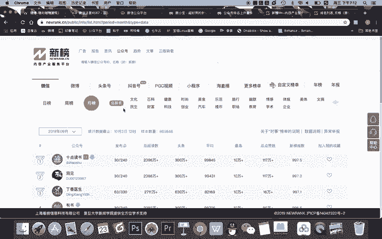

3。整体公众号。分析了什么？数据分析的。结果。或者我直接写吧，这是新榜里面。首先第一。能够查看什么呀，公众号。榜单。对吧在新榜这里能够查看公众号榜单。但其实在微小宝这里。

不仅能查看公众号的排行榜榜单以及各个领域的榜单，还能查看什么呀？排名上升最快的榜单。所以在这里我把什么新榜和。

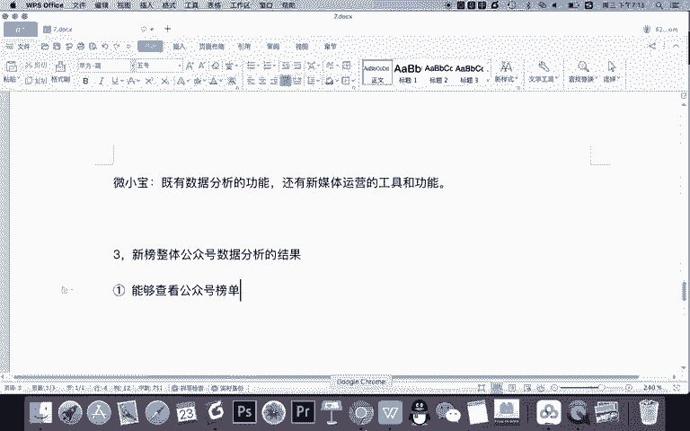

公众号就合起来写吧，或者就不写记得啊。这里呢你要强调新宝加。微小宝。数据分析。所以你除了能看榜单之外，在微小宝还能看什么呀？增长。最快的账号。排行榜。

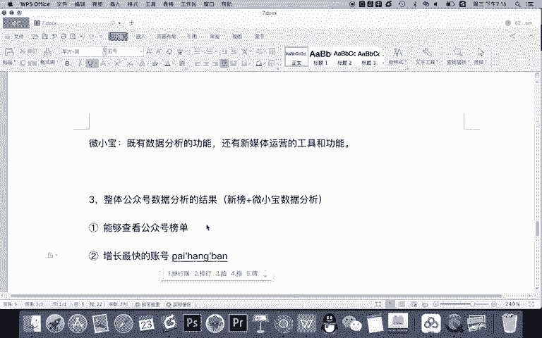

比如说我刚刚举的那个例子，你想知道现在哪些账号做的还不错，怎么办？你就可以看排名上升最快的些榜呢，看看他们为什么做的好，学习他们的一些优点，然后也让我们的公众号在这样一个不那么容易做账号的时代呀。

然后也能做好，对吧？那么微小宝这里还有一个数据研究院，这里是什么意思呢？啊，我给大家写一下。

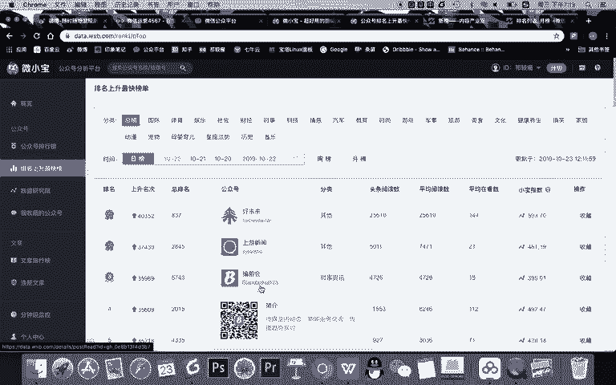

韦小宝的。数据研究院啊指的是。Yeah。分析的是全平台的平均数据。

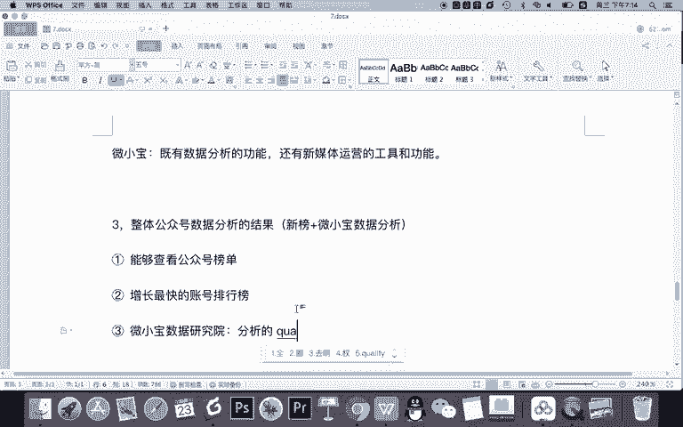

大家看啊，在这里，比如说你看他报告采集了8万个公众号得出的一个数据的平均情况，什么意思？约等于你新注册一个公众号，从零开始做的话，如果你能做到这个数据约等于达到了一个平均的水平。比如粉丝达到3万多。

每天平均新增20多个，然后呢啊净增长30个左右。如果你每天能达到这个水平，你记得你是能达到行业的平均水平的这是目前行业里一个平均水平。OK在数据研究院里同样支持按照各个类型领域去查看。

同时大家看啊还能查看你什么呀，收藏的公众号进行对比分析。所以第四个功能叫什么？

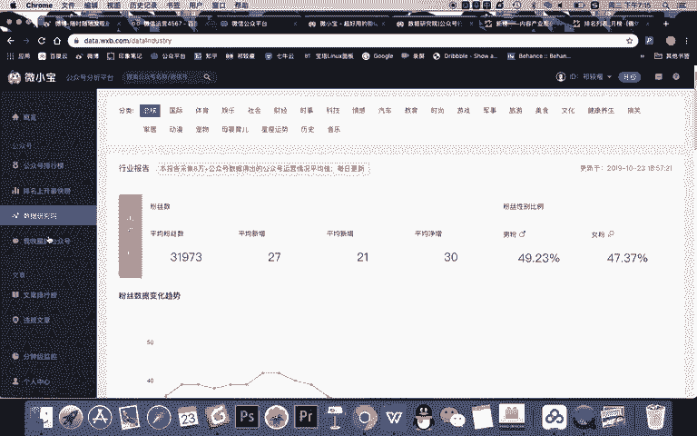

第四。😊，能够。对行业案例公众号。几。😊，什么呀竞品。公众号进行数据分析或者叫对比分析啊。比如你说我们公司的公众号做的还不错，我也想看看竞争对手的怎么样，然后你就可以添加两个公众号进行对比的一个分析。

这是能够监控的，同时还能看到什么啊，在微小宝这里啊，微小宝的功能会多一点。但新榜这里呢主要是什么榜单啊以及的。然后在微小宝这里呢还能看到热门文章排行榜。

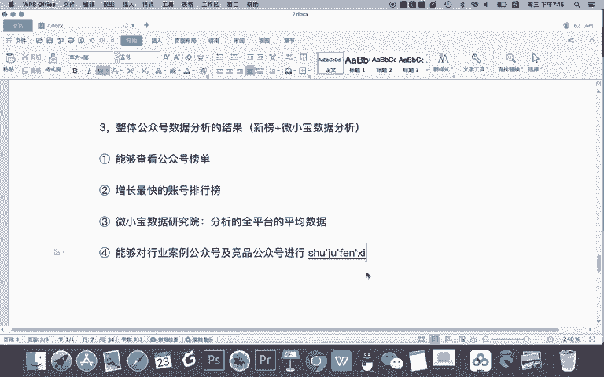

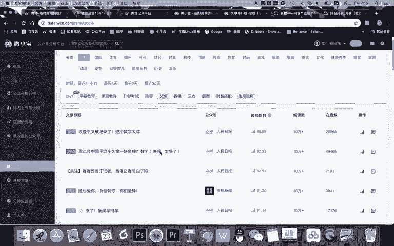

所以希望大家记得对比分析啊。5。能。分析或查看。当天的热门。文章。

这是整体的一个分析。比如说今天有哪些文章很火，阅读量很高，那么排行榜就在这里。这是你看最近24小时的一些热点啊，大家可以看到这些热点，你看最多的是谁呀？人民日报央视新闻。

这看国家级的这个媒体还是很厉害的对吧？然后呢，你还可以看最近3天7天平均30天的，建议大家可以查看一些最近7天的一个热门文章。因为如果7天都很热的话，说明这个文章不仅是一个热点。

而有可能它的覆盖范围很广。所以呢你可以看看这篇文章它写的是什么。从热门文章里去学习它的什么呀。标题写作选题，还有内容创作的技巧。O同样的，记得这个传播指数只是一个数字，百分之百是满分。

写的接近百分之接近100的话会比较什么呀，证明比较好。然后阅读量和再看数呢是一个预估的一个数据啊，你需要知道，同时还能看到什么。

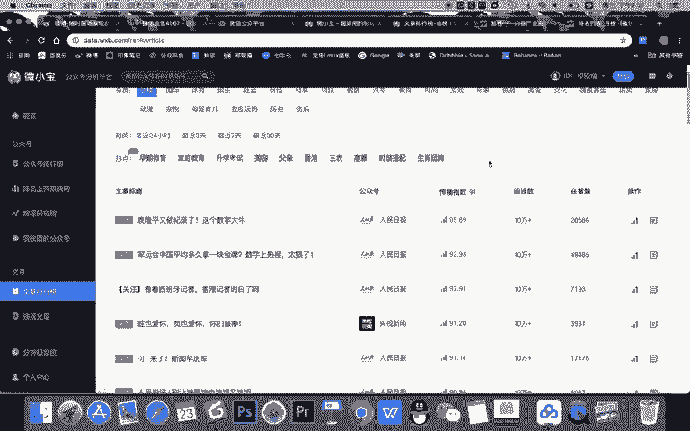

微小宝啊，这个给大家写一下，因为对于新媒体人来说，我认为比较重要啊，能够。

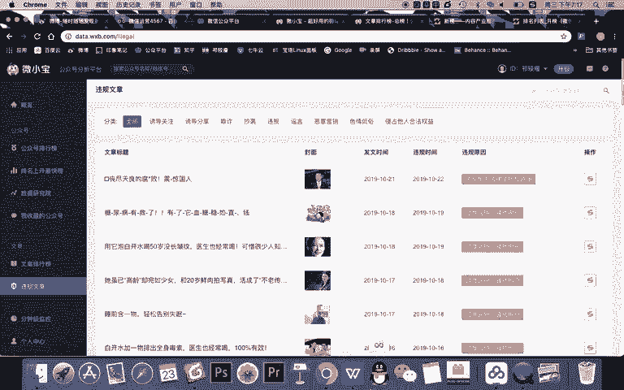

查看违规文章，对自身创作什么呀？什么呀起到。警示。和规范作用。

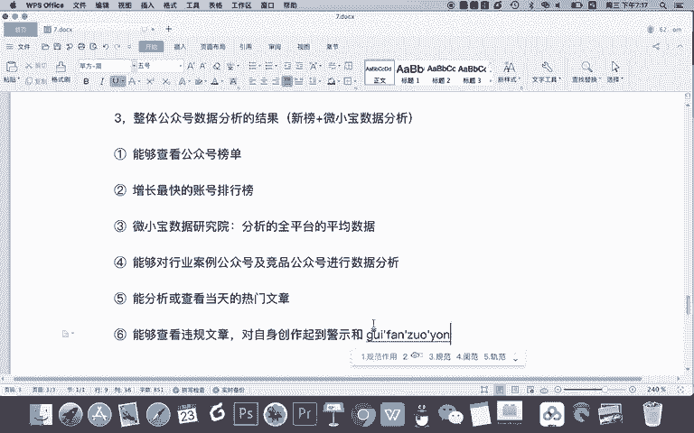

有一些自媒体人在创作文章的时候，有些时候为了获得高的一个阅读量，有些时候会写一些什么呀？三俗的一些内容。比如你看涉及低俗性暗示的一些内容。太三俗的话，你记得这样的文章是会被干掉的，也就是会被禁封的。

你可以经常看一下这里面禁封的一些文章的内容，不管是标题还是内容的选题。他们在过度营销骚扰用户和涉及低俗色情方面都是一些负面的案例啊。你看一看了解一下之后，你以后写文章就引以为戒。

OK微小宝呢同时支持分中级的一个监测啊，但当然我这里去没有建立这个分中级的监测，而且我想建立还需要去完善自己的信息。所以呢如果你对某个账号或者某一个内容，想去监控的话。

可以使用微小宝进行这样的一个数据监测。O这是刚刚给大家讲的微小宝这样的一些功能，但其实呢在新榜里啊，它也有一些功能，但是比较少一些。比如啊我们只能看到一个榜单，对吧？

我们只能看到各个领域的一些周榜月榜的一些榜单，这是新榜的榜单功能。微小宝呢功能会强就更丰富一点。但除此之外。

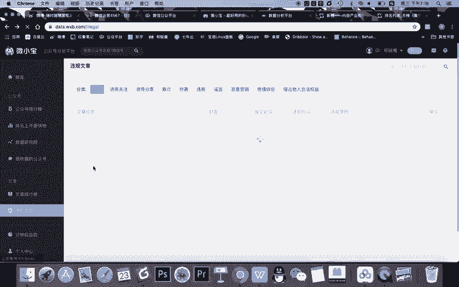

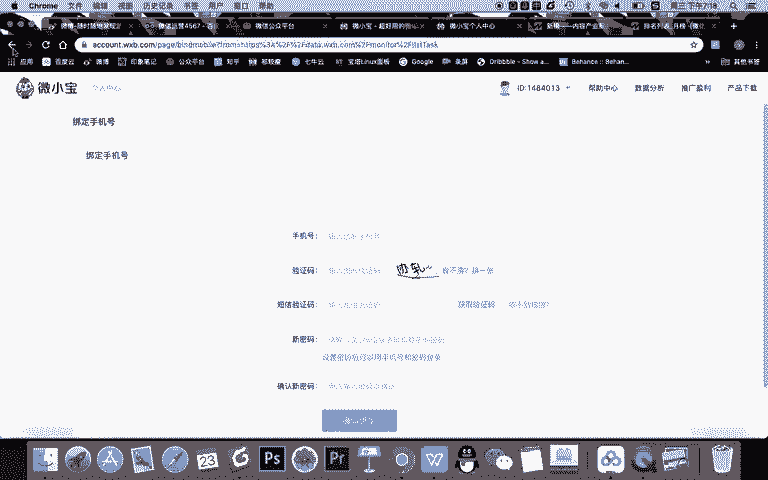

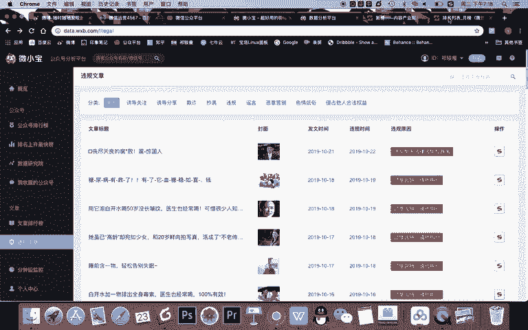

作为啊新版，还有一个功能就是可以啊。第七个功能或者说。单独拎出来而7的可以对某一。公众号进行。

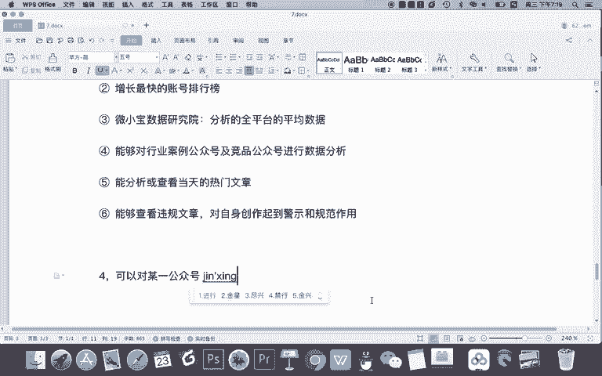

详细的数据分析。比如我们可以看啊，在新榜里，如果你对某个账号感兴趣，比如我看一下啊啊，我们就在。总榜里找吧好吧，比如说我们就总排行。十0点读书这个账号如果你感兴趣，我们分析一下，点击十0点读书啊。

就能去到十0点读书的一个详细的信息页面。比如你可以看到它的什么基本信息认证信息简介啊，然后你可以看到它属于的类型，还有它新榜会把它在全平台的一个账号都归纳一下。比如它还在微博平台，还有头条平台也有账号。

然后呢，在十点读书的这个详细的信息里面，你可以看到它的新榜的指数变化，可以看到啊十点读书整体都是偏稳定的，一般都在999哈或者995啊这种标准之上，说明什么十0点读书运营的比较稳定，运营的比较稳定。

然后呢，它的整个的内容创作的。然后呢，他的账号运营的也比较好是吧？你看都是分数比较高。接近1000接近1000的话就表明他的账号是属于整个新媒体的，或者说整个公众号平台最顶级的一个水平。

OK你还可以看到啊，它的整个的一个排名在10月22号是排名第四的，最高呢998是吧，第一名是吧，最最高的首候第一名，这是它的一个指数变化。但记得指数是一个综合的一个分值。除此之外啊，新榜还支持这个账号。

它的一些基本数据的统计。比如发布次数啊，发了几次，依次发布几篇文章。我看到十0点都是一次发8篇。10万加的文章有多少篇，七篇最高的阅读量。都是啊10万加对吧？总共的一一个阅读量呢，你看头条的阅读量。

点赞量是吧？平均的一个数量都是在这里有参考的，而且呢。在下面呢会对他每一天的什么呀一个排名情况进行统计，甚至还有发布数量。你可以看到啊，像10点读书在公众号内容发布的一个特点上呈现出了一个很稳定的特点。

就是它每天基本都发布8篇文章，也就是一次推送都推一8篇，因为它是超级大号嘛，是吧？他也不会去说每推一篇文章，它跟其他一些大号会有区别。然后他的阅读量情况呢也是比较稳定的对吧？

基本都是达到1个80万六七十万的一个左右。头条的阅读量呢。对吧就会高一点。是吧比如说不仅是10万加啊，平均的阅读量，还有最高，还有点赞数啊，点赞数我个人认为比阅读量参考价值更大，特别是对这样的账号。

因为从阅读量角度来说，他们的阅读量都挺高的对吧？然后呢，订单点赞不一样，那看点赞有什么作用的，来看这里。比如说我建议大家通过对优秀的行业公众号的一个分析，通过分析它的点赞量来向这篇文。

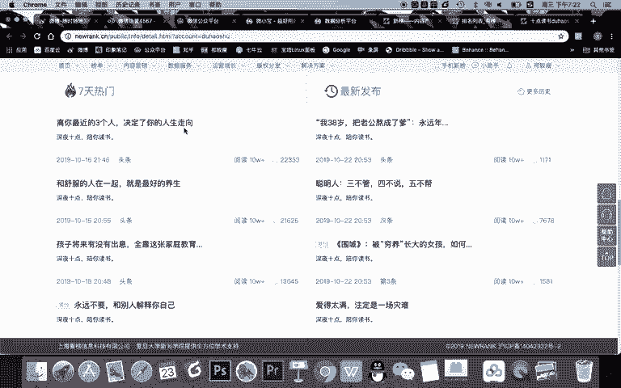