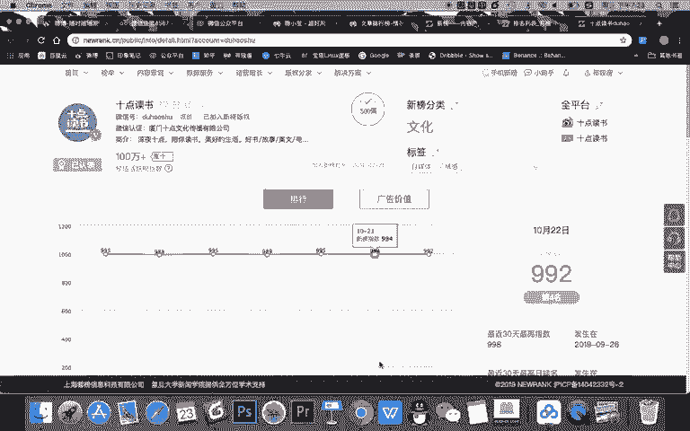
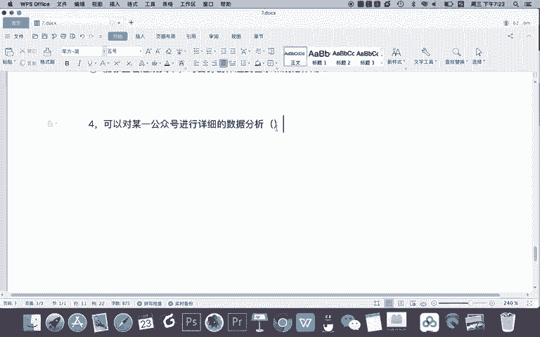
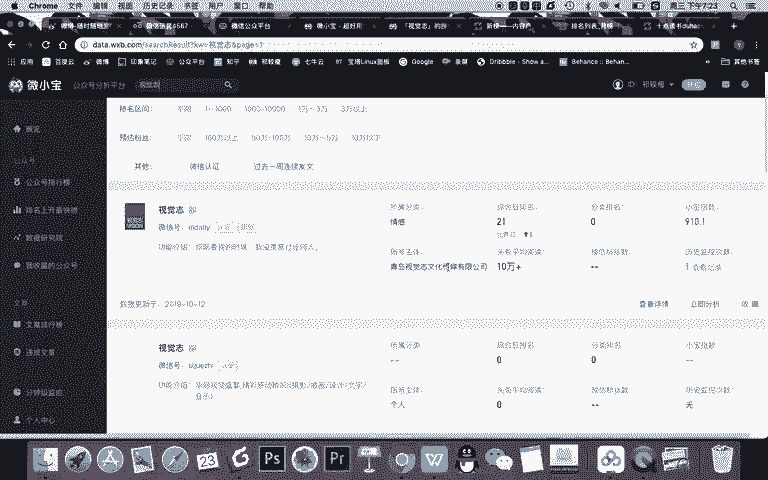
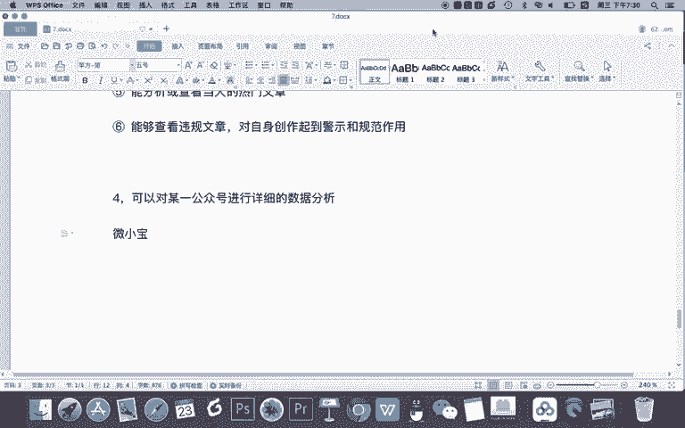

# 微信公众号运营视频全套 手撕运营 拳拳到肉 - P57：4.02-公众号全行业分析~3 - 达妹_达内教育 - BV1UvvvebEdT

文章学习它的标题创作的一个技巧。然后你可以看到10点读书它的7天热门的文章里面，这些点赞量靠前的，因为阅读量都是10万加啊，点赞量靠前呢，然后你看它写的是什么是吧？它的内容创作技巧。

包括它的标题创作技巧啊，你都是可以参考的啊。当然这个参考，我建议其实也可以从这儿参考。在文章排行榜这里。你可以看到。比如说最近7天的一个文章的一个排行榜，然后看看哪些文章比较最火啊。

当然有些时候因为整体的榜单都被人民日报所占了。其实你可以比如说你做情感领域，你可以去看看情感领域的一个内容，对吧？然后呢看看这样的一些标题，看看去学习它的一个创作技巧。OK那除此之外呢，我们可以看到啊。

在这个新榜里面，它还支持对最新的文章的一个数据的一个统计情况。这是新榜里面对一个公众号的一个信息的一个分析啊，我个人认为呢基本的信息有，但是它不够全，全的话是谁呀？

建议选用。

微小宝来，我们看一下微小宝都又能分析什么，韦小宝怎么分析呢？来看这里你可以输入任何一个公众号。比如说我分析一下视觉制。我们一搜视觉制啊，能找到多个视觉制。当然第一个才是大号，对吧？它的指数是900多。

然后呢，排名会有。然后呢，公众号的阅读量，包括账号主体都有。

OK我们点进入之之后能够看到什么呀？排名情况。还有它文章的阅读量和翻文次数情况，还有竞品对比情况，包括对整个视觉日内容的分析，还有通知号主体的分析。我给大家讲讲分别这些数据有什么价值。首先。

通过账号的排名，我们能知道这个账号在整个平台上的一个排名情况，包括啊它的一个小板指数对我们的最大的价值是当你们公司要投放一些大号的时候，你可以在微箱包里查一查。

看看它的一个排名情况以及整体的一个排名情况。如果他在这个领域排名靠前，或者说在自身的领域排名靠前，说明它就是一个大号，影响力是在的，可以投放。但如果你投了一个账号。他根本没有什么影响力。

他的阅读量都是刷的，那么他在这个排名就会靠后。那你看不到这他的排名的话，你记得这个号就不能投。大家看啊，这是它的一个排名情况啊，然后还有在它分类里面的一个排名，你看都是很靠前的啊，基本都是前5名。

这是基本的排名。主要是了解这个账号在整个公众号平台的一个位置啊，了解它的一个水平。还有呢就是我们在投广告的时候有用。那么了解这个文章发文和阅读情况能干嘛呢？对我们的帮助是能指导我们的公众号。

比如看看这些做的好的公众号，每天都会去更新文章，对吧？发文次数30天发了30次。平均每次呢会发布5篇左右。我们刚刚看到看到10点读书是8篇的，所以你看大号发的文章会多，因为他一个号是有一个团队去创作的。

我们看到他的发文的时间段，大部分在集中在晚上的。18到22点。OK其实呢你去了公众号再看一下，去了手机上一翻，你就会知道它固定什么时间发文章。比如10点读书，什么时候发文章，记得10点读书。

每天都是晚上10点发文章啊，你可以去搜一下看一下。这样也给我们一个提示啊，当我们想运营公众号的话，那你需要在每天固定的最好是晚上这个时间去发文，并且呢保持稳定的更新频率。如果经力ok的话。

可以一次更新多篇文章。对吧。那么分析他的公众号的阅读和再看情况有什么作用啊？首先。分析它的阅读量，能知道这个账号的文章整体的一个传播情况。那要是分析它的再看数的话，非常关键。

就是能看到它受到用户喜爱的程度。而且啊如果大家在这里升级会员之后，你能看到每一篇文章的一个传播指数的话，你看看就非常关键的一点，就是你能参考那些再看数高的文章去创作它的选内容和标题。

这样的话你的文章阅读量也会变高。O这是它的一个什么呀再看数。阅读量呢，这个基本刚刚有数啊，不管是新版也好，微小宝也好，这个阅读量都是10万加意义不大。所以呢最好是看一下非头条的阅读量。

甚至它非头条一些点赞量啊。O你看它的发文数量，有时候是没更的，但大部分都是什么？456，这是它的一个频率。好，除此之外呢，大家当然可以像什么呀？在前面去分析公众号一样，你可以添加一个公众号。

让两个公众号进行对比分析。比如对比分析视觉知和实点读知他们账号运营的区别。这样呢更好的指导你的公众号的运营。还有一个非常关键的啊。

韦小宝比新版更丰富的一个信息是韦小宝会对这篇文这个公众号它的内容进行抓取和分析。比如首先分析它的原创比例，你可以看到视觉制啊原创的比例还是比较高的，占比65%。视频呢会占的少。因为怎么说。

视觉制主要是图文创作，对吧？它是这样的一个特点。还有呢你可以看到。他的文章所属的类型，你看情感类、娱乐类和社会类的多。那你知道他的受众以男性为主，女性为主呢？是的，一思考就叫女性为主。不信的话。

你再看看他的整体的文章的热词。关于什么情感两性恋爱婚姻八卦娱乐，对不对？这说明他的受众是女性。所以他在选题的时候就会多写娱乐类的情感类的社会类的，甚至是把社会和娱乐圈的一些情感内容去进行创作啊。

这是一个怎么说，这是一个精准定位的一个问题。再然后你可以看到违规情况啊，这个意义不大，因为基本的大号很少违规，一旦违规性质比较严重。那还有一个我认为比较重要的一个功能。

就是你看一下视觉制人家同主体的公众号什么意思？也就是这家公司啊，他除了有视觉制这一个账号之外，还有哪些大家可以看到视觉制有15个公众号，预估2000多万粉啊，首先有他看有视觉制ins生活。

影探ins生活窈遥窈窕妈妈。大家看啊，这每个账号可了不得。看看排名。都是这么的靠前，记得每个账号每年都能为这个视觉制挣上千万元，对不对？所以你看这账号都是什么摇钱树，你可以看到他们这些号做的都不错。

然后呢，看到他们的再看的数量，甚至是小宝指数。建议你可以如果对某一个公司或者某一家自媒体公司进行分析的话，就可以用这种方式看出他旗下的所有的这些账号，然后选择经典的账号进行分析。

OK以上呢大家可以看到啊，我们有了新宝，还有微小宝之后，我们就能把我们对公众号这个平台的一个了解。怎样。

拓展出你自己公众号的这样一个边界之外啊，就是能去到整个平台去看看这个平台有哪些账号，有哪些好的账号，有哪些热门的文章，以及这些好的账号都是发布什么文章，在什么时间发它的传播情况都可以知道。

所以呢我们通过全平台的微信公众号的数据分析，能更好的指导我们的公众号运营。它能让我们知道我们公众号的一个运营的情况，甚至能知道我们的竞争对手行业案例的情况。O啊，希望大家对新宝还有微小宝这两个工具。

熟练使用啊，多多的在你运营公众号的时候去进行分析，去指导改进你的公众号的运营。O关于公众号运营的知是我们本节课就到这里，感谢大家的学习。

