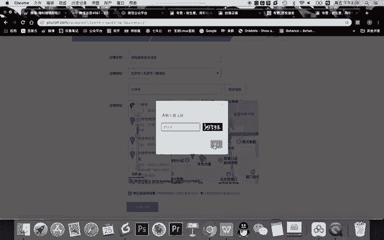
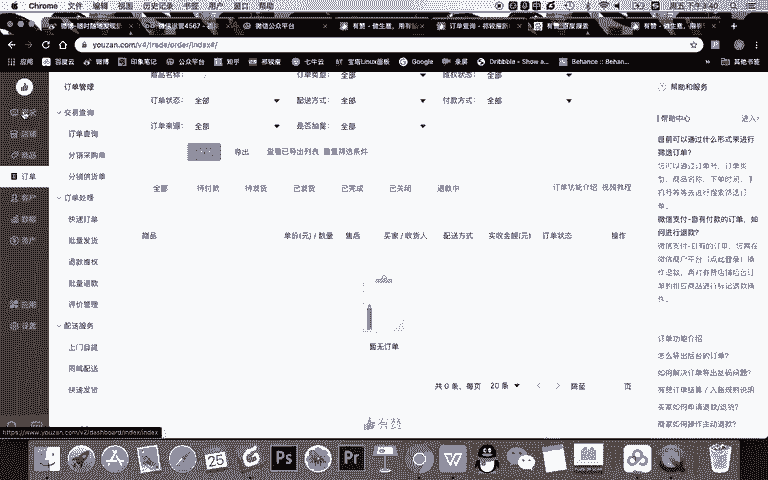
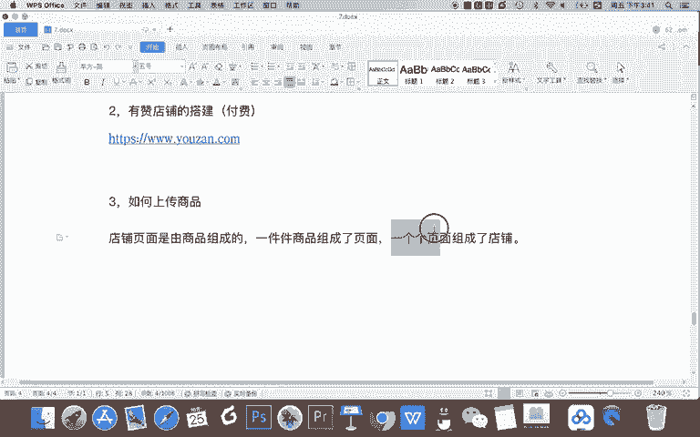

# 微信公众号运营视频全套 手撕运营 拳拳到肉 - P58：4.03-微信店铺搭建~1 - 达妹_达内教育 - BV1UvvvebEdT

hello，同学们跟大家学习微信运营的第七节，也就是第三天的课程啊，我们微信店铺搭建的相关内容。在微信的前面的课程里，大家了解了微信公众号的基础运营的相关知识，比如微信的排版。

微信吸引力标题的撰写文章内容的创作。那么其实在企业运营过程中啊，一些电商类的企业还需要什么呀？微信店铺，也就是说做微信什么呀？电商。比如我们知道在很多的企业公众号里，我们在。自定义菜单。懂是吧。

微信的入口。见过是吗？或者说在一些资金等微信的一些入口能。直接访问企业的。微信店铺。对吧为什么说是能访问企业的微信店铺呢？因为我们知道，如果你有这个淘宝和天猫的店铺是不能跟微信打通的。

因为我们知道阿里系和腾讯系是竞争对手，所以呢我们需要干嘛？需要去想在微信里卖东西，一般有两个方法，一可以链接你的京东的店铺，或者第二个什么呀，需要搭建自身什么微信。店铺，然后呢搭建微信店铺之后。

把你的店铺跟微信打通了，所以它会有什么微信的店铺。那我们给大家讲一些什么呀？微信。店铺搭建的一些方法。首先第一个方法啊，如果公司平台比较大的话，可以做什么？可以一字什么呀？自身开发。

有如一些针对大型的一些企业可以在公众号啊，特别是一些服务号里面去开发自己的微信商城啊，自己去建一个商城是可以的。但通常我们大部分看到的一些微信店铺是什么？走。第三方的事。

第三方那些店铺呢呃它的好处是你不需要去完成任何的开发的工作。你只需要在第三方的平台上使用些模板，然后就能够去完成你的店铺的搭建。比如我们知道一些第三方的微信商城的好的工具。有。有赞。还有什么？

还有威盟啊，甚至我们很多个人会用的一个什么呀？个人用的是微电啊。为啥说个人用呢？因为我们知道像淘宝天猫，你如果有他们的店铺的话，它包含用户的个人中心，甚至包含物流啊。

所有的整个的一个电商体系是非常完善的。但微店呢他只能买卖是吧？他甚至没有很多用户的，比如说一些第三方的费用的接管呀，甚至比如说没有一些物流信息，甚至没有一些售后啊，好评啊这些东评价这些东西。

所以呢它比较适合个人去开微店。那么我们今天呢将给大家讲解的是。用有赞店铺的。答辩方法。如果我们比如说啊想在微信里去卖东西，然后企业呢也比较正规大型，我建议你就开通一个微信的什么有赞的平台。然后呢。

有赞是首先是。付费的啊，它是有不同版本的付费，按年去收费。然后呢，你企业可以一年花几千块钱就能用这个店铺。搭建好这个店铺之后，有赞的店铺可以跟微信打通，然后就成为你的微信店铺的一个啊运营的一个平台吧。

那我们首先给大家讲一下如何去搭建你的有赞的店铺。比如大家首先啊你可以百度。你看他是香港上市的啊，你可以百度直接百度什么呀？有赞，然后找到他的官网。我把他的网址发给大家啊，然后我给大家演示一下。

我们本节课呢就给大家演示一下如何去用有赞搭建一个店铺。然后登录注册之后，第一次啊，你第一次去开通有赞，需要点击创建店铺，大家可以看。用友赞创建店铺，它有多种类型，比如你可以做微商城。还有呢做什么呀？

零售类的啊，这个比较适合什么拥有门店的零售，线下门店那些零售的商家，还有有赞美业，就适合做美容美发的，还有有赞教育啊，适合做什么培训。甚是校区机构的，还有有赞的餐饮，是合做线下的一些餐饮门店。

那今天我们给大家演示呢，主要给大家讲什么呀？线上商城的搭建。因为大部分企业想在线卖东西都需要有一个微商城，也就微信商城，我们可以搭建。所以你可以点击立即开店。然后根据你的商品的类型去选择类目。

比如举个例子啊，我是讲新媒体的，我就给大家选教育培训这个领域，然后呢去给你的店铺起一个名字。比如我写齐教授的什么呀？新媒体。或者齐教授新媒体课堂。然后基本写一下地址就可以。然后你可以写详细的地址，对吧？

你也可以去不写，然后完成之后啊，还必须得写啊，以前并没有这个要求写到区就可以。那比如说你随便编一个。如大中寺。OK啊，我们就搜大钟寺。

OK输入这个验证码。验证码竟然看不太清楚。哎，这验证码真的好奇怪啊，看不清。这个应该是。9333。

OK完成基本的信息的填写之后，就创建了一个店铺。大家可以看你现在手机扫码就能进入这个店铺。当然啊，其实你现在有的店铺是什么？它是一个模板啊，这里面是空的啊，或者有一些案例性的产品。但进入有赞的后台。

大家看你能看到的就是它的一些概况。首先进入的首页概况信息。然后呢，甚至你的订单呀、营业额呀这种信息，下面是一些学习交流啊等等的服务。在最上面大家可以看啊，店铺免费试用7天，最多试用一笔100笔订单。

对吧？然后呢，你看只有7天7天之后就到期，这个店铺不能试用的。所以我们在教学的时候可以拿它做演示。但是呢啊你去。想起开店，你肯定还是需要去付费。大家可以看一下价格啊。你看。😊，基础版是6800。

然后1万多，然后呢啊2万多，这是不同的一些版本。如果你比如说一些。小的一些企业可以选择这样一个版本，然后就可以去使用了。OK在概况里呢，你可以每天看到一些订单的信息，然后呢去店铺里大家看啊。在店铺里。

这里有你的移动店铺APP开店，信入还有什么进入到。微信百度支付宝的一些小程序，还有去内容创作时候，也就是你搭你店铺的一些页面，还有一些店铺的一些风格。在商品这里呢就是你的各种商品。

大家看这个店铺目前是有这样一些商品的对吧？然后你还去可以在订单里去查看管理处理你的订单。还有你客户的一个管理啊，包括你的店铺的数据分析，包括你整个的资产。

所以大家可以看到有暂示一个功能完备的一个电商平台。它为企业提供的服务还是比较完善的那我们在微信的课程里面，关于微信店铺呢，我们就会给大家讲讲搭建，并且呢给你的微信打通。

所以呢我们只需要去讲有赞的一些部分的内容。比如首先我给大家讲一下有赞的商品的。如何？上传商品。首先你记得一句话，为啥要讲这个内容？比如说你的微信店铺对用户来说，他能访问的是你的店铺是吧？

但是其实对我们的一个运营人员来说，你记得这句话。店铺。页面是有。商品组成的。然后呢，一件件商品组成了页面。一个个。页面组成了店铺。首先你看啊就像盖房子一样，你如果有一栋房子。

你记得你那房子都是一件件商品，就是一块一块的砖组成的，一块一块的砖组成了一面一面的墙，你就理解一件件商品组成了一个个页面。然后呢，多个页面有组合起来，组成了一个店铺，也就是多个墙组合起来成为了。

