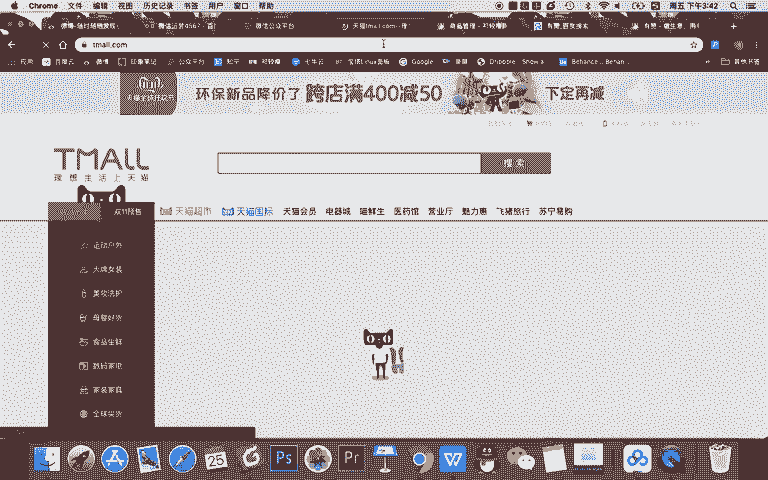
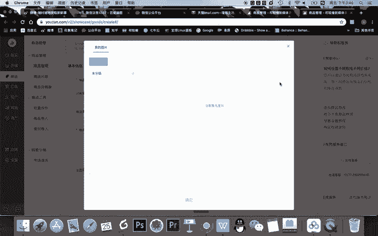
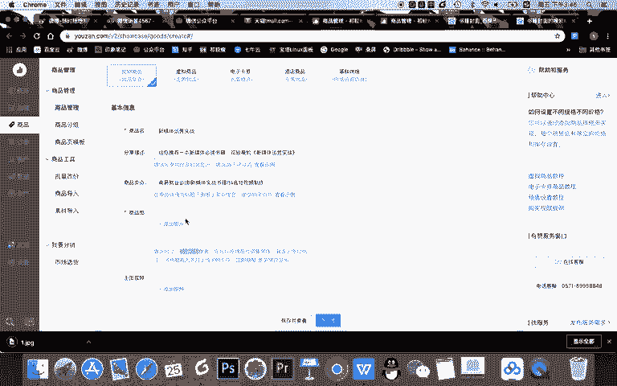
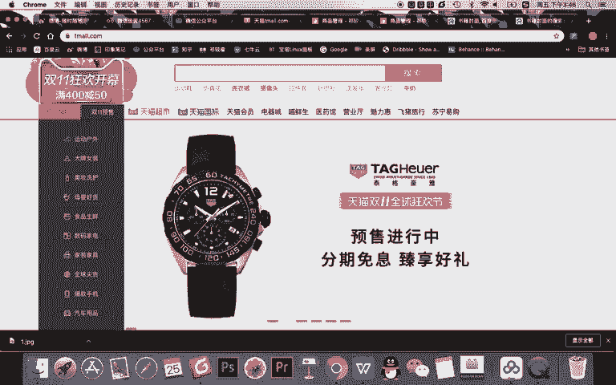
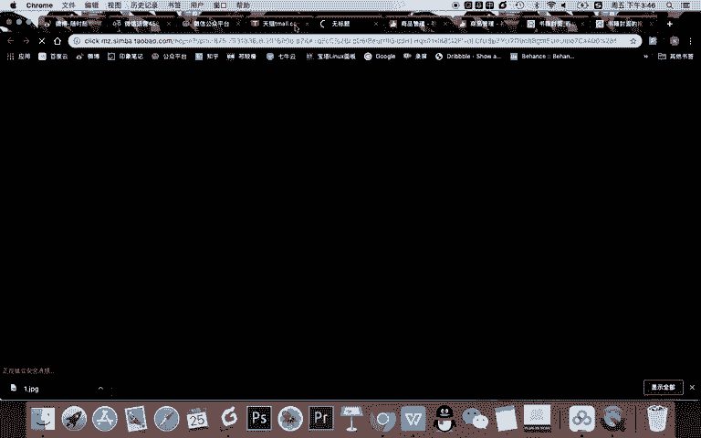
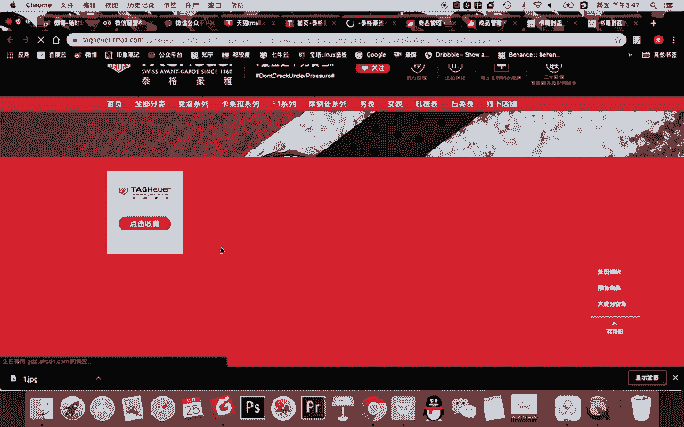
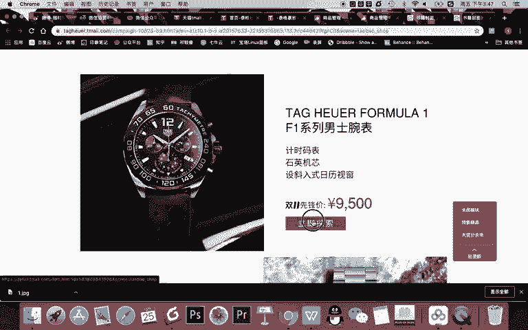
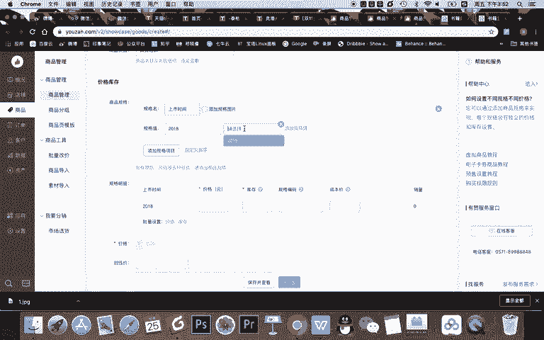

# 微信公众号运营视频全套 手撕运营 拳拳到肉 - P59：4.03-微信店铺搭建~2 - 达妹_达内教育 - BV1UvvvebEdT

你的什么？你的一个房子，比如我们其实可以看一下天猫啊。

我们去到任何一家天猫的具体的店铺。首先大家看啊，这是一家店铺。然后呢，我们去到这个店铺之后看到的。我这个首页，那么首页这个页面之外呢，它还有其他的一些页面。比如说我们可以看啊，它有。热卖推荐，哎。

这直接是一个什么？这是一件商品啊，包括你看我们看所有的宝贝。刚刚在首页是有一个这个页面长这个样子，对不对？

那么在他的所有宝贝呢，你看所有的商品疯狂的这些人，这缺的是什么？这就是一件商品。但你发现这件商品上面有这些。什么呀？可以访问的页面，这叫什么？这也是一个页面。你看这个页面。跟这个页面这是不同的页面。

但是这个页面就有这么多商品，一点击是去到了一个具体的商品。所以商品页面或者说多个商品页面就组成了一个所有宝贝，也就所有商品的页面，然后去到首页是有一个有见有设计感的一个新的页面。所以你要记得。

我们的店铺就是由一个个页面组成的一个店铺。然后我们这些页面里有些有些叫首页。有些叫什么呀？比如说盲盒页，有些有些叫艺术摆件页等等等等。OK所以呢我们如果想去搭建一个店铺，第一件事儿，要学会如何上传商品。

那我们看在有赞里啊，我们看一下。我先把这些页面关掉。哎啊我就直接去打。我的。进入我的后台。OK我就直接去到我的后台，然后呢，在这里你看有。添加商品的地方，对不对？你看我直接可以选择去发布商品。

当然对我的店铺来说，这四件演示商品是没有用的，我可以干干嘛，我可以给它删掉，对吧？但是我现在呢我也给大家演示，我先不删掉，我先去点击发布商品，然后我就可以去创建一款商品。比如我的商品。叫什么？

新媒体运营实战。对吧假如我写了一本书叫新媒体运营实战，然后呢，这是我的商品的书名。然后分享描述呢就是微信分给好友会显示的是吗？就比如说我可以写上快来是吧，直接写给你推荐一本。新媒体。必读书籍。然后呢。

是吧。习教授的。新媒体。运营。时代okK这是分享页越等于分享给别人会看商品的卖点呢会在详情页的标题下展示。比如说你可以啊。你看看。😊，往前写你可以看一下，哎怎么去展示，对吧？这是慢一点去展示的。

你可以写是吗？高薪就业。必读。然后呢，新媒体实战。书籍，然后再写。抖音短视频。制作等等的。okK你还可以啊，或者说不是可以，是必须要给你的商品去添加一张图片单记的啊。

这个商品的图片是需要800乘800的那我们随便找一个什么书籍。

封面的图片。我们现在找一个方形的，大概去演示一下就OK。比如这个书籍啊。OK我们上传一下。你看我们现在这商品是没有去分组的啊，我们直接点击本地上传。

你多你比如说商品很多，图片很多的话，你就可以进行一些分总。OK商品的图片显示好了，但是记得啊这里可以添加多张图片，多张图片的效果是怎样的呢？来看这里。我们找一款别的商品来看。

我们知道大家一般去看到一款商品之后啊。

比如我们就点这个一一个商品在它的。

呃，主介绍页会有什么？你看这就多个页面，我访问了之后又访问了，对不对？然后呢，我就需要再去。

看看找到一款商品看。找这个商品在这里，你看12345约等于我们如果传多个图片的话，它会显示在这里，是基本是这样一个效果。所以在这里呢我演示一下，就不传多个图片了。还有啊你也可以传视频的一些图片。

比如说啊你看有些视频是不是有些天猫的一些商品的。很多就候第一个是视频，一个点可以播放。

我们在微信里在有赞呢也是可以这样。然后呢，你需要去给商品建分组啊，这个呢稍微有点对新学学员来说有点难度啊，为什么要建分组？你记得比如说。这家卖手表的一家店铺。你呢是需要去分组的。

因为它里面会有很多款手表，比如说男士的。女士的商务的运动的等等等等。你要去建分组。这样当用户想点男士运动手表的时候，他就能找到这个分组，看到这个分组的所有的手表。比如说。你看分组的话，比如说镜前系列。

这就是点击这个分组之后，能看到这个系列所有的商品。所以呢我要对商品新建一个分组，因为我现在没有，对不对？我要去建一个分组创建一下。比如我这分组名称叫。新媒体。必读书籍。然后呢，它会默认一些什么呀？

在这个分类里展示时候的一个排序。比如大家看这个在镜前系列，为什么这四个会排在第一行呢？它是有默默认的一些排序的。比如说序号在设置的时候，序号会大，它的靠前，或者说创建时间的前后靠前。

所以如果你想让第二排的靠前的话，你把它序号写的更大，或者说创建的时候更新啊，更晚啊会更靠前。然后呢，你会让这个列表会展示它的效果。你看这是大图的效果。这是小图的效果。其实你看这电脑端是不是小图就长这样。

你也可以在有赞里让它长这样，或者说你为了美观，让它以大两小也可以。那我现在比如说我就选择一个小图。然后呢，或者一大两小吧，一会儿呢我的心呢会显示在这里，然后购买样式你看也可以显示，你看变成加号。对吧。

然后我选择这个默认这个样式要不要显示商品名，其实呢可以显示可以不显示为什么？你比如说你的书的这个图片就是有名字能看得清的话，你就没必要显示它商品名称。然后呢，还有价格啊也可以显示不显示。

一般会显示哎商品标签的一个简介，就是你可以写一句话，介绍你这个类型的一个商品啊。比如说就写什么。新媒体。是吧地组。书籍推荐啊，为了跟上面这个区分开怎样。对呀。1000个新媒体人精选的。行业好书。必读。

新媒体。书籍推荐。或者啊我们用句号ok。你这样一写呢，约等于这个类型的这个内容是什么都可以。然后为了排版美观，我就这里写一句话，你看啊去展示。然后你记得用户点击了这个新媒体必如书籍。

在这里看到的各种书都会展示在这里。okK我点击保存，阅读于现在我点击保存之后，我的分组里就有了一个书籍的分组。那我现在要做什么呢？来，我继续添加我的这个商品。比我刷新之后。刚刚是没有了。

现在你看有一个新媒体必读书籍，对不对？然后我就可以去给它归到这个鼠类。然后呢，商品类目是按照商品属性的，比如说是男人女人，然后我们现在属于什么？对吧我们属于教育培训啊，你去选择这个分类就可以。哎。

商品规格这一点一定要讲一下啊，因因为有很多同学会添加或不添加规格，我建议你一般是要添加规格的。所谓的规格就是按照商品的颜色、尺寸、款式等等去确定。比如我这是一本书，它有什么规格？对吧他有上市的是吗？

时间比如规格呢，你看。规格值是多少？比如说你写的我这个数是2015版本。对吧就写了12015版，然后还有新的规格，比如20。一般的一些版本。对吧然后呢。啊，比如说20182015再添加一个最新的。

比如说2022版本。

对吧OK这是三个规格。