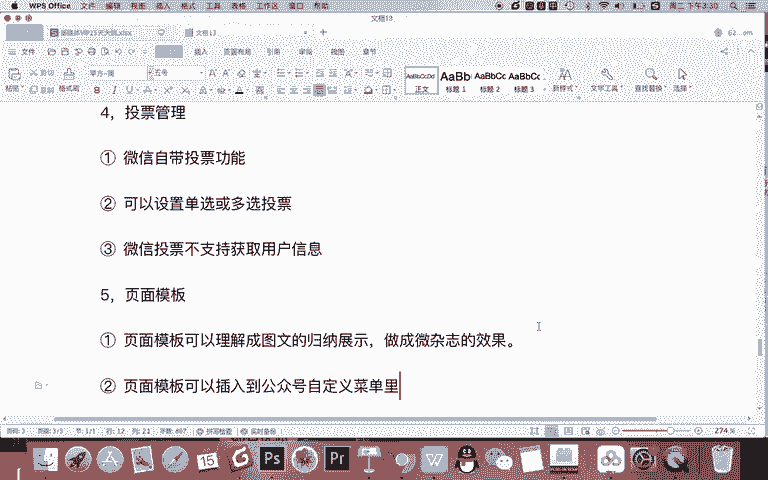
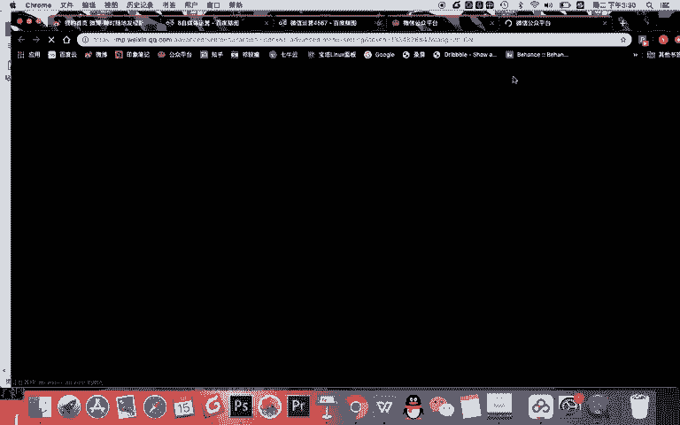
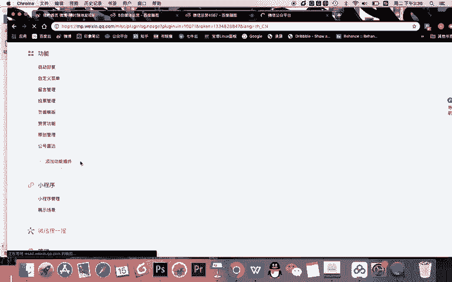

# 微信公众号运营视频全套 手撕运营 拳拳到肉 - P5：1.02-公众号后台功能认识~2 - 达妹_达内教育 - BV1UvvvebEdT

你给我发了一条留言，别人也给我发了留言。我的文章下面的留言的排名顺序，基本谁的留言回答的好，点赞量高会排在上面。所以呢如果你想成为一篇文章留言的前十名。那你的这个留言要多，那怎样留言才能多呢？

当然是转发这篇文章，让别人给你点赞，对不对？所以你看我们利用留言的功能就能实现增粉，因为能引导用户去分享去分享，并且让用户访问点赞。OK这是关于留言给大家讲解这么多。那么我们再来看下一个功能。

第四个功能。投票管理啊，这里呢记得这是什么呀？这是第一。这是微信自带。投票功能。就是你可以发起或设置一些投票，然后把这个投票插入到文章中。让用户进行投票。那关于投票呢，他比较简单，我就再说一点。

可以设置。单选或多选投票。什么意思？比如你可以一次出20个题，每个题有一个选项去让大家投票。也可以就出一个题，让有20个选项让大家投票。比如说啊谁谁是你心目中最帅的老师，哎，你可以设置20个老师。

让大家去投，那用投票能干嘛？当然是能拉票，能实现文章的一个转发传播。但是需要注意的是，关于投票。微信投票。不支持。获取用户信息。比如你说A。我们给大家20个选项，看看哪个老师的支持率最高。

那么我们谁支持率最高呢？所有给他投票的学生将获得奖励这个活动可以吗？不可以，因为你没有办法知道哪个老师的什么获取投票的用户数量啊。所以呢你看我们这些信息都不会展示出来。你只能知道数量啊。

你并不知道是谁投放的，所以呢你记得啊，用微信呢对用户的隐私保护还是比较好的。什么是页面模板。记着第一。页面模板。可以理解成。图文的。什么呀？归纳。嗯。展示。比如你的公众号写过很多的文章。

那你就可以把这些文章用一个页面模板啊给它归纳起来。那么页面无模板你看做成什么效果，左右翻页，还有上下这种小什么栏目的一个效果。所以你可以把页面模板做成什么呀？做长。什么呀微杂质的。效果。这是一面膜板。

那这个页面模板只能添加什么？只能去添加一些图文内容。然后呢，这个页面模板会是一个链接，需要记住。第二点。2。页面模板可以插入到。公众号。自定义。菜单里。约等于我们说啊，你看这里。

。

在公众号的自定义菜单这里啊，你看到这里有一些我们说可以做成微网站的形式，对不对？那网站的网站的一些链接，超链接访问哪里呢？你可以就访问什么呀？页面模板，然后让用户直接访问你做好的这个页面。

比如说他一点击这个位置就能看到。这样一一些文章的整合啊，这就是页面模板。但记得啊想做好一个页面模板，你得有什么，你得有图文。所以现在我虽然教给了大家页面模板，但你现在能做吗？不能，因为你的公众号刚注册。

你还没有发布过一些文章，所以不能去做一个页面模板。当你发布了多篇文章之后，你可以把你的文章给它归纳总结做成一个页面模板，然后展示到你的一个自定义菜单里面。ok。第6个功能。赞赏。首先是什么是赞赏？

赞赏是。能让粉丝给。作者。打赏就是你写了一篇文章，这篇文章的最下面。如果你有赞赏功能，你可以点有一个按钮啊，这样出现一个赞赏的标志，同时是打赏这篇文章的作者，大家看一下。你看赞赏呢，你可以赞赏给。

多个账户啊，你看你可以邀请多个账户，这里现在呢就只有我一个账户啊，所以打赏给谁啊？记的。一个公众号可以添加。多个作者被。赞赏，但不是每个人都随意被添加的。

一定是他在你的这个公众号怎么发布了多篇原创的文章才能有赞赏啊。所以他还有一个必要条件是。三。要原创文章才能背。赞赏啊，所以这里那你记得赞赏，就是让读者给你打赏1块5块10块，100的给你打赏啊。

原来就是一个粉丝跟啊自媒体作者一个互动的方式啊，一般打赏都不多啊，那你有赞赏的？另一个非常重要的功能就什么原创管理。什么是原创管理？啲。写的。原创的图文。可以标注。原创。然后呢。保护。自身版权。

比如你写了一篇文章，如果你标注了原创之后啊，别人又去抄袭你的文章，那么他的那篇文章会自动替换成你的这篇文章，并且会在他的公众号里面展示你的公众号信息，这样能保护你自己。那么记得啊，除了去标注原创之外啊。

首先啊我希望大家都能标原创。其次啊除了标注原创之外，它还可以设置什么？2、可以开启。白名单让某些账号可以转载。而且不显示。你的信息。啊，什么意思？就看啊你的公众号文章虽然可以写成原创。

但是如果你有一些分公司或者合作的伙伴，他想转这篇文章，但是他的文章并不显并竟并不想显示是转载的效果，并不想展示你的公众号，那怎么办？你可以什么？在转载设置里怎样添加一些账号，给它添加成白名单。

让这个文章呢可以被别人转载，或者说长期可以转载啊，让这些账号能转你的文章，并不会显示转载的那个效果。当然其实用原创管理的目的还是要保护你。但记得有些时候你的一篇文章很好，你的分公司也想去发布。

但是呢也想以文章的形式发布，而不是转载的形式。那么你就可以用这种方式去添加。那么你需要记得标注了原创的文章，你得是自己写的是原创啊，标注了原创的文章就可以怎样。就可以去获得赞赏的功能。

然后甚至然后让用户留言等等。那最后一个工号雷达啊，你看这几天微信公众号的这个工号雷达是新的功能还不稳定，在这里能干嘛呢？就是你可以去搜索到一些新的账号，然后并添加到这里去关注这个账号。

约等于你可以把行业的一些经典的账号或者竞争对手去添加对它进行研究啊和查看OK这是我们关于功能部分的一个。基础的讲解，我们随后会对自动回复和自定菜单进行详细的知识讲解。接下来说到小程序啊，首先你记得。

个人啊。是没有办法注册小程序的，只有你的企业可以注册小程序。然后呢，你可以关联。多个小程序去到你的公众号关联之后呢，可以在你的自定义菜单啊、图文啊或者消息模板里面去应用小程序，让用户能够访问到小程序啊。

你看现在我要点击快速注册并认证小程序，你看个人不支持，对不对？需要用什么啊？啊，企业的信息去能注册。那小程序呢约等于就是一种展示效果，可以做成网站或商城添加到你的公众号里面。如果你是企业的话。

你可以用企业的公司的账号去开发或设置小程序，然后去添加到你的公众号里面。那小程序的展示场景也同样的，你看啊一般会有附近的小程序啊，这样一个展示场景。其实我们用公众号啊去添加小程序。

最主要的目的是希望把它添加到我们的图文的文章里，还有资金菜单这里，让用户看文章或者访问我们公众号的时候能访问啊。附近的小程序呢比较适合线下的一些门店。比如你们门口的超市啊，或者你们门口的那个奶茶店等等。

可以去开通这样一个功能去使用。OK微信搜一搜呢是做什么的，你可以理解成微信的。搜索功能啊，这也是微信公众后台新添加的一个功能啊。我们平时你可以用这里是吗？

