# 微信公众号运营视频全套 手撕运营 拳拳到肉 - P60：4.03-微信店铺搭建~3 - 达妹_达内教育 - BV1UvvvebEdT

那所谓的规格大家要记得啊，这些规格指的就是你的比如商品的类型。比如你看这个商品。这商品呢它是按颜色有这个分类的对吧？甚至有的尺码大小等等，有不同的各种的规格，你在这去选。那我们的商品也是这样。

如果它有规格，你就需要去写住。比如你看啊，我有三个规格的版本。

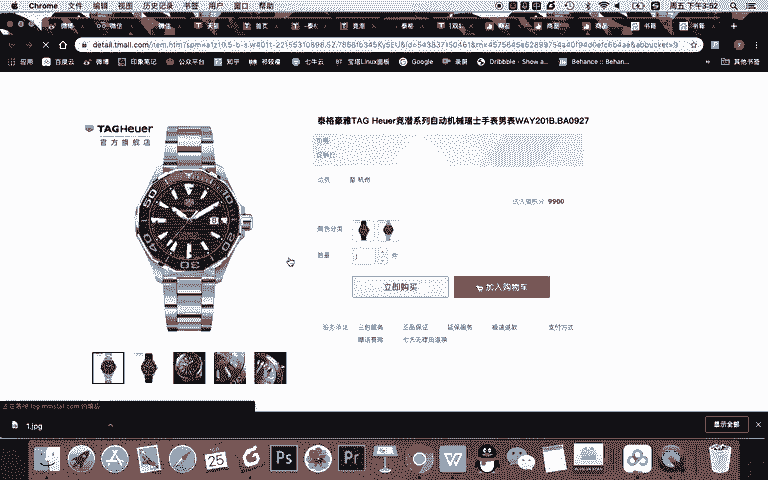

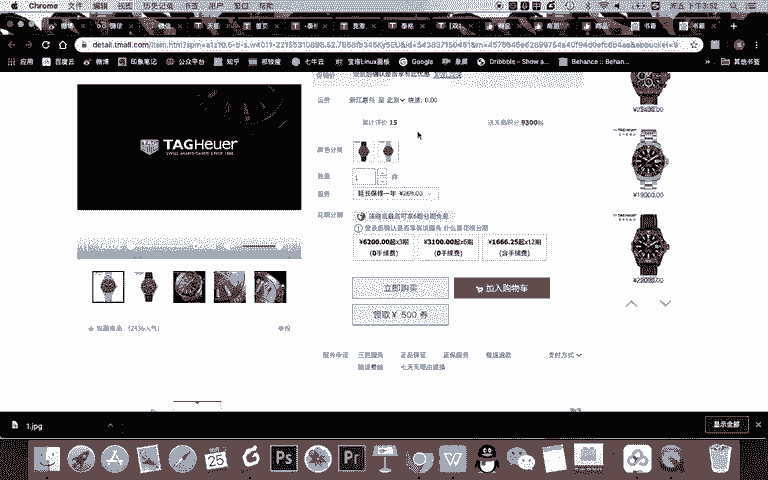

然后价格呢，你看啊有展示展示出来的价格。比如说。2018版本就比如88元。66元。然后呢，99元库存呢999。就按照你商品的一个库存情况，然后编码这个有的话就可以填上。没有了就可以不填，对吧？然后呢。

写出成本价，方便你统计它的一个最终价格，这是不会展示给用用户的。比如说50。40。60，然后。划线价这个很简单了啊，划线价指的就是这里。

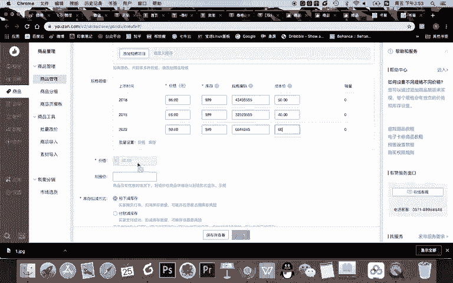

你看一般的商品呢都会写一个。划钱价就是原价吧，就所谓的原价，让你感觉这个商品很划算。那我们就写划线价，比如说。

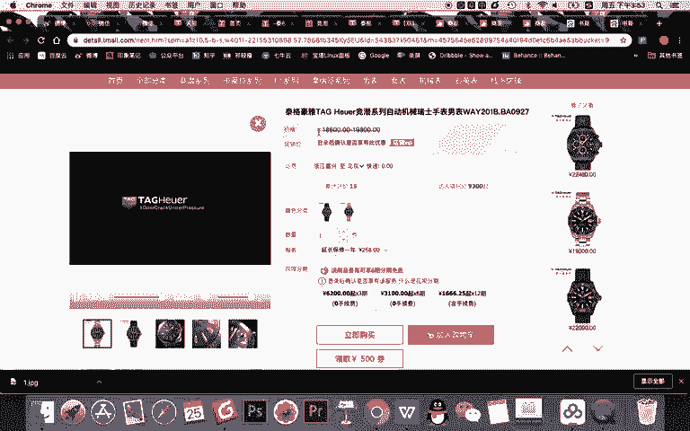

就写99对吧？因为你要买最新版就没有折扣，卖老了版本哎，原价99，我们也便宜，对吧？然后呢，这个价格这儿不显示的，为什么？因为它有三个版本，当用户选择了不同的版本的时候，然后会有显示不同的价格。

然后库存呢你你也可以去显示或不显示，包括商品如果有编码，对吧？一般都会有，然后写上配送呢，你可以写包邮嘛，就0元，对吧？或者你可以去建设建立一些运费的模板，然后有到时间。

会在这个商品让他直接选的这个模板，告诉用户是多少钱，怎么包邮的一个情况。O还有我们这商品呢还可以进行。预售啊或自定义上架的时间或者立即开卖。然后呢，有要预售的话，就是下单后需过来选择的方号。

你可以去设置啊，这些是基本的内容我们就不再设置。所以呢在这里我们可以设置这个商品的一个基本的信息。然后在下一步的时候。我们是要给这个商品去进行详细的商品的描述。什么是商品描述？看这里。就是这里。

就是你看像在天猫上我们看到的很多这种图片的一些。呃，造型设计啊，这些就是商品的详情。比如我现在去找一本书啊，比如我喜欢的一个一本书，我们去展示一下啊，复制一下，看看它的效目。

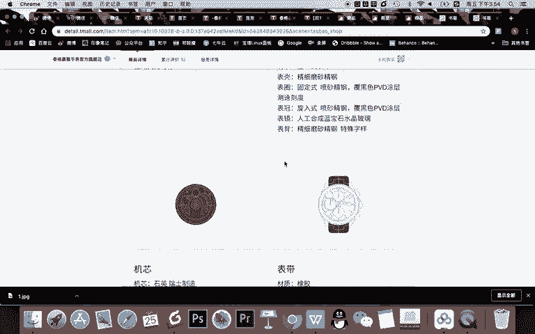

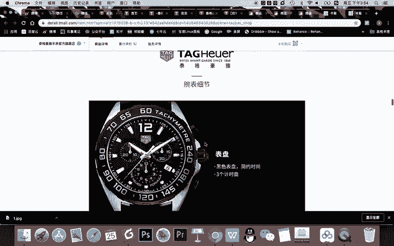

嗯。我们看他的一个商品。描述是怎样？你看它的上面描述就太简单了，对不对？不美观怎么办？我要去找一个。

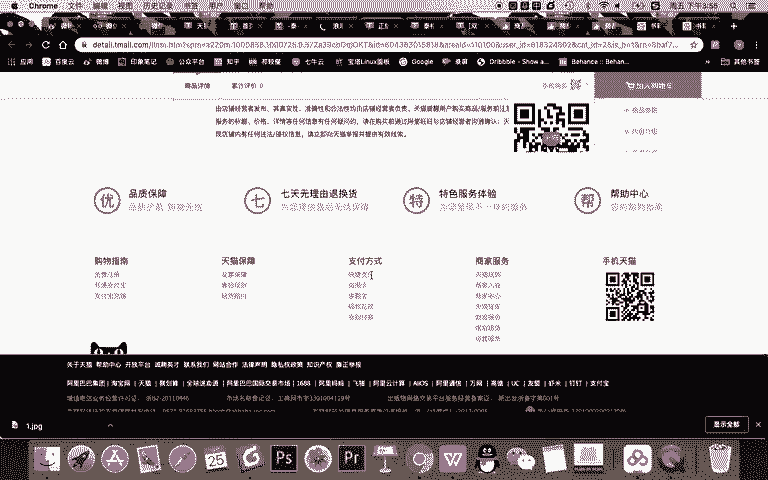

好看的一个商品描述啊，就是正常来说，我们的商品描述是需要去。

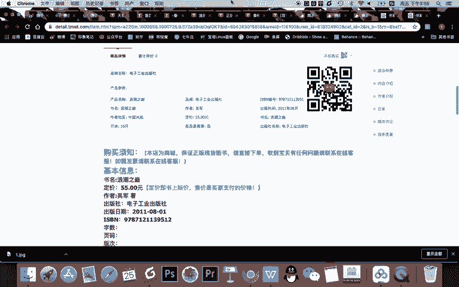

啊，这个版本不是特别好啊，为啥？因为它是PC电脑版本啊，我只是演示一下给大家看，大家记得需要去进行创作和排版成。

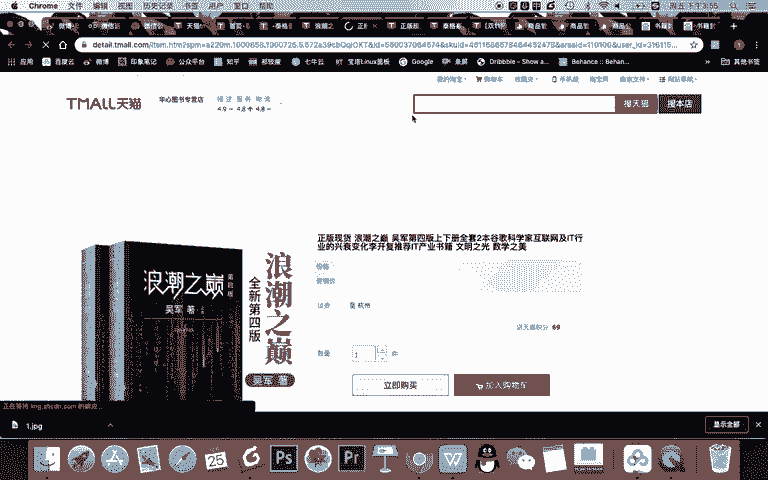

你的手机版本的啊。一般情况下，你需要找专业的运营人员，或者就是你去给这个商品去添加商品描述。比如你看添加出来就是这个效果。对吧或者你把这所有的内容做成图片啊，直接插入图片也可以。它就像有点微信的文章。

给这个书写一个详情的介绍。OK我们保存并查看一下。最多不能超过啊，你看有点多了，那我们就删一部分。Yeah。OK我们保存并查看一下。好，商品跳转之后，其实告诉大家。

你现在这这个你看我排序出的这个商品上传的一个效果，就基本是用户购买时看到一个效果。比如说你看。他可以看到这个内容，然后呢选择版本，不同的版本。哎，你看不同的价格。

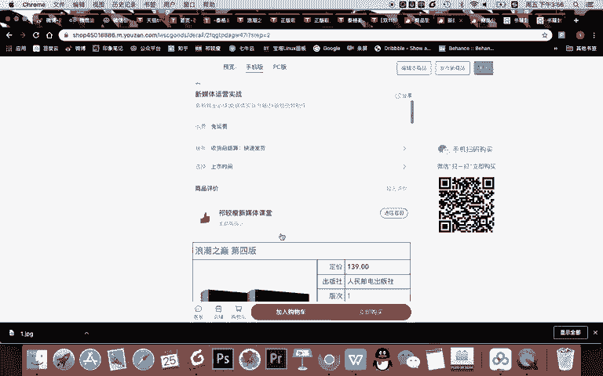

然后我上传一个图片，对不对？你可以上传5个图片，然后商品呢还有它的详细的介绍，你就可以看到这里面你当然可以点击立即购买，对吧？你选择版本，下一步直接登录就可以购买。

这个页面的效果呢就是你在手机端看的效果。我们基本预览还可以看到什么PC端啊，它基本有点淘宝有点像了，对，对不对？

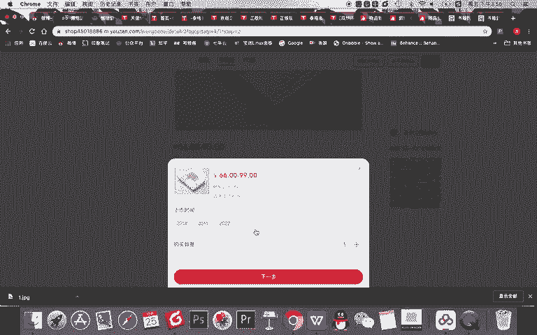

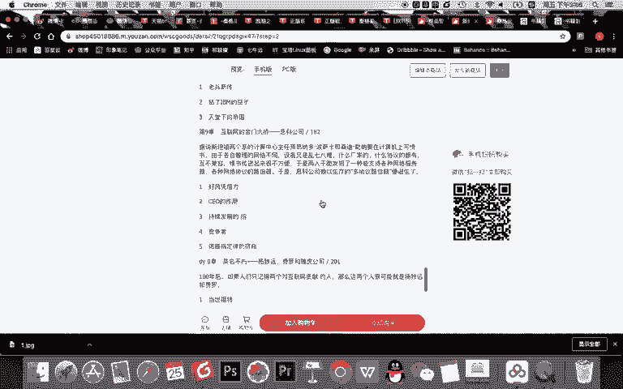

OK那到这里呢，我们这个商品就添加。完成了。当然你可以如果哪里有问题啊，你比如说你说手机版上，我看图片不美观，有任何问题，你可以继续编辑这个商品。或者你可以发布新的商品啊，我们现在就关闭它。

关闭它干嘛呢？我们要去到我们的商品里面。看看我们的商品的管理。大家看在商品管理里，除了刚刚几个测试的商品之外，是不是有了我添加了这样一个商品，对吧？而且我做两件事儿，除了添加商品之外。

我还有一个新建了一个商品的分组。比如我开了一家店，我卖的有书籍，有音频课，有视频课是吧？甚至还有一些直播课。okK我就可以建一个不同的分组。第一个分组叫新媒体必读书籍的分组，还有呢新媒体是吧？

视频课程、新媒体音频课程等等。然后我就上传多个商品属于不同的分组，等我多个商品建设之后，建设好之后。那约等于我去盖这个房子或搭建我的店铺的这个砖。就好了，然后我就可以用不同的商品去组成页面了。好的。

关于有赞呢，我们本节课进行了一个非常重要的基础的一个内容的讲解，就是如何在有赞里去上传商品。然后呢我们进行了一个商品的上传，并搭建了呃一个分组。那我们本节课先到这里。

下节课我们将给大家讲解如何去做出你的店铺的整体的形态。OK我们本节课就到这里。

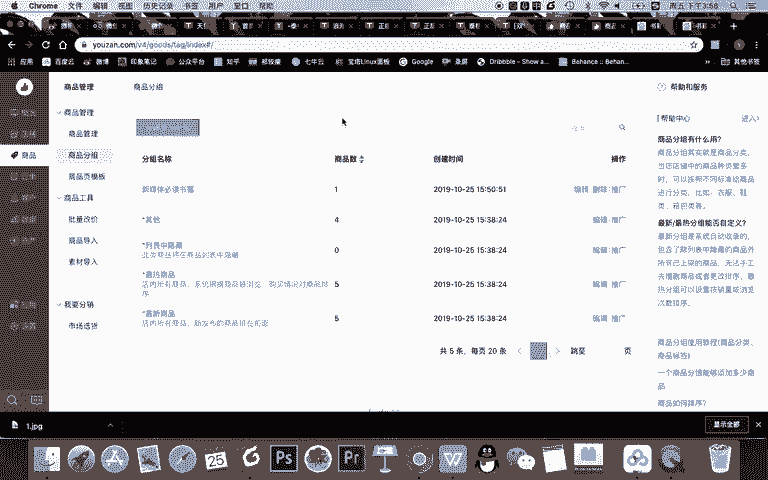