# 微信公众号运营视频全套 手撕运营 拳拳到肉 - P61：4.04-有赞微页面建设~1 - 达妹_达内教育 - BV1UvvvebEdT

同学们好，在上节课呢我们学习了有赞店铺的搭建的第一部分的内容，也就是去上传商品。那假如我们现在啊上传了多款商品啊，但是大家看我的商品呢还是比较少的。因为我在实战中呢只上传了一个商品。

但同时呢有多个测试商品，那我就以这5款商品为例去给大家讲讲本节课的重点内容，也就是微信我们如何把有赞的整个的店铺搭建好之后能打通。那首先呢打通之前啊，比如说有赞。打通微信是第二部分的内容。在打通之前。

我们有一个重要的内容要做，就是要把整个的店铺先建好。我们通过商品能建好页面，那怎么去搭建呢？记得。商品再强调一遍啊，商品组成页面。页面。组成。店铺啊，所以呢我们现在要去做页面了。那页面呢在店铺这里。

大家可以看到啊，在店铺这里呢，你看有各种的我们的一些什么呀？功能啊。那其实我们要做的是内容创作微页面，建好了微页面呢，就可以把多个页面整合到一个页面上，然后就成为一个店铺的呃一个店铺吧，或者就是。来。

我们先暂不升级它的一个页面。那什么是页面呢？比如大家看啊，我新建一个页面，其实所谓的页面就是你要选择一个模板造型，然后呢在里面去完成它的完善它的内容。比如像这个内容，你看一个商品。

两个它后背后是一个商品两个商品。所以你知道商品能组成页面，对不对？当然，有些时候你为了让你们公司的店铺更漂亮，你可以选择这样的页面或这样的页面或这样的。OK比如我现在要选择一个啊，比如说适合我教育类的。

比如这个页面，那我就直接点击使用模板。比如这个页面名称叫做。比如说。新媒体书籍。OK页面描述呢就是什么？就写上还是那句话分享给别人会显示，就写必读。必读的什么经典。新媒体书籍。

OK你看在页面这里同样去面临一个问题，就是我们要去建一个分类，对吧？首先我们要去给页面建分类，就像你去买买服装或者买任何的一个东西，它都会有一些分类，对吧？我们比如说我们去给页面建一个分类，叫书籍。

OK啊，书籍呢什么就是什么直接写互联网好处推荐吧。Yeah。OK我需要大家明确的是，在商品那里面，我们要建分组分类，对吧？页面也同样的，因为你可以把有都是书籍的一些页面整合到一个内容上面。比如举个例子。

有新媒体的书籍，有电商的书籍，有呃比如说有java呀、程序员的相关的书籍，对吧？那我们所有的书籍也可以归类。

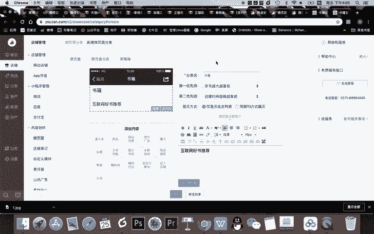

OK我们添加一个微页面，你看这个页面呢呃比如说我们让他去。选择啊，比如说我就选取啊一个新媒体请教授新媒体课堂这样一个内容。

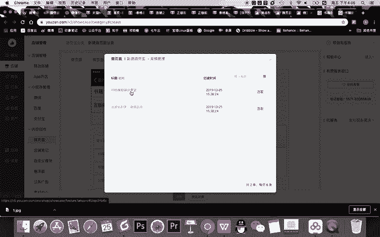

去确定啊我的这样一个内容。OK。

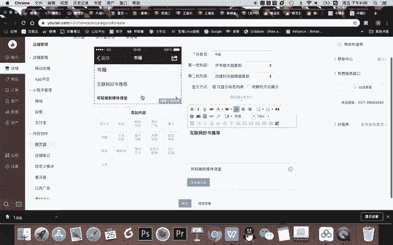

添加。我的微页面。

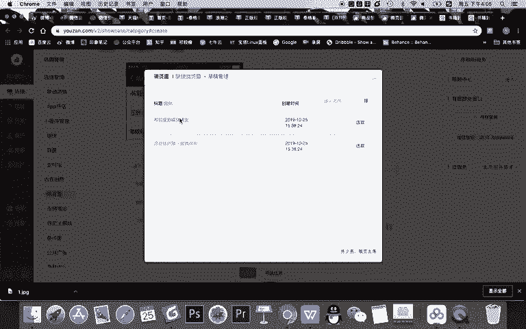

OK在新建这个页面之后，大家看啊，我这个页面现在呢它是模板。这个模板呢就会有一个问题，就是你看这所有的图片素材我都得干嘛？你记得我们用有赞的好处，就是我们有模板。然后呢。

你只需要把所有素材替换成你的就可以。比如我现在这个页面，你看都是各种母婴类，我要干嘛？哎，你看我要点到这个，把它图片进行替换，对吧？大家可以看到啊，我在这里呢可以选择这个图片展示的一个造型。

那现在它有几个图片。对吧它有两个，但是我可以你看用这种造型的话，可以添加多个，可以一行展示两个或者是轮播海报。所以我现在要做的什么事儿？我做的就是一选择了这种造型之后去替换图片，并设置不同的内容的来源。

那么我就要去干嘛？你看这尺寸是750乘350的图片，我就要去。制作啊当然去制作两个。但现在呢。我就不去制作了啊，我淘宝或者说我百度上去搜索两个，比如说哎类似的。

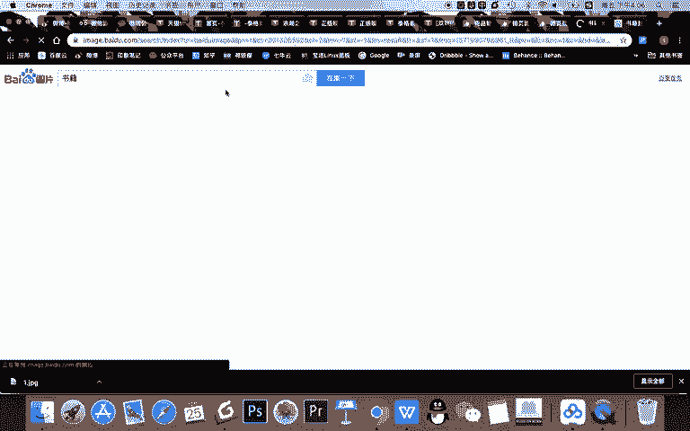

这些图片的造型。比如刚刚那个造型以及。啊，就这个造型吧，我给大家演示一下。

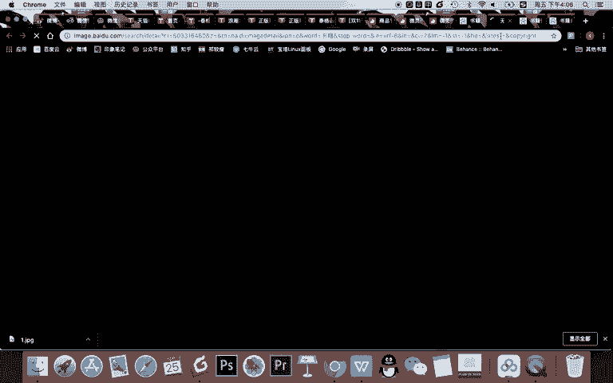

。OK这是一个具体书的一个造型。OK我去。

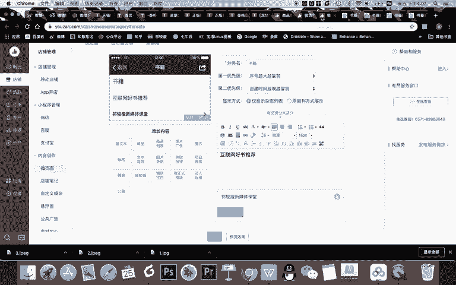

上传这两个图片到这里啊，更换它的图片。Yeah。确认。然后呢，你看这图片就被替换了。然后同样的我在这里再去更换这个。Yeah。嗯。

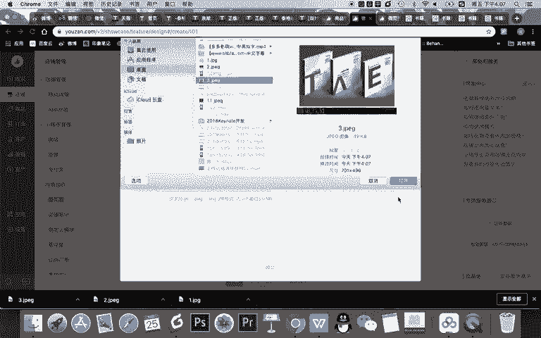

确认。OK那么现在呢大家看两个刚刚的这个母婴产品的这些内容都已经变得不一样了。这两个产品呢都已经变成我的书的这样一个造型了。那我需要去干嘛？你看你可以给他去写标题，标题就是说。是吧比如说。

新媒体或者说什么呀，微信运营好书，你写上，你可以在这展示啊，你也可以不写内容。那么你需要注意一点，现在非常关键了。页面是由什么组成的？最初的页面都是由商品组成的。比如我现在有两个图片，我要去到哪？

我可以让它跳转到，记得啊，你看能跳转到很多地方，比如其他的页面，什么叫一个页面跳到其他页面。比如举个例子，大家看这是一个页面，对不对？当然这是一个页面，对吧？那我能让它去哪儿呢？

我能让它跳转到其他的页面，或者说其他的商品。比如说这是一个页面，这个页面，我点这个图片。他直接去到的是什么？是商品。但你看在这个。

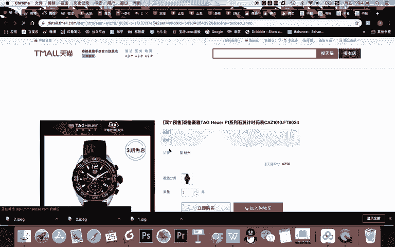

泰格豪雅的首页上面也是一个页面，我一点去哪了？我点了他首页的这个图片，其实我去到的又是这个页面。

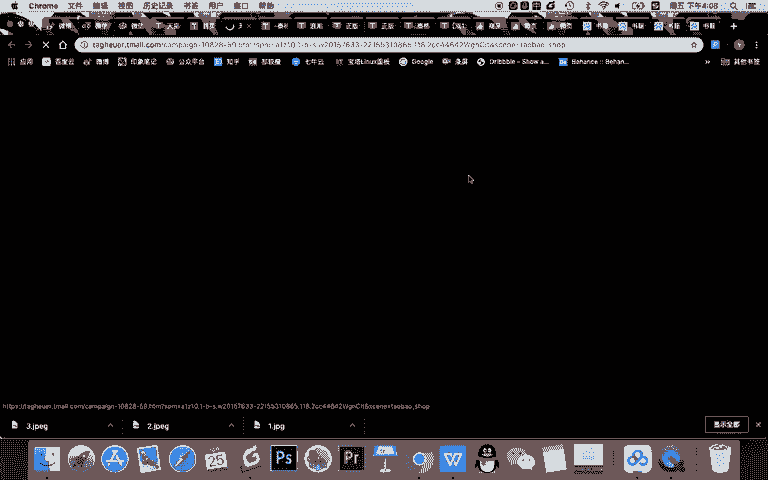

对不对？能理解不能？就是啊你我给你主写这句话啊。首先第一个啊是。商品或者叫一件件商品能组成页面，页面最终组成店铺。但记得第二个。先有。不同的。商品组成一个页面，然后呢。接着。然后不同的页面在。左长。

什么呀？新的页面，这个页面可以是。主页。

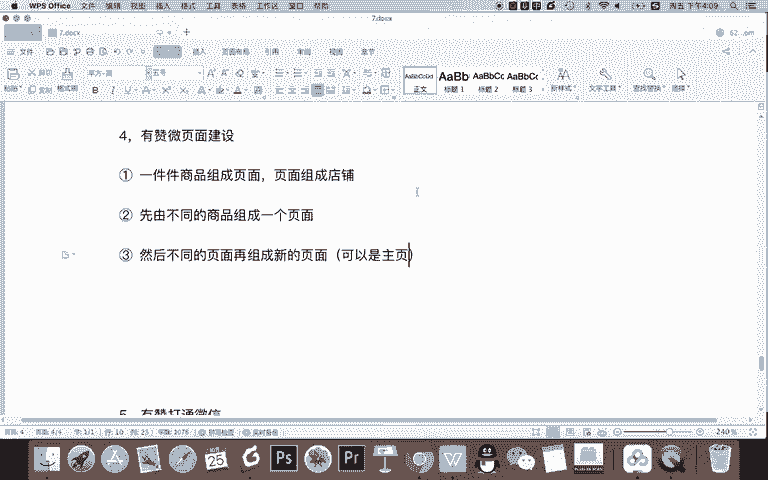

比如我们在淘宝上啊，或者说天猫上再随便找一个。随便找一个，你看我们找，假如说找这个页面。

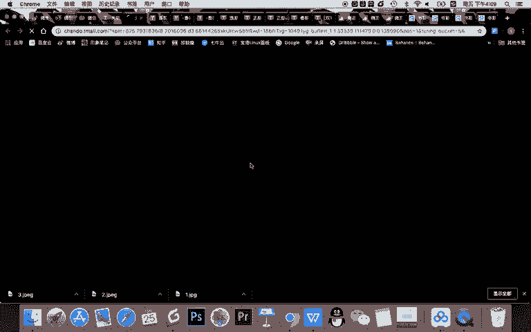

OK进入到了自然堂旗舰店的页面。首先你看这里面是不是跟我们很像，有图片有商品能点击，那跟我们的这个。长得是一样的，哎，有焦点图，有商品等等可以点击。那然后我们看到自然堂这里能去哪儿呢？

能去哪能去到其他的些页面。比如说你看这个是什么，我一点。哎，去到了商品，对不对？再看自然堂能不能去到其他的一些页面，点这个优惠券。

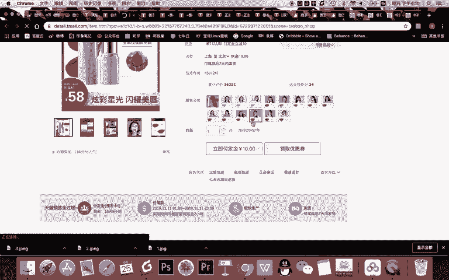

去掉优惠券，他就让哎他这就是直接淘宝让我去什么登录了，对吧？领优惠券。然后去这个又趣的商品。所以你可以看到自然堂的这样一个首页是可以直接。

访问到商品。那我们现在能不能把我们的页面也去访问商品，当然可以。你看在这个图片跳转的里面，我们可以选择去跳转各种东西。当然可以选择去跳转是么？某一个商品，你看我就去点击了我的这个商品。

确认约等于现在我点击这个图片，也就是在上面的这个图片的话，它就能去了这个书籍，就是我建设的这个书籍。然后呢，现在这个页面我也让他去到商品。

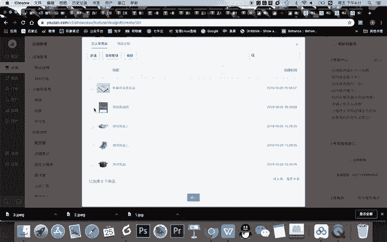

大家看我选了一个测试商品4，我可以确认现在呢约等于这个两个图片都去到了商品。但是你看啊下面这个内容，假如我不想要怎么办？这是一个模板，对不对？我不想要，我可以很简单的。删掉它。这也不是不想要也去。

全部都可以删掉的。对吧这都可以删掉的。你说哎老师，你把这所有都删掉了，但是你又想做怎么？