# 微信公众号运营视频全套 手撕运营 拳拳到肉 - P62：4.04-有赞微页面建设~2 - 达妹_达内教育 - BV1UvvvebEdT

啊，那我告诉你很简单。想添加什么你都可以添加的。比如说你看啊现在。我把所有的东西删掉。哎，大家看下面这些就是组件了，组件就是你你想把这个页面建成什么样就什么样。比如说除了这两个图片之外。

我想让它去在这个下面去显示一个什么？显示商品，哎，我就直接点商品，大家看直接会有一个商品的模板展示在这里，但是我感觉它非常的不好看，对不对？怎么办？我不想让这个商品完全的这样展示。

我可以去选择一行三个小商品，可以吧？声点啦。我还可以一行一个大两个小这样去展示。哎，我比如说我现在想让这个去展示。对吧或者你看啊我就。全部是横向滑动的一堆的上面也可以。你说哎我现在不想只展示商品了。

我还要去展示一些什么？比如说图片的广告，那我就可以把这个图片的广告放在这儿，甚至我又放在上面。那我要告诉大家的是，大家看现在这个图片的广告跟上面这个是一样的，对不对？是吧你摔重复了怎么办？我删掉他。

在其他的组件里面，我可以去做各种的营销。比如说一添加一些优惠券。对吧让用户进来领券，甚至呢我还要添加一些秒杀的东西是吧？我放你看我放在这里秒杀，然后这个秒杀展示太多怎么办？一行三个秒杀对吧？这是商品。

这是秒杀。你说这东西怎么没有？

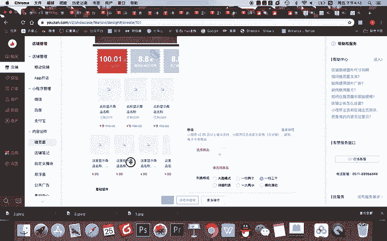

那我告诉大家，这里面都是默认的啊，你要建设一些商品是秒杀活动的，它会默认显示在这里。比如大家看。比如大家看现在我建的这个组是什么？是一个商品组，但是它有商品没有没有，那怎么办？

这三款三个图片显示哪三个商品呢？我可以去我的商品里面。去怎么样？比如说这是一个秒杀活动，我还没有啊，我就不去秒杀了。我这样我再给大家新建一个商品，你看这个商品分组呢，一行是三个，总共显示两行。

但没有商品怎么办？

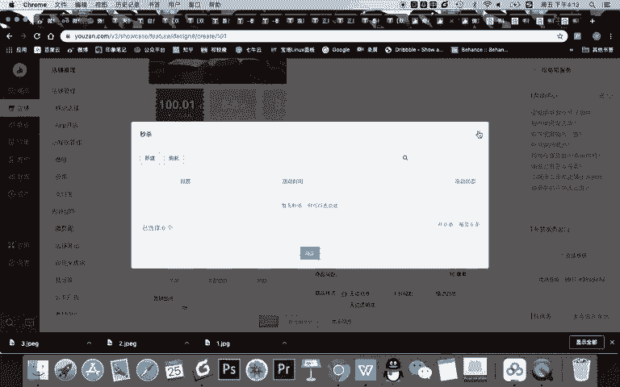

我直接去选择这个确认。

然后呢。再添加，比如我把我的书记再确认，你看书记在这了。再添加，比如把这个花生啊放在这儿再添加OK约等于在这个地方就有了三个我的商品焦点图去到这商品，焦点图也可以去到商品。

那你说我焦点图能不能不让他去到商品，比如第一个是两个图片中的，第一个是让他去到我的商品，第二个我改掉。

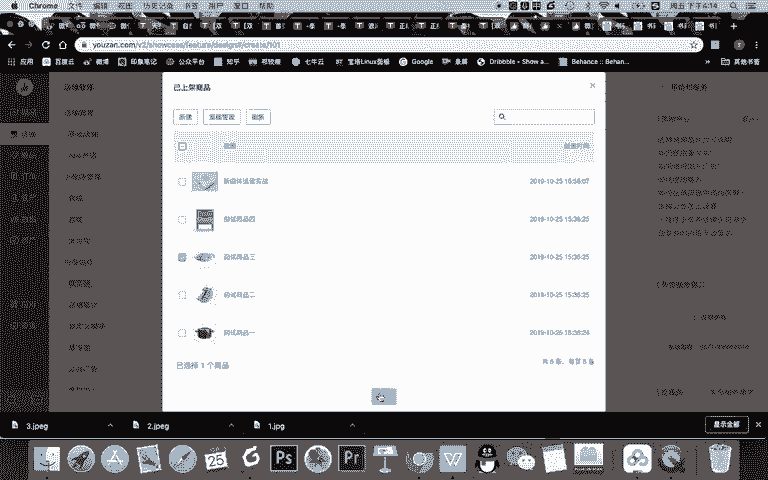

我把这个内容进行去到某一个新的。页面。比如大家看在页面这里呢，我只建了一个其教师心理理课堂的一个页面。还有呢它的默认的一个页面，对不对？所以我没有更多的页面，对吧？当然我还可以去找到默认的一些分类。

最热最新的分类。如果是最热的话，那你的店铺的哪些商品访问量很高。那这个商品它就会默认显着。比如我现在给大家显示最新的分类。

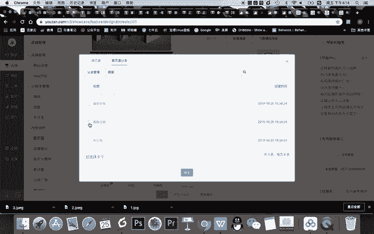

OK那你就能看到到时间你点这个去到了一个什么呀，你看最新分类里，最新分类里肯定还有我这个数据。因为我刚刚添加了这个数据。当然，除了以上内容之外，我还可以去添加更多的东西到到我这个页面上面。

比如我现在看啊。我想添加一个关注公众号的内容。对吧你看我的公众号的内容就有了，但是这个功能呢你需要去设置好，对吧？才能用。然后你说哎我不想要这个了，我还能添加一个什么吗？写一句话，添加一个标题。

比如添加什么标题，哎，我们把这个内容放下面。什么双十一。现实。折扣。什么限时折扣优惠券。领取中。对吧然后呢，他就跟他挨着就可以了。你说哎他挨着不够近呢，我感觉这个好像离上面近，那怎么办？

你甚至可以添加一些什么呀？辅助线，你看我点了一下辅助线，这就多一个线。这个线呢我就可以。放在这里，这样的话这个线又区分了他们和他们之间的距离。你说我还想添加别的。辅助空白。

把这个东西跟这个区分开OK区分开了。好，同学们，现在我希望大家理解一个概念就是什么？就是微页面的一个建设。什么是微页面？微页面就是你可以把商品组成页面或者添加各种素材模板组成页面。

然后为这些素材添加具体的内容。比如现在我这个没有优惠券，所以我就不能添加我删掉删掉之后。在我建的这个简单的微页面上，大家能看到的是什么？能看到的是我建了两个图片，然后呢一组商品。

对吧那么我让这个东西保存并继续之后，我的这个页面就出现在了我的什么呀？我的什么呀，我的店铺里了。比如大家现在看一下啊，你看我再去到我我页面。在我的微页面里就有一个齐教授新媒体课堂这个页面。

这就是我刚刚建的页面。然后我点开。

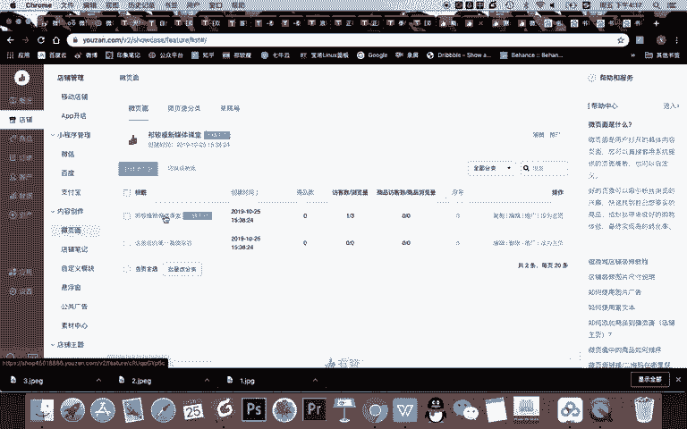

打卡。点开之后啊，他就是我的。这样一个页面的一个造型。

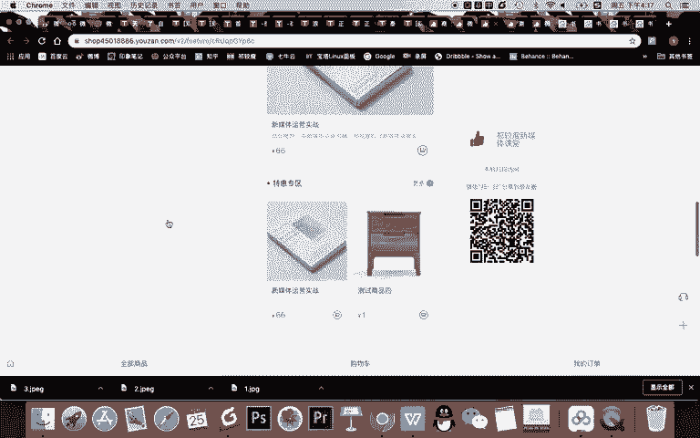

能理解吗？这是你的。页面啊。那我们现在要干嘛？你可以建多个页面，我给大家演示一下什么叫建多个页面啊。比如第一个啊，我建设一个这样一个页面。Yeah。7。比如这个页面，比如说叫。啊，课程。页面。点击上架。

但是你看啊他还没有对吧？没有内容怎么办呢？我随便去。啊，我看看我能不能随便去添加一些。

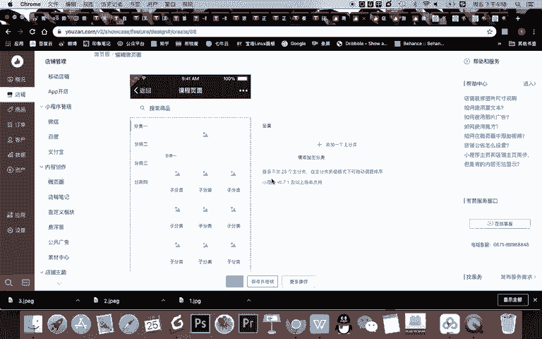

内容啊，比如说我添加一个背景图吧，就。

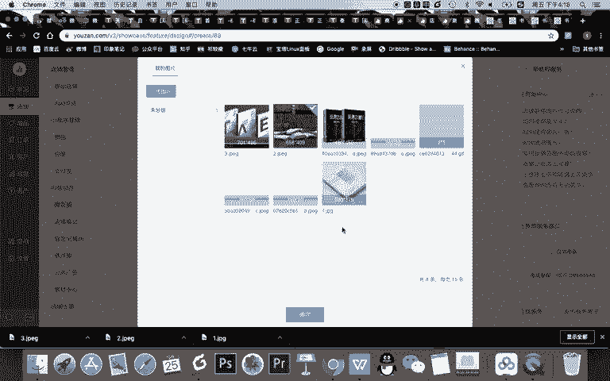

分类呢，比如说我就。啊，就就就这样去做，然后子分类它当然都需要添加啊，我看看能不能不添加。你看还需要我去添加更多的一个分类，那我怎么办？我就删除掉它。啊，还是必须你看像这个类型呢。

我还必须去添加具体的内容。所以我现在想给大家去建多个页面，但是因为时间关系啊，我不能够去给大家一个一个建页面。但是现在我希望大家注意一点啊。来，大家看一下。首先记得。你的商品组成了页面之后啊。

你这里可以建多个页面，然后多个页面组合成一个新的页面。比如这个新的页面叫主页，然后你就可以把你的主页去放到你的什么呀？比如放到你的微信的店铺里。比如举一例子啊，我给大家去。

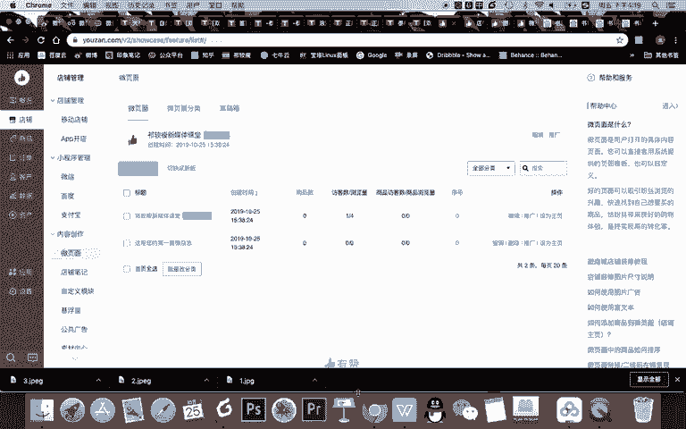

画一个图吧，看看让大家了解一下。首先。比如我给大家去。放一个东西，假如这个东西是一个商品。大，朋们，我们假如已经上传了多个商品，比如。上传了。三个商品。同时呢这三个商品假如我又给他。上传到6个商品。

什么意思？因为我刚刚其实只上传了一个商品，对不对？那三个商品呢，我又分别让三个商品做成了一个页面。就像我刚刚给大家演示的那现在比如我再去。做一个内容。填充呢我就要无填充，哎，这是一个页面。

这也是一个页面，比如这个页面就叫书籍页面，这个页面叫视频页面，这里面分别是三个商品。这三个商品呢，比如我让他用。黄色表示，然后呢，这是一个页面这是一个页面。那这两个页面我又同时可以干嘛？

我又同时可以把它放到一个面页面上，怎么放？很简单啊，比如你看我再插入一个。这个形状。填充呢我还选择无填充OK放到同一个页面，它怎么显示呢？很简单，我去把它弄成一个什么。实心的，比如说把它弄成一个图片。

约等于在一个新的页面上，我一点这个图片就去到了这个页面。这个页面打开呢又有两个图片，两个图片一点开又有三个一个页面是三个商品。然后这三个商品，我再一点去到具体某一个商品，这就是什么呀？

页面和页面组成的一个主页，所以这个图片约等于是主页上的一个图片，我点了主页上的这个图片之后，直接看到的是这个页面的两个内容，比如两个图片，一个图片，两个图片。然后我又点了这两个小图片之后，哎。

去到的是三款商品。然后在这里呢去到是另外三款商品，对吧？我两个页面，两个图片都可以点，然后看到这三个商品之后，我可以点着击任何一个商品进行购买。所以你记得页面。

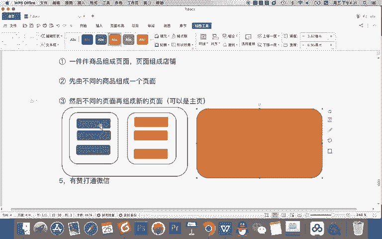

是由商品组成的，页面也是由其他的页面组成的。回到我们天猫上的一个展示效果。

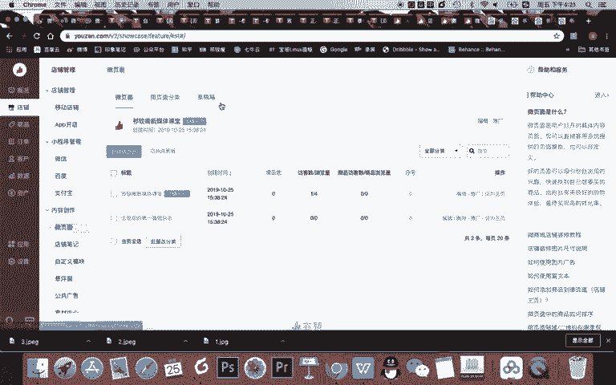

比如我们看自然堂旗舰店的这个页面，这是它的什么？