# 微信公众号运营视频全套 手撕运营 拳拳到肉 - P63：4.04-有赞微页面建设~3 - 达妹_达内教育 - BV1UvvvebEdT

这就是它的首页。首页呢你看就是有很多可以点击的内容。比如在这里一点去哪儿？既可以看到啊，既可以点这个图片去到新的页面，也可以去到某一个商品。那我们就来看它是去到商品还是去到新的页面。哎，直接去到的商品。

对不对？

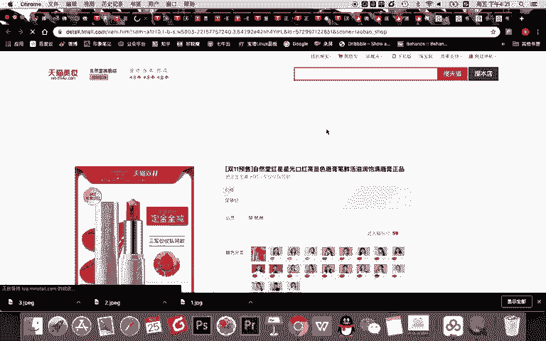

所以是可以的啊，你说能不能点它不去到上面去到别的页面，那得是一个更高级的一个页面。比如说。对天猫来说。天猫的首页是由多个什么呀，图片组成的对吧？但是这些图片去哪儿了，去到了新的页面，这些页面又去了商面。

比如说我们点这个。点天猫上的这个图片，我们去到了一个新的页面，对吧？这个页面是由什么组成的？你看我看是由商品组成的，我一点具体的某一个就去到一个商品。比如点这个有可能去的，你看这是一个图片。

有可能去到商品或取到新的页面。我们一点哎，又去到了一个页面，对不对？再点去到了某一个商品。所以你能理解的这个商品，你看啊商品。组成页面。页面又组成新的页面，然后很多页面组合成了一个主页。

也就是天猫的主页。

约等于比如说你现在假如在有赞里啊去组合了多个页面，成为店铺主页之后，你可以把你的店铺的主页放到你的。

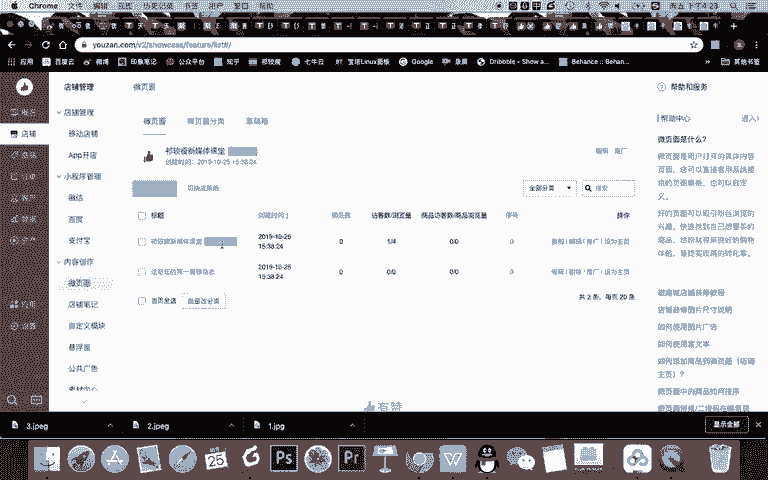

微信里，比如大家点开一下。这是你的店铺的一个主页。对吧然后呢，你看这个主页，你说哎我这个主页不好看怎么办？我删。

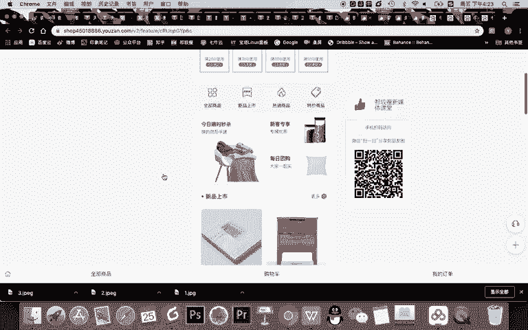

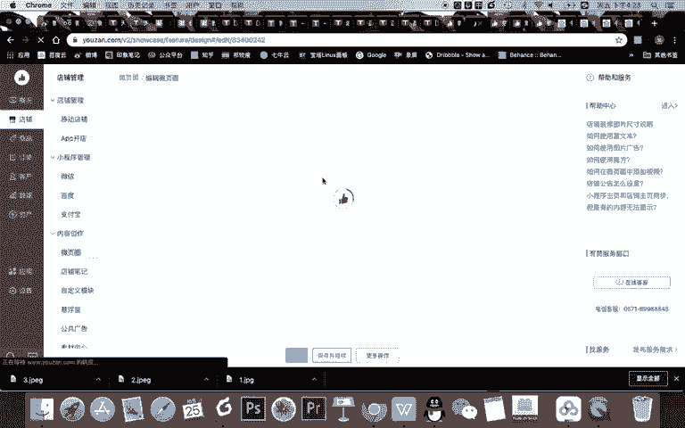

或者说爱进行修改，你说他长得不好看，我我想换成我的图片，很简单，你还要这个造型，对吧？你看直接替换。图片。确认。替换。图片确认，然后让他去到新的页面，可以不可以？当然可以，你看在这里可以找页面。

也可以找商品。比如你可以去到微页面去分类，但现在我们没有页面，让它去到商品。哎去到这个商面确认。然后在这里呢也是去到，我让他不去商品商品分组去到这个书籍的分组。但其你知道这个分组里只有什么。

只有一个我上传的一个商品。

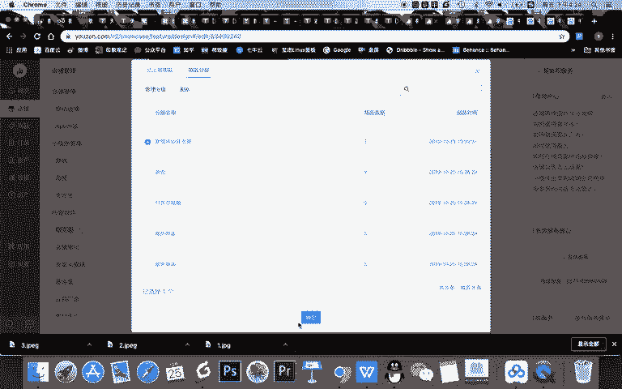

OK下面呢也一样，是这些优惠券等等。但现在我没有这些券，我全部。什么呀，删掉它，因为我不删的话，你会知道它会有什么情况。他是有可能无法发布的，因为这里都需要去上选择商品了，对吧？所以你看啊这都是添加的。

你说在哪添加在最下面这些个性化的。所以你看这都是可以去。删掉。OK假如这个店铺的主页，你做了很多的图片，跳转到很多的页面。那么此时这个页面做好了，你就可以点击上家，然后你的主页就做好了。

主主页做好之后就干嘛？直接做好之后就可以去推广了，怎么推看点击推广，你能获取这个店铺的二维码或地址。

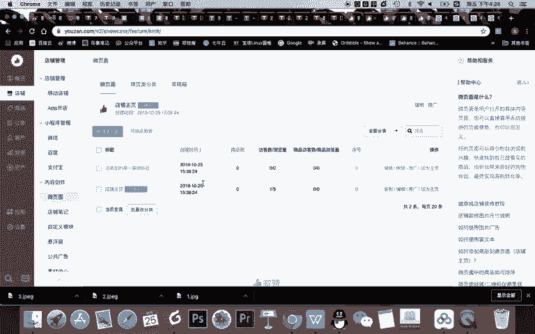

那我接下来就给大家讲讲如何把你的什么呀。

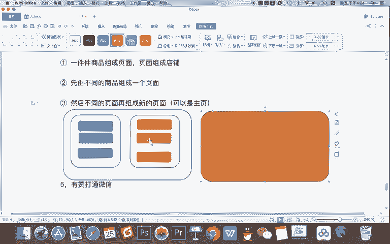

有赞跟店铺打通。其实记得有赞店铺就是一个链接。

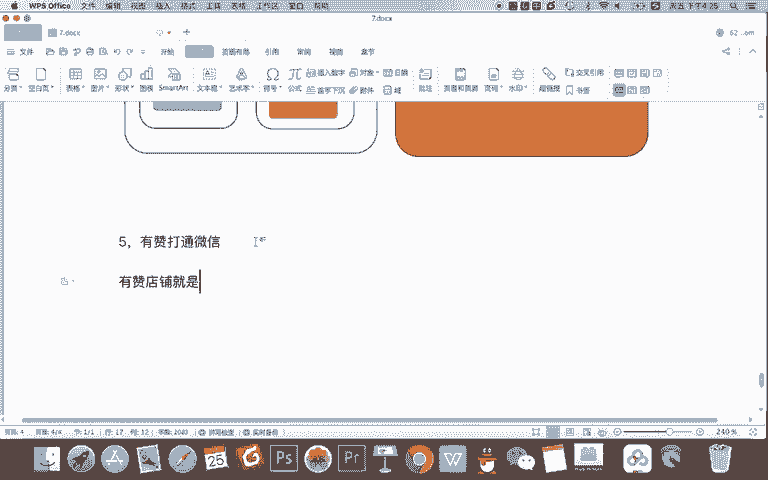

对吧因为我们做的这个店铺就是一个页面嘛，它就是一个链接。所以你看我现在可以打开这个链接。打开这个链接，就是你建的这个店铺的主页，就是我们刚刚让它长成这个样子，对吧？你可以把它改成别的样子。

甚至呢你还要让去用户去的一个主页，这就是主页。你看一访问。

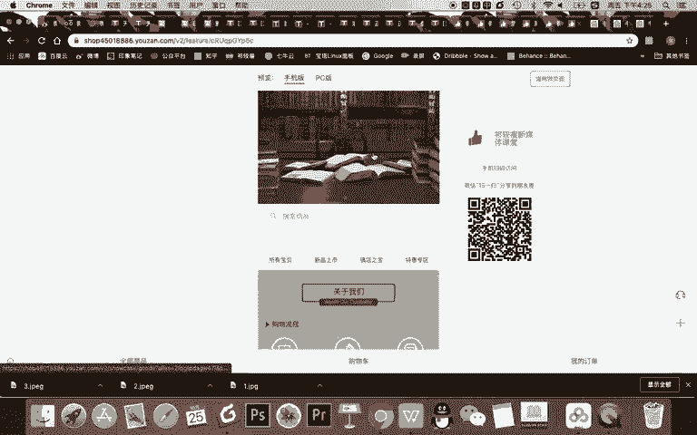

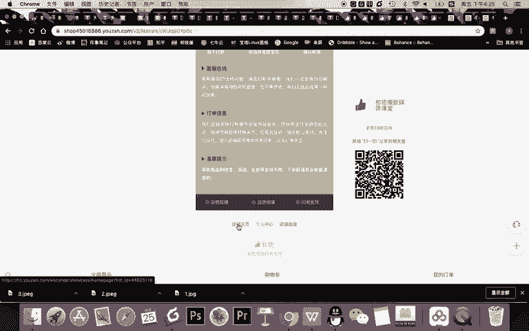

还是这个页面，但是你也可以放商品的页面等等去跟有跟你的微信打通。那怎么打通呢？其实用链接打通。那我接下来给大家提供几个方法。最常见第一个一。

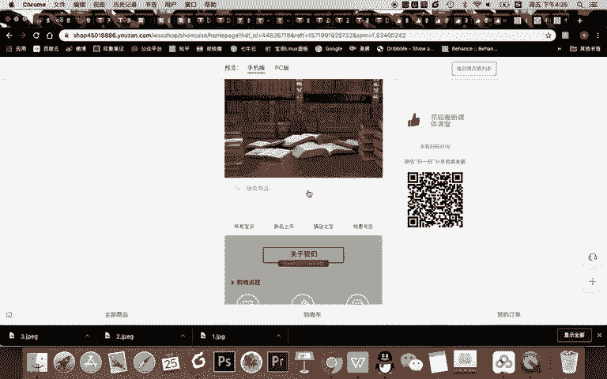

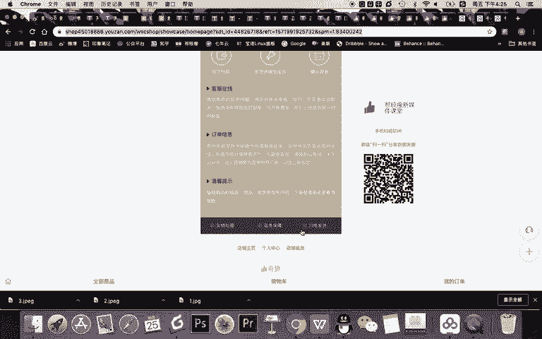

把。🤢，店铺。链接放到。公众号哪儿啊？对，自定义菜单里。对吧这是一个方法。第二。什么呀？链接放是什么？放到被关注回复里。

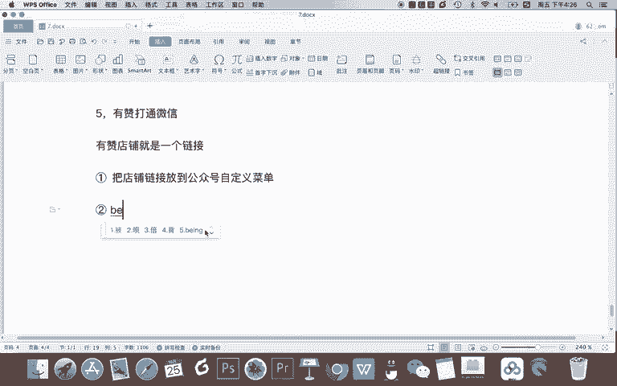

比如大家有没有见过这种回复啊，你看一下，我给大家。

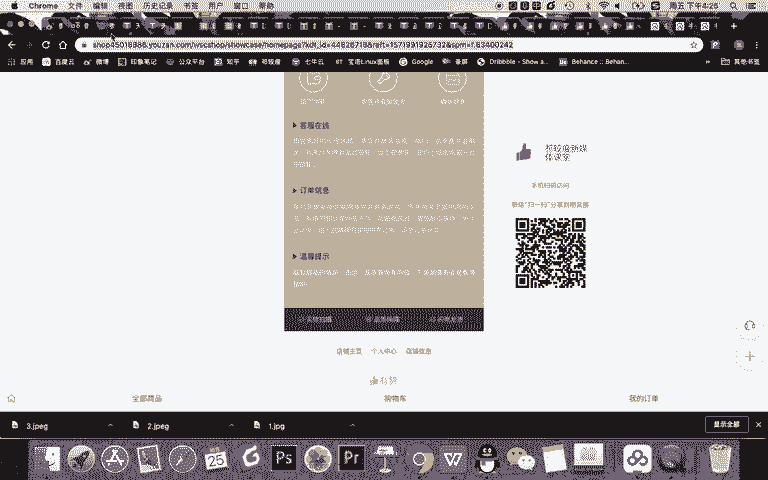

看一下被关注回复。比如我扫码登录一下啊。Yes。比如大家你直接在他的。这个关注里看到的就是这样一句话，比如说点击在我们前面的课程也有讲也有讲解啊，比如说。点击。店铺。什么访问。什么呀，店铺访问在线。

店铺，而且。注意朋友们，这两个店铺这两个字是什么？这两个字其实是文字链，那怎么设置呢？我们之前有代码，其实现在很简单，你既可以把。

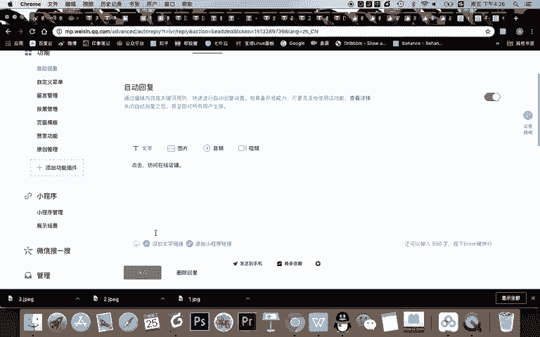

比如说这个店铺的地址。

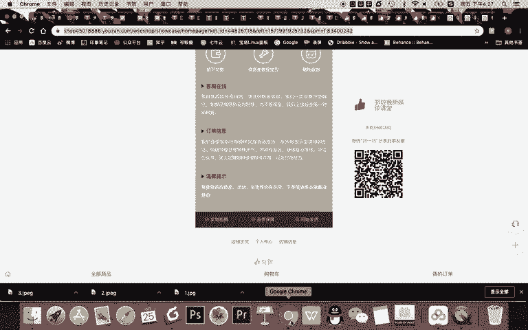

对吧放在你的。这里然后直接改成两个字。对吧。店铺okK确认。OK你这样一设置之后，这个文字链就会显示出来什么？点击店铺访问在线店铺啊，你用户就可以直接在你的公众号一关注就能看到你的这个。

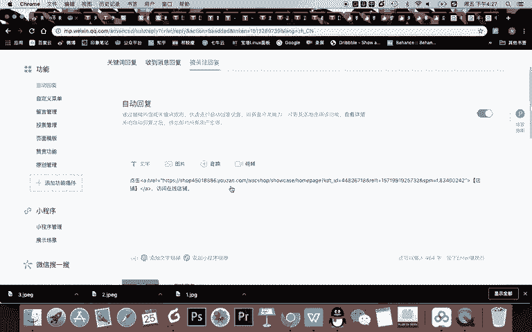

点铺那还有什么方法？在微信的公众上兑换里，其实还有什么？关键词回复，比如你告诉用户什么。

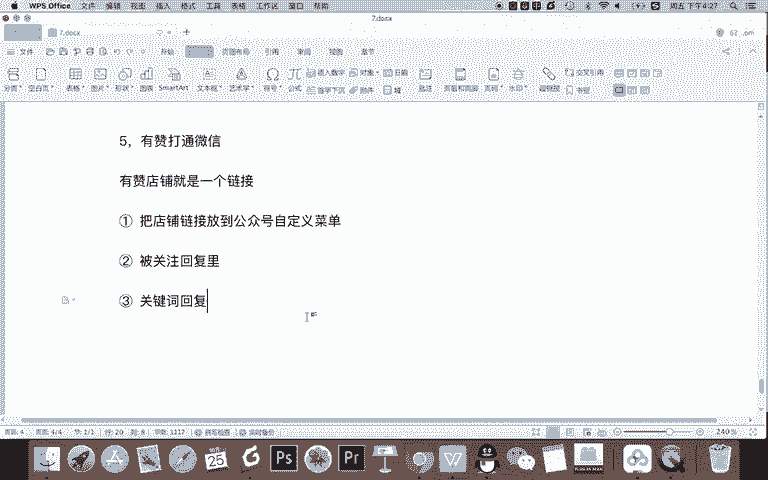

回复。一什么呀，访问。商城。对吧回复一直接访回商上，用户一回复一啊，收到一个文字链，你给他一个店铺。

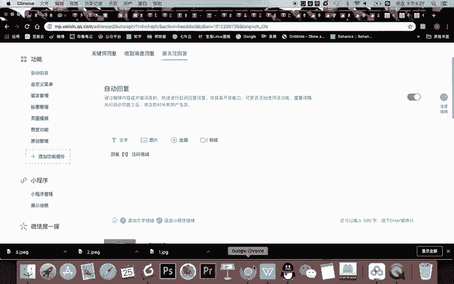

那其实除了这个微信对话了，也在这样呢，三个地方可以设置店铺之外，还有什么方法？还有第四个非常常见的，比如说啊我们写一篇文章去介绍某个商品，或介绍你们的商城之后，你可以阅读。原文。

对吧把你的阅读原文链接放成店铺的地址可以访问。还有没有？还有啊还有第五个啊，非常常见的在哪？记得。微信图文中放。二维码。而且注意大家看啊。

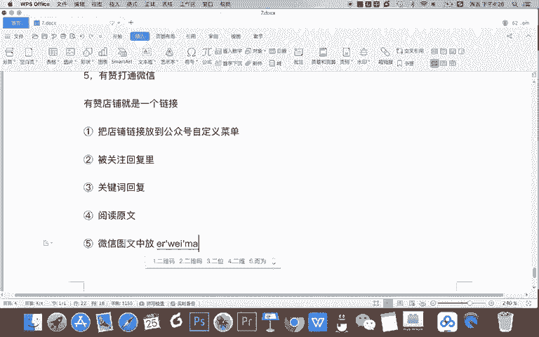

在我刚刚建设的这个店铺上，我们在后台可以看到它既有什么。

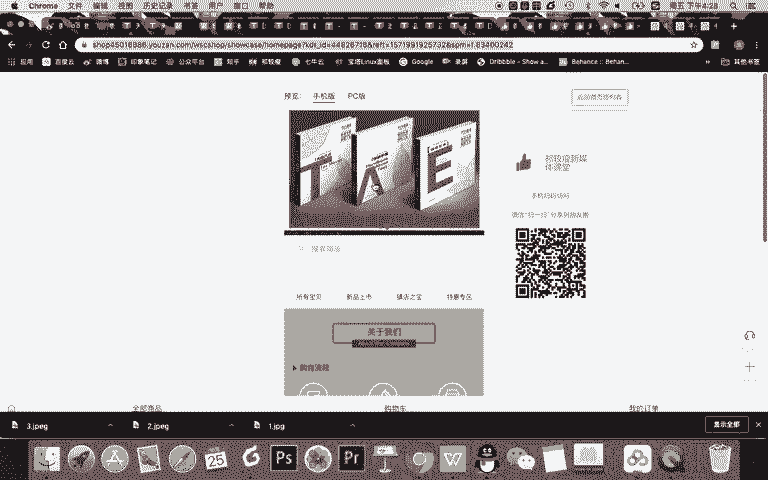

你去推广这个店铺的时候，既有链接，还有二维码。但是注意千万不要去。

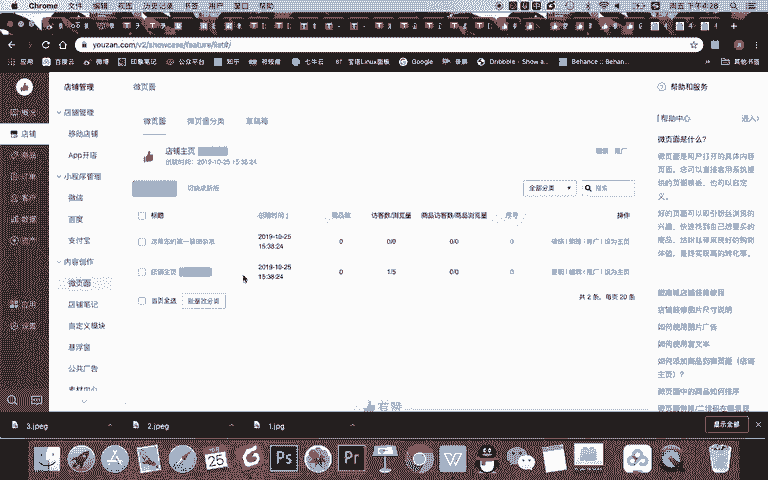

发这个什么呀？你看剪下的二维码，不要去发这个链接。因为我们知道微信的公众号的图文里是不能放外链的，这个有赞的就属于外部链接，对吧？所以呢你不能放你直接把这个某一个商品或某一个页面的二维码。

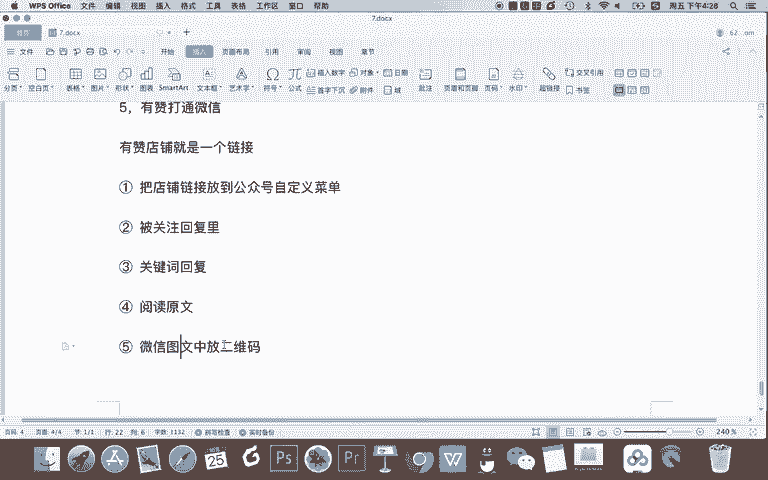

放在这个有赞里也是能够打通的。

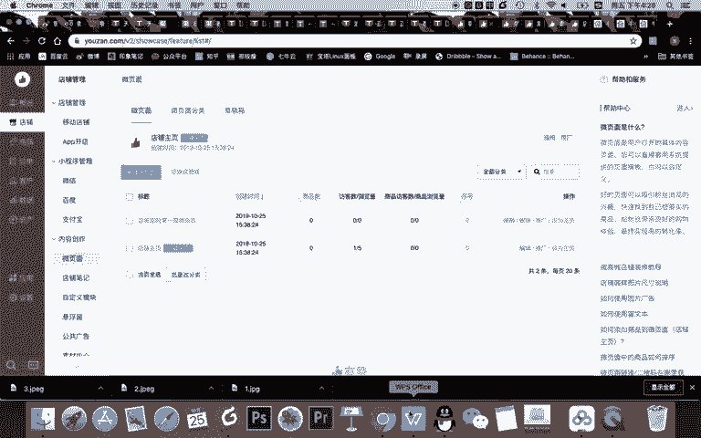

还有吗？还有没有别的地方？其实啊我们主要的。我们的微信跟公众号啊，或者说我们的微信店铺跟公众号打通的最核心的方式就这个。其实很多企业会在自定菜单中放多个链接。比如说其中一个叫主页，还有一些什么呀？

一个页面地址。比如你建了一个页面，这个页面叫。

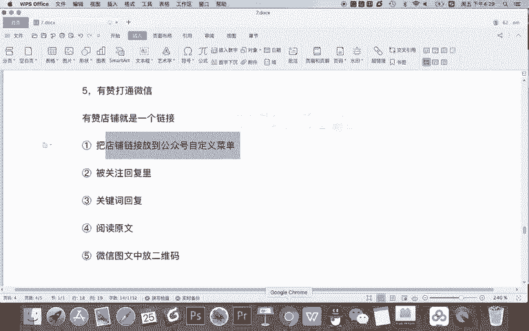

折扣商品页面，然后把那个商品的页面链接也放在你的。

自定菜单里约等于点开一个自定菜单，它有多个可以跳转的可访问的页面，都是直接在有站里能够设置好了。当然你还可以干嘛？第六点。生成。小程序把小程序放在文章或。自定菜。当中。都可以。

有赞呢也支持把你的整个店铺，你看啊做成什么小程序店铺，可以一键生成你的小程序店铺，然后呢把它放在微信里，甚至放在百度啊，支付宝里都是可以的。所以呢用有赞去创作或创建一个店铺是非方面的。

但希望大家记得整个里面有两个难点啊，第一，你会借建设这个商品和。

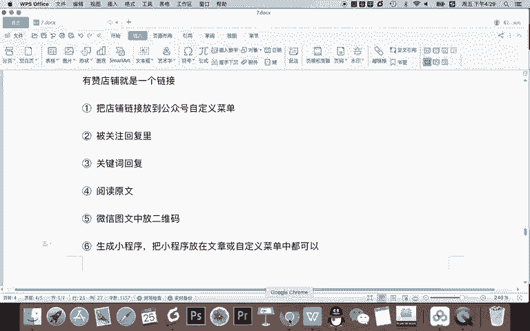

商品的什么分组就可以。第二呢，你要会把商品组成不同的页面，然后把不同的页面又组合成一个店铺。比如主页就可以跳转到多个页面或多个商品就可以。OK那关于本节课呢，我们其实给大家讲了两个核心的内容。

第一就是如何把商品组成页面。希望大家在我的演示，以及看这个图片里能理解如何去建页面。然后其次就是建一个一主页页面啊之后，把你的这个页面如何跟你的。

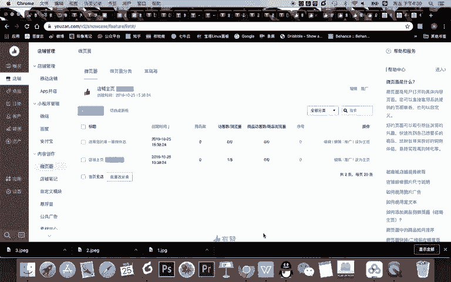

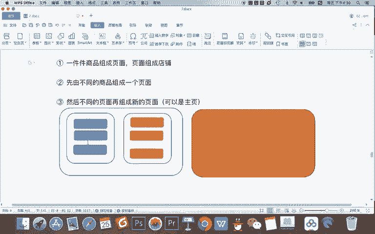

这个微信的公众号打通啊，最核心的就是自定菜单，然后有被关注回的关键词会有阅读原文，还有微信图文。那通过以上方法呢，就能够把你的整个的商品或者你们的整个店铺去推广到微信里接触的用户。

然后从而实现对用户的一个推广和转化销售。O关于微信店铺的搭建就到这里，希望大家能够注册一个有赞，然后去利用一周的免费的时间去搭建一下你的店铺跟你的公众号打通。最后强调一下，个人订阅号是无法认证的。

也不能在自定菜单当中放什么呀？店铺的链接。但是你记得企业的公众号一般都是认证的，是可以放链接的。如果你个人呢去。用友赞做了一个店铺，你可以用以下的一些方式去跟你的公众号打通。

OK我们关于微信店铺的搭建就到这里，我们下节课将学习新的内容。

