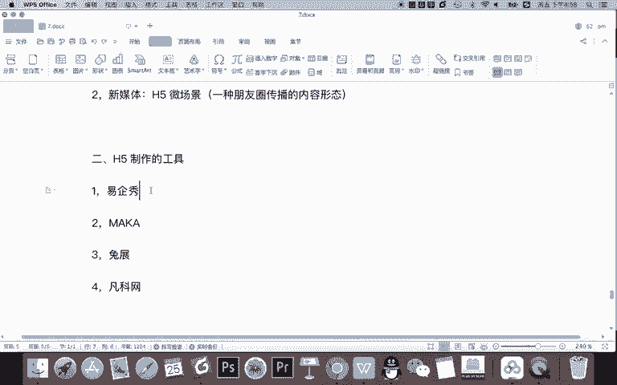
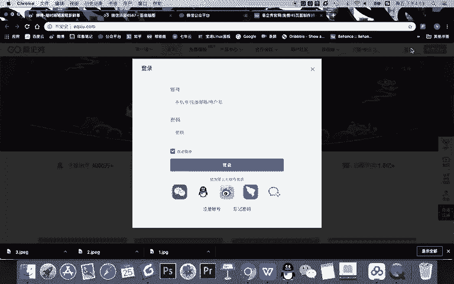
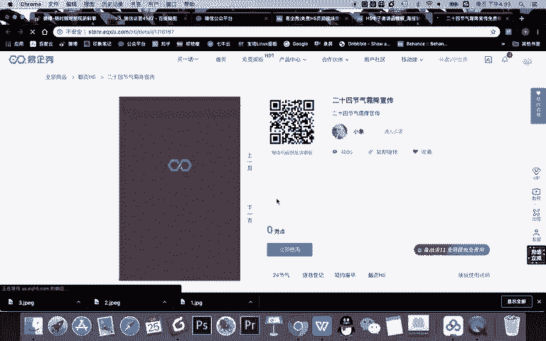
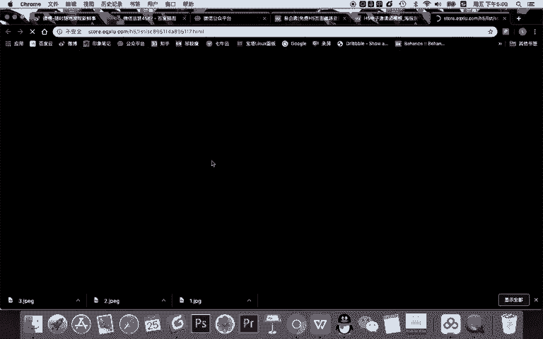
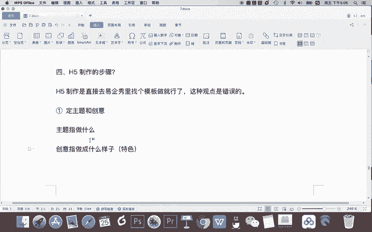

# 微信公众号运营视频全套 手撕运营 拳拳到肉 - P64：4.05-微信H5制作~1 - 达妹_达内教育 - BV1UvvvebEdT

同学们好，欢迎大家来学习微信H5制作的相关内容啊。首先第一个问题，我相信学新媒体的同学都会知道啊，什么是H5，那到底什么是H5呢？其实H5呢对我们新媒体行业人来说啊。

他跟我们整个互联网啊整个行业来理解是不同的概念。从互联网的角度来理解是什么？Ht。ML5。你看啊我们搜一下HTML。Yeah。

他做的是什么？其实做的是页面开发，它是一种什么程序员开发这种页面编程的语言啊，比如说HTML，你可以看一下它的什么。

看一下他的百度百科的一个介绍。但其实我们新媒体所指的H5是什么？指的是。H5。微场景。微场景啊，它是什么？一种。朋友圈。传播的。内容形态。啊，比如说我们一搜H5制作啊，你看。出来的跟刚刚不一样了。

出来就变成什么。😡，玛卡一起秀拓展凡科这些平台啊，对不对？刚刚我们HTMML5是编程语。你就是什么程序员理解的HTH5跟我们新媒体所说H5是不一样的。今天我们要教大家做的是什么？就是H5微场景。

那第二呢，首先给大家分享一下H5。制作的工具在我们新媒体里面刚刚给大家看到那几个其实都是还不错的工具。比如说第一个。一起笑。对吧然后呢。比如第二个还有什么？玛卡。第三，还有什么？还有比如说拓展啊。

也是专门做一组。还有第四个，我们之前给大家提到的凡科互动有什么？凡科网。等等啊，还有更多的一些H5制作的工具。其实你只要搜H5制作就能找到这平台。那今天我们教大家去制作H5呢，用的是一起绣。

就比如我们来来先看一下啊，一起秀。

首先啊大家可以像我一样啊登录注册啊，因为我经常使用，所以我就直接登录。

OK进入一起修之后，我先给大家讲一下我们平时看的是什么东西啊。这个HO比如大家看这里，我相信大家在你的朋友圈一定看过各种类型的，比如一些人才招聘呀。或者企业的一些介绍啊。

产品发布甚至活动介绍的一些内容啊，这些都是H5内容。比如说我们看这个。先来看一下它的效果。

。啊，比如我们声音小一点啊，会有去声音播放的一个内容啊。我建议大家见过吧？这样类似的一些内容对吧？当然它这个呢比较简单啊，基本属于静态的。来，我们可以去看更多的，比如说教育培训行业。

是自媒体行业。嗯。그。比如找一个啊这个内容。Yeah。你看啊里面都是有各种各样的一些内容的。对吧这个就跟刚刚比要丰富很多，但它是什么会员收费的一个功能。okK这些内容呢都是我们所说的一些H5。

所以第三个问题啊，就给大家简单梳理一下。H5的特点是什么？就为什么很多企业都有这个需要在。朋友圈呀或者在公司宣传的时候啊，去制作1个H5，并发到他的朋友圈进行传播。H5为什么会有这样的一些。啊。

这么受企业的喜欢和需要。选先第一个原因啊，就是H5是吗？内容。丰富。什么是内容丰富呢？就是集合了。文字不能叫文章嘛。结合的文字。图片语音。还有呢。甚至是视频。动画岛。多种。内容传播形式。或者形态吧。

比如我们知道在新媒体领域，我们主要消费者接触的一些内容形式有我们天天看文章，看图片，现在看短视频，看直播等等。那么H5的特点就是他把这所有的啊文字图片、语音视频等结合了起来。第二个特点啊。

除了内容丰富之外，第二个特点是交货。先抢。就是H5。可以通过游戏。甚是答题。等是是甚还有什么选择等。形式与。用户进行交互。就用户可以跟H5玩起来，他不只单纯的看啊。通过比如说我们之前讲过的凡客互动啊。

可以做H5的小游戏，甚至呢可以做一些H5的一些答题。比如测测你今年的运势如何，测测你是什么呃什么人格的一些人。测测你这个星座啊，在后半年你能不能转运啊等等等等。还有还有什么，还有明星换脸啊。

测测你的这个明星的相似度，对吧？等等等等。还有呢做一些选择题，做一些，比如说新媒体四6级测试等等，跟用户互动起来，有互动就怎样更有粘性啊，对用户来说印象更深刻。所以你在传播的时候效果会更好。

当然除此之外，HO还有一个特点叫什么？趣味性强，为什么这么说呢？因为H5一般是什么。有。专门的设计。和策划。内容和形式。都更有趣。做1个H5呢是企业的一项活动啊，它会在朋友圈进行传播。

所以一般它并不会像写一篇随意的文章一样，随便写写去传播。一般会把这个H5做的很有趣。不管是在视觉上看着有趣，还是在内容上都会做的更好。所以呢传播效果会更好。所以把H5做有趣，做的有交互性。

一在依靠它丰富的内容。那么呢在朋友圈的传播效果会更好，也更利于企业进行品牌的传播和用户的转化。所以呢H5的这些特点，也是企业细，不是经常在你的朋友圈去什么呀，制作H5去传播的一个原因。

那我们知道了H5制作的一些工具，也知道它的优势之后，我们就要去制作H5了。但是在做之前，我们首先确定一件事儿就是。H5制作的步骤。为什么这么说呢？因为有很多同学会这样理解，H5制作是直接去。一起。秀丽。

做就行了，或者说是怎么做。找个模板做就行了。其实我告诉你啊。这种。观点是错误。为什么这么说呢？因为从任何一个内容制作的角度来说啊，我们做H5或者说做任何的一个设计，你不能只靠模板。

如果你去了一起秀里面找了一个模板做，那原来你就会做成模板这个样子，对不对？所以呢做H做H5呢，其实我们要什么？从脱离模板的角度去思考，然后在制作的时候可以借助模板。当然你说哎我不用模板能不能做也可以的。

你公司去找你们的前端开发人员，然后呢再找设计。你作为一个新媒体运营人员去写完，做车创意做规划，然后呢让设计设计出这些页面，然后再用开发人员完成那些效果的实现。那么你们就能做一个独立的H5创作。

但今天呢我们给大家讲的就是用什么呀？一个人这样的一个能力去做出一个完整的H5，所以呢我们就用模板就用一起秀。但并不是说我们用一起秀就可以直接做了，而是也有正确的一个规则或者正确的一个步骤。

那好H5制作的步骤。第一步要做什么。第一步啊做任何一一个东西，包括写篇文章。第一步都是这样定。主题和创意。主题纸。做什么？😡，创意纸什吧？做成。什么。样子。或者叫就做成什么特色。比如说哎我要给公司。

比如说主题是企业宣传类的一次H组，我要给我们公司做一个宣传H组。

