# 微信公众号运营视频全套 手撕运营 拳拳到肉 - P65：4.05-微信H5制作~2 - 达妹_达内教育 - BV1UvvvebEdT

让别人了解我们的公司，认可我们的公司。那我要把我这个东西做成什么样的？你要去想想啊，比如说做成比如举个例子，互联网的。风格还有二次元的风格，包括古典的。包括什么呀？比如说漫威的等等等等，包括卡通的对吧？

甚制是什么？包括答题的。等等。你想把它做成什么样，这是你的创意所在。然后呢，定完了主题和创意之后，第二步要去什么呀进行。页面。规划。约等于说确定好。各个页面。分别。做或者分别展示。什么内容？

在这个过程中呢，有一个非常关键的内容就什么？确定。H5。整体的一个什么呀？逻辑。就是比如说假如这个页面总共有10页的话，你第一页到第十页，它们之间是有一个顺程的逻辑的。但现在在页面规划上。

首先第一步解决钥式什么？几页。合适。大家认为做1个H5做几个合适。其实我不建议大家去参考一起秀里面的一些模板，你看看它多少亿啊，那里没有参考价值。因为很多模板呢就是单纯的一个模板。

它并没有把这个啊比如说该放的内容全放进去，包括它的一些动画呢，是有些时候也是不可取的。那我建议呢我们在做页面规划的时候放几页合适呢？我建议一般哈。12到。15页。不要超过15页，超过15页就太多了。

也不要低于。比如说10页左右，低于10页也太少。为什么？因为一般毕业是封面，最后一页啊联系方式啊，是吧？中间你要是总10页的话，也就8页的内容再少太少啊。当然如果一页数超过15页。

用户翻页一页页的看感觉太多啊，所以我建议呢通常就做12页左右啊，不要超过15页，然后在这个里面啊，你规划好了各页内容主要是干嘛。要除了确定。各页面。什么呀。放什么？之外。还要。确掉。各业的。文案。啊。

比如说你给公司做一个宣传性的HO，你第一页到最后一页它的页面的各页的文案要做出来啊，然后呢，最好啊甚至有些时候你还去规划出它的一个大致的设计。然后呢，你在做H5的时候，你还可以去根据它的内容去进行调整。

比如。啊，给大家举一个例子啊，比如我我给我我们公司要去做一个企业宣传性质H，那么我就要去写出它的所有的文案。这个作用呢是当我写出文案之后，我大致能知道我的这个页面某每一页分别长什么样子。然后呢。

我可以去在制作的时候，不完全受限于这个模板，它长什么样，我做什么样，而是根据我需要它是什么样。他就是什么样？OK完成了这个页面规划之后，第三步。要进行。素材的积累盒。制作。比如说。

你做一个公司宣传的H5，你要去什么？积累。收集。logo的。图片。然后呢，制作各种。需要的。素材主要是图片啊，甚至你要是想把艺术做的好，你有可能还得做什么做动图等等。然后第四部台真的是怎样？

去比如说利用。一起笑。去。制作。但另外一起就怎么做呢？第四步就是什么？利用一起笑。选择模板，然后第五步才是什么？实战的时候。制作一术选模板，我建议这样啊，记得。跟住。内容的主题和创意。风格。选择木板。

比如我们前面有说啊，我想把它做成二次元的一个内容风格。那你就在我们所有的模板里啊，你要去选择。比如说啊翻页的一些H5的模板，这里有各种各样的类型，对吧？你要去找你的需要的那个类型，建议多看啊。

多找一些模板，然后对比去选择最合适的那个模板。还有呢就比如说你们公司是一个严肃的金融类的机构，那你就要去选择一些比较严肃的正式的一些模板。如果你们是做早教类的，你就要去选择一些卡通的类模板。

还有呢可以根据你们公司的一些logo的颜色去选择相符的一些模板，选择好一个非常重要的，就要记这句话啊，记得选择一个。好500。H5制作的。成功率什么？提高一倍。至少是一倍的。

就有有些时候你比如说内容什么都规划的很好，但你选的模板不合适，那你这个H5越做越难看。但如果你选了一个好的模板，你的啊制作的成功率会提高很多啊，而且有它达标的概率很高。

但一种前提是跟这个我们的这个要求是不符的。比如说你说我根本不需要模板，我建一个空白的页面，我只需要这个平台，我自己能做的非常的好。那这个时候呢我你就不需要选模板了，你需要完全去原创它的所有的内容。

然后去创建一个内容，这就是你的1个H5的制作的一个方式。OK第五步制作的时候呢，会遵循一些操作和制作的技巧，我们等会给大家讲，但假如你现在把这个H5，比如说啊。

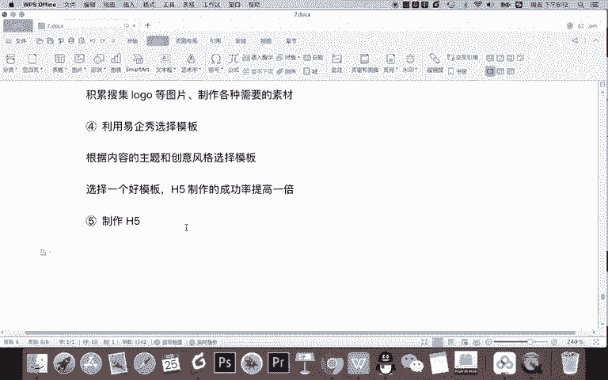

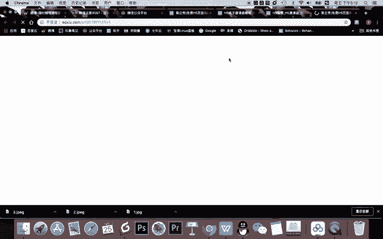

你选了一个空白的页面。或者选择了某个有模板的页面，你把这个东西做好了。那做好了之后，你要干嘛？下一步干嘛？记得完成H5制作的第六步。

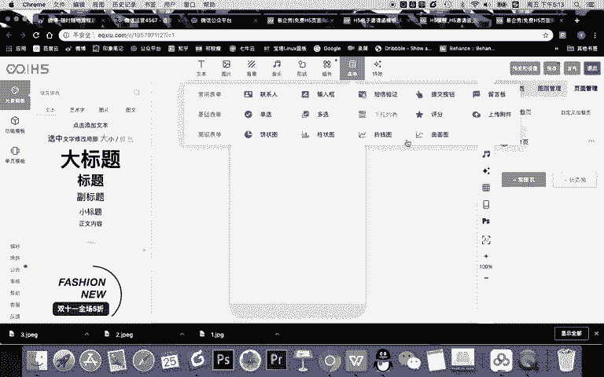

是。预览。

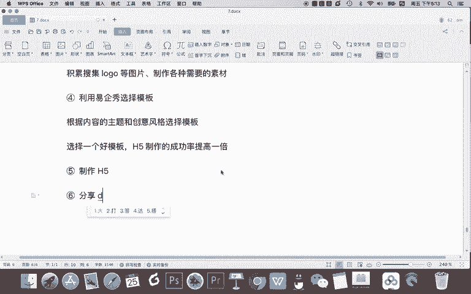

而且是分享到。手机预览。为什么要分享的手机预览？因为有可能在你的PC端啊，电脑端去查看的时候没有问题，但有可能发送到手机预览会有问题。

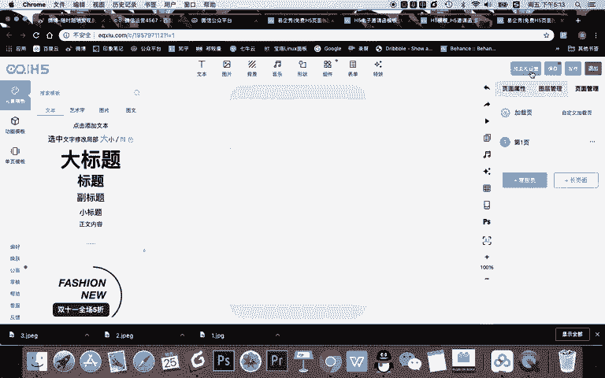

比如怎么去预览啊，记得。一定要发送到。不同。型号的手机。比如你既要在。苹果手机甚至是在比如说苹果六啊，苹果十甚至苹果十一上预览，还要在华为、oppo啊小米。各种尺寸和版本的手枪预览。

保证你的设计没有效果啊，没有去，比如说没有一些。

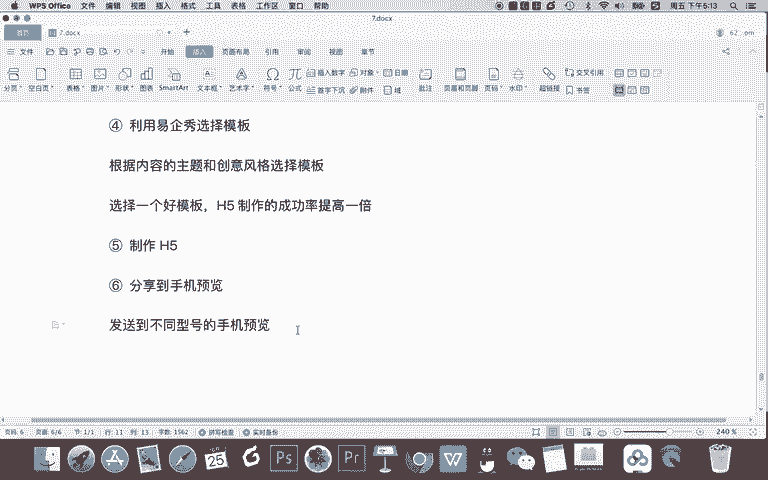

bug啊，它没有一些，比如说有些时候你在这电脑上看的没有问题，在你的苹果手机看的没有问题，但有可能在安卓手机有问题，那你就需要。

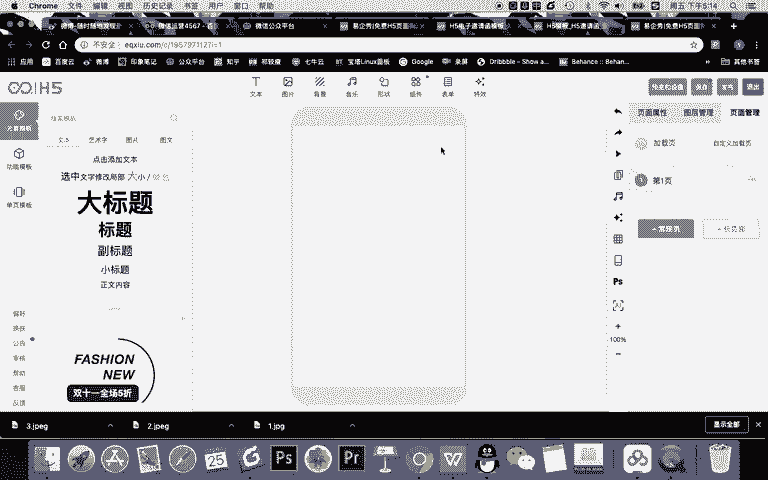

去对这个内容进行再次的调整。OK预览之后呢。记着第七步。记得。多次预览优化后。保存。然后第八步呢。是。发布。并传播那怎么发布传播呢？其实如果你给用户去推送的是吗？可以。做成。二维码或者叫。

带二维码的海报去。群发，然后呢，用户自发。在。微信群或朋友圈传播这个用户呢指能你们公司的一些人可以在微信群啊、用户等等去传播。所以最后一步是分享传播，然后记得啊制作H5。

或者用一起就制作H5只是我们这里面的其中两步。你今天因为H5制作。第一步要定主题和创意，然后去规划页面的内容，然后去积累素材。前两步呢基本是新媒体人的文案的一个技能啊，确定它。

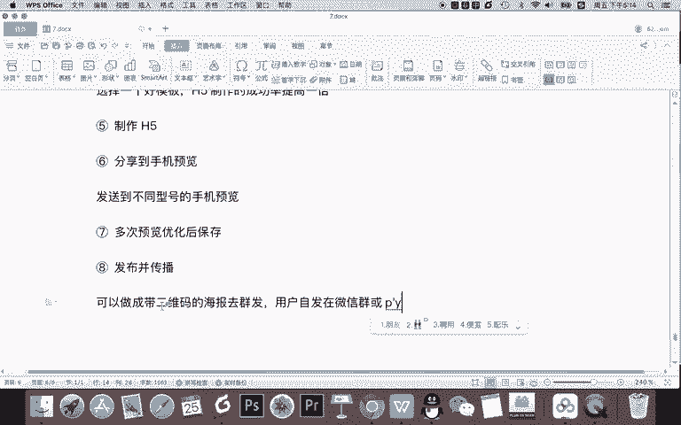

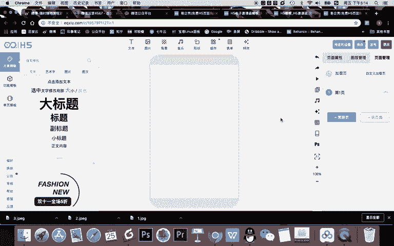

主要的主题，然后呢确定它的一个创意风格，然后去写出它的文案和页面的规划。然后去开始一步步制作。那我那么在我们的课程中呢，在关于H5的制作是非常核心的。

所以现在我本节课先给大家讲讲我们一起秀的一个内容的一个操作。

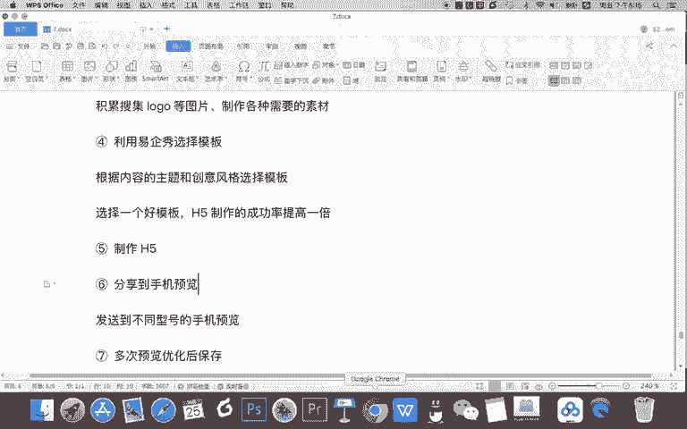

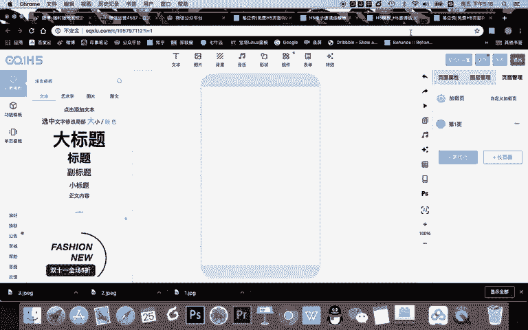

那常规来说，我们进入己绣。第一步是去选择模板。比如在模板里面，你可以去找到，比如说你们公司要去找产品介绍，所以呢你就可以先去找看有没有什么产品介绍类了。比如。做成一个邀请函类型的啊。

比如说企业服务类的吧。在企业服务类呢，比如说你们看看有没有去看促销类的很多，对吧？那我们比如说做一个促销类的吧。然后呢，作为新手来说，可以选择免费的模板。当然后期如果你们公司经常有需要做H5，你可以去。

