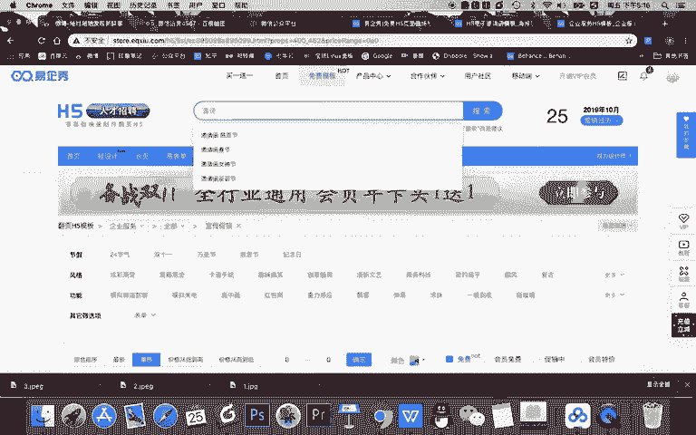
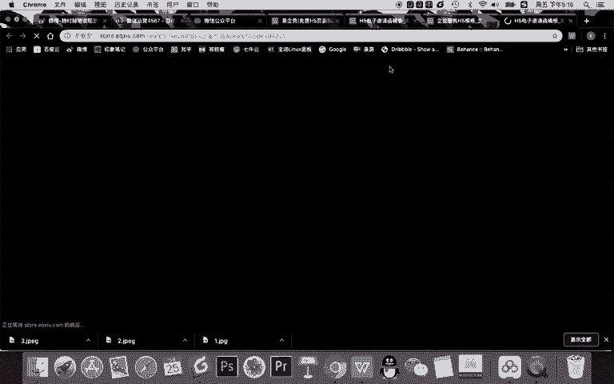
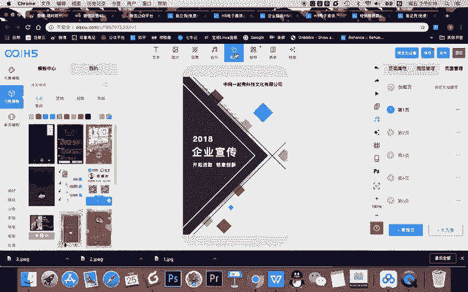
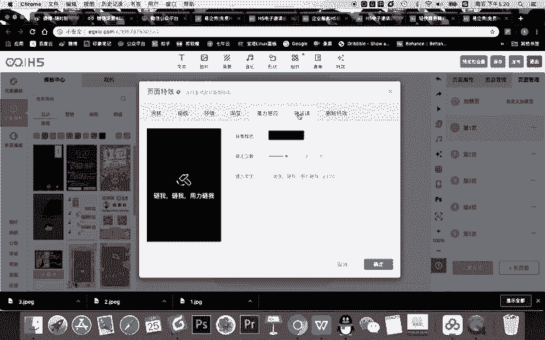
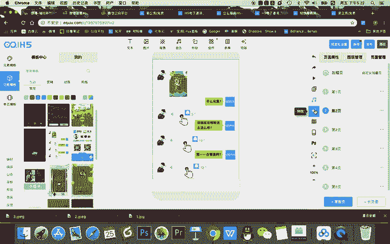
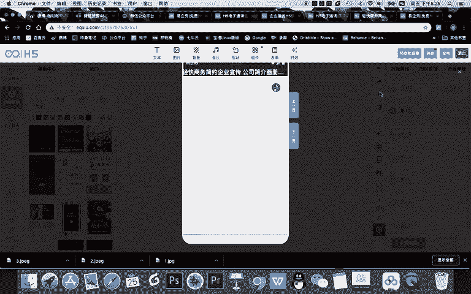
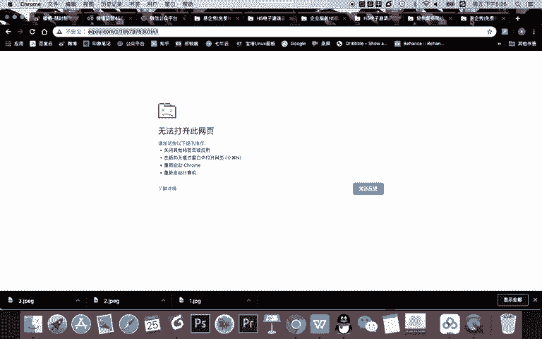
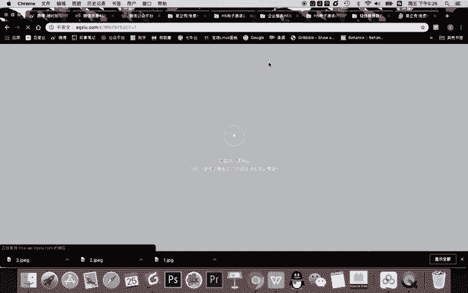
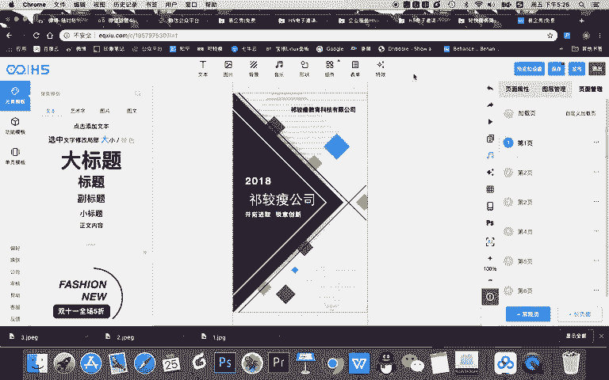

# 微信公众号运营视频全套 手撕运营 拳拳到肉 - P66：4.05-微信H5制作~3 - 达妹_达内教育 - BV1UvvvebEdT

选择什么会员免费或者说一些收费的都是可以的。但是大家看这里啊，这里当我选择了企业服务促销里面之后，然后选择最热的它只有几个。但记得啊你不用每次只选这几个，你其实有些时候可以搜索。比如说。

企业。

产品。你搜企业产品之后，也会有很多相关的。你看一些模板，甚至你直接在这里点免费，有些时候比你按类型选择更多。O大家看现在我找了一个企业产品类的一出。比如我认为这个还不错，哎，我看看他的模板怎么样。哎。

这种效果的。可以吗？哎，我感觉有点简单了啊，我再选择一个模板。比如选的这个看一下。不。其实看到这个页面，我希望大家知道一点啊，其实所谓的H5，它就是网页版，或者说手机上移动版的PPT。

如果你能把PPT做的很好，那其实你也能把H5做的很好。OK我们看这个。啊，这个比刚刚那个页面要好很多，因为它的背景，所有素材都是会动的。所以呢我现在就选择它去使用。使用之后呢，我需要对这个H5的操作啊。

非常的熟悉。那我接下来就给大家讲一下这个H5的后台的一个操作。首先，H5呢主要分为四个区域，第一个是中间的编辑区。然后左侧这边是他的素材模板区。比如啊在缩的模板区里，你可以选择文字的各种模板。

你看啊各种文字甚至艺术字的一些效果，甚至会找到一些页面的模板，还会找到一些单页的一些效果模板。那我建议大家啊不要在这里去选择任意一个模板去插入到你选择这个模板里。因为他们的风格不相同。

如果你在这里随便找了一个模板，插入在这里，它的整个的统一的设计性会被打破，所以不要去选功能模板呢，可以去参考使用一些。比如说。你看啊这个是音乐播放啊，甚至打电话的一些效果啊，你可以去使用一下。

OK这是模板里啊，当然你有些模板去使用之后，它会在我的这个模板里显示出来。那么我们如果想去在一个一起秀，或者说在一个页面上面添加文字，你看都在上面添加图片是如果想给一起秀去换背景，也在这里添加音乐形状。

组件啊都在这里组件是什么呢？比如说组件你可以添加一些。

打电话的功能，你把手机号往这里输入一确认，到时间用户一点打电话就能够给你拨打电话。然后呢，表单里面能输入。这样的一些表单啊，我认为挺挺好用的。因为比如说一些企业想去挖掘一些客户啊。

或者想邀请函去邀请一些用户参与的话，利用表单功能可以获取一些用户联系方式，他会留下他的电话。写是微信啊，或者他的一些邮箱等等给到你。然后你可以在后台获取这个信息。

OK在特效这里面呢会有一些H5的互动的特效，比如一些涂抹或像啊，你在这抹一抹，它会消除。还有呢指纹这个特效就很我个人感觉很弱智了，手指一按能够识别，其实也不是手指一摁识别二维码，不是不是识别指纹。

其实就摁一下这个动动作，对吧？所以不要用。环境这里呢在你过年的时候，比如春节的时候会可以去使用一下，比如下一些。灯录啊、红包等等啊，但我建议这些东西也不要用啊，渐变呢就是渐变色效果。

重力感应就是这个页面上面会这样来回动，还有砸玻璃效果，就是一砸啊，它会什么？它会有一个砸玻璃的音效啊，所以我建议一般不去用啊，这些里面呢只是有这种页面互动特效。

但不建议使用。ok。😊，我们最后说中间啊，我们再说右侧右侧呢其实就是页面编辑区。首先。各个页面的一些背景。对吧甚至背景的音乐、动画等等出现的效果都会在这。然后各个页面还会有图层。比如说这个页面你看。

这个素材它的图层效果对吧？它页面所有内容在这，还有呢最核心常用的是页面管理。在页面管理里里面里面，我们首先如果一个页面的效果，比如说。这个页面你想下个页面还用，可以点击这三个什么呀？哎呀菜单选择。

然后呢去复制一个页面，然后还可以删除它。还有呢一些比如说新建一个页面等等等等啊。OK啊，多个页面呢记得想排序很简单，摁着，你看摁着这个页面。第一个你往它进行上下的拖动。就能对它进行一个排序。然后呢。

整个页面就比如说一页一页的做，一般是这样一个一页面呢进行调整啊，去制作就可以。甚至你说哎，老师，我想在第二页添加一个新的页面，点击添加就会建立一个新的页面，有了新的页面什么也没有。我想要这个素材，你看。

ctrol A controll C，然后control B内容就会有了。你说我不想要这边，我想把这边的一个东西弄进来好不好？这是可以的。因为打电话这个页面可以跟其他页面不相同的对吧？它可以长这样。

然后。你去替换你的头像啊等等是可以的啊，但一般不要去。比如说。随便搞一个红包派发的页面整合到，你看这风格都不搭嘛，所以不能这样去做啊。你看我你可以你就需要。把这个页面整个删掉。

然后选择一个合适的甚至一些。功能类的嘛，就就聊天对话这种这是可以做的对吧？你可以替换文字啊，对话，这种效果是可以的。OK啊，当然这里面你看你还可以去给它给各个页面去制作特效，去进行网格的一个设置的参考。

包括你可以给他弄起手页边框，甚至导入一些PPSD的文件格式啊等等等。这是页面的设置。那最核心的我们H5的制作。其实在中间中间操作很简单，我一般建议我们的同学。

在制作这个H5的时候啊，最大的一个制作技巧就是。如果你选择一个好的模板，那么不要改变这个模板的一个设计，基本就是替换文字。而且这个文字是什么颜色，文字有多少，什么字体字号啊，你全部不要改，只需要替换。

比如这是你们公司，你就写的什么？比如说齐教授啊，教育科技。有限公司。对吧你就这样去替换，然后呢，你把时间对所有内容替换，不要改变模板的设计。然后你说哎如果这个页面是新的，没有这些内容怎么办？很简单。

点击。添加，然后呢去设计。比如说其教授公司，然后去选中它。比如说去修改它的颜色甚至字体啊，你可以建议啊，我们下一课会讲这设计的技巧。有字体字号啊，这些你完成一个。设计对吧？去一点点调整。

OK假如这个内容制制作好了，放在这里之后，除记得啊，除了去双击选中能调整之外，直接选中这个素材，可以对它的字号、颜色等等进行调整，而且还能给它去加边框阴影，设置它的位置。对吧甚至能设置它的透明度等等。

然后呢记得给它添加动画效果，它是什么，怎么动的啊，你就需要整个页面统一添加完动画之后，一定要记得去调整它。那么在这里讲一个非常重要的技巧，记得。在H5页面上面，各个素材出现的时间，比如你看一下。

现在是不对的，对不对？齐教授公司这几个字出现的太早了，他应该在其他的素材出现之后，跟着2018，还有这几个字一块出现。那你记得想给他添加动画，想让它控制出现的时间。

在H5或者说在一起修里面是通过延迟来实现的。比如你看一下这个延迟是0。8秒，你要跟他一样。对吧然后甚至十动画它向下移动，你要怎样？但入你也要让他向右移动。哎，现在我们再来看。

对吧这是基本OK了。所以呢记得在动画里除了要添加动画之外，还是要通过延迟控制它出现的时间。然后触发这个一般就不用啊，触发是指点击这个东西会去到哪啊。

一般我们在页面或者说在H5页面里主要是让大家去看这个效果，不要让它这点击触发。当然你也可以设置成点击触发，但要记得写文案，引导它，让它点击就进行触发OK啊，图片也是啊，各个页面，比如说。

比如我们看到哎有点卡住了，我们看到后面的页面，任何一个素材选中之后可以替换，也可以删除。删除之后就在图片里，你可以上传新的图片，然后去导入进来，然后对它进行一个处理，添加动画，一页一页的调整。

所有的页面调整完之后，一定要先点保存，然后再发布。那记得啊做好了，想让用户看到之前你自己要去点预览。然后在设置里去完成一个基本的设置之后才能去发布发布的时候，就我们知道H5嘛，只要在微信内部传播的。

不管是H5，还是我们之前做的有凡客互动的游戏，还是我们有赞的商城，它都是有二维码有链接的。整个做好之后，把你的二维码啊分享给大家，或者说把链接分享出去，让大家去传播。O啊。

这是我们的整个的H5的操作部分啊，正好它页面也挂掉了。我们给大家就讲到这里啊，操作一点都不难。下节课我们将给大家讲非常核心的H5制作的技巧。不管是这个页面的设计还是文案还是动画等等，它都是有制作技巧的。

我们需要给大家进行详细的讲解。O我们本节课H5的，比如说在一起修内部的平台操作。

