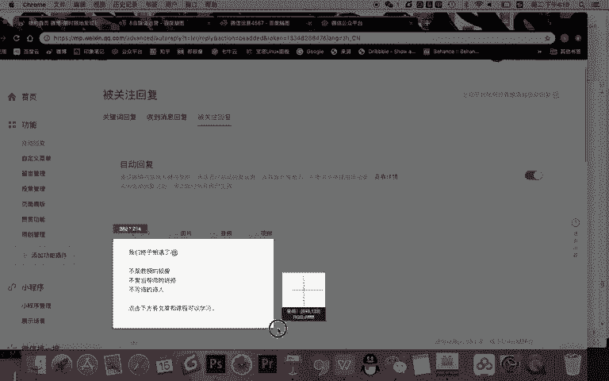
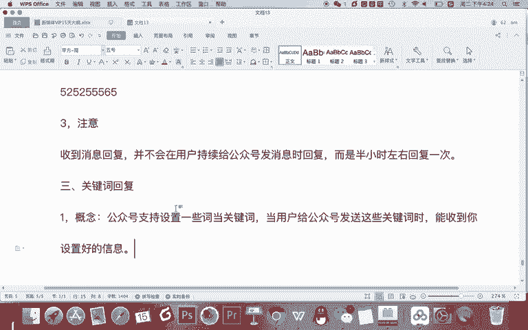

# 微信公众号运营视频全套 手撕运营 拳拳到肉 - P6：1.03-自动回复设置~1 - 达妹_达内教育 - BV1UvvvebEdT

同学们好，今天我们来学习微信运营第三节课的内容，也就是公众号后台的自动回复的设置。在自动回复这里有三种设置。首先被关注回复，收到消息回回复和关键词回复，我们挨个给大家讲一下。Okay。啊。

首先什么是被关注回复呢？你可以理解成什么？给新粉丝的。问候语。对吧。被关注嘛，就是别人关注你的时候，你给他一个回复。所以如果一个人刚刚关注你，应该的发什么内容呢？在这里我们应该设置什么信息然。

给大家一个建议。在被关注回复里应该设置以上信息。第一个。一。😊，应该是什么呀？感谢关注的问候。因为你想这个人刚刚关注你去到你的公众号，你应该感谢一下他或问候一下他，对吧？第二个干嘛？第二页进行。自我。

介绍对吧？你首先你说哎感谢关注。第二呢，我是谁进行自我介绍。第三部分呢。要什么呀？引导阅读化。点击。你向他介绍了你是谁之后，你要告诉他，哎，欢迎你去看我的公众号的文章，或者说欢迎访问我的网站等等等等啊。

都可以。那么比如说大家看我给大家一个案例啊，我的内容是怎么设置的？比如说大家看。我的这个内容是啊，你看我们终于相遇了啊，我把这个撤销吧。截个图给大家会更清晰一点。

其实你看啊，我在这里去写的，我们终于相遇了这句话，意思不就是什么？感谢关注，对不对啊？终于等到你我你终于来了啊，这是问候一下，对不对？先感谢问候。第二步呢？我是谁呢？我自我介绍是不是教授的教授。

不爱当导师的讲师，不写诗的诗。你看三句话凸显我的一个风格和特色是吧？我是教授，但是呢不是大学的那个教授，我是一个讲师，但是呢不爱给别人天天什么呀，讲一些成功学啊，人生和大道理。所以呢我只传授知识啊。

这是不当导师，不写诗的诗啊，我说自己喜欢浪漫自由的一些事情。虽然不写诗呢，也要有诗性的一些什么呀特质啊，所以呢三句话是体现了我的一个风格，我进行了一个简单的自我介绍，让别人知道我是谁。

然后引导阅读或点击，我在这里写的是点击下方有文章和课程可以学习。那下方是哪里呢？其实就是这里就是我们下节课会给大家讲的指定菜单。大家看他关注我的账号之后，他会收到那句话显示在这里，然后下方资定菜单。

他能看文章，能学习我的课程，还能看到我的一个教学演示的内容。OK以上呢就是被关注回复，也就是给新粉丝的问候的一个设置。那我们来看第二个内容，收到消息回复。什么是收到消息回复？你可以理解说什么。当。

意思啊，你说到相应回复的意思就是。当用户给公众号发消息时。公众号。呃自动回复。也就是比如说我已经关注你很久了，或者我刚刚关注你，我给你发一条消息在吗？你好，我想要学习什么学习什么什么。你好。

请问这个问题怎么解决等等？这都是用户给你发的消息。那么当用户给你发这些消息的时候，你给他的回复，那这个时候应该回什么内容？你想一下这个时候应该回复什么内容，什么时候才需要收到消息回复？肯定是这样。

当你没有在公众号后台在这运营的时候，你需要给他回复。因为你想如果你就在运营公众号，他一给你发消息，你就自动回复，或者说你人工给他回复就可以了，对不对？所以呢什么时候场景是什么？使用的场景是。没有。

运营公众号是。作为自动客服信息给用户的。恢复。这是我们收到消息回复，那应该设置的内容呢。我建议什么？应该。告诉用户。怎样。你收到消息了。同时会。什么呀，上限后。处理。让用户。不要。着急对吧？

然后如果着急呢，如果有急事儿。对不对？如果比如说像你们这就一个客服的信息。如果你平时没啥急事的话，你可以自动回复，等我留言处理就行。如果你有急事怎么办？可以什么联系。别刷某某某。

对吧所以你需要在这里告诉一是告诉他你收到了。二呢安抚一下三可以联系。那到底应该怎么写呢？我们可以这样试一下啊。比如说我给大家写案例。你可以这样写。消息已收到。直接回复，等我上线。就回复你。然后呢。

如果什么有急事儿，可以。加微信。联系其教授。对吧你看你直接写一个名字。啊，或者说你写一个客服，可以联系客服小A或者类似的啊微信号。比如说随便编编一个微信号。

对吧OK你这样一个信息发送到或者说设置好自动回复之后，那用户一给你什么呀，发消息，你告诉他哎，消息收到了，我上线回复你，如果有急事可以加微信联系，这样用户的体验就比较好。因为他会知道什么？你哎收到了。

会给他回复。甚至呢你哎如果他真着急可以联系你。那需要注意的是啊。需要注意一点，就是。收到消息回复。并不会持续。给用户回复什么意思啊？消先回复并不会。在用户持续给公众号发消息。是啊，回复。那儿是怎样？

而是。半小时左右回复一次。那公众号为什么要这样一个设置呢？就是你设置好了这句话之后呢，用户如果给你发，你好，在吗？哎，你会给他推送一下。如果他再问你哎，我有什么什么事儿，你就不会给他回复了。

不会给他频繁的回复。这是公众号一个人性化的设置啊。因为你想每次你回的都是相同一句话，对用户来说，他就是机械式的回复，你有必要一句一次一次的回复，没必要，你只需告诉他一次，我上线会回复你，那么他就。

这次就他就不会再给你发消息，正常的不会了，对吧？如果他比较着急，还没你发现，你没他你不理他怎么办？他肯定会联系这个方式，对吧？所以你注意啊，当你设置好这个信息，你去测试的时候。

比如你手机给自己的公众号发了一条消息，然后你去测试的时候，你第一次发哎，给我回复了。为什么我后来再发消息不给我回复呢。你要记得原因就是收到消息回复啊，并不会持续回复。一般半小时左右只回一次。

OK这是我们收到消息回复啊，被关注回复和收到消息回复都比较简单，希望大家注意能去设置就行啊。其实呢我给大家讲一小技巧啊，刚刚。你说微信号这个地方的时候，我建议大家不要直接写文字。你看这有图片，对不对？

你把这句话。做成一张漂亮的图片，把你的微信二维码啊，不要写微信号，把微信二维码直接放到这个图片上给用户会填更好。因为它直接长按这个图片就能识别二维码，加上你的个人微信去跟你联系。

所以呢这是一个更方便的一个方式。那到最后啊我们一个最关键的一点就是关键词回复。首先什么是关键词回复？来，大家看一下给定义啊。提是。公众号支持。设置一些什么词，当关键词。你可以设置任意次当关键词。

这是这是你自己去设置的。然后呢。当用户给。公众号。发送。这些关键词时能收到你设置。好的。

信息。那比如说使用场景啊，比如说我给大家2。