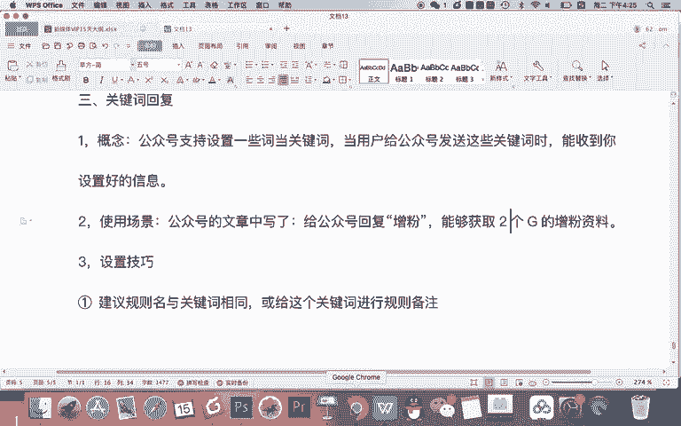
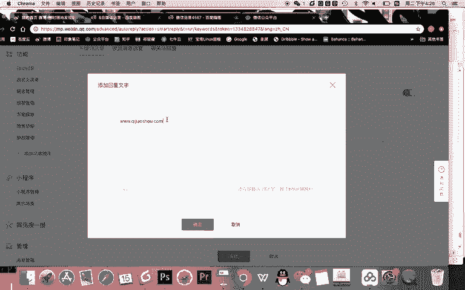
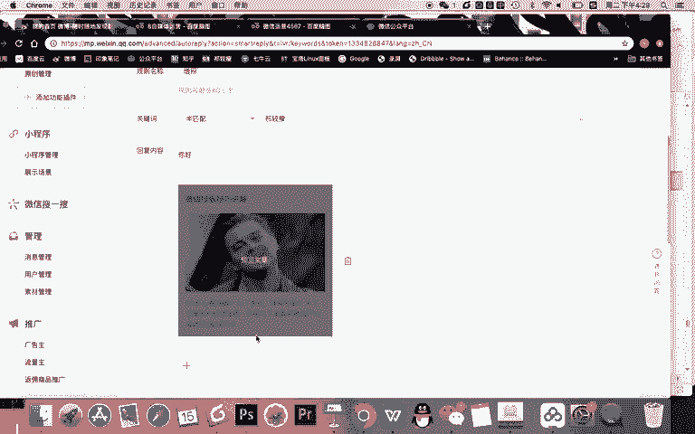
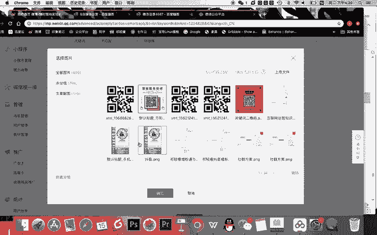
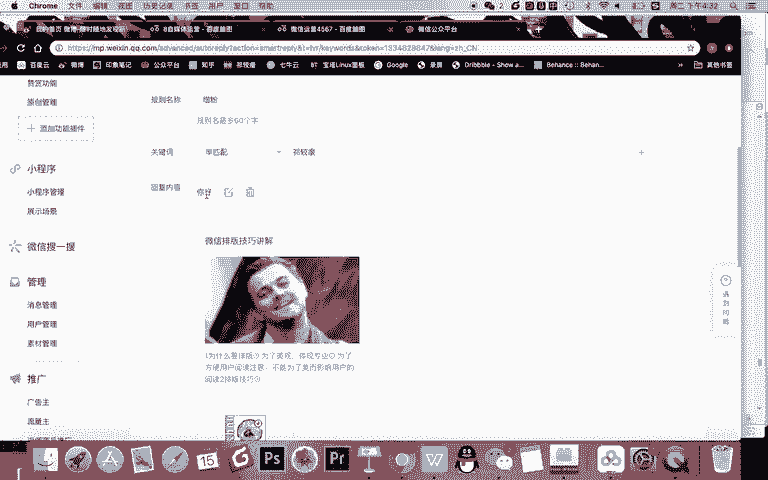
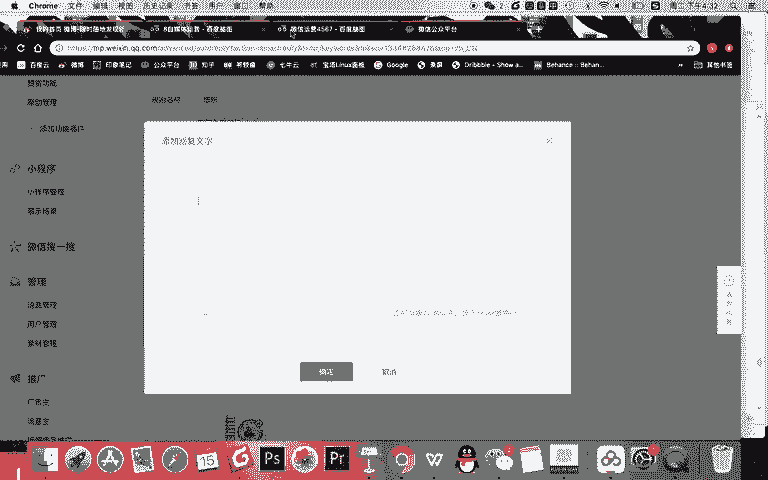
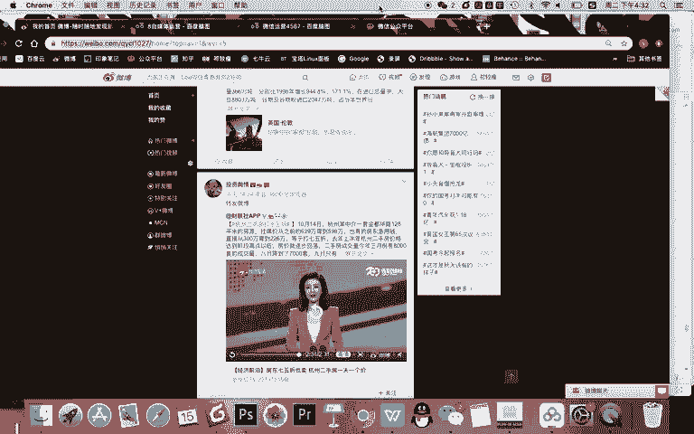
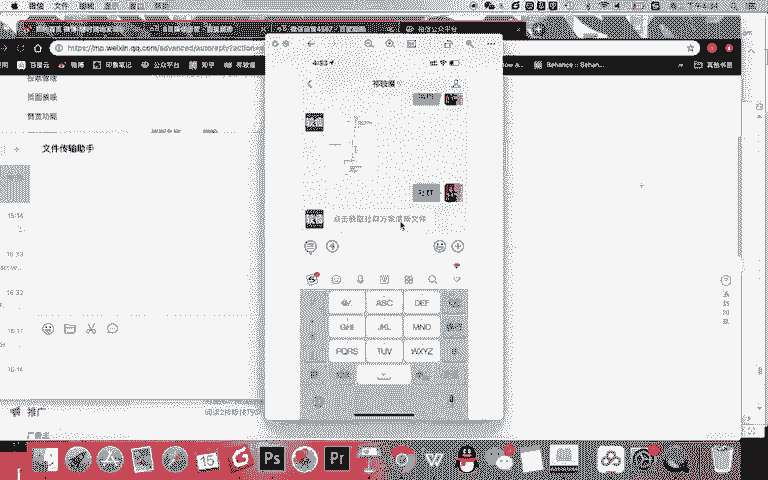

# 微信公众号运营视频全套 手撕运营 拳拳到肉 - P7：1.03-自动回复设置~2 - 达妹_达内教育 - BV1UvvvebEdT

Yeah。使用场景什么时候会用呢？很简单。比如你在。公众号的文章中。写了一句话。比如喜这句话，什么话呢？就写。给公众号。啊，这样吧，我这样去标注啊。给公众号回复。棕粉。能够。获取什么呀？两个G的。

增粉资料。你想知们？如果你的一篇文章是写如何微信增粉呢，然后你这个文章中下面带一句话，给给公众号回复增粉，能够获取两个季的增粉资料。那用户是不是就会给你的公众号去回复个增粉，那应该干嘛？

应该就能收到内容啊。那很简单，你看怎么设置啊，首先。点击添加回复啊，输入规则是什么？意思？就是你给的这个关键词和回复的内容命个名起一个规则啊。这个规则呢我建议啊。设置技巧。第一。建议归则明与。

关键词相同或给这个关键词什么呀？进行规则备注。比如说。我设置一个关键词叫松粉。对吧。你看我这样写的啊，我刚刚回复他让他回复增粉能收出两个字记的学习资料。我给他回复一个增粉，然后呢，我给他链接。

比如说3W点奇教授点com去到这个网站能获取两个记的学习资料，我点确认。那你想我这个关键词是不是设置好了，我一点保存。

对吧不能保存让我写规则。那什么是规则呢？就是给这个关键词内容定一个规则。那我的规则就可以写什么？比如说教学演示。比如我在录制我们这个新媒体课程的时候，我设置了很多的关键词做教学演示。

我可以给规则起一个教学演示。然后当我后期想搜某个关键词的时候，我一想啊，我当时教学演示，我一搜教学演示就能找到这个关键词，所以这就是规则名，能理解吗？就是你给他命名一下。

当然你可以说哎我也不懂什么规则名，你直接就叫增粉也可以啊，让别人一搜增粉就知道是什么意思。这个规则是自己看的啊，你自己定义一个规则就可以OK。那么首先啊第一点注意。规则啊可以写可以不写。

那第二点技巧看这儿啊。关键词支持。添加。多个关键词什么意思啊？你看这句话。2。🤢，可以添加。Doer。关键词回复指定的。统一内容。什么意思啊？就是多个关键词可以统一内容。比如说回复啊案例。回复齐教授。

点啊。可以收到。视频课程。我这个时候会有一个场景啊，会遇到什么回复提交设施场景会遇到问题，什么问题。学员吧。齐教授打错啊。会打成什么呀？比如说。齐教授。其。教授。企。教授等等等等。

那你想如果他会把这个名字打错的话，如果我让他回教授还能回吗？就不能回。所以这个时候你可以怎样，比如说你可以这样。金教授。对吧。你可以把他可能打错的多个名字都写成什么？都写的出来。

然后回复一个指定的内容给他。这样当用户不管回答的正确还是错误的时候，都能收到这个内容啊，这就是什么？多个关键词设置回复。那除此之外，还有一个迹巧。第三。建议设置关键词时用。半匹配。

能够让什么用户打错时也能收到。回复内容。啊，什么是半匹配？很简单，比如说技教授半匹配的话，如果他真的有个字打错了，但是系统能识别出来，它就是错别字。那么呢他也能收到啊，但是如果他错的离谱。

半匹配也匹配不上，对吧？但如果你是全匹配，那必须每一个字一模一样，它才能够收到，能理解吗？所以我优先建议大家在设置的时候就设置半匹配啊啊，然后呢甚至如果容易打错的话，你可以多个关键词去回复内容。

那回复的内容可以回什么。大家看啊。我先把它删掉。看回复内容可以回复图文、文字、图片、语音视频。但同时我告诉你，你看。注意一个技巧。

가。

比如说啊这个图片OK还有一个技巧，就是第四点。一次可以设置。多个内容回复。并且。可以选择。选择什么一次回复全部或指。随机。回复一个。比如说大家看我现在在公众号的后台设置有文字，有图文，有图片。

甚至我还可以做声音和视频。那么在这里我可以选择回复全部。那么他给我回一个齐教授，他能收到这三个内容，但如果我选择随机回一条，只能收到其中一个内容啊，这就是这个回复内容的一个设置，就是一次可以多个或一个。

那现在大家来看啊，我给我的公众号设置一个词叫齐教授。然后呢，我点击随机回一条，那我一保存之后，如果你给我的公众号，现在回复齐教授这个词，那么大家就能什么呀，收到一随机还是什么全部，那你得看什么？

我刚刚的内容，对吧？你看我编辑的时候是随机，所以他只能收一个。但如果我现在点击回复全部就能什么呀，回复全部的内容。来，我现在给大家演示一下。然后我给大家讲一个新的内容。比如我现在去给我的公众号啊。

我手机操作一下，大家稍等，我现在呢就给我的公众号，比如搜到齐教授。然后呢，我给我的公众号回复我刚刚设置的内容，设置的就叫。齐教授。对吧。那我回复绩销授之后，我能收到那三个内容，对不对？因为你你看一下啊。

肯定是这样的，我把这个图片分享到电脑上。OK大家看一下。OK你看一下啊，我现在呢给我的回复提要时候，我设置三个都能收到了。但现在我还有一个疑惑啊，或者说还有一个知识点要传给大家。有些时候。

比如我想让用户访问一个链接，我应该怎么去让给他回复，难道是这样吗？你看一下，比如。我回复齐教授，我现在啊希望这个地方不是你好两个字的，而是一个链接啊，这个链接比如。

比如就是我的微博地址吧。

。那么同学们如果这个就是微博地址的话，我一点保存用户收到是不是也是地址。但我个人认为这个地址非常不方便，不美观。我需要一个技能，什么技能？我给大家现在讲一下啊。Yeah。我们把这个知识点叫做第4个。

就是自动回复的文字。链设置。那什么是文字链设置呢？首先给大家看一个效果，这个效果就是对比。现在如果我不会设置文字链，我想给用户一个链接的话，那么我只能把链接复制在这里不美观。但如果啊。我会。

去设置文字链。那么我给用户提供链接的时候，就可以让他。什么呀去回复。自动回复给他一个链接内容。比如大家看一下现在我一个截图。这个截图呢就显得水平很高了。来。😊，大家再点开看一下。

你看我现在呢给我的公众号回复的社群两个字，然后呢，这个社群显示的就是一个什么？一个链接。然后我的用户如果去点链接的话，去到的是我设置的一个页面。

是一个外网，也就是外部链接的一个页面。这个页。