# 微信公众号运营视频全套 手撕运营 拳拳到肉 - P8：1.03-自动回复设置~3 - 达妹_达内教育 - BV1UvvvebEdT

变得既有学习资料，还有我是其他的内容，能够形成其他平台的一个增粉的转化。所以你看我可以把链接变成文字链，用户看起来既美观又清晰。

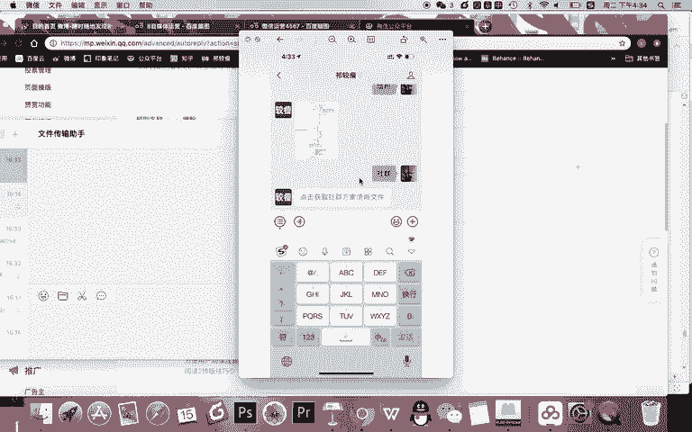

那么如何设置文字链呢？这里有一个方法啊，记得第一，首先要一个什么？

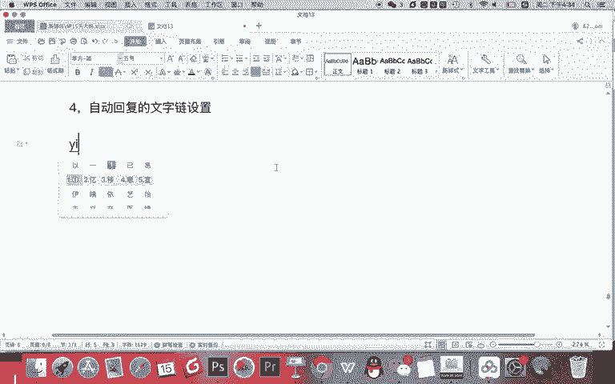

文字链要有代码，这个代码呢其实很简单，你百度搜一下就能获取。就比如说你直接搜微信文。

自恋。代码。其实就是一个A标记啊。OK哎，这个现在百度搜的不是第一个了啊。其实还是这个啊，你看可以看到我直接给你复制吧。我把这个内容直接放在这里啊。方便大家看到。

其实呢你只要用这样一个标签啊去设置就能完成一个文字链设置。那怎么设置呢？记得。引号。内的。是链接，然后呢点击查看。是啊。文字啊，你其实可以这样去写嘛，你把这这个东西再复制一遍。记得这个放什么？链接。

这是文字，然后你只需要这样的去设置的话，你的文字链就能设置成功。比如大家再来看一下啊，现在啊我先。

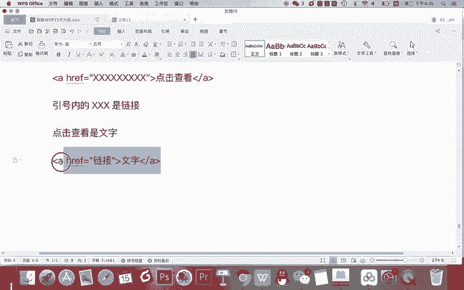

把它改一下。现在呢我把这个内容复制到我的微信公众号的后台，这是一个链接，对不对？我先放到下面，大家看哎啊这这这复制太多了。

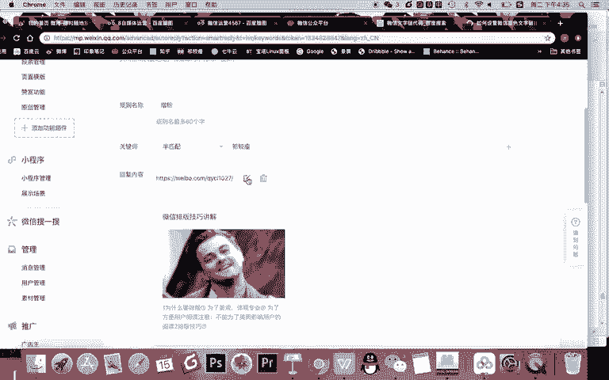

OK大家看这个这是那个代码，对不对？我放在这里，大家看我现在需要做的是把这个链接。放在。这里。然后呢，把它删掉，把它放在上面，这文字放什么？访问的是什么就是什么。比如我这是我的微博地址是吧？

我就直接写点击访问。齐教授微博，甚至就几个字。齐教授微博OK那需要注意的是啊，我给你写一下注意事项。

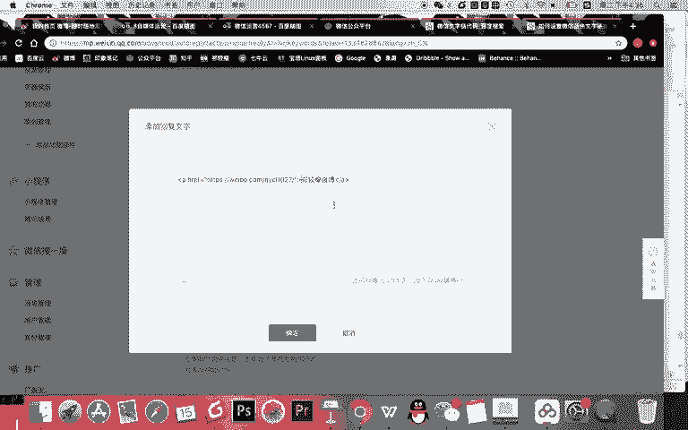

注意。要查看代码。正确性。什么前后两个。诶。Yeah。前后两个A的前后不能有。多余空格什么意思？这段代码很多时候在你复制的。啊，复制到这个微信里面的时候，他有时候会错误。比如这多个A，甚至这前面多个A。

那就完蛋了，能理解吗？千万不要把这个代码，这比如后面多个A，它就错误了。前面多个A也无法生效，一定要看，不能多A，只是第一个A和H之间会有一个空格的距离啊，没有过余空格，那这个代码就生效。

比如现在你看到我把这个链接一放，再点确认，哎，这就变成了起教授微博，对吧？那我现在把这个删除。

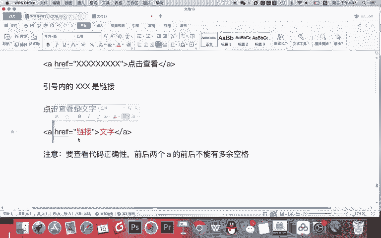

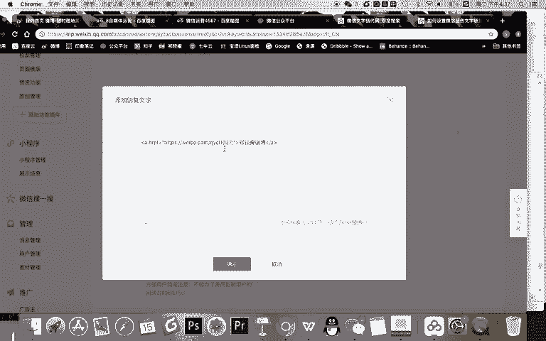

把这个也删除，我再次点击保存。那么我手机上再次去给自己回复一个齐教授，大家看一下效果是不是就有文字链。哎，大家看一下，我现在呢就有一个文字链了。给大家分享的微信里让大家看一下。OK大家看一下。

刚刚设置齐教授这个文字链，一点进去就能去到我的微博主页。所以这有一个什么好处，我告诉大家啊。

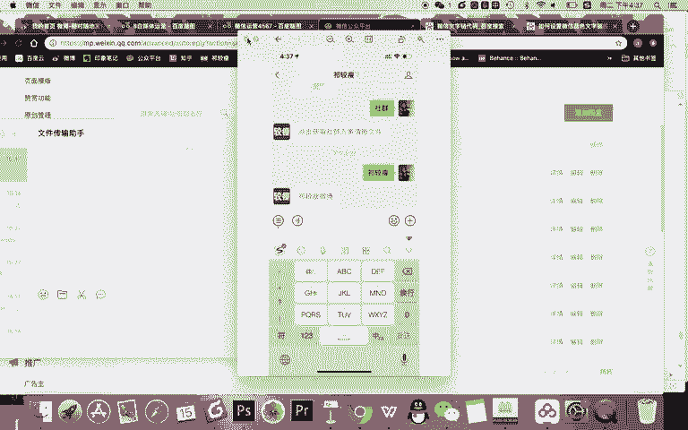

Yeah。好处。能把。公司。官网。地址。商品。地址。等设置成文字链的形式，让什么。让用户。在。微信内。

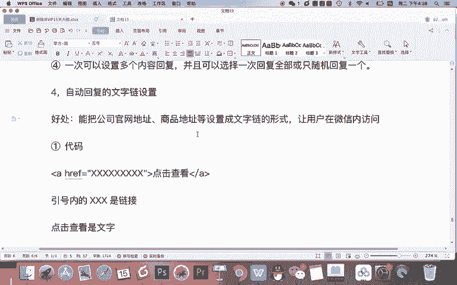

访问。OK那作用呢是非常显而易见的那我现在问大家，你有没有见过这样的一个内容。如果文字链你会了之后，那么现在我们可以在被关注回复里完成一个更高级的设置。什么叫更高级的设置呢？

就比如大家有没有在一些被关注回复里看到这样的内容，比如说。

你看啊。这个案例就是。被关注。回复回复的什么内容呢？感谢关注。然后首先他有这个，然后会说。点击。Yeah。官网。访问。公司。网站。点击。折扣或者说什么点击福利。领取。77折。优惠券。

对吧然后甚至还有回复啊，下面比如说他是这样的。回复。比如说一。收到。什么。收到，比如说增粉。资料。回复。B。2。🤢，收到视频课程。OK大家看现在啊，你理不理解它的这个内容，点击官网这个地方呢。

它是变成了文字链的颜色。比如说是这种绿色啊，效果就跟这个一样。就说你点击官网这俩字是可以点的，这种蓝色吧啊，不能叫绿色，是蓝色。然后呢，点击这个我们改一下啊，也是蓝色。就是可以访问的文字链。

那这个怎么设置？还有呢回复一收到什么，回复二是什么，这是什么？记得同友们，这是啊把关键词回复，还有文字链的设置跟。你的被关注回复整合在一起，我希望这当成一个作业，大家能会啊。但是我告诉你，你要不懂的话。

很简单，你现在在要干嘛？记得把官网这俩字儿。给他抠出来放哪儿啊？放到这个代码里。所以比如说你看你要把这个代码。放在这儿。然后呢。文字这俩字写什么改掉，把文字删掉，这写成什么？官网，然后这放什么呀。

这里放。官网链接。能理解吗？这里放官网的链接。啊，我再给你标红吧。然后呢，这里文字链的话，这里就。用红色标注一个官网，然后下面这个方法设置的一样福利啊，这就改成福利，然后再放另一个链接。

然后同时呢你需要在你的关键词里面设置两个关键词，一个叫一一个叫2，然后设置回复对应的内容。这样用户一关注你，他能看到这一大段话，它就可以直接点击访问你的官网或直接领取福利，甚至给你公众号回复一个一啊。

领取一些内容。那么这就效果就显示的更好看了。注意啊，这个内容显示出来长短是跟它一样的。这么长啊，它只会显示官网两个字。所以呢希望大家能够注意啊，你可以啊，当然你可以这样。

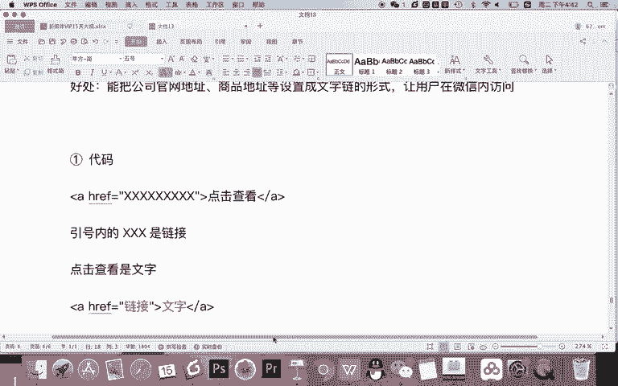

Okay。这个是。福利地址，这里改章。设置好之后的显示效果就会显示成点击福利领取7折优惠券，点击官网访问公司网站。OK呢这是我们本节课的内容。其中有一个小小的难点，就是文字链的设置。

我们可以把文字链设置到关键词啊，还有被关注回复里，让用户一进来就能访问你的官方网站的链接，甚至通过关键词给他回复一个链接的形式啊。那自动回复这里呢，其实一点都不难，只有三个内容。一、关注你了给他回复。

他给你发消息的回复，以及你设置关键词去让他。

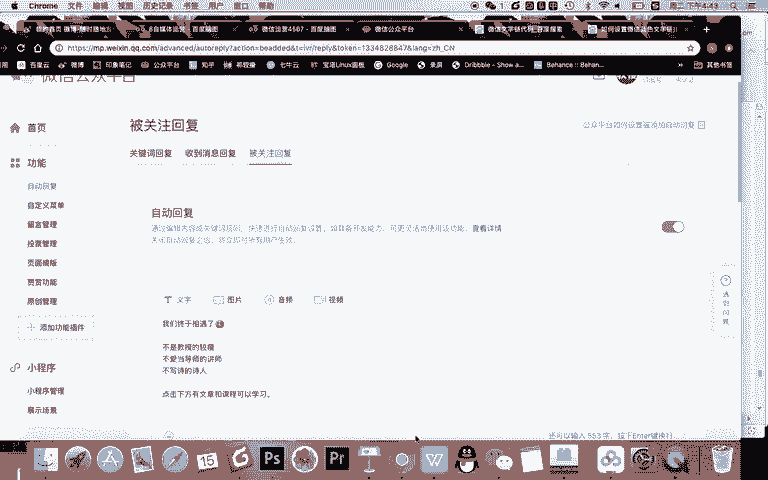

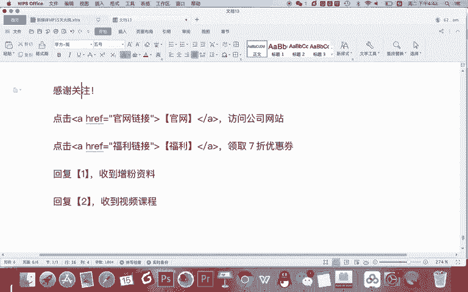

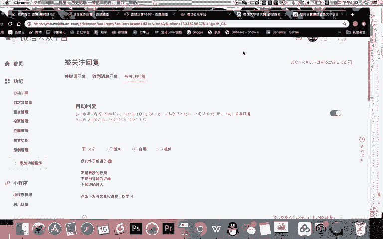