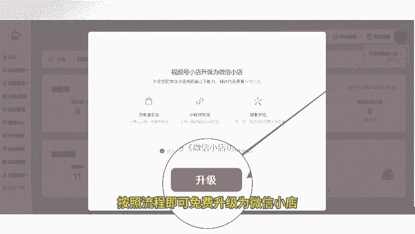
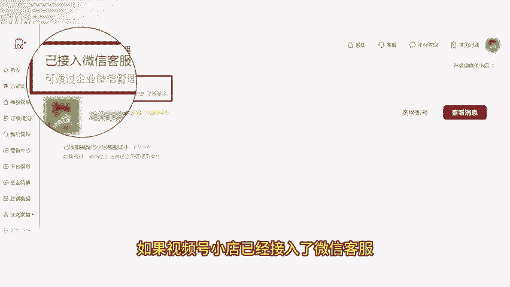
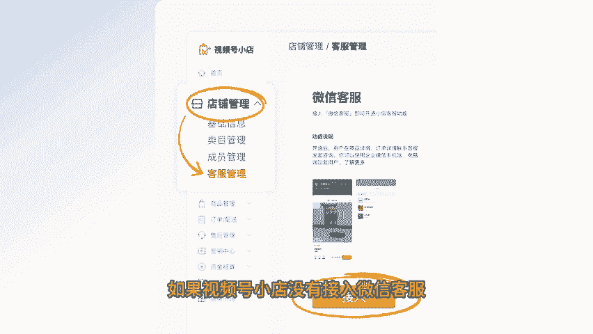
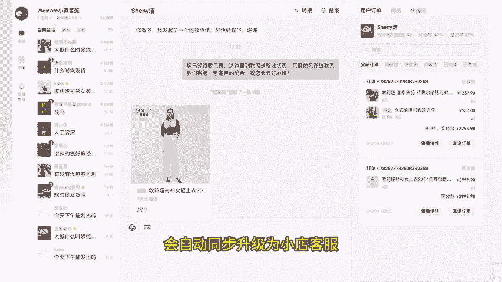

# 微信小店运营技巧一：微信小店正式上线，注意千万不要升级客服系统！ - P1 - 芝麻客服 - BV138sxe1Et3

了解微信小店运营玩法，高效运营微信小店。微信在8月25日正式上线了微信小店。对于已有视频号小店的商家，可将店铺免费升级为微信小店。我们登录视频号小店点击右上角的升级为微信小店。

按照流程即可免费升级为微信小店。需要注意的是，视频号小店升级分为店铺升级和客服系统升级两部分。如果视频号小店已经接入了微信客服，店铺升级后，不主动点击升级小店客服。

那么芝麻视频号助手的功能使用都不受影响。如果视频号小店没有接入微信客服，店铺升级后，会自动同步升级为小店客服，那么芝麻就无法正常获取客服消息，客服系统相关功能就没法正常使用。

所以各位视频号小店商家在升级小店前，一定要提前联系我们的人工客服进行确认，一定不要。

要主动点击升级小店客服，并且目前官方推出的小店客服系统功能比较基础，只能绑定客服员工查看订单、发送商品，编辑快捷回复。不能像芝麻视频号助手一样，设置多店铺聚合回复，多种客服接待设置，多种自动回复。

编辑订单价格、地址、备注物流侧边栏快速处理售后订单、侧边栏、小额打款等。最后再一次强调，为了您能正常使用芝麻客服系统相关功能。升级前，请一定要联系我们的人工客服哦。关注芝麻聊视频私域。

学习更多微信小店运营技巧，我们下期再见。