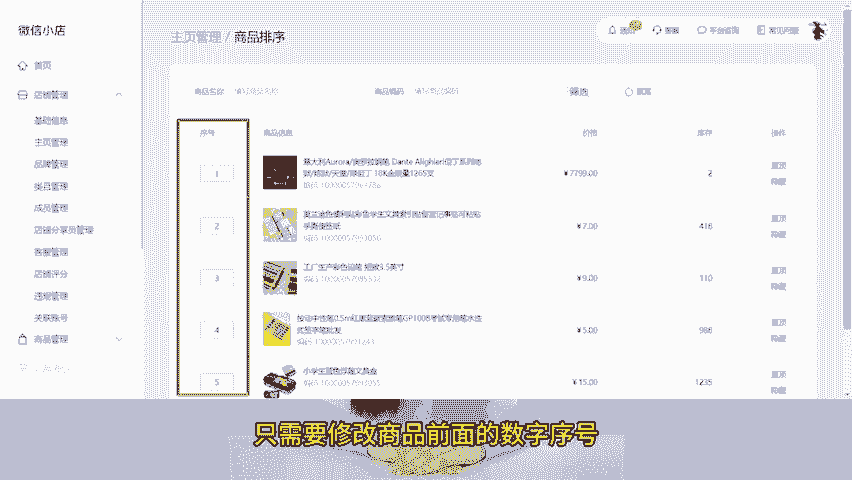
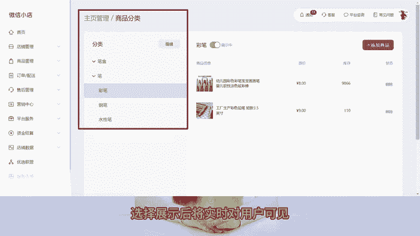
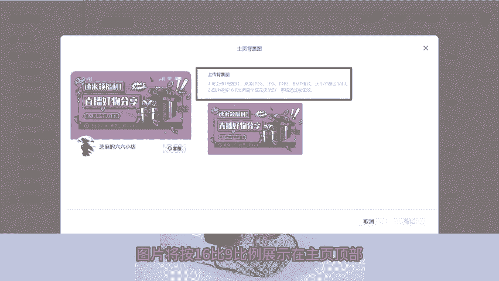

# 微信小店运营技巧三：微信小店和视频号小店有哪些区别？微信小店可进行主页管理 - P1 - 芝麻客服 - BV1QD4zexEn2

了解微信小店运营玩法，高效运营微信小店。各位视频号商家朋友们注意了，9月25号之前一定要将视频号小店升级为微信小店，否则其新增商品上架将会受到影响。已经购买了芝麻视频号助手的话。

请及时联系我们的客服在客服的协助下进行升级，将视频号小店升级为微信小店后，我们会发现微信小店多了一个主页管理功能。可以对商品进行排序分类，新增主页背景图和精选展示位。第一，我们可以对商品进行排序。

只需要修改商品前面的数字序号，即可成功调整排序。需要注意商品序号不能超过商品总数。第二，可以对商品进行分类，最多可设置两级分类，新增分类默认隐藏，选择展示后将实时对用户可见。第三，可以设置主页背景图。

图片将按16。

比9比例展示在主页顶部审核通过后生效。第四，可以设置精选展示位，配置链接和描述信息，向用户展示精选的商品或内容。小图模式至少配置三个展示位，大图模式至少配置一个展示位，最多允许配置5个展示位。

可以配置当前店前商品公众号文章，视频号内容，并且公众号视频号不需要与当前视频号小店关联，可以重新修改展示内容的封面图。

关注芝麻聊视频私域，学习更多微信小店运营技巧，我们下期再见。