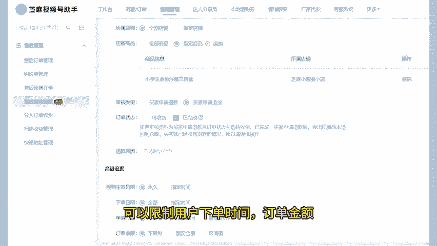

# 微信小店运营技巧五：微信小店售后自动退款如何设置？ - P1 - 芝麻客服 - BV1n9sUetEh2

了解微信小店运营玩法，高效运营微信小店。各位微信小店商家们在大促时间段，如双十一、双十二、618等电商狂欢节，由于商品报单和促销活动的吸引，订单量会急剧增加，同时申请退款的人数也可能随之增多。

面对这种情况，我们如何高效处理仅退款请求，以确保顾客满意度呢，有的商家在大促前会提前增加兼职客服人员确保有足够的人手处理退款等售后问题，但是这样人工成本也会上升。

我们可以使用芝麻视频号助手的售后自动退款功能，设置售后退款自动审核规则，简化退款流程，对于符合一定条件的退款请求，可以自动通过并立即退款。芝麻视频号助手支持同时管理多个微信小店。

企业可以给不同微信小店不同商品设置不同的自动退款规则。可以限制用户下单时间。

订单金额申请售后时间符合这些规则的订单，申请仅退款时，系统就会自动同意退款。比如设置下单，24小时内，订单200元以内还没有发货的订单，申请仅退款时自动同意退款。关注芝麻聊视频私域。

学习更多微信小店运营技巧，我们下期再见。

