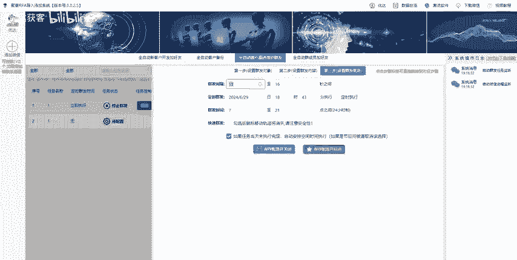
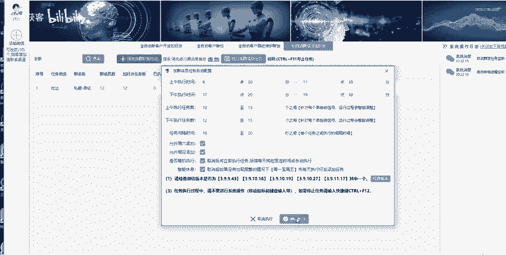
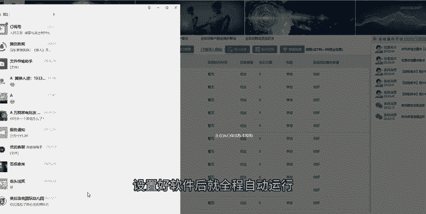
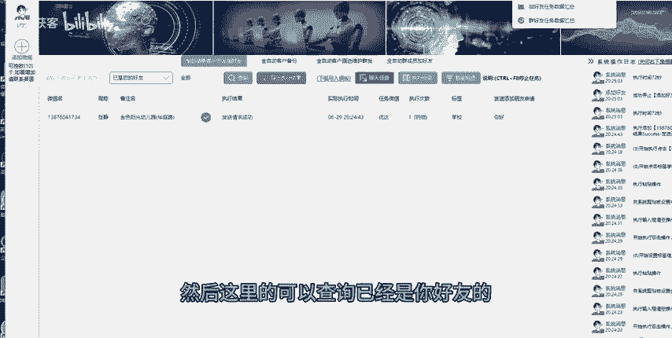
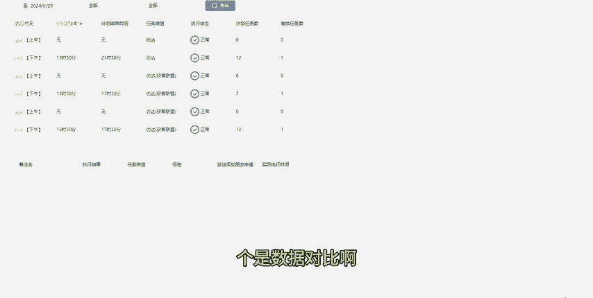
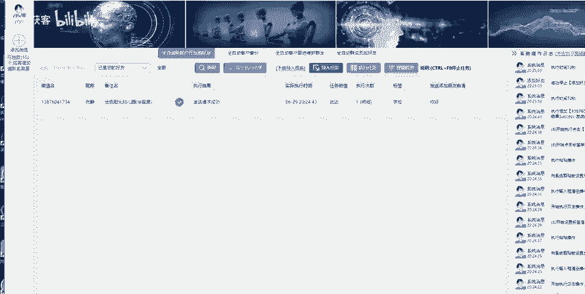

# 微信批量自动加好友全程模拟人工 - P1 - 优达获客 - BV1xi421a7xz

🎼不。🎼好，今天优达给大家介绍一款巨客RP智能微信营销系统。🎼然后这个是RP的模式，它支持导入数据，然后支持的数据有手机号、QQ号、微信号，然后支持通讯录备份，支持群发，支持群好友添加。

然后至此独家至此，频繁添加好友至频繁郑动暂停。🎼红着。🎼，然后我在模板里面可以设置嗯自己的念证语。🎼的自是。🎼Home。🎼回到软件的界面，我们一开可以看到这个界面，可以看到。🎼呃。🎼远近的直线时间。

🎼然后添加数量和间隔时间。然后这个系统支持的微信版本呃，也是以下的以下的几个版本，全部都是比较细颖的版本。🎼在软件里面我们可以自由的设置啊，根据自己的需求去设置添加时间和添加。🎼听见时间段的天空。

🎼依旧。🎼不知。🎼好，接下来我给大家介绍一下，就是这个模板是怎么导入的啊，这个模板的格式呃就是呃这样的。然后第一排的话是导入手机号QQ号，第二排的话就是备注标签啊，打招呼的验证语，然后就是任务微信。

这个任务微信是什么意思？就比如说我的微信名称就优达好呢？那我这个就是优打这个微信号去添加啊，上面的这些数据。🎼这个是风这个。🎼任务执行就是方便大家哪个号码添写哪个数据好。

接下来我们把这个模板设置好的模板导入一下啊，导入到软件系统里。🎼还有最。🎼就我。🎼然后这里。🎼是谁？🎼好，导鱼进来了。导鱼进来的时候。🎼等一下。🎼啊，这就提示点确定就行啊。🎼哦，我们看到导进来了以后。

第一排就是。🎼啊，手机号码。第二个的话就是备注，然后。🎼阴阵宇啊、朴清志之类的。然后这个界面跟之前跟大家已经介绍过了。🎼我我们默认机型啊，刚刚那个设置界面想。🎼好，接下来给大家讲解一下这个背。

🎼备封其实备封你微信上的好友或者微信群，我们可以备份好友或者微信群啊。好，给大家讲解一下这个群发。🎼这个群发的话，我们先要把好友去备份啊，备份以后可以群发的话，支持文本、文字、图片，还有文件，谢谢你。

然后的话群发的话可以设置群发的时间，电视群发啊，群发间一隔。

🎼啊，讲一下这个群成员添加这个功能啊，群成员天气功能添加这个功能也需要提前把群成员去备份，然后备份以后添加到右右边，圈限到右边啊，可以设置一刀设置添加的验证语啊，然后嗯标签。🎼只有。🎼掩埋迁就。🎼呃。

不管是群发，这里讲解一下，不管是群发还是说群成员添加，都需要提前备份一下啊，微信，备份通讯录备份一下。

🎼叫我。🎼好，我们重点讲解一下，还是这个添加手机号码，就是添加手机号为微信好友。🎼好，我们新新手的话，我们直接默认就行，不需要去修改啊，我这里已经修改了一下时间。🎼好。

软件就全程自动化控制你的呃时时刻软件就会控制你的电脑的键盘和鼠标，全程全自动模拟人工去运行。

🎼不知。🎼杰个说这个时候的鼠标不是我自己在操作啊，是软件系统自己在操作，才会去搜索模板里面设置的第一个添加号码。🎼第一个号码搜索添加，然后他会根据你在模板里面设置的啊，什么好友话术、面阵语啊。

🎼然后备注的名称啊嗯。🎼然后那个标签都是根据你模板里面设置的，全程都是智能自动化。🎼我们的标签设置设置的是学校啊。🎼好，好友发送你请求成功。🎼全程是自动化控制你的电脑的键盘鼠标，这个是RP不会封号的哈。

然后我们看一下这个软件系统的话，它可以去查询一下。就是说你这个模板里面数据总览里面有哪一些，然后哪一些添加啦，我们查线上发送好友添加，就刚刚这个发送好友已经添加成功了。然后这个是哪个微信。

支持10个微信，5个微信号，我是这里只上了一个微信，所以我是。🎼，🎼可以查选一个。🎼然后这里的可以查询李佳是你好友的，直行呢没有执行异常这一之类的。

🎼这个是数据对比啊，这个是可以看到你的数据云的呃，哪个时间段添加了添加了多少。

🎼然。

