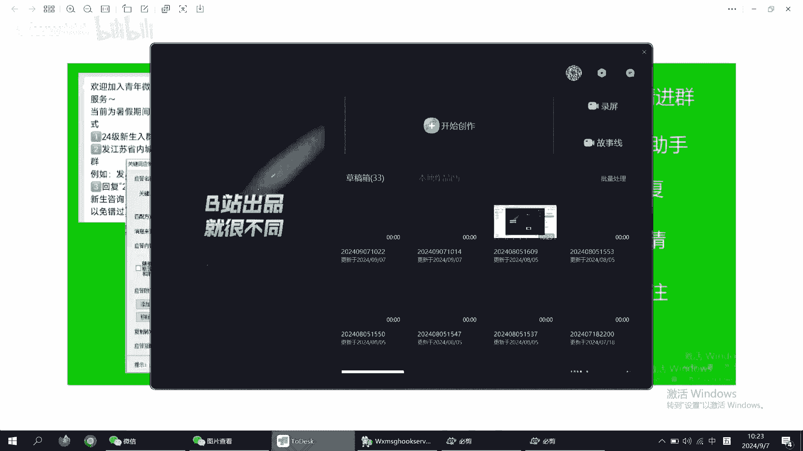
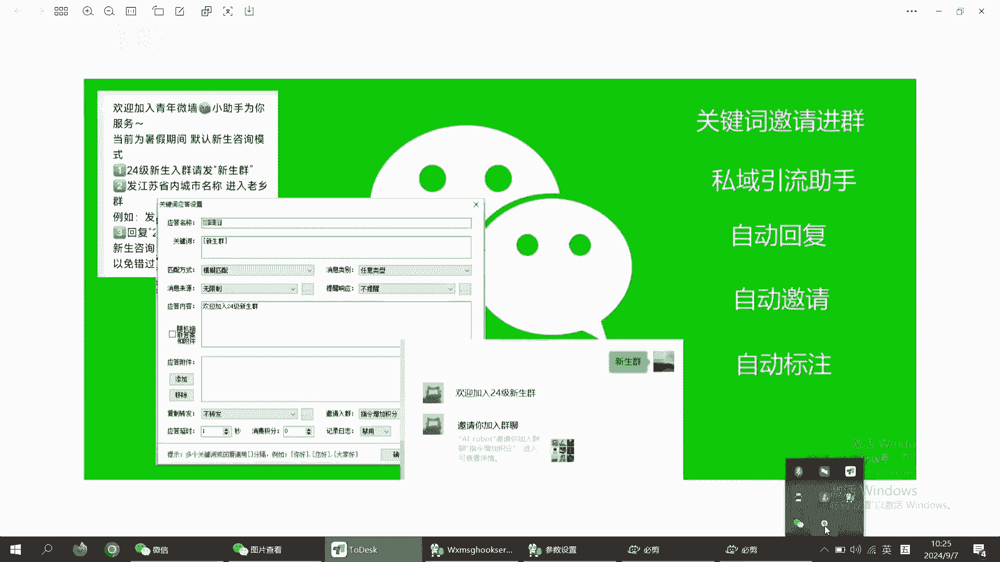

# 微信机器人 关键词邀请入群演示及配置 私域引流助手 自动回复自动拉群及自动备注 告白墙分流必备 抖音 小红书引流高效工具 - P1：studio_video_1725677877771.mp4 - adww888 - BV1LqHfeuEhc

大家好，今天我们来介绍一下机器人关键词，邀请进群的功能，简单来说就是客户添加机器人，没好友以后，机器人会自动回复一段提示语，比如回复某个关键词进入哪个群，那我们先来看一下这个演示效果。

我现在给机器人发送一个关键词，比如新生群，这个时候机器人就自动回复了这个邀请，进群的这个链接，还有这个提示语，我们再来回复一个，同样的机器人也是回复了相应的这个群，邀请的链接。

点开这个链接就可以直接加入到这个群，我们现在看一下是怎么配置的，英格我们基础版机器人的朋友应该很熟悉，还是在我们这个业务参数设置里面值得应答，然后这里新增了一个邀请入群的一个选项。

第一个这个是关键词回复的关键词，然后这里匹配方式是完全匹配，还有消息来源，这些都是跟基础版的机器人是一样的，配置，唯一不一样的，就是这里多了一个邀请入群的一个额选项，可以选择不同的群。

白名单里面有哪些群就可以选择，哪些可以选择哪个群好了，这个就是我们呃邀请进群的这个呃，方式和配置方法，有需要的同学可以一键三连获取下载链接。

