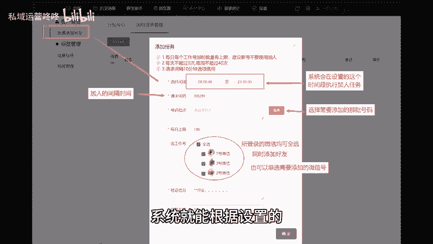
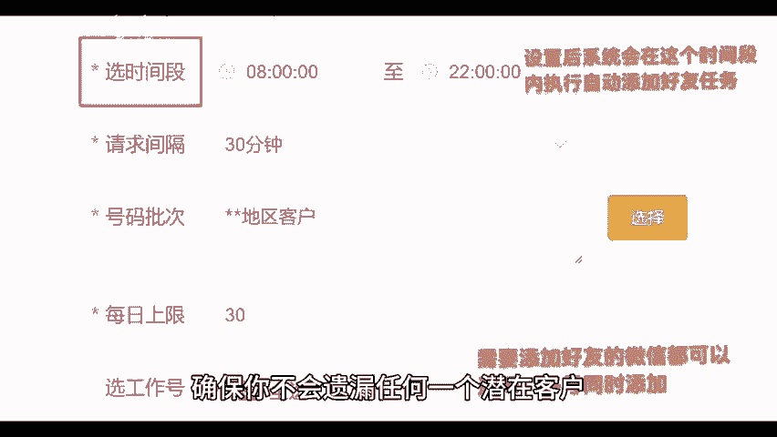
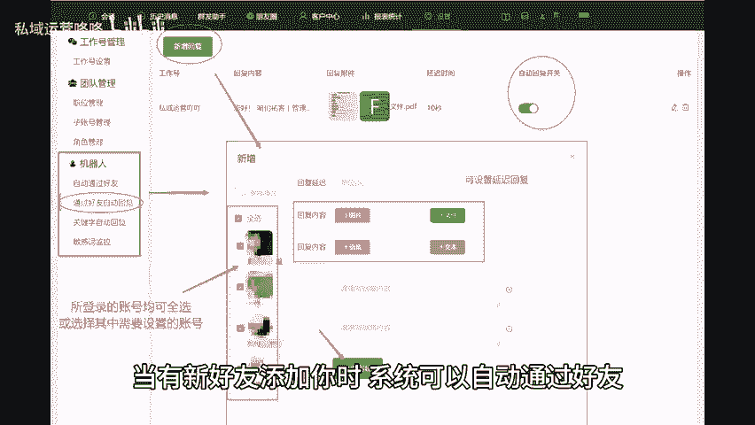
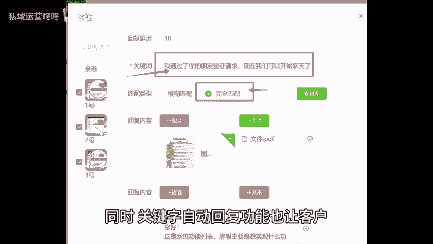
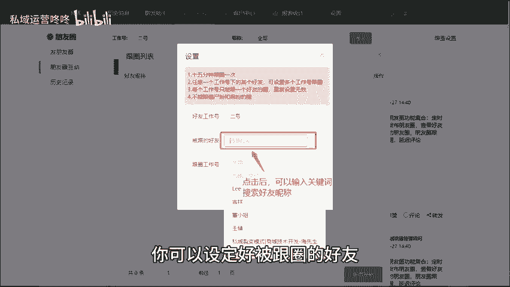
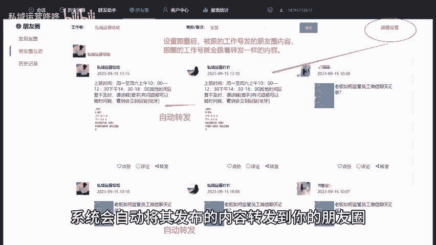
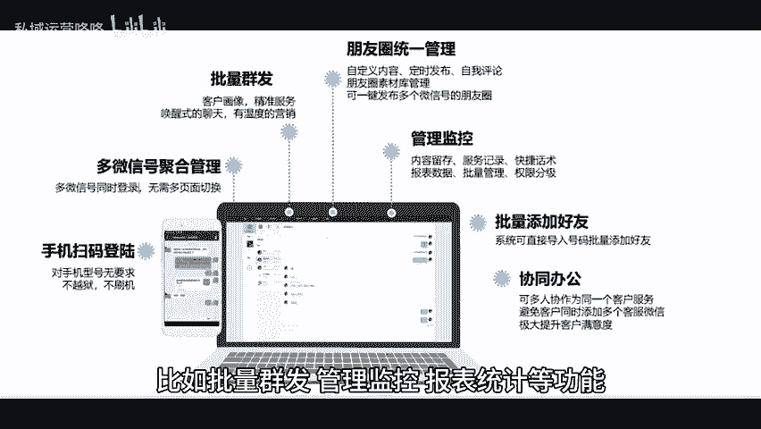

# 微信自动化操作，让你的微信管理更智能！ - P1 - 私域运营咚咚 - BV18R4zeXEP6

🎼微信的广泛应用让我们与客户的沟通变得更加方便。但与此同时，管理多个账号的工作量也在不断增加。今天就给大家分享一个个微管理系统，一起来看看它都有哪些自动化设置吧。

一批量自动加好友系统支持批量导入客户数据，只需将潜在客户的信息上传，系统就能根据设置的规则自动为你发送好友请求，确保你不会遗漏任何一个潜在客户。2机器人智能回复，当有新好友添加你时。

系统可以自动通过好友，并在他们接受请求后发送欢迎信息，同时关键字自动回复功能，也让客户在任何时候都能得到及时的反馈。这样不仅提高了客户体验，也让你节省了大量的时间来处理常见问题。3、自动转发朋友圈。

通过在系统上进行跟圈设置，你可以设定好被跟圈的好友，只要这个好友发朋友圈，系统会自动将其发布的内容转发到你的朋友圈，再也不需要手动逐个转发了。除了以上提到的自动化操作。个微管。😊。

🎼系统还具备很多其他实用功能，比如批量群发管理、监控报表统计等功能，全方位提升你的微信管理效率。快来试试这些自动化功能，让你的微信管理之路更加轻松愉快吧。😊。

