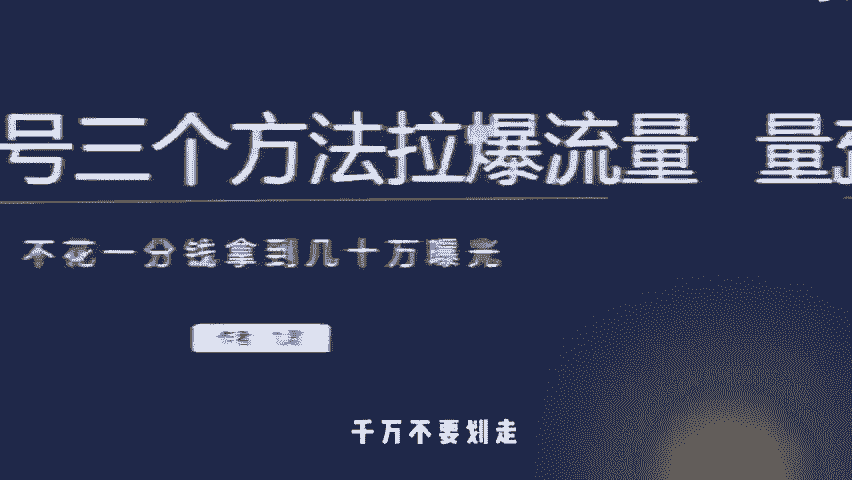
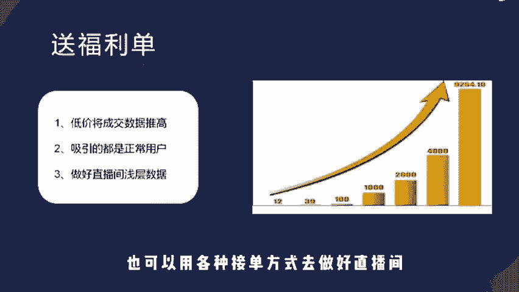
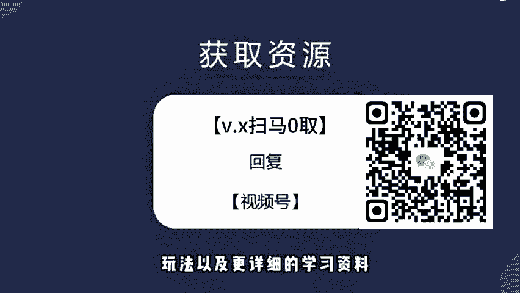

# 微信视频号分成计划祝福类赛道，小白单日收入3500+，全流程详细拆解 - P2：视频号爆流量教程 - 鸡蛋灌饼十八代传人 - BV1mUpMeQEku

🎼视频号怎么不花一分钱拿到几十万曝光？其实非常简单，只要你能明白平台背后的流量机制，就能立马拿到结果。我曾经就用这套逻辑，一条视频就获取了3000精准用户。那这条视频总结了我做视频号几个月的经验。

尤其是最后一点对你来说非常重要。如果你也想在视频号分一杯羹，千万不要划走。首先第一个就是思域拉流量，也就是不管你是短视频还是直播，你都可以拿私域去换平台的流量，只要你发布视频转发到思域后。

有人给你点赞了。视频就会拿到一定的曝光，一个点赞大概可以拿到100的曝光，也就意味着只要你有100个点赞，你就可以拿到一万的曝光。如果你的视频内容刚好get到了用户情绪就能快速完成。冷启动直播也是一样。

当你开播时，你可以用福利等方式从思域拉私域流量进直播间。这时候只要你思域来人了，官方就会给你一比1配比流量，也就是说你从思域拉了1000人进来，官方就会给你送1000流量。

而这时候你把这些公域流量再沉淀在思域里面，下一次直播就能拉更多人进来，这样就能把流量越滚越大从。😊。

🎼开始，官方就把直接配比流量改成送流量券了。不过这样就能更加直观可控。那第二点就是GMV拉流量。简单说就是你的直播间成交GMV和人数越多，官方就会给你配备更多的流量，并且你的直播间浅层数据。

比如关注送灯牌、互动等等，也是可以触发官方推流机制。所以这时候我们主要做两步。第一步就是在开播的时候直接送福利单，用威力或者平本的价格去把交易数据做起来。因为现在平台电商算法还不完善。

所以平台是没有羊毛党标签一说的。你用这种方式吸引的人大部分都是正常消费用户，所以不用担心你的投产比，后续也可以用各种接单方式去做好直播间浅层数据。这一步下来。😊。

🎼你的直播间流量基本会来一次爆发。那第二步就是直接放钩子，只要用户分享直播间就能得到一个福利。这有什么好处呢？我们知道平台是会根据私域数据给你配比流量的。

所以这时候通过观众分享进来的用户又会再一次触发平台推流机制，而进来的用户又会分享你的直播间，这样就能让你的流量螺旋上涨，然后在直播中途穿插去做直播间预约，这样你下一次只要一开播，就会有大批流量进来。

那通过几招下来，你的流量基本就已经打开了。那第三点就是解决转化问题。当你通过上面的步骤拿到了官方给的流量，你会发现有一部分是泛流量，很难直接在直播间做转化，那怎么去解决？答案就是为单模式。

这时候你要做的最重要一件事就是用一切方法把这些泛流量沉淀在私域中。因为用户是可以点击你的头像一键添加的，所以这件事的路径是非常轻松的。当你把泛流量沉淀在私域后，就要有后端服务去不断攻破用户信任。

当用户有下单域望后，再把这些用户导入直播去做成交，这样就能继续触发官方的推流机制，由此形成循环。第三点，看不懂的人。😊。

🎼一定要多看，因为这一部能帮你多赚几倍的钱最好。总的来说，现在视频号的思域裂变算法是非常强大的，包括他的一些推理算法也是有很大机会的，这也是很多直播间开播就能做到几十万场关的核心原因。好了。

这期视频就到这里。如果你想了解更多关于视频号的规则，玩法以及更详细的学习资料，回复视频号就可以领取了。😊。

