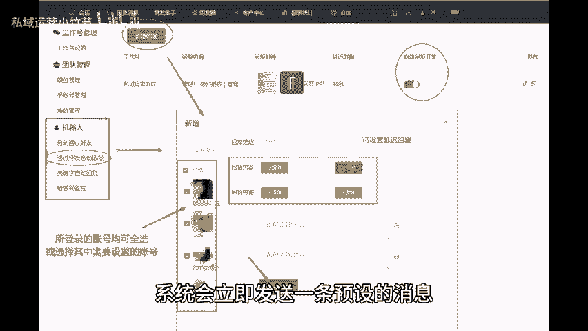
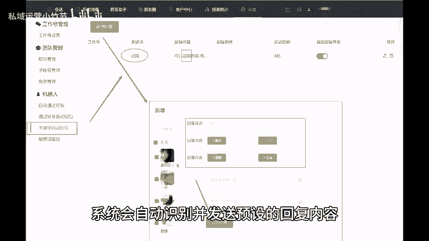
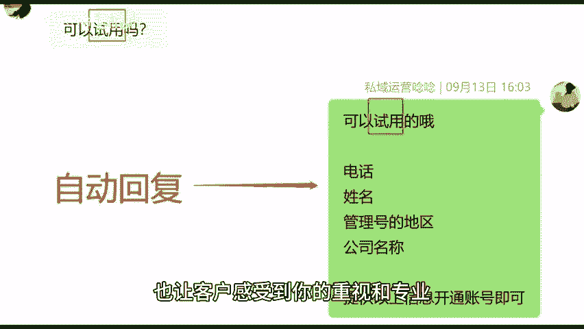

# 微信运营新助手：自动回复神器，让沟通更高效！ - P1 - 私域运营小竹节 - BV1NtvSehE5Q

🎼在现代职场中，效率是成功的关键。然而，我们经常会面对大量重复且繁琐的日常任务，消耗宝贵的时间和精力。今天我想向大家分享一个实用的微信自动回复神器。它将帮助你高效管理沟通，提升工作效率。一自动通过好友。

当你收到新的好友请求时，系统会自动通过该请求。这样不再需要你手动逐一确认，直接让你的社交网络扩大接触更多的人脉资源。2、通过好友后打招呼，一旦有新的好友通过请求，系统会立即发送一条预设的消息。

这条消息可以是简单的欢迎语，也可以是关于你产品的介绍，或者询问客户需求的信息。这样的做法不仅提升了用户体验，还能够有效降低你在沟通上的时间成本，让每一次交流都变得轻松自如。3、关键词自动回复。

当客户发送包含特定关键词的消息时，系统会自动识别，并发送预设的回复内容。😊。

🎼这不仅提高了回复的及时性，也让客户感受到你的重视和专业。除了机器人自动回复，你还可以在个微管理系统上进行批量，自动加好友，批量群发多号，同时定时发圈等设置，能够让你在工作中更加高效。

如果你想减轻你的工作压力，让时间得到更好的利用，那就快快试试吧。😊。

