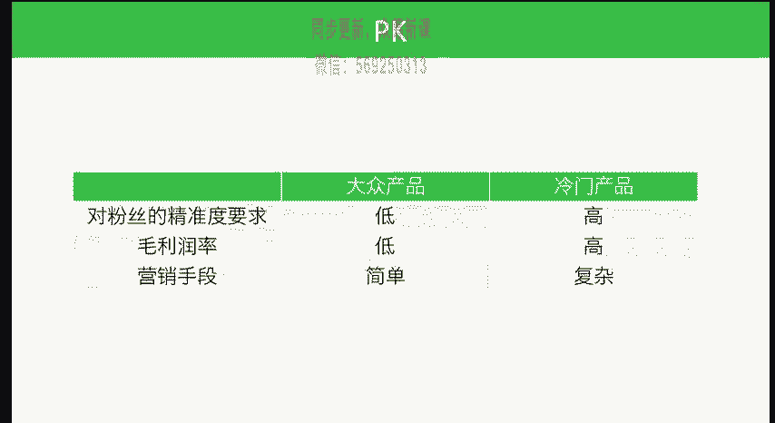

# 微社群裂变营销私域流量池增长秘籍创业运营销售获客视频课教程 合集 8套 374资料 13.1G - P10：10 卖大众产品，还是冷门产品 - 高端网创试错赚钱大师 - BV1sr421F7AZ

低价产品还是高价产品迹样的问题之外，还有一类问题，包括到底是卖大众产品还是卖冷门的这种产品呢？所谓的大众产品就包括比如说像水果啊，这种就是偏大众的产品啊。那么冷门的产品呢。

比如说一些比较专业类的一些产品，比如说嗯某种治疗方式啊，或者说某种牙科服务啊等等啊，这种就是偏冷门的这种产品，到底我们应该卖哪类的这种产品啊，同样我们先做一下大众产品和冷门产品之间的分析。

首先呢大众产品对于粉丝的精准度的要求呢是比较低的。而冷门的产品，我们对于粉丝的这种精准性的要求就会比较的高，以及对于毛利润率的这种要求越是大众产品，往往它的利润也就会越低。冷门的产品。

它的利润率就会比较高。从营销手段上来讲呢，大众产品。

它的营销方式简单，因为它大众嘛，因为你到处都能见到。那么你在营销方面呢就是相对简单一点，冷门产品就会复杂一点啊。关于营销手段的讲解，我们后面也会有专门的课题来去讲解。那么从这些比较当中。

我们得出一个结论，就是包括我们之前的课程，我们要结合起来去看我们得出一个结论，就是取决于我们的粉丝的类型以及对我们的信任度，这是一个非常重要的概念。就是我们前面也得过这样的结论。

就是我们的粉丝到底需要什么样的产品。我们就是销售什么样产品。但是在这样的情况之下，我们提出另外一个重要的建议，就是我们在这两者之间，如果有可能的话去做相对冷门的产品。冷门产品相对来讲它的竞争。

在后期会比较的就是虽然前期你去积累。核心竞争力比较有点难度。但是后期一旦你的核心竞争力积累起来之后，那么别人不不一定能够去去打得过你。比如说像我们去销售的这种非常专业的这种课程。因为它是一个冷门产品。

所以说我们的粉丝的精准度要求也是比较高，毛利润率也会比较高。虽然说营销手段复杂，但是复杂又恰恰是我们的一个经营的门槛啊，这是我们对于这两者之间的一个比较，也是我们对于大众产品和冷门产品的一个比较。

那反过来说，如果卖大众产品可不可以呢？其实也不是说不可以，但是我们觉得未来的话可能相对大众的产品可能一些更大的一些企业，他会去做。那么他们有更强的实力啊而冷门更多的是中小微店的这种机会。

这是我的个人一些观点。我们做中小微电商主，那么我们服务的应该是最好是一个小。一个群体，这样子的话，我们的长期的价值就会比较的高。

