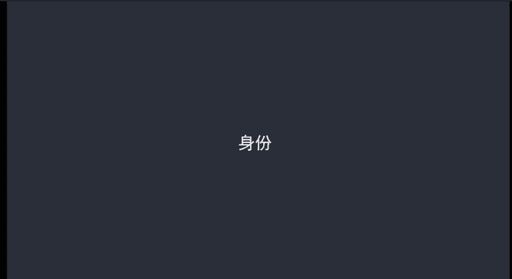

# 微社群裂变营销私域流量池增长秘籍创业运营销售获客视频课教程 合集 8套 374资料 13.1G - P11：01 什么是人格体 - 高端网创试错赚钱大师 - BV1sr421F7AZ

第三章定位，学会塑造人格体形象，成为意见领袖。这个是目前来说呢，我们微信电商卖家呢比较环呃比较弱的一个环节啊，很多的微信电商卖家呢根本就没有任何的人格体，表现出来的就是一个卖货的商家形象。

所以说导致呢和粉丝之间很难形成高互动。这一课呢我们就来给大家提供解决人格体设计的问题和思路。首先第一个讲到的问题是什么是人格体？直接讲微信人格体的话，对于之前没有接触过的卖家来说呢，可能不是很好理解。

所以说呢我们先回归到现实生活中。在现实生活中呢，我们每个人都有自己的身份。这个身份呢就是我们的一个可识别的标签。讲到这个呢，别人就知道你是做什么的，也会明白你的专业是什么。

比如说你是教师，那么你身边的家长都知道你是在做教书育人方面呢，非常专业。他们的孩子有学习问题呢，都会很愿意和你交流。比如说你是一个医生，那么周边有人生病，他们都会想找你看病。那假如说你是一个学生。

周边的人有一些呃小的学术问题呢，他可能也会找你咨询一下。那这些人呢之所以能够找到你，都是因为你身上有一个非常明显的身份标签。而这个身份标签放在微信上，就是我们的人格体。这样讲大家应该都能够明白。

在微信上，人格体就决定了我们在别人心中的形象。不同的是，在微信上我们看不见，摸不着。所以说要通过能利用的一切信息把自己的定位表现出来。我们看几个案例。

先说一下我自己的，我在微信上的定位呢是一个有丰富微信电商经验的老师。那当大家有微信电商方面的问题都会来找我咨询。再比如说我们的学员星野，他自己的定位呢是专业的减脂教练。再比如说我的一个朋友。

他是做土特产的。他给自己的定位形象是一个专门做土特产的宝妈。有了这些定位之后呢，我们的粉丝都能够很清楚的知道我们是干什么的。然后呢，有对应的问题呢，都会愿意跟我们交流。那通过这一张图片呢。

大家也可以看到我们对定位呢都进行了一些外在的表现。呃，因为你的定位不表现出来呢，粉丝是不会知道的，具体应该怎么表现呢？我们会在第二节课的时候呢来给大家进行讲解。

