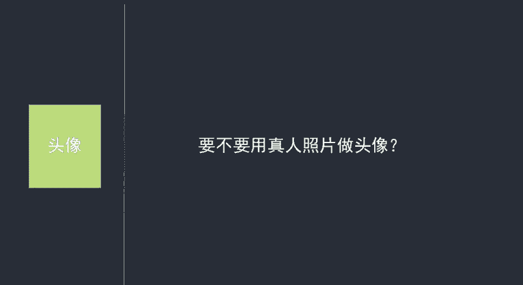
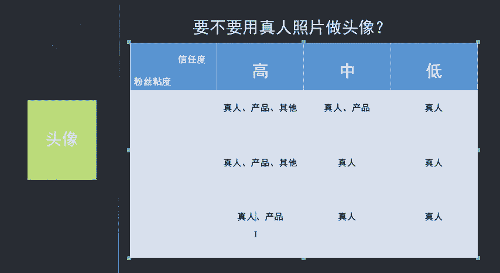
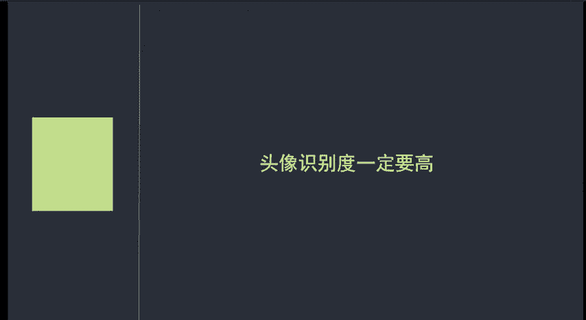
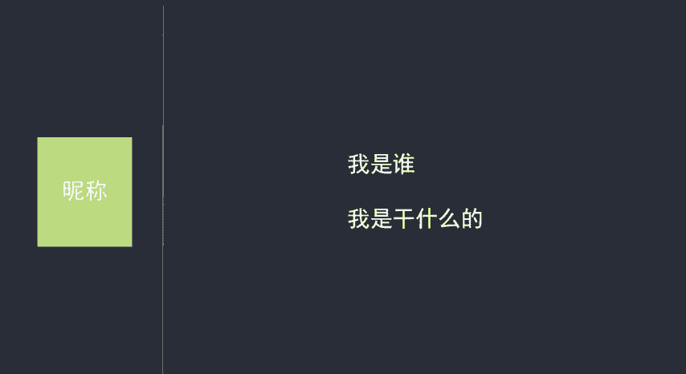
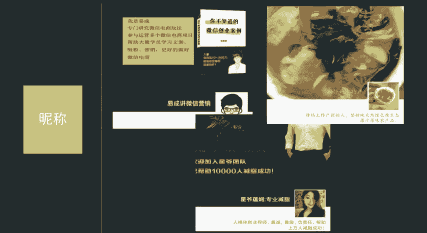
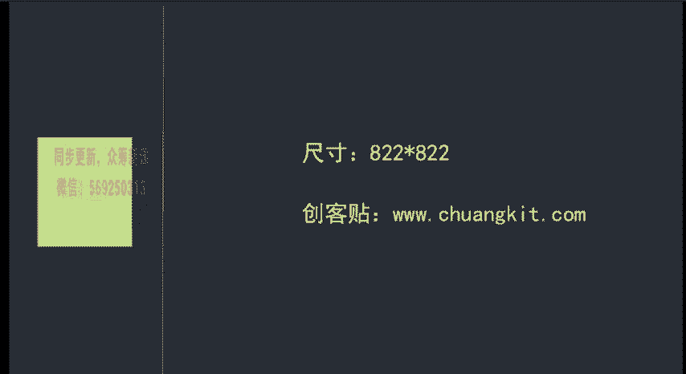
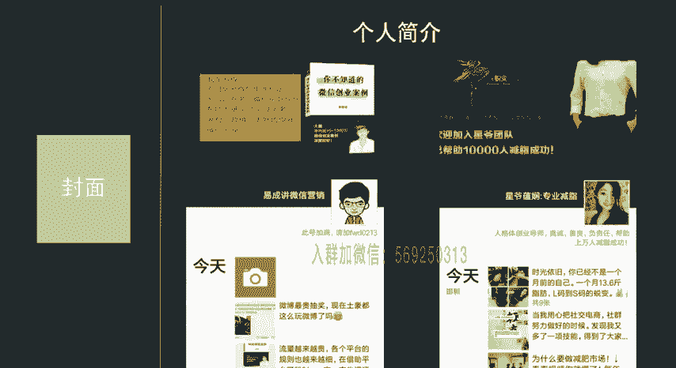
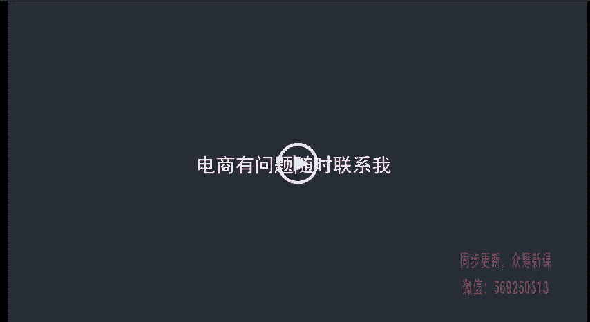

# 微社群裂变营销私域流量池增长秘籍创业运营销售获客视频课教程 合集 8套 374资料 13.1G - P12：02 微信人格体包含哪些方面 - 高端网创试错赚钱大师 - BV1sr421F7AZ

来讲微信人格体具体包含哪些方面呃，这一节课的内容呢相对来说比较多。所以说在学习的时候呢，大家一定要做好笔记。最好呢能够在讲到某一方面的时候，就暂停一下，考虑一下自己在这个方面应该应该如何优化。

不然的话很可能学习完之后呢呃会存在意向模糊，或者说完全就找不到头绪的问题。首先讲一下微信人格体大约包含几个方面，有头像昵称、封面、签名、地址。这几个方面呢都需要我们精心设计才行。

下面呢我们就来挨个讲解一下，具体应该怎么做。首先第一个是头像，客户加我们最直观的印象。那我们应该怎么设置呢？目前我们看到的头像呢，大体分为几种真人头像、风景头像、产品头像、宠物头像，孩子的头像等等。

究竟选择哪一种头像比较好呢？其实很多人觉得用真人头像不是很方便哈，很纠结，所以者呢我就给大家总结了几种情况，我们来一起看一下，用什么头像有几个决定因素。第一个是你的粉丝信任度如何。

第二个是你的粉丝粘性如何来看上面这个表格。如果说你的粉丝信任度，粉丝信任度比较高。而粉丝粘性也比较高的话，这个时候我们选择什么样的头像都是可以的，你可以随便用。那如果说你的粉丝信任度。

是适中的，而粉丝粘度呢是比较高的。这个时候呢我就建议你用真人头像和产品头像。那再说一个，如果说你的粉丝信任度是比较低的，而你的粉丝黏度是比较高的。这个时候呢一定一定是只能选择真人头像。

这个表格呢大家应该都能够看得懂，我就不去给大家详细的讲解啊。你只要是对照这个表格来选择对应的呃图像就可以了。那比如说啊粉丝粘度比较低，而且那个。信任度是比较高的。这个时候呢，你可以选择证人和产品图像啊。

这方面如果不懂的话，我们在微信上去联系。

知道了什么时候应该选择什么头像。还有一个方面呢，就是用真人头像的话，我是用生活照呢？证件照呢，还是用职业照呢？这个也是要分情况的。比如说你是做房产中介的，介议呢还是职业照比较好。比如说你是做母婴类的。

那么日常生活照就比较好。这个呢也是要实际情况实际分析啊。如果说你自己分析不出来，那可以微信联系我，我给你一些建议啊，这个呢我就是把一些理论性的东西讲给大家。具体呢要接受你的实际情况。

我们在微信上去进行交流。另外一点呢需要注意的就是头像的识别度呢一定要高。因为现在每个人微信上都有几百上千的好友，而且多多少少都有几个甚至十几个在微信上卖产品的卖家。每天朋友圈内容更新呢也是比较快的。

所以说我们要保证我们的粉丝能够第一眼识别到我们的文案，或者说在聊天界面呢第一眼就能够找到我们，这就要求我们的头像呢具有一定的辨识度。

看几个案例啊，第一个案例和第一个头像和第二个头像呢在朋友圈的辨识度相对来说呢就比较低。第一个，因为类似的图像实在是太多了，不太容易区分。第二个呢，主要是头像占比太小，导致呢不好区分。因为你不点开放大。

仔细看的话，你根本就看不清具体是什么内容。这是我们应该避免的问题啊。另外还有一些就是艺术长，尽量呢我们也不要用啊。再看第三张和第四张。第三张是我们蒋辉老师的头像啊，这张图像和第二张呢存在一个问题。

就是实际人物占比比较小。但是这个图像的好处就是背景色比较突出。在朋友圈里面啊，就按照我现在几个微信号看来呢，在朋友圈里面除了蒋老师之外呢，像这种背景颜色的图像还是很少的。

所以说呢识别度相对来说要高了一些。如果说这张图像的背景色啊也是像在路边这样随便一拍的话，那这个图像也是完全不建议大家用的啊。那像第四张图像呢，它是一个卡通的啊比较呃容易吸引人注意的这样一个卡通形象哈。

但是呃并不是适合每一个人，只有你的粉丝信任度比较高，而且粉丝年性比较高的时候呢，你才可以这样去用。呃。如果说这两个方面任何一个方面都比较低的话呃，这个呢就不要大家去用了啊。呃，具体的选择方法。

大家肯定大家结合上面的表格呢来进行选一下就可以。

呃，然后呢我们来讲一下昵称。呃，传统微商呢为了让自己的在微信通讯录当中呢能够排名靠前，通常会采用在昵称前面加AAA几个字母的方式。其实呢这个方式啊真的是非常愚蠢。

因为呢客户不会因为你排名靠前就选择买你的产品，他们选择的是那些能够自己记住昵称的，而且比较聊得来的人，所以说我们想要让客户找我们购买，要做的两点。第一点，记住你第二点能够聊得来。那我们先来讲一下。

如何让客户记住你，想要让客户记住你呢，不仅仅是记住你这个人，还要记住你是做什么的。所以说我们在微信昵称的时候呢，也要在里面包含两个方面，第一个我是谁，第二个我是做什么的，还看几个案例。

比如说我自己的昵称是按照这个格式想出来的啊，我是谁？我是易程，我是做什么的？我是做微信营销的。所以我的昵称就是易程讲微信营销。这是我的微信昵称定位。这样呢很容易被人记住。再来看我们的学员微信昵称。

他是谁，他是星爷，他是做什么呢？做专业剪纸的，是不是也很容易被人记忆。再来看一个我们朋友的案例，他是谁，他是静妈，他是做什么的，他是卖土特产的。他的昵称呢就是静妈土特产也很容易记忆，也知道你是做什么的。

其实你只要是留意观察，你会发现很多大V很多知名人物，他的昵称呢都是这个模式。比如说做日语培训的日语魔术师，虽然他们并不是直接名字加业务，但是在粉丝的第一感觉就是知道你是做什么的。

而且很容易就记忆了你再比如说微博大V俄罗斯什么值得买。看完就知道你是做什么的，而且有一定的好奇度，这个昵称就比俄罗斯代购好的多。大家可以仔细的体会一下，是不是这样。另外呢除了我们。

个人的微信昵称外，还有一个非常经常用到的昵称啊，就是微信群昵称或者是QQ群昵称。群昵称呢就是我们群里的一个非常好的宣传渠道。哎，我们不需要自己去发广告。只要是你发言，你去跟别人交流呢。

实际上每次交流呢都是一次广告，所以说要利用好具体怎么利用呢来看几个案例。比如说我们的一个学员是做膏药的，在群里他的昵称就是小胖，你加膏药，真管用，一个做花茶的学员，他的微信昵称呢就是喵小赖。

你加花茶真好喝。一个做内裤的昵称呢就是内裤要买两室一厅的等等。这些趣味性的昵称呢都能够让你在群里很快的脱颖而出啊，比你去聊天一点点的呃分享效率会高很多。呃。另外一个比较重要的方面呢，就是封面啊。

从封面虽然日常浏览朋友圈，我们的粉丝并不会看到啊，但是当他对你的内种感兴趣，想要进一步了解你的时候呢，就会点开，然后点开呢就能够看到了。包括第一次加好友的时候，一般都会习惯性的打开资料看一下。

如果这个时候看到你的封面是一个大广告粉丝呢对你的兴趣度会瞬间降到冰点。所以说呢我们要注意一下封面的问题。呃，第一个要掌握的就是朋友圈封面的尺寸。目前朋友圈的尺寸呢是822乘822像素。

但是所有的内容呢要尽可能的往中间集中，四周留出100像素左右的空间呢是比较好的啊。因为不同的品牌手机和不同的尺寸的屏幕可能都会存在一定的差异。这样做呢，可以保证任何手机上能够展示出最好的效果。

另外呢给大家提供一个可以简单制作封面的工具创客贴。网址是3W点窗KIT点COM即使你完全不懂PS呢，也可以利用这个工具做出非常好的朋友圈封面啊，下面我们来看几个案例哈，个人介绍类的朋友圈。

我自己的朋友圈封面呢，一是一段自我介绍，加上自己输的封面。这样呢粉丝就更加清楚我是谁了？我能做什么。第二个是我们学员的案例哈，讲的是他自己的呃介绍帮助多少人兼职成功，看起来呢比较正视。

虽然很多粉丝刚加的时候呢，可能会有持疑态度啊，觉得你是个骗子，但是呢啊他们并不会直接把你删除，毕竟他们是抱着希望加进来的，你是他们减肥的希望，这些粉丝能不能留住呢？

更关键的是靠我们的文案和我们的聊天水准了。

第二种呢是产品展示类的我们的学员微信。第一个是做代购的封面拍了一张并不明显的产品图，资料选的也不错，这样呢也是可以的啊，虽然说起不到什么大作用。

但是呢至少粉丝看了不反感第二张呢是做自部类产品的学员他的封面呢是自己公司的背景墙。有一定的信任度。但是呢这个并不是很好，因为角度选择不仅啊，还有很大的优化空间可以提升啊，而且没有展示出自己公司的实力来。

剩下的两个维度呢就是签名和地址，签名和地址呢其实没必要区分的很清楚啊，保持一致就好，这个呢我们就放到一起讲签名和地址呢其实更多的是为了加深客户对你的印象。

所以说呢我们的一般做法呢就是对自己的定位有一个大体的概括，一个案例，比如说我自己的签名就是电商有问题，随时联系我，时刻暴露在朋友圈里面，让我们得到曝光。那比如我们的学员他的定位是专业剪纸。

帮助上万人剪纸成功。这个呢其实非常简单了啊，你只要把你自己的微信定位总结一句话就可以了。

