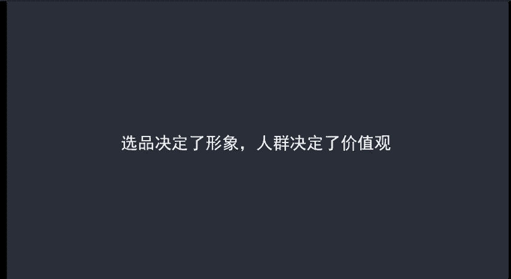
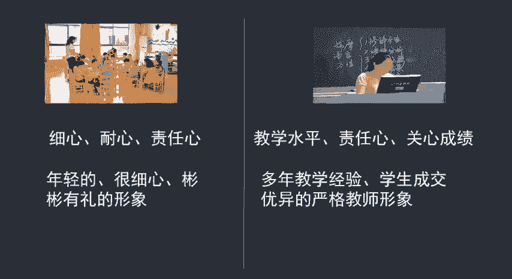
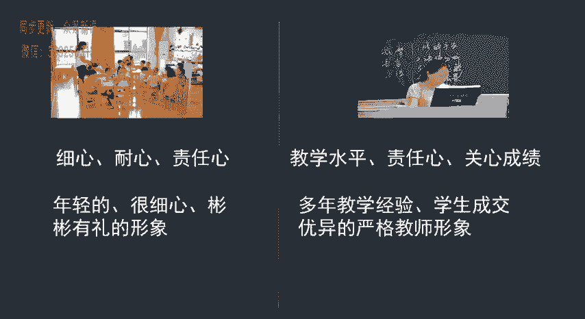
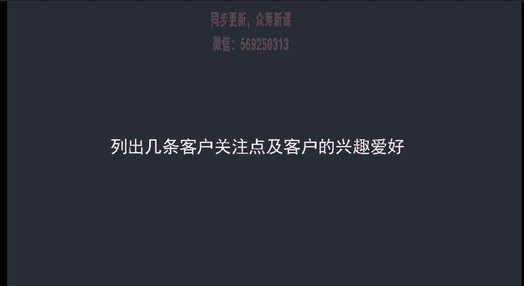

# 微社群裂变营销私域流量池增长秘籍创业运营销售获客视频课教程 合集 8套 374资料 13.1G - P13：03 我应该建立一个什么人格体 - 高端网创试错赚钱大师 - BV1sr421F7AZ

一个什么样的人格体我们在前面讲到了定位的问题啊，有了定位之后呢，人格体的雏形也算是出来了。但是我们要对人格体呢进行丰富才行，不然定位和输出内容不搭，就导致了客户满意度呢瞬间降低。呃。

那么内容应该如何去丰富呢？呃，内容的丰富完全是由你的人群来决定的。选品决定了你的人格体雏形，人群决定了你要输出什么内容。呃，为了方便大家理解呢，我们来举一个简单的例子。

比如说我你是做幼教的啊，那么你如果想要让你的学生家长对你满意，你需要体现出自己的细心、耐心和责任心。呃，这也是呃这类呢也需要一些年轻的避免有理的呃女性角色呢比较好。那同样是做老师。

如果说你做的是高中老师，教的是高三啊。如果你还是很年轻的，很细心的。那么家长的满意度呢，可能并不是很高。因为呢他们的需求是让孩子的学习成绩进行提升，而不是照顾好自己的孩子。

所以说他们可能更偏向于那些教学水平比较高，责任心比较高，有多年教学经验的老教师了啊，至于你长得怎么样啊，他们并不用关心哈，只要是你是能够让学生提升呃学习成绩的老师就可以。

所以说我们再去丰富人格体形象的时候呢，要从三个方面入手。第一个方面是什么人？第二个方面是关注点是什么。第三个方面是爱好是什么呃，我们拿化妆品来举个例子啊，什么人做化妆品啊。

什么人做化妆品代购的基本上都是90后的白领女生啊，这是我们的主要客户群体。那么他们的关注点是什么呢？这个关注点一定是对于你产品的关注点比如说你的产品是不是正品，是通过什么途径进货的，有没有小票等等。

这些呢是客户比较关注的问题。第三个需要考虑的就是这些客户的爱好是什么啊，比如说爱好化妆购物追星等等，这些都整理出来了，怎么来丰富自己的人格体呢？首先你的形象定位更加明确了啊，你的客户呢是90后的白领。

那么你的年龄段呢一定是和他们相符的，性别呢最好也是一样的啊，除非你是一个非常懂产品的异性，另外呢你知道了他们的疑虑呃能够通过文案很容易的销售他们的顾虑，下一步剩请的就是销售了，不需要在费尽。

值的聊在聊天中建立信任。比如说你是人肉代购，每个月去一趟韩国，那么你就可以每个月来个直播，日常再发一些直播的内容就可以了。比如说知道了他们的爱好，你的写你的文案素材都出来了。

发一些追星的购物的化妆的文案，喜爱度也建立起来了，具体怎么写呢？怎么用。我们在后面的课程中也会讲到啊，在这里呢给大家布置一个作业。呃，按照我刚才的方法列出几条客户关注点击客户的兴趣爱号，然后写几个。

你可以匹配客户关注点击爱号的优势。这个呢会让你清楚自己现在的定位和文案出现了什么问题，以及呢具体应该如何优化。那同样呢这个作用呢并不是强制性的啊，你只要是感兴趣，你想去优化的话，你把它写下来。

整理成word文档，发到我的微信上。呃，只要是你发呢我都会认真的看，认真的给你提供解答。

