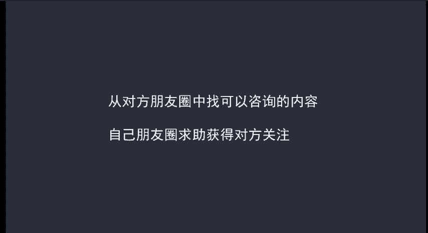
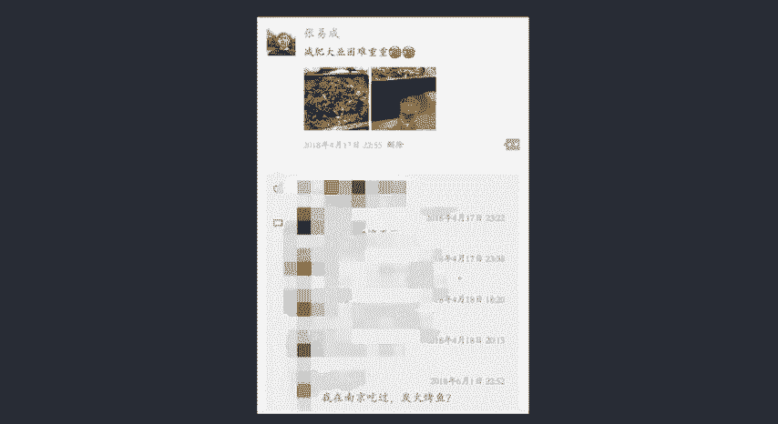
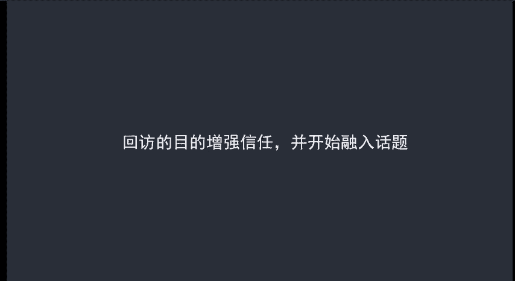

# 微社群裂变营销私域流量池增长秘籍创业运营销售获客视频课教程 合集 8套 374资料 13.1G - P14：2 回访合情合理的和客户再次开始聊天 - 高端网创试错赚钱大师 - BV1sr421F7AZ

合情合理的再次开始和客户聊天。这个呢是很多微信买家头疼的问题啊。因为第一次聊完想和客户聊天呢就找不到突破口，这该怎么办呢？有几个解决办法啊，第一个是从对方朋友圈中找到可以咨询的内容。

第二呢就是自己朋友圈求助，获得对方关注，来看两个案例啊，比如说这个是我今年4月发的朋友圈。然后到了6月的时候，有一个人给我评论了，说自己在南京吃过炭火烤虑之类的。😊。

呃，实际上呢这个就是找话题啊，而且也容易比较引起注意。因为朋友圈啊只要有回复的，我们都会比较认真的去看，对吧？再来看一个案例，这个呢是我们淘宝客户微信变现课程的黑牛老师，然后朋友圈发的。

目的呢就是为了增加和粉丝之间的互动。而且借助这个机会呢可以和粉丝进行一波聊天互动，同时呢也能够找到共同的兴趣爱好。这两个做法呢都是可以的，但是这并不是长久之际，因为客户不可能。😊。

呃，每次呢都能跟你互动，或者说每次呢都能看到你发的朋友圈啊，那怎么办呢？为了解决这个问题呢，我们要学会在第一次接触客户开始聊天的时候呢，就要为第二次联系客户埋下伏笔。怎么理解这句话呢啊，看一个流程呃。

通过某个渠道加到好友之后呢，按照我们讲的呢，要去做个自我介绍，然后找到共同话题聊天。聊天肯定是有个循序渐进的过程。当聊到最高潮的时候呢，要学会终止聊天。比如说不好意思啊，我有点事情呢要去处理一下。

回头呢再和你聊天啊呃，聊的很愉快。呃，就跟我们看电视一样啊，看到最高潮的部分，往往他会给你插一段广告，让你呢对下一集呢充满期待。还有一点呢就是实在是聊天费不带不起来，这个方法不适用，那我们应该怎么办呢？

啊，解决办法呢就是送试用品，送赠品。最好的呢我建议大家还是送虚拟的产品啊，两个原因。第一个原因呢是虚拟产品成本比较低啊，比如说送电子书啊，几乎没什么成本，比如说送化妆教程都是一本万利的事情。

第二呢就是如果你送实物，它不仅成本高，而且客户很大情况下呢是不会给你提供它的地址信息的。因为毕竟大家呢并不是太熟悉啊，信任不够而虚拟产品呢却能够解决了这个问题啊。因为你不需要客户什么信息。

直接就发个链接，发个视频就可以了。😊，呃，最后呢再强调一点啊，就是我们去做客户回访的目的呢，是为了增强信任，并不是为了直接卖产品啊，只是为了我们下一步卖产品，再铺垫一下，找到我们的营销切入点。

这个大家一定要记清楚。

