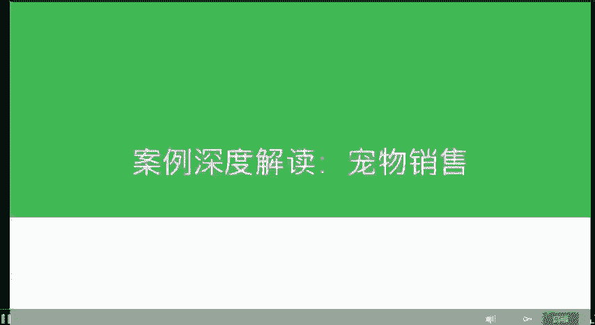
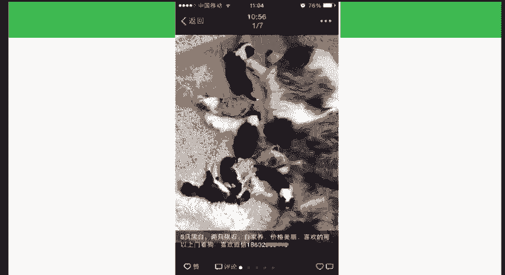
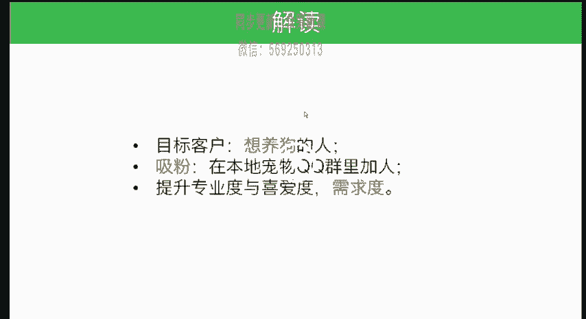

# 微社群裂变营销私域流量池增长秘籍创业运营销售获客视频课教程 合集 8套 374资料 13.1G - P15：02 卖宠物 - 高端网创试错赚钱大师 - BV1sr421F7AZ

给大家介绍一个简单的这个案例啊，就是宠物的销售。这个案例呢就是在我们的朋友圈当中可以卖狗。那么这个店主是怎么做起来的啊？这个店主呢，他其实是相当于是一个全职太太这种啊，就是自己养了几个猫几个狗。

一开始是通过朋友的这样一介绍，在他这里买他的小狗。然后呢，他自己又搞定了这个狗呃这个渠道。后来呢他跟我们去聊这个我们给他定位他的这个目标客户就是想养狗的这样的一个人群，想养狗的啊。

那么这样一个人群，首先呢第一在本地的这个宠物QQ群当中，他加了一些人。因为你要知道本地的宠物QQ群当中的这些人呢，他有可能他不是那些没有狗的人，他很有可能是有狗的人。不过没有关系。

就是因为他们身边也会有一些想养狗的人，或者说他养了一条或者两条。第二个呢，在包括5八同城里面会有一些想买狗的这种人，他就可以去加去聊啊。在整个朋友圈当中，策略就是提升自己的这个专业度。

你比其他的这个卖狗的人显得更加的专业，以及你是一个相对有趣的这样人。但是实际来看呢，就是虽然我们给他这个建议，他做的并不是特别好啊，当然他也卖，只能说现在竞争并不激烈啊，就是别人只看到你。

但是从我们的这个角度来讲，如果你能够在这方面专业度上能够提升的比较高的话，那么就可以。那我们来再分析下，为什么狗狗他也可以在这个方面去销售啊。首先呢这个人群我们要去简单在做一个深度解读的话。

就是这个人群想养狗的人，这种人啊想想养狗的人呢，它的人群其实基数还是非常广的。这里除了提升专业度喜爱度，我觉得他再家一个需求度。就是想养狗的人，他可能需求度还没上来，尤其对于这种生意啊。就是有一定想法。

但是需求度不那么旺盛的。那么朋友圈是一个或者社交媒体是一个非常非常适合这类产品销售的一个工具。因为它可以通过平常的教育就可以把你的需求度给调动起来啊，这是一个非常重要的一点。

其次呢你可以通过很多互联网的这种方法去吸粉啊，吸粉去获得那些想养狗的人去关注到你。然后你想想看，就是人群又比较大众，你吸粉就相对来讲没有那么困难。第三呢，提升专业度喜爱度需求度。

又能够在社交媒体上去把它完成。那么这一波想养狗的人通过你的这样一个教育，就慢慢的。可能就会产生这种需求。如果你的货源好，狗狗漂亮，或者说我也不懂狗啊，这个就可能呃使得他们能够在你这儿去购买这个宠物啊。

猫啊狗的这个应该都可以。

