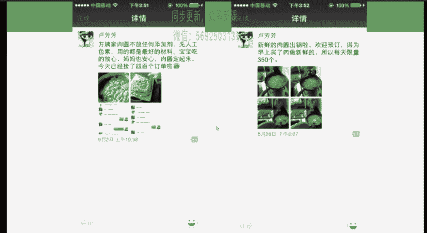
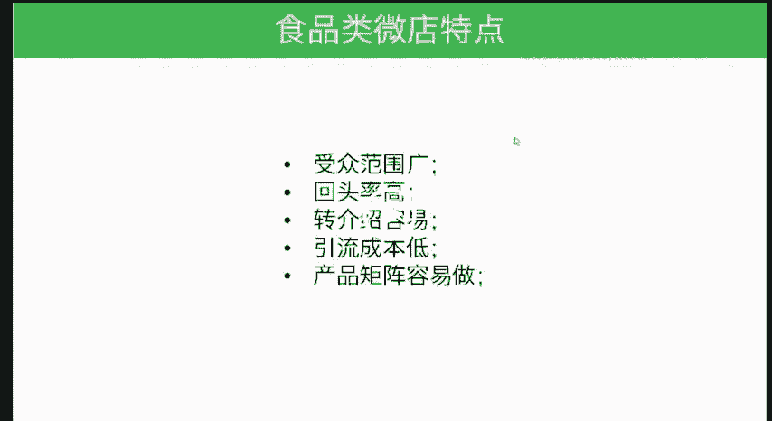

# 微社群裂变营销私域流量池增长秘籍创业运营销售获客视频课教程 合集 8套 374资料 13.1G - P16：04 卖肉圆 - 高端网创试错赚钱大师 - BV1sr421F7AZ

好嗯。这会我来对于一个产品，肉圆或者说卖家常的。菜和食品这样的方式，这样的产品都可以通过社交媒体进行营销。

嗯，这是一个真实的案例啊啊，当然我们讲案例都是真实的这就是身边的一个案例。那我同事的一个亲戚在接受了我们指导之下，他去做的就是他这个亲戚呢，方姨加呃肉圆不添加任何添加剂，无人工色素用的是最好的材料。

宝宝吃得放心，妈妈吃也安心，肉圆订起来，今天已经接了400个订单了，太恐怖了，是不是400个订单意味着什么？要知道他们家是几十个起订。那么400个订单，相当于一天要卖到几千个肉圆啊。

一个肉圆呢大概是一个肉圆是卖1。7块到2块多钱啊。利润起码有百分之三四十，4十肯定是有的啊。这个是我们来看一下啊，我们是在8月中8月20号左右，20多号吧，20多号给他建议的。

在9月2号他就卖到了这样子的一个成绩，是不是特别的恐怖啊？就是每一天的这种订单量的增长。我再次强调一遍，社交媒体对于很多，尤其是掺假的行业是一个巨大的机会。我们在市场上买的这种肉圆。

是不是会经常会有这种掺假，就是掺添加剂、色素等等这些是吧？即便有一些看上去像模像样的，他说不听你啊，我们消费者真的相信吗？都不敢相信。但是这种加长的通过社交媒体去营销的这样的产品。

就能够让你去相信这个产品的品质。所以这是一个非常好的产品。我们简单说一下，就是它是怎么推广呢？其实它真的没有太多的这种推广。就是通过同学群，通过各种曾经加过的微信群，没有任何的主动营销。

太多太多的这样一客户主动的找过来。因为我们去想到肉园，我们刚才说过，这是一个明显的供不应求的市场。因为大家都想买到这种正品肉园啊，大家很难找到，终于找到一家了。那你想想看是不是大家会主动来买呢啊。

非常有意思的一个案例，非常小。但是我们也看到。这个案例这个经营者他现在利润是多可观啊。我们再说一下，到了这个后面啊，他又把这个发展呢从一开始纯肉园，再到后来各种馅儿的这种园子。从一个人做这个肉圆。

已经请了亲戚朋友一起来做这个肉圆。越做越大生遗啊。呃，一天现在的利润应该是有2000块钱应该是不止了。小产品大机会啊。当然我们这里要说一下，做食品类这种，我们说微店的这样一个特点啊。

第一个受众的范围比较广，回头率高，转介绍也会容易。比如说这个肉圆，你买了之后有可能还送给邻居去吃几个引流成本也会比较低，因为肉中非常广嘛，这种流量要求质量不高啊，那么而且产品举证容易做。

你可以增加这种食品，新的这种食品啊。

所以这个我觉得尤其在目前我们再说一下哪个行业遇到的问题多，信任危机比较大，就越来越通过社交媒体可以去影响这个行业，很显很显然食品这个行业是一个信任程度非常低。我我们甚至在外面这些餐厅里面。

我们吃不到非地沟油的这样的餐厅啊，都是为了好吃，不顾得信任等等等等。越是这种行业。社交媒体越能发挥出它的作用。所以为什么我们去大力的推荐咱们这个课程？

因为越来越多的人能够学会运用社交媒体去卖各种各样的产品的话，那么将会有更多的人去受益。

