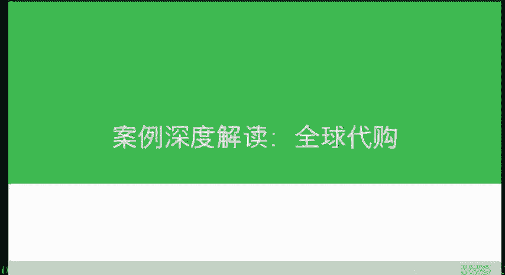
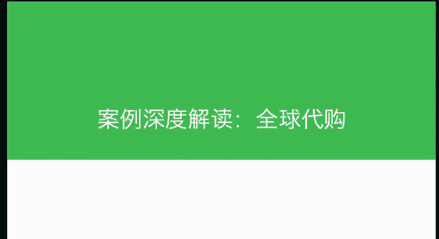

# 微社群裂变营销私域流量池增长秘籍创业运营销售获客视频课教程 合集 8套 374资料 13.1G - P17：05 全球代购 - 高端网创试错赚钱大师 - BV1sr421F7AZ

给大家讲一个这个全球代购的一个有趣的案例啊。那我们知道这种做代购的人很多，但是像这家做的这么的高大上的，我只见到这一家啊，这一家呢就是通过微信朋友圈去卖全球代购的这种产品。

而且呢都是卖的是这种大牌的这种产品。为什么我说他做的很牛呢？

几个点。第一个点就是他的客户群特别的高质量，就是这个跟他原来的这种社会圈，就这些人他可能都没有去专业的这种戏粉。在他的社会圈就是活跃着很多有钱人。那么在活跃这些有钱人的时候。

他们就去挖掘这些有钱人需求啊，去采购了非常多的国际的这种服装啊等等，在朋友圈进行销售。那每一件服装基本上都是几千元人民币啊。那么至少在他的，你看订货都在排单中，那一个月可能是百万以上的这种销售啊。

所以非常高大上，利润也是非常高。因为这种服装这种东西啊，不像说奶粉啊，这种利润是比较低的，价格也比较透明，对吧？这种价格是不透明的那我们可以看到它的主图也做的非常高大上。

就是可能某种机会啊跟范冰冰合个影放到这上面，陌生人一看好牛逼的样子，对吧？那么全球顶级买手这是对自己的一个定位啊，顶级买手，那么。你天天在他的朋友圈上，如果看到他顶级买手，那。他自己都这么自封了。

你会你会觉得这个人真的很高端，而且范冰冰啊这个时尚圈的这种领袖了啊，就会对他产生一种天然信任。所以他的这几个元素给他加在一起的话啊，老板本人我们看到的戒指什么的，也是比较一个潮男，对吧？

所以说我们就会觉得这家店卖的肯定是很高大上的东西。那么价格呢自然是不便宜了。那么我们就想跟大家分享的就是围绕你的这样一个人群，然后挑中这些好的产品，你就可以在朋友圈。自由的发挥啊。

他的粉丝没有一个是通过主动推广而来的，全都是客户主动的去给他去做介绍。因为他对于全球的这种选品，所以可能跟他之前呢做采购啊各方面的这个职业经验也有关系啊，太专业了。所以说他挑的这些货也非常的好。

非常的热销，受大家欢迎啊，所以这个也是要结合自身的这种特点，我们去打造自己的微店的社交媒体卖货的模式啊。为什么跟大家分享这么多的案例，就是为了让大家从思维层面上接受不同的信息。

那未必哪种模式你可以去模仿，但是这些思路都可以让你借鉴。